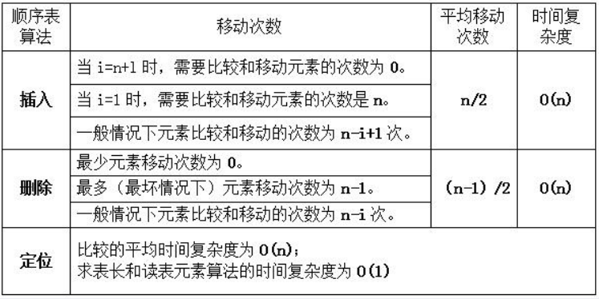
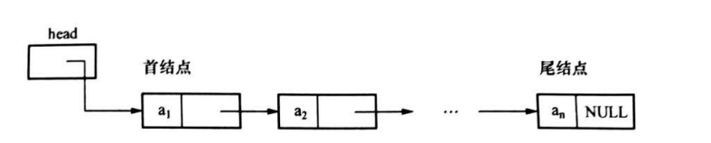
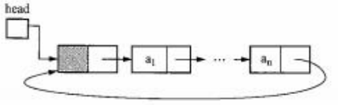
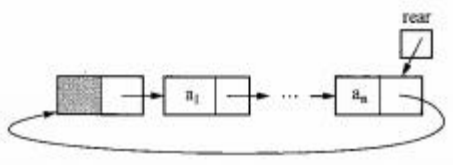
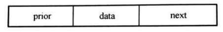
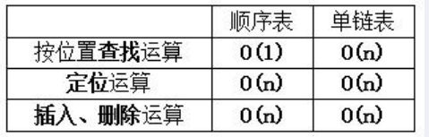

[toc]

### 线性表简介

#### 1. 概念

线性表是一种线性结构，由 n(n≥0)个数据元素组成的有穷序列，数据元素又称结点。**结点个数 n 称为表长。**a1 称为起始节点，an 称为终端结点。 


#### 2. 基本特征

线性表中结点具有一对一的关系，如果结点数不为零，则： 

- 除起始结点没有直接前驱外，其他每个结点**有且仅有一个直接前驱**； 

- 除终端结点没有直接后继外，其他每个结点**有且仅有一个直接后继**。


#### 3. 存储结构

- ==顺序存储==结构实现==线性表==，称为顺序表，一般使用**==数组==**来表示顺序表。逻辑结构和存储结构一致
- ==链式存储==结构实现==线性表==，称为链表。逻辑结构和存储结构次序不一定相同


#### 4. 顺序表

顺序表的“第 i 个数据元素”存放在数组下标为“i-1”的位置



##### 4.1 插入（前插）

插入算法的基本步骤是：首先将结点 ai~an依次向后移动一个元素的位置，这样空出第 i 个数据元素的位置；然后将 x 置入该空位，最后表长加 1。

具体的插入算法描述如下： 

```c++
void InsertSeqlist(SeqList L,DataType x, int i) { 
    //将元素 x 插入到顺序表 L 的第 i 个数据元素之前 
    if (L. length==Maxsize) exit(“表已满”); 
    if (i<1 || i>L. length+1) exit(“位置错”);//检查插入位置是否合法 
    for(j=L.length;j>=i;j--) //初始 i=L.length 
        L.data[j]=L.data[j-1]; //依次后移 
    L.data[i-1]=x; //元素 x 置入到下标为 i-1 的位置 
    L.length++; //表长度加 1 
}
```

##### 4.2 删除

删除运算的基本步骤是：

- 结点 ai+1,…，an依次向左移动一个元素位置（从而覆盖掉被删结点 ai）；
- 表长度减 1。此处无需考虑溢出，只判断参数 i 是否合法即可。

算法描述如下：

```c++
void DeleteSeqList(SeqList L,int i) { 
    //删除线性表 L 中的第 i 个数据结点 
    if(i<1 || i>L.length) //检查位置是否合法 
        exit(“非法位置”); 
    for(j=i;j<L.length;j ++) //第 i 个元素的下标为 i-1 
        L.data[j-1]=L.data[j]; //依次左移 
    L.length--; //表长度减 1 
}
```

##### 4.3 定位

是查找出线性表 L 中值等于 x 的结点 序号的最小值，当找不到值为 x 的结点时，返回结果 0。下列算法从左往右扫描顺序表中的 元素，考察元素的值是否等于 x，描述算法如下： 

```c++
int LocateSeqlist(SeqList L, DataType x) { 
    int i=0; 
    while ((i<L. length) && (L.data[i]!=x) ) //在顺序表中查找值为 x 的结点 
        i++; 
    if(i<L.length) return i+1; //若找到值为 x 的兀素，返回兀素的序号 
    else return 0; //未查找到值为 x 的兀素，返回 0
}
```


#### 5. 链表

head头节点指向的第一个节点是首节点

##### 单链表

由head头节点出发，终端节点的 next 为 NULL



**单链表结构**

```c++
typedef struct node { 
    DataType data; //数据域 
    struct node * next; //指针域
}Node, *LinkList;
```

**初始化**

```c++
LinkList InitiateLinkList() //建立一个空的单链表 
{ 
    LinkList head; //头指针
	head=malloc(sizeof (Node) ) ; //动态构建一结点，它是头结点 
    head->next=NULL; 
    return head; 
}
```

**求表长**

```c++
int lengthLinklist(LinkList head){
    Node *p;
    p=head; j=0;
    while(p->next != NULL){
        p=p->next;
        j++;
    }
    return(j);
}
```

**读元素**

```c++
Node *GetlinkList(LinkList head,int i){
    Node *p;
    p=head->next;int c=1;
    while(c < i && p != NUll){
        p=p->next;
        c++;
    }
    if(i==c) return(p);
    else return NULL;
}
```

**定位**

```c++
int LocateLinklist(LinkList head, DataType x){
    //求表 head 中第一个值等于 x 的结点的序号，若不存在这种结点，返回结果为 0
    Node *p=head; //p 是工作指针 
    p=p->next; //初始时 p 指向首结点 
    int i=0; //i 代表结点的序号，这里置初值为◦
    
    //访问链表
    while (p != NULL && p->data != x) {
        i++; 
        p=p->next;
    }
    
    if (p!=NULL) return i+1; 
    else return 0;      
}
```

**插入**

- 先找到链表的第 i-1 个结点 q

- 生成一个值为 x 的新结点 p，p 的指针指向 q 的直接后继结点
- q 的指针指向 P

```c++
void InsertLinklist (LinkList head, DataType x, int i) { 
    //在表 head 的第 i 个数据元素结点之前插入一个以 x 为值的新结点 
    Node *p,*q; 
	if (i==1) q=head; 
    else q=GetLinklist (head, i-1); //找第 i-1 个数 据元素结点 
    if (q==NULL) //第 i-1 个结点 不存在
        exit(“找不到插入的位置”); 
    else{ 
        p=malloc(sizeof (Node) );
        p->data=x; //生成新结点 
        p->next=q->next; //新结点链域指 向*q 的后继结点 
        q->next=p; //修改*q 的链域 
    } 
}
```

**删除**

```c++
void DeleteLinklist(LinkList head, int i) {
    //删除表 head 的第 i 个结点
    Node *q;
    if(i==1) q=head;
    else q=GetLinklist(head, i-1); //先找待删结点 的直接前驱
    if(q !== NULL && q->next != NULL){
        //若直接前驱存在且 待删结点存在
        p=q->next; //p 指向待删结点 
        q->next=p->next; //移出待删结点
        free(p); //释放已移出结点 p 的空间
    }
    else exit (“找不到要删除的结点”); //结点不存在
}   
```


##### 单向循环链表

在单链表中，终端结点的指针指向首结点可以构成循环链表。

**只有头指针 head**



**有头指针 head 和尾指针 rear**


**只有尾指针 rear**




##### 双向循环链表

每个结点有两个指针，next 指针指向直接后继结点；prior 指针指向直接前驱结点。 带头结点的双向循环链表 L 为空的条件：(L->next == L) &&(L->prior == L)



**删除**

设 p 指向待删结点，删除*p 的操作：

```c++
p->prior->next=p->next; 
p->next->prior=p->prior; 
free(p);
```


**插入**

在 p 所指结点的后面插入一个新结点*t 的操作:

```c++
t->prior=p; 
t->next=p->next; 
p->next->prior=t; 
p->next=t;
```


#### 6. 顺序存储和链式存储实现的比较



