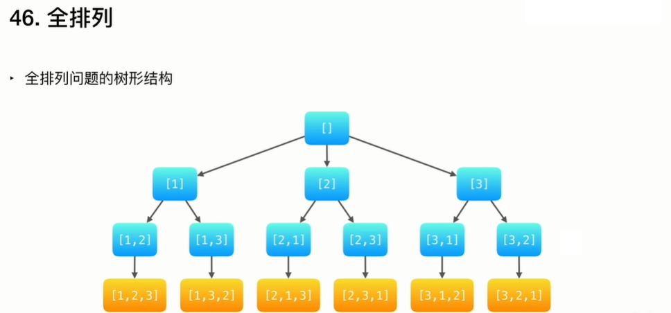

### 力扣之46.全排列 I



```java
import java.util.ArrayList;
import java.util.List;

/**
 * @program: algorithm
 * @description: 全排列1
 * @author: Wangwt
 * @create: 13:38 2021/7/31
 * 深度优先遍历-回溯算法
 * 给定一个不含重复数字的数组 nums ，返回其 所有可能的全排列 。你可以 按任意顺序 返回答案。
 * 思路：深度优先遍历dfs，递归遍历到叶子节点，然后回溯，撤销上一步的操作
 * 递归终止条件：判断是否到了叶子节点，元素个数是否为树高
 * 状态变量：记录每个元素是否被选择的状态
 */
public class QuanPaiLie46 {

    public static void main(String[] args) {
        int[] nums = {1,3,6,8};

        List<List<Integer>> list = permute(nums);
        for (List<Integer> integers : list) {
            System.out.println(integers);
        }
    }

    private static List<List<Integer>> permute(int[] nums){
        List<List<Integer>> res = new ArrayList<List<Integer>>();
        List<Integer> temp = new ArrayList<Integer>();
        boolean[] status = new boolean[nums.length];

        dfs(res,temp,nums,status,0);
        return res;
    }

    private static void dfs(List<List<Integer>> res, List<Integer> temp,  int[] nums, boolean[] status, int depth) {
        if (depth == nums.length){
            res.add(new ArrayList<Integer>(temp));
            return;
        }

        for (int i = 0; i < nums.length; i++) {
            if (status[i]){
                continue;
            }
            temp.add(nums[i]);
            status[i] = true;
            dfs(res,temp,nums,status,depth + 1);
            temp.remove(temp.size() -1);
            status[i] = false;
        }
    }
}
```

### 力扣之47.全排列 II

```java
import java.util.ArrayList;
import java.util.Arrays;
import java.util.List;

/**
 * @program: algorithm
 * @description: 全排列2
 * @author: Wangwt
 * @create: 13:26 2021/7/31
 * 深度优先遍历-回溯算法
 * 给定一个可包含重复数字的序列 nums ，按任意顺序 返回所有不重复的全排列。
 * 思路：深度优先遍历dfs，递归遍历到叶子节点，然后回溯，撤销上一步的操作
 * 递归终止条件：判断是否到了叶子节点，元素个数是否为树高
 * 状态变量：记录每个元素是否被选择的状态
 * 剪枝：条件是给定的数组有序，或手动排序。判断相邻的的元素是否相等，
 */
public class QuanPaiLie47 {
    public static void main(String[] args) {
        int[] nums = {1,3,1};

        List<List<Integer>> list = permute(nums);
        for (List<Integer> integers : list) {
            System.out.println(integers);
        }
    }

    private static List<List<Integer>> permute(int[] nums){
        List<List<Integer>> res = new ArrayList<List<Integer>>();
        List<Integer> temp = new ArrayList<Integer>();
        boolean[] status = new boolean[nums.length];

        Arrays.sort(nums);
        dfs(res,temp,nums,status,0);
        return res;
    }

    private static void dfs(List<List<Integer>> res, List<Integer> temp,  int[] nums, boolean[] status, int depth) {
        if (depth == nums.length){
            res.add(new ArrayList<Integer>(temp));
            return;
        }

        for (int i = 0; i < nums.length; i++) {
            if (status[i]){
                continue;
            }

            if (i > 0 && nums[i] == nums[i-1] && !status[i - 1]){
                continue;
            }

            temp.add(nums[i]);
            status[i] = true;
            dfs(res,temp,nums,status,depth + 1);
            temp.remove(temp.size() -1);
            status[i] = false;
        }
    }
}
```


### 力扣之113. 路径总和 II

```java
package com.tangdi.leetcode.backtrack;

import java.util.ArrayList;
import java.util.List;

/**
 * @program: algorithm
 * @description: 113. 路径总和 II
 * 给你二叉树的根节点 root 和一个整数目标和 targetSum ，找出所有 从根节点到叶子节点 路径总和等于给定目标和的路径。
 * 叶子节点 是指没有子节点的节点。
 * @author: Wangwentao
 * @create: 2021-09-26 16:04
 * 深度优先遍历-回溯算法
 * 递归终止条件：判断是否到了叶子节点，元素个数是否为树高
 * 思路：深度优先遍历dfs，递归遍历到叶子节点，然后回溯，撤销上一步的操作
 **/
public class BinaryTreeRouteSum113 {

    public static void main(String[] args) {
        List<List<Integer>> res = new ArrayList<List<Integer>>();
        List<Integer> temp = new ArrayList<Integer>();
        int targetSum = 20;
        TreeNode root = init();

        if (root == null) {
            System.out.println(res.toString());
        }

        dfs(root, res, temp, targetSum);
        System.out.println(res.toString());
    }


    public static void dfs(TreeNode node, List<List<Integer>> res, List<Integer> temp, int targetSum) {
        temp.add(node.val);

        TreeNode left = node.left;
        TreeNode right = node.right;
        if (left == null && right == null) {
            int sum = 0;
            for (int i : temp) {
                sum += i;
            }
            if (targetSum == sum) {
                res.add(new ArrayList<Integer>(temp));
            }

            return;
        }
        if (left != null) {
            dfs(left, res, temp, targetSum);
            temp.remove(temp.size() - 1);
        }

        if (right != null) {
            dfs(right, res, temp, targetSum);
            temp.remove(temp.size() - 1);
        }
    }

    /**
     *       5
     *      / \
     *     4   8
     *    /   / \
     *  11  13   6
     *
     * @return
     */
    static TreeNode init() {
        TreeNode root = new TreeNode(5);
        TreeNode node4 = new TreeNode(4);
        TreeNode node8 = new TreeNode(8);
        TreeNode node11 = new TreeNode(11);
        TreeNode node13 = new TreeNode(13);
        TreeNode node6 = new TreeNode(6);

        root.left = node4;
        root.right = node8;
        node4.left = node11;
        node8.left = node13;
        node8.right = node6;
        return root;
    }

    static class TreeNode {
        int val;
        TreeNode left;
        TreeNode right;

        TreeNode() {
        }

        TreeNode(int val) {
            this.val = val;
        }

        TreeNode(int val, TreeNode left, TreeNode right) {
            this.val = val;
            this.left = left;
            this.right = right;
        }
    }
}
```

