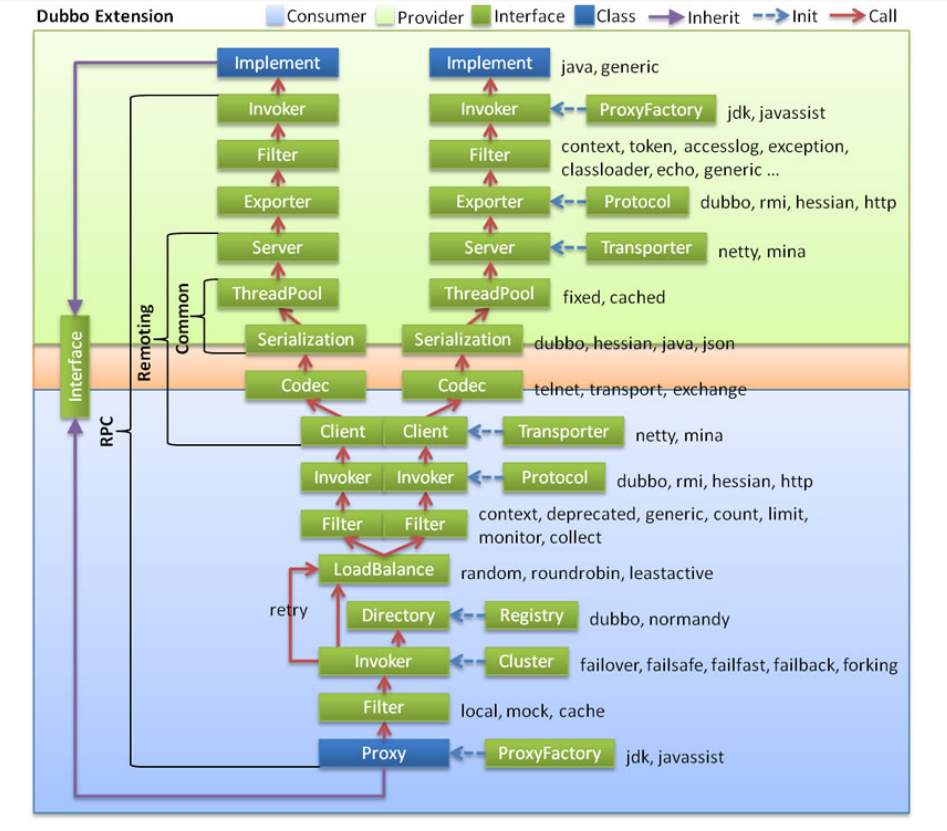
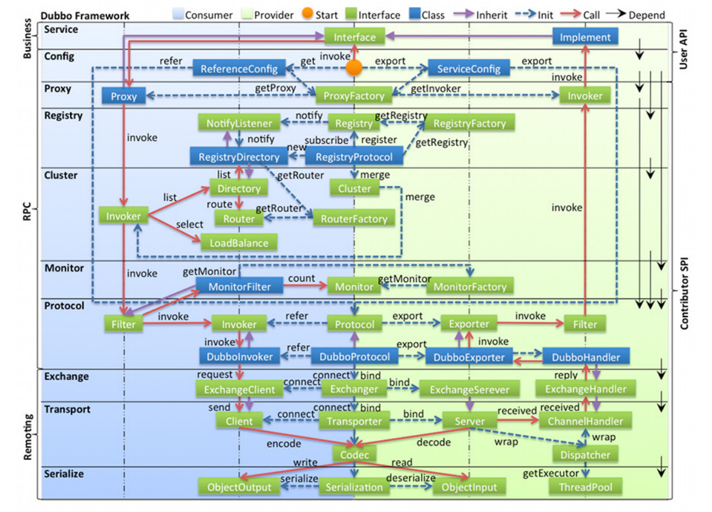
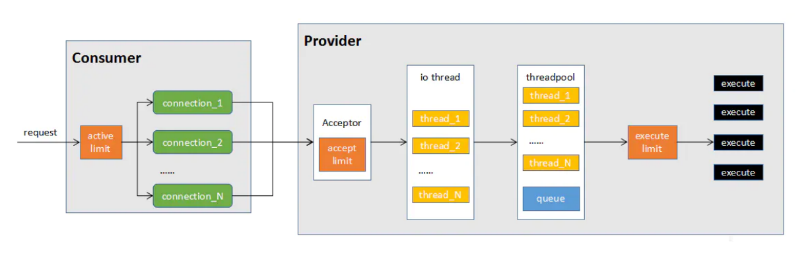
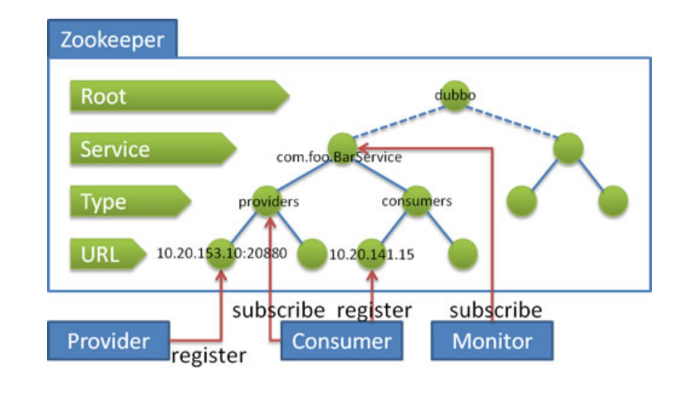
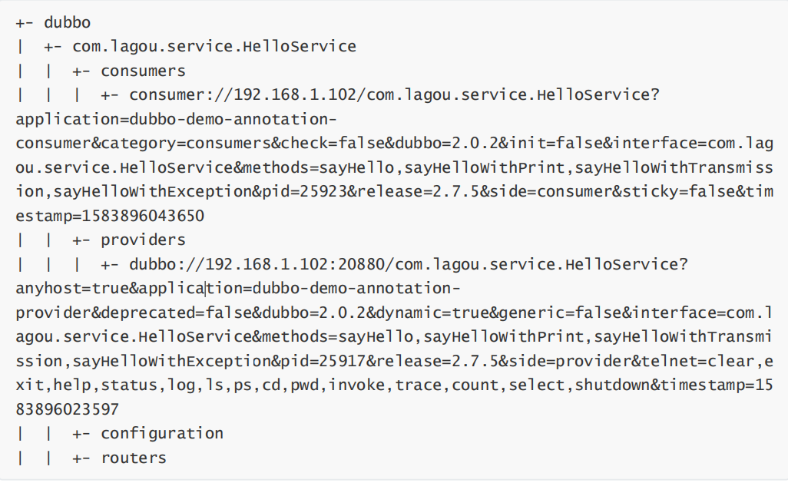

[toc]

### 整体的调用链路

1. 消费者通过Interface进行方法调用 统一交由消费者端的 Proxy 通过ProxyFactory 来进行代理对象的创建 使用到了 jdk javassist技术
2. 交给Filter 这个模块 做一个统一的过滤请求 在SPI案例中涉及过
3. 接下来会进入最主要的Invoker调用逻辑
  - 通过Directory 去配置中新读取信息 最终通过list方法获取所有的Invoker
  - 通过Cluster模块 根据选择的具体路由规则 来选取Invoker列表
  - 通过LoadBalance模块 根据负载均衡策略 选择一个具体的Invoker 来处理我们的请求
  - 如果执行中出现错误 并且Consumer阶段配 置了重试机制 则会重新尝试执行
4. 继续经过Filter 进行执行功能的前后封装 Invoker 选择具体的执行协议
5. 客户端 进行编码和序列化 然后发送数据
6. 到达Consumer中的 Server 在这里进行 反编码 和 反序列化的接收数据
7. 使用Exporter选择执行器 
8. 交给Filter 进行一个提供者端的过滤 到达 Invoker 执行器 
9. 通过Invoker 调用接口的具体实现 然后返回

### Dubbo源码整体设计

Dubbo源码整体设计与调用链路十分相似。只不过这里可以看到接口的一些具体实现以及左侧也有更为详细的层次划分

##### 图例说明：

- 图中左边淡蓝背景的为服务消费方使用的接口，右边淡绿色背景的为服务提供方使用的接口，位于中轴线上的为双方都用到的接口。
- 图中从下至上分为十层，各层均为单向依赖，右边的黑色箭头代表层之间的依赖关系，每一层都可以剥离上层被复用，其中，Service 和 Config 层为 API，其它各层均为 SPI。
- 图中绿色小块的为扩展接口，蓝色小块为实现类，图中只显示用于关联各层的实现类。
- 图中蓝色虚线为初始化过程，即启动时组装链，红色实线为方法调用过程，即运行时调时链，紫色
  三角箭头为继承，可以把子类看作父类的同一个节点，线上的文字为调用的方法。

##### 分层介绍:

Business 业务逻辑层

- service 业务层 包括我们的业务代码 比如 接口 实现类 直接面向开发者

RPC层 远程过程调用层

- config 配置层 对外提供配置 以ServiceConfig ReferenceConfig 为核心 可以直接初始化配置类 也可以解析配置文件生成 
- proxy 服务代理层 无论是生产者 还是消费者 框架都会产生一个代理类 整个过程对上层透明 就是
  业务层对远程调用无感 
- registry 注册中心层 封装服务地址的注册与发现 以服务的URL为中心 
- cluster 路由层 (集群容错层) 提供了多个提供者的路由和负载均衡 并且它桥接注册中心 以Invoker为核心
- monitor 监控层 RPC调用相关的信息 如 调用次数 成功失败的情况 调用时间等 在这一层完成
- protocol 远程调用层 封装RPC调用 无论是服务的暴露 还是 服务的引用 都是在Protocol中作为主
  功能入口 负责Invoker的整个生命周期 Dubbo中所有的模型都向Invoker靠拢

Remoting层 远程数据传输层

- exchange 信息交换层 封装请求和响应的模式 如把请求由同步 转换成异步

- transport 网络传输层 统一网络传输的接口 比如 netty 和 mina 统一为一个网络传输接口

- serialize 数据序列化层 负责管理整个框架中的数据传输的序列化 和反序列化

### Dubbo调用模型

1. consumer发起一个请求时，首先经过active limit(参数actives消费端最大并发调用数）进行方法级别的限制，如果超过actives则等待有其他请求完成后重试或者超时后失败。
2. 从多个连接(connections）中选择一个连接发送数据，对于默认的netty实现来说，由于可以复用连接，默认一个连接就可以。线上业务由于有多个consumer多个provider，因此不建议增加connections参数。
3. 连接到达provider时（如dubbo的初次连接），首先会判断总连接数是否超限（acceps），超过限制连接将被拒绝。
4. 连接成功后，具体的请求交给io thread处理。io threads虽然是处理数据的读写，但io部分为异步，更多的消耗的是cpu，因此iothreads默认cpu个数+1是比较合理的设置，不建议调整此参数。
5. 数据读取并反序列化以后，交给业务线程池处理，默认情况下线程池为fixed，且排队队列为0(queues)，这种情况下，最大并发等于业务线程池大小(threads)，如果希望有请求的堆积能力，可以调整queues参数。如果希望快速失败由其他节点处理（官方推荐方式），则不修改queues，只调整threads。
6. execute limit（参数executes）是方法级别的并发限制，原理与actives类似，只是少了等待的过程，即受限后立即失败

### 服务注册与消费源码剖析

Zookeeper的目录结构如下：

