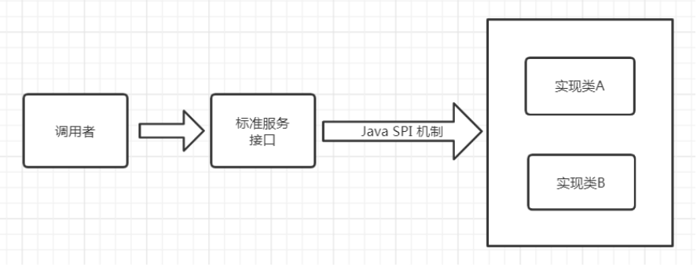
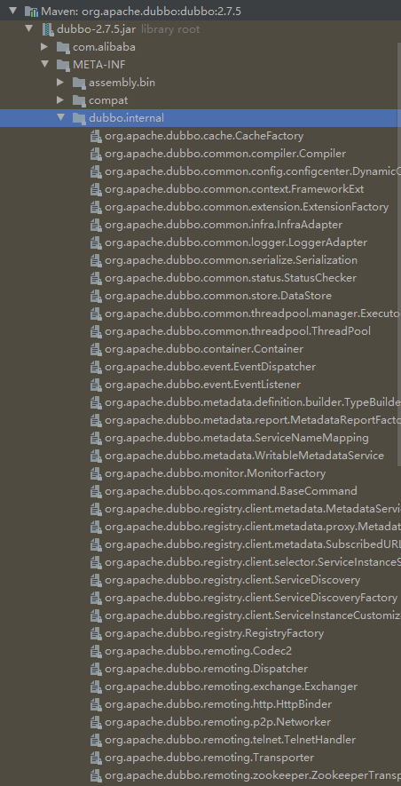

[toc]


## 一、Dubbo的SPI机制

### 1.Dubbo为什么不直接使用JDK自带的SPI机制？

##### [查看JDK SPI机制 -->](../../../java/基础/SPI机制)

##### JDK SPI的缺点：

1. 所有扩展实现都会被初始化并加载，影响了程序启动的耗时，若有扩展实现加载耗时又没被使用，影响了系统资源
2. 并且任意一个扩展实现加载失败，都会影响所有的扩展实现的使用

##### Dubbo SPI的改善

提供了对扩展点包装的功能(Adaptive)，实现动态加载扩展点，并且还支持通过set的方式对其他的扩展点进行注入


### 2.Dubbo SPI简介



Dubbo项目中大量使用Dubbo SPI ，定义了一些接口服务，如协议，负载均衡。并在**META-INF/dubbo.internal**包下提供了大量扩展实现，除此之外，使用Dubbo的开发者也可通过Dubbo SPI自定义实现扩展服务，




##### dubbo提供的默认负载均衡实现如下图所示：


### 3.使用Dubbo SPI自定义扩展实现

`SPI `自定义的扩展实现中，`SPI`声明文件以 `key-value` 形式存储，**key代表了某个扩展实现的标识**，**value为扩展实现的全限定类名**

##### 创建API工程

1. pom文件添加dubbo依赖

```xml
<dependencies>
    <dependency>
        <groupId>org.apache.dubbo</groupId>
        <artifactId>dubbo</artifactId>
        <version>2.7.5</version>
    </dependency>
</dependencies>
```

2. 定义接口服务，接口使用**@SPI**注解

```java
import org.apache.dubbo.common.URL;
import org.apache.dubbo.common.extension.Adaptive;
import org.apache.dubbo.common.extension.SPI;

@SPI
public interface HelloService {
    String  sayHello();
}
```


##### 创建扩展实现工程

1. 导入API工程的依赖
2. 编写两个扩展实现类

```java
import com.tangdi.service.HelloService;
import org.apache.dubbo.common.URL;

public class DogHelloService implements HelloService{
    @Override
    public String sayHello() {
        return "wang wang";
    }
}
```

```java
import com.tangdi.service.HelloService;
import org.apache.dubbo.common.URL;

public class HumanHelloService implements HelloService{
    @Override
    public String sayHello() {
        return "hello 你好";
    }
}
```

3.编写SPI声明文件，在**resources/META-INF/dubbo** （区别于dubbo默认的spi实现文件）目录下创建一个以“**接口全限定名**”为命名的文件，文件内部配置**两个实现类名称和对应的全限定名**

```
human=com.lagou.service.impl.HumanHelloService
dog=com.lagou.service.impl.DogHelloService
```


##### 创建使用工程

1.  导入API工程和扩展实现工程
2. 编写main函数，与jdk spi不同的是 dubbo spi 使用自己实现的**ExtensionLoader**来加载扩展实现类

```java
import com.tangdi.service.HelloService;
import org.apache.dubbo.common.extension.ExtensionLoader;

import java.util.Set;

public class DubboSpiMain {
    public static void main(String[] args) {
        // 获取扩展加载器
        ExtensionLoader<HelloService>  extensionLoader  = ExtensionLoader.getExtensionLoader(HelloService.class);
        // 遍历所有的支持的扩展点 META-INF.dubbo
        Set<String>  extensions = extensionLoader.getSupportedExtensions();
        for (String extension : extensions){
            String result = extensionLoader.getExtension(extension).sayHello();
            System.out.println(result);
        }

    }
}
```


### 4.Dubbo SPI的Adaptive功能

Dubbo中的Adaptive功能，是动态的选择具体的扩展点。通过getAdaptiveExtension 统一对指定接口对应的所有扩展点进行封装，通过URL的方式对扩展点来进行动态选择。 (dubbo中所有的注册信息都是通过URL的形式进行处理的)这里同样采用相同的方式进行实现

##### 在上面的基础上更改API工程

1. **@SPI 注解**的value值代表该接口默认的实现是什么，对应dubbo.internal文件中的key

2. **@Adaptive 注解**代表可以被动态选择的扩展实现方法

3. 在参数中提供URL参数.注意这里的URL参数的类为 `org.apache.dubbo.common.URL`

```java
import org.apache.dubbo.common.URL;
import org.apache.dubbo.common.extension.Adaptive;
import org.apache.dubbo.common.extension.SPI;

@SPI("human")
public interface HelloService {
    String  sayHello();
    @Adaptive
    String  sayHello(URL  url);
}
```


##### 在上面的基础上更改扩展实现工程

1. 实现类方法增加URL形参即可

```java
@Override
public String sayHello(URL url) {
    return "wang url";
}
```

```java
@Override
public String sayHello(URL url) {
    return "hello 你好";
}
```

2. SPI声明文件以key-value形式编写

```
human=com.lagou.service.impl.HumanHelloService
dog=com.lagou.service.impl.DogHelloService
```


##### 在上面的基础上更改使用工程

main 函数中需要传入URL参数，并且在参数中指定具体的实现类参数

URL的地址不限，关键是 `?` 后面跟上全限定接口名，然后指定扩展实现对应的key

```java
import com.tangdi.service.HelloService;
import org.apache.dubbo.common.URL;
import org.apache.dubbo.common.extension.ExtensionLoader;

public class DubboAdaptiveMain {
    public static void main(String[] args) {
        URL url = URL.valueOf("test://localhost/hello?hello.service=dog");
        // 获取所有扩展实现，封装到AdaptiveExtension
        HelloService adptExt = ExtensionLoader.getExtensionLoader(HelloService.class).getAdaptiveExtension();
        String  msg = adaptiveExtension.sayHello(url);
        System.out.println(msg);
    }
}
```


### 5.基于Dubbo SPI的Dubbo过滤器功能

与很多框架一样，Dubbo也存在拦截（过滤）机制，可以通过该机制在执行目标程序前后执行我们指定的代码。

Dubbo的Filter机制，是专门为服务提供方和服务消费方调用过程进行拦截设计的，每次远程方法执行，该拦截都会被执行。这样就为开发者提供了非常方便的扩展性，比如为dubbo接口实现ip白名单功能、监控功能 、日志记录等。

##### 步骤如下：

1. 实现 `org.apache.dubbo.rpc.Filter` 接口

2. 使用 `org.apache.dubbo.common.extension.Activate` 接口进行对类进行注册 通过group 可以指定生产端 消费端

3. 处理逻辑代码实现

   ```java
   import org.apache.dubbo.common.constants.CommonConstants;
   import org.apache.dubbo.common.extension.Activate;
   import org.apache.dubbo.rpc.*;
   
   
   @Activate(group = {CommonConstants.CONSUMER,CommonConstants.PROVIDER})
   public class DubboInvokeFilter implements Filter {
       @Override
       public Result invoke(Invoker<?> invoker, Invocation invocation) throws RpcException {
           long   startTime  = System.currentTimeMillis();
           try {
               // 执行方法
               return invoker.invoke(invocation);
           } finally {
               System.out.println("invoke time:"+(System.currentTimeMillis()-startTime) + "毫秒");
           }
   
       }
   }
   ```

4. 在 `META-INF.dubbo `中新建 `org.apache.dubbo.rpc.Filter `文件，并将扩展实现类的全名写入

   ```
   timeFilter=com.lagou.filter.DubboInvokeFilter
   ```

**注意：一般类似于这样的功能都是单独开发依赖的，所以再使用方的项目中只需要引入依赖，在调用接口时，该方法便会自动拦截**

## 二、负载均衡策略

### [Dubbo官网文档](https://dubbo.apache.org/zh/docs/advanced/loadbalance/)

##### Random LoadBalance-随机

按权重设置随机概率。在一个截面上碰撞的概率高，但调用量越大分布越均匀，而且按概率使用权重后也比较均匀，有利于动态调整提供者权重。

##### RoundRobin LoadBalance-轮询

**缺点：**存在慢的提供者累积请求的问题，比如：第二台机器很慢，但没挂，当请求调到第二台时就卡在那，久而久之，所有请求都卡在调到第二台上。

##### LeastActive LoadBalance-最少活跃调用数

相同活跃数的随机，活跃数指调用前后计数差。

**优点：**使慢的提供者收到更少请求，因为越慢的提供者的调用前后计数差会越大。

##### ConsistentHash LoadBalance-一致性 Hash

[具体查看一致性hash](../集群及分布式解决方案汇总/集群及分布式解决方案汇总)

相同参数的请求总是发到同一提供者。

- 当某一台提供者挂时，原本发往该提供者的请求，基于虚拟节点，平摊到其它提供者，不会引起剧烈变动。
- 缺省只对第一个参数 Hash，如果要修改，请配置 `<dubbo:parameter key="hash.arguments" value="0,1" />`
- 缺省用 160 份虚拟节点，如果要修改，请配置 `<dubbo:parameter key="hash.nodes" value="320" />`


##### 指定负载均衡

配置负载均衡策略，既可以在服务提供者一方配置，也可以在服务消费者一方配置，如下

```java
//在服务消费者一方配置负载均衡策略
@Reference(check = false,loadbalance = "random")
```

```java
//在服务提供者一方配置负载均衡 
@Service(loadbalance = "random") 
public class HelloServiceImpl implements HelloService { 
    public String sayHello(String name) { 
        return "hello " + name; 
    }
}
```

##### 自定义负载均衡

1. 负载均衡器在Dubbo中的SPI接口是 `org.apache.dubbo.rpc.cluster.LoadBalance` , 可以通过实现这个接口来实现自定义的负载均衡规则

2. 编写自定义负载均衡扩展实现类

3. 在dubbo-spi-loadbalance工程的 `META-INF/dubbo` 目录下新建`org.apache.dubbo.rpc.cluster.LoadBalance` 文件，并将当前类的全名写入

   ```properties
   onlyFirst=包名.负载均衡器
   ```

4. 消费者或者生产者引入自定义负载均衡SPI工程


## 三、线程池

### [Dubbo官方文档 - 线程池配置](https://dubbo.apache.org/zh/docs/references/xml/dubbo-provider/)

### 1 Dubbo提供以下两种方式

##### 1.1 fifix（Dubbo默认）：固定大小线程池，启动时建立线程，不关闭，一直持有，默认创建的执行线程数为200，并且没有任何等待队列

在极端的情况下可能会存在问题，比如某个操作大量执行时，可能存在堵塞的情况。后面也会讲相关的处理办法。

##### 1.2 cache:：缓存线程池，空闲一分钟自动删除，当线程不足时，会自动创建新的线程。

如果突然有高TPS的请求过来，方法没有及时完成，则会造成大量的线程创建，极度消耗系统资源，拖慢系统性能甚至导致OOM

##### 1.3 limit：可伸缩线程池，但池中的线程数只会增长不会收缩。只增长不收缩的目的是为了避免收缩时突然来了大流量引起的性能问题

##### 1.4 eager：优先创建`Worker`线程池。

在任务数量大于`corePoolSize`但是小于`maximumPoolSize`时，优先创建`Worker`来处理任务。当任务数量大于`maximumPoolSize`时，将任务放入阻塞队列中。阻塞队列充满时抛出`RejectedExecutionException`。(相比于`cached`:`cached`在任务数量超过`maximumPoolSize`时直接抛出异常而不是将任务放入阻塞队列)


### 2 自定义Dubbo线程池

由于线程池的使用对于业务开发人员是无感的，只有fix模式的线程池中的线程不够处理请求或者cache模式的线程池创建大量线程导致程序OOM，引起的系统故障，业务开发人员才能得知发生问题了。

##### 现在要实现当线程池数量不够用，或者创建了大量线程超过阈值，发生告警

1. 继承Dubbo相关线程池实现类，自定义线程池及实现线程池阈值告警

```java
import org.apache.dubbo.common.URL;
import org.apache.dubbo.common.threadpool.support.fixed.FixedThreadPool;
import org.slf4j.Logger;
import org.slf4j.LoggerFactory;

import java.util.Map;
import java.util.concurrent.*;

public class WachingThreadPool extends FixedThreadPool implements Runnable{
    private  static  final Logger  LOGGER = LoggerFactory.getLogger(WachingThreadPool.class);
    // 定义线程池使用的阀值
    private  static  final  double  ALARM_PERCENT = 0.90;
    private  final Map<URL, ThreadPoolExecutor>    THREAD_POOLS = new ConcurrentHashMap<>();
    public  WachingThreadPool(){
        // 每隔3秒打印线程使用情况
        Executors.newSingleThreadScheduledExecutor().scheduleWithFixedDelay(this,1,3, TimeUnit.SECONDS);
    }
    // 通过父类创建线程池
    @Override
    public Executor getExecutor(URL url) {
         final  Executor executor = super.getExecutor(url);
         if(executor instanceof  ThreadPoolExecutor){
             THREAD_POOLS.put(url,(ThreadPoolExecutor)executor);
         }
         return  executor;
    }

    @Override
    public void run() {
         // 遍历线程池
         for (Map.Entry<URL,ThreadPoolExecutor> entry: THREAD_POOLS.entrySet()){
              final   URL  url = entry.getKey();
              final   ThreadPoolExecutor  executor = entry.getValue();
              // 计算相关指标
              final  int  activeCount  = executor.getActiveCount();
              final  int  poolSize = executor.getCorePoolSize();
              double  usedPercent = activeCount / (poolSize*1.0);
              LOGGER.info("线程池执行状态:[{}/{}:{}%]",activeCount,poolSize,usedPercent*100);
              if (usedPercent > ALARM_PERCENT){
                  LOGGER.error("超出警戒线! host:{} 当前使用率是:{},URL:{}",url.getIp(),usedPercent*100,url);
              }

         }
    }
}
```

2. SPI声明，创建文件 META-INF/dubbo/org.apache.dubbo.common.threadpool.ThreadPool 

   ```properties
   watching=包名.线程池名
   ```

3. 在服务提供方项目引入该依赖，并在配置中设置使用该线程池生成器

   ```properties
   dubbo.provider.threadpool=watching
   ```

   

## 四、服务降级

#### 什么是服务降级

服务降级，当服务器压力剧增的情况下，根据当前业务情况及流量对一些服务有策略的降低服务级别，以释放服务器资源，保证核心任务的正常运行。

#### 为什么要服务降级

而为什么要使用服务降级，这是防止分布式服务发生雪崩效应，什么是雪崩？就是蝴蝶效应，当一个请求发生超时，一直等待着服务响应，那么在高并发情况下，很多请求都是因为这样一直等着响应，直到服务资源耗尽产生宕机，而宕机之后会导致分布式其他服务调用该宕机的服务也会出现资源耗尽宕机，这样下去将导致整个分布式服务都瘫痪，这就是雪崩。

#### dubbo 服务降级实现方式

XML配置方式

```xml
<dubbo:reference id="xxService" check="false" interface="com.xx.XxService" timeout="3000" mock="return null" /> <dubbo:reference id="xxService2" check="false" interface="com.xx.XxService2" timeout="3000" mock="return 1234" />
```

注解方式

```java
@Reference(mock="return null") 
@Reference(mock="return 简单值")
@Reference(mock="force:return null") 
```


