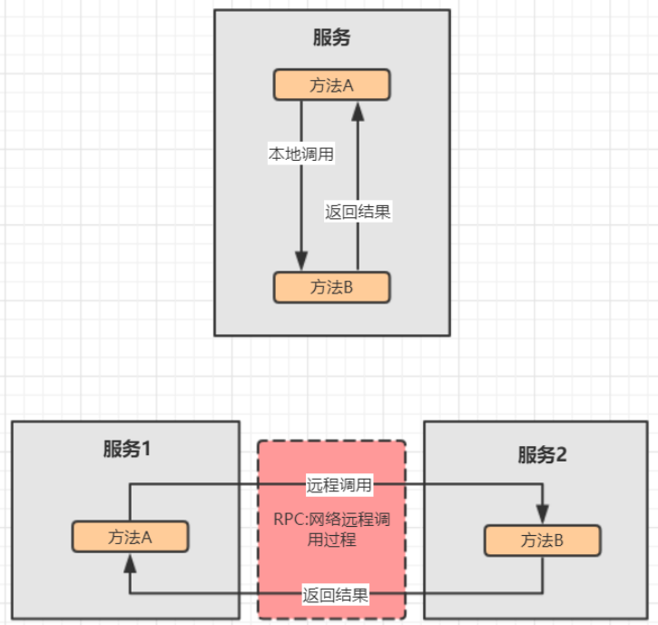
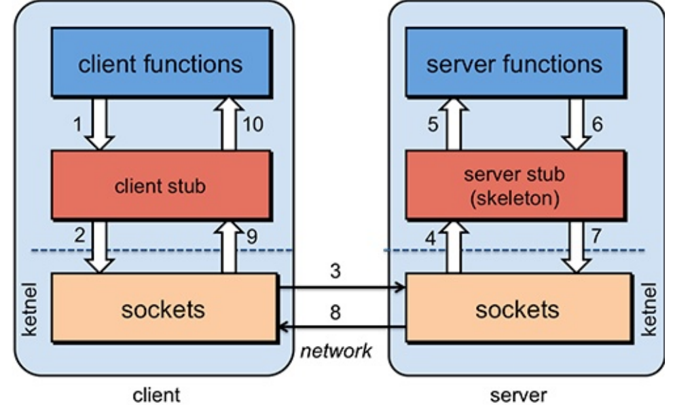
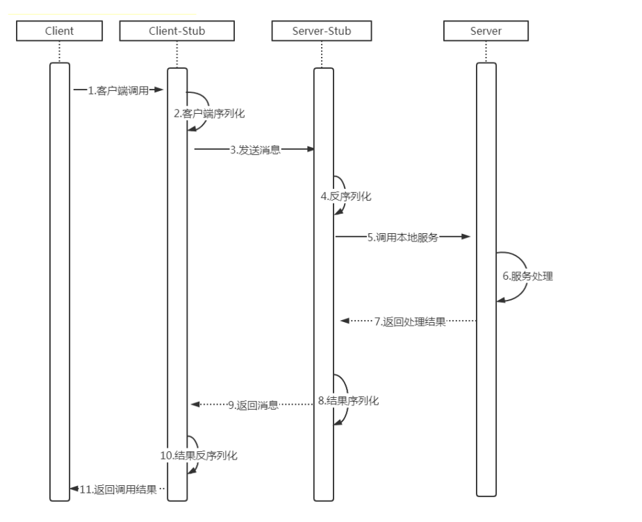
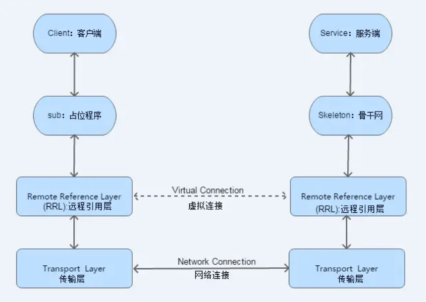

[toc]

## 分布式架构网络通信

在分布式服务框架中，一个最基础的问题就是远程服务是怎么通讯的，在Java领域中有很多可实现远程通讯的技术，例如：RMI、Hessian、SOAP、ESB和JMS等，它们都实现了RPC

### 1. 基本原理

要实现网络机器间的通讯，首先得来看看计算机系统网络通信的基本原理，在底层层面去看，网络通信需要做的就是将流从一台计算机传输到另外一台计算机，基于传输协议和网络IO来实现，其中传输协议比较出名的有tcp、udp等等，tcp、udp都是在基于Socket概念上为某类应用场景而扩展出的传输协议，网络IO，主要有bio、nio、aio三种方式，所有的分布式应用通讯都基于这个原理而实现


### 2. 什么是RPC

RPC全称为remote procedure call，即远程过程调用。借助RPC可以做到像本地调用一样调用远程服务，是一种进程间的通信方式

比如两台服务器A和B，A服务器上部署一个应用，B服务器上部署一个应用，A服务器上的应用想调用B服务器上的应用提供的方法，由于两个应用不在一个内存空间，不能直接调用，所以需要通过网络来表达调用的语义和传达调用的数据。**需要注意的是RPC并不是一个具体的技术，而是指整个网络远程调用过程。**




### 3.RPC架构

 在java中RPC框架比较多，常见的有Hessian、gRPC、Dubbo、Motan等，其实对 于RPC框架而言，核心模块就是**通讯和序列化**

一个完整的RPC架构里面包含了四个核心的组件，分别是**Client**，**Client Stub**，**Server**以及**Server Stub**，这个Stub可以理解为存根

#### 组件结构如下图所示：



- 客户端(Client)，服务的调用方。

- 客户端存根(Client Stub)，存放服务端的地址消息，再将客户端的请求参数打包成网络消息，然后通过网络远程发送给服务方。

- 服务端(Server)，真正的服务提供者。

- 服务端存根(Server Stub)，接收客户端发送过来的消息，将消息解包，并调用本地的方法。


#### 调用时序图如下所示：



1. 客户端（client）以本地调用方式（即以接口的方式）调用服务；

2. **客户端存根（client stub）接收到调用后，负责将方法、参数等组装成能够进行网络传输的消息体（将消息体对象序列化为二进制）；**

3. **客户端通过socket将消息发送到服务端；**

4. **服务端存根( server stub）收到消息后进行解码（将消息对象反序列化）；**

5. **服务端存根( server stub）根据解码结果调用本地的服务；**

6. 服务处理

7. **本地服务执行并将结果返回给服务端存根( server stub）；**

8. **服务端存根( server stub）将返回结果打包成消息（将结果消息对象序列化）；**

9. **服务端（server）通过socket将消息发送到客户端；**

10. **客户端存根（client stub）接收到结果消息，并进行解码（将结果消息发序列化）；**

11. 客户端（client）得到最终结果。

RPC的目标是要把2、3、4、5、7、8、9、10这些步骤都封装起来。只剩下1、6、11


### 4. RMI

 Java RMI，即远程方法调用(Remote Method Invocation)，一种用于实现**远程过程调用**(RPC-Remote procedure call)的Java API， 能直接传输序列化后的Java对象。它的实现依赖于Java虚拟机，因此它仅支持从一个JVM到另一个JVM的调用。

#### 流程图



1. 客户端从远程服务器的注册表中查询并获取远程对象引用。 

2. 桩对象与远程对象具有相同的接口和方法列表，当客户端调用远程对象时，实际上是由相应的桩对象代理完成的。

3. 远程引用层在将桩的本地引用转换为服务器上对象的远程引用后，再将调用传递给传输层(Transport)，由传输层通过TCP协议发送调用； 

4. 在服务器端，传输层监听入站连接，它一旦接收到客户端远程调用后，就将这个引用转发给其上层的远程引用层； 5）服务器端的远程引用层将客户端发送的远程应用转换为本地虚拟机的引用后，再将请求传递给骨架(Skeleton)； 6）骨架读取参数，又将请求传递给服务器，最后由服务器进行实际的方法调用。

5. 如果远程方法调用后有返回值，则服务器将这些结果又沿着“骨架->远程引用层->传输层”向下传递；

6. 客户端的传输层接收到返回值后，又沿着“传输层->远程引用层->桩”向上传递，然后由桩来反序列化这些返回值，并将最终的结果传递给客户端程序。


#### 需求分析

1. 服务端提供根据ID查询用户的方法

2. 客户端调用服务端方法, 并返回用户对象

3. 要求使用RMI进行远程通信

#### 代码实现

##### - 服务端

```java
import com.lagou.rmi.service.IUserService;
import com.lagou.rmi.service.UserServiceImpl;

import java.rmi.RemoteException;
import java.rmi.registry.LocateRegistry;
import java.rmi.registry.Registry;

/**
 * 服务端
 */
public class RMIServer {
    public static void main(String[] args) {
        try {
            //1.注册Registry实例. 绑定端口
            Registry registry = LocateRegistry.createRegistry(9998);
            //2.创建远程对象
            IUserService userService = new UserServiceImpl();
            //3.将远程对象注册到RMI服务器上即(服务端注册表上)
            registry.rebind("userService", userService);
            System.out.println("---RMI服务端启动成功----");
        } catch (RemoteException e) {
            e.printStackTrace();
        }
    }
}
```

##### - 客户端

```java
import com.lagou.rmi.pojo.User;
import com.lagou.rmi.service.IUserService;

import java.rmi.NotBoundException;
import java.rmi.RemoteException;
import java.rmi.registry.LocateRegistry;
import java.rmi.registry.Registry;

/**
 * 客户端
 */
public class RMIClient {
    public static void main(String[] args) throws RemoteException, NotBoundException {
        //1.获取Registry实例
        Registry registry = LocateRegistry.getRegistry("127.0.0.1", 9998);
        //2.通过Registry实例查找远程对象
        IUserService userService = (IUserService) registry.lookup("userService");
        User user = userService.getByUserId(2);
        System.out.println(user.getId() + "----" + user.getName());
    }
}
```

##### - 接口与实现类

```java
import com.lagou.rmi.pojo.User;

import java.rmi.Remote;
import java.rmi.RemoteException;

public interface IUserService extends Remote {

    User getByUserId(int id) throws RemoteException;
}
```

```java
package com.lagou.rmi.service;

import com.lagou.rmi.pojo.User;

import java.rmi.RemoteException;
import java.rmi.server.UnicastRemoteObject;
import java.util.HashMap;
import java.util.Map;

public class UserServiceImpl extends UnicastRemoteObject implements IUserService {
    Map<Object, User> userMap = new HashMap();

    public UserServiceImpl() throws RemoteException {
        super();
        User user1 = new User();
        user1.setId(1);
        user1.setName("张三");
        User user2 = new User();
        user2.setId(2);
        user2.setName("李四");
        userMap.put(user1.getId(), user1);
        userMap.put(user2.getId(), user2);

    }

    @Override
    public User getByUserId(int id) throws RemoteException {
        return userMap.get(id);
    }
}
```

