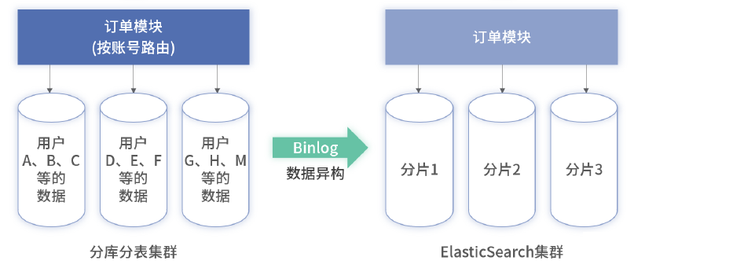
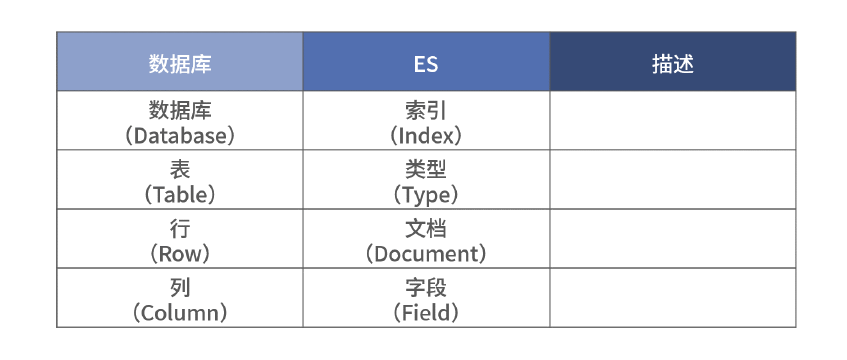
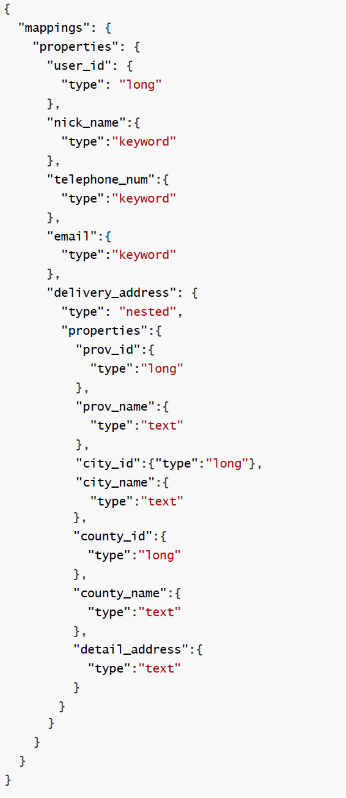

分库分表后的多维度复杂查询，可以使用ES搜索引擎来完成，如按uid分库的订单表需要用商户id查询、分页查询等多维度的复杂查询查询

采用binlog 将数据库的数据同步至 ES





- 数据库表结构

  

- ES文档结构

  

- ES深翻页查询

  ```sql
  select col.. from table where id >= lastMaxId order by id limit pageSize
  ```

  