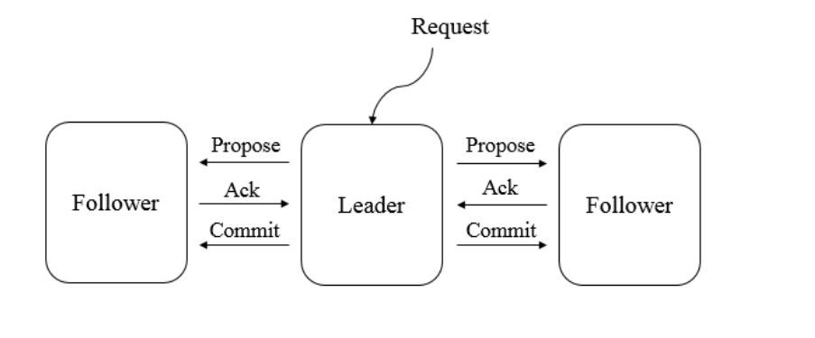
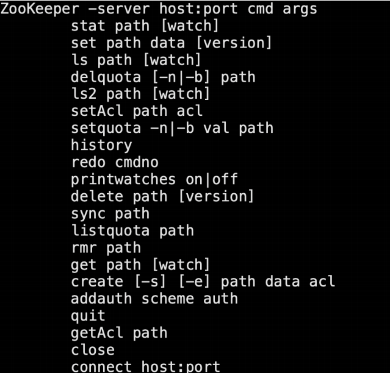

[toc]

## zookeeper简介

zookeeper是开源的分布式协调服务，通过共享存储（信息共享）保证分布式系统信息的一致性，实现对分布式系统的协调，基于网络通信。

zookeeper是分布式数据一致性的解决方案，本质是类文件系统，通过快照和事务日志实现文件的存储

类似于一个项目组中，leader ——上传任务——> SVN ——发送事件——>邮箱——发送邮件——>组员————>从SVN获取任务

### 集群角色

所有角色在处理请求时，都通过责任链来进行一些列处理

leader：发起投票

follower：提供读服务；参与投票；参与leader选举；

observer：提供读服务

**保证数据一致性**

当follower和observer接收到客户端写请求时，转发给leader，leader发起投票过半写成功策略，follower参与投票，observer不参与。根据投票结果，所有服务器（包括leader、follower和observer）进行写操作



### 会话

zookeeper服务端的端口为2181，当应用程序依赖了zookeeper，在启动的时候就建立了与zookeeper的TCP连接，这就开始了客户端会话的生命周期。

客户端通过定期心跳检测，保持与zk服务端的TCP连接

### 数据节点

**具有强一致性**

znode类型：持久、持久顺序、临时、临时顺序

持久节点不随会话结束而消失

临时节点随会话结束而消失

顺序节点后缀由zk自动生成一串序号，所以前缀的名称可以重复

非顺序节点名称不可以重复

### Watcher（事件监听/通知）

Watcher事件通知机制时zk核心，数据发布/订阅、命名服务、集群管理、Master选择、分布式锁和分布式队列都基于此实现

Watcher数据变更通知，客户端向服务端注册一个Watcher，然后通过回调获得消息

事件通知类型：Event.xxxxxx

### ACL（访问权限控制）

权限模式：ip、Digest、world、Super

授权对象：ip:xxx.xxx.x.1/24、username:password、world:anyOne（常用）、super

权限、create（针对子节点）、delete（针对子节点）、read（ls2/get）、write（set）、admin


## zookeepe搭建及使用

### 客户端命令行操作

创建会话建立（TCP连接）

```sh
./zkcli.sh 连接本地的zookeeper服务器
./zkCli.sh -server ip:port 连接指定的服务器
```

连接成功之后，系统会输出Zookeeper的相关环境及配置信息等信息。输⼊help



create（针对子节点）、delete（针对子节点）、read（ls2/get）、write（set）、admin

### 客户端原生API操作

创建会话建立（TCP连接）、创建节点、删除节点、获取子节点列表（getChildren）、获取节点数据（getData）、修改节点数据

##### 1.添加依赖

```xml
<dependency>
    <groupId>org.apache.zookeeper</groupId>
    <artifactId>zookeeper</artifactId>
    <version>3.4.14</version>
</dependency>
```

##### 2.创建会话

```java
import org.apache.zookeeper.WatchedEvent;
import org.apache.zookeeper.Watcher;
import org.apache.zookeeper.ZooKeeper;

import java.io.IOException;
import java.util.concurrent.CountDownLatch;

public class CreateSession implements Watcher {

    private  static CountDownLatch countDownLatch = new CountDownLatch(1);


    /*
      建立会话
     */
    public static void main(String[] args) throws IOException, InterruptedException {

     /*
        客户端可以通过创建一个zk实例来连接zk服务器
        new Zookeeper(connectString,sesssionTimeOut,Wather)
        connectString: 连接地址：IP：端口
        sesssionTimeOut：会话超时时间：单位毫秒
        Wather：监听器(当特定事件触发监听时，zk会通过watcher通知到客户端)
     */

        ZooKeeper zooKeeper = new ZooKeeper("127.0.0.1:2181", 5000, new CreateSession());
        System.out.println(zooKeeper.getState());

        // 计数工具类：CountDownLatch:不让main方法结束，让线程处于等待阻塞
        countDownLatch.await();

        System.out.println("客户端与服务端会话真正建立了");

    }

    /*
        回调方法：处理来自服务器端的watcher通知
     */
    public void process(WatchedEvent watchedEvent) {
        // SyncConnected
        if(watchedEvent.getState() == Event.KeeperState.SyncConnected){

            //解除主程序在CountDownLatch上的等待阻塞
            System.out.println("process方法执行了...");
            countDownLatch.countDown();

        }


    }
}
```


##### 3.创建节点

```java
import org.apache.zookeeper.*;

import java.io.IOException;
import java.util.concurrent.CountDownLatch;

public class CreateNote implements Watcher {

    private  static CountDownLatch countDownLatch = new CountDownLatch(1);

    private static ZooKeeper zooKeeper;


    /*
      建立会话
     */
    public static void main(String[] args) throws IOException, InterruptedException, KeeperException {

     /*
        客户端可以通过创建一个zk实例来连接zk服务器
        new Zookeeper(connectString,sesssionTimeOut,Wather)
        connectString: 连接地址：IP：端口
        sesssionTimeOut：会话超时时间：单位毫秒
        Wather：监听器(当特定事件触发监听时，zk会通过watcher通知到客户端)
     */

         zooKeeper = new ZooKeeper("127.0.0.1:2181", 5000, new CreateNote());
        System.out.println(zooKeeper.getState());

        // 计数工具类：CountDownLatch:不让main方法结束，让线程处于等待阻塞
        //countDownLatch.await();\
        Thread.sleep(Integer.MAX_VALUE);

    }


    /*
        回调方法：处理来自服务器端的watcher通知
     */
    public void process(WatchedEvent watchedEvent) {
        // SyncConnected
        if(watchedEvent.getState() == Event.KeeperState.SyncConnected){

            //解除主程序在CountDownLatch上的等待阻塞
            System.out.println("process方法执行了...");
            // 创建节点
            try {
                createNoteSync();
            } catch (KeeperException e) {
                e.printStackTrace();
            } catch (InterruptedException e) {
                e.printStackTrace();
            }

        }


    }


    /*
       创建节点的方法
   */
    private static void createNoteSync() throws KeeperException, InterruptedException {

        /**
         *  path        ：节点创建的路径
         *  data[]      ：节点创建要保存的数据，是个byte类型的
         *  acl         ：节点创建的权限信息(4种类型)
         *                 ANYONE_ID_UNSAFE    : 表示任何人
         *                 AUTH_IDS    ：此ID仅可用于设置ACL。它将被客户机验证的ID替换。
         *                 OPEN_ACL_UNSAFE    ：这是一个完全开放的ACL(常用)--> world:anyone
         *                 CREATOR_ALL_ACL  ：此ACL授予创建者身份验证ID的所有权限
         *  createMode    ：创建节点的类型(4种类型)
         *                  PERSISTENT：持久节点
         *				    PERSISTENT_SEQUENTIAL：持久顺序节点
         *                  EPHEMERAL：临时节点
         *                  EPHEMERAL_SEQUENTIAL：临时顺序节点
         String node = zookeeper.create(path,data,acl,createMode);
         */

        // 持久节点
        String note_persistent = zooKeeper.create("/lg-persistent", "持久节点内容".getBytes(), ZooDefs.Ids.OPEN_ACL_UNSAFE, CreateMode.PERSISTENT);

        // 临时节点
        String note_ephemeral = zooKeeper.create("/lg-ephemeral", "临时节点内容".getBytes(), ZooDefs.Ids.OPEN_ACL_UNSAFE, CreateMode.EPHEMERAL);

        // 持久顺序节点
        String note_persistent_sequential = zooKeeper.create("/lg-persistent_sequential", "持久顺序节点内容".getBytes(), ZooDefs.Ids.OPEN_ACL_UNSAFE, CreateMode.PERSISTENT_SEQUENTIAL);

        System.out.println("创建的持久节点" + note_persistent);
        System.out.println("创建的临时节点" + note_ephemeral);
        System.out.println("创建的持久顺序节点" + note_persistent_sequential);

    }
}
```


##### 4.删除节点

```java
import org.apache.zookeeper.*;
import org.apache.zookeeper.data.Stat;

import java.io.IOException;
import java.util.concurrent.CountDownLatch;

public class DeleteNote implements Watcher {

    private  static CountDownLatch countDownLatch = new CountDownLatch(1);

    private static ZooKeeper zooKeeper;


    /*
      建立会话
     */
    public static void main(String[] args) throws IOException, InterruptedException, KeeperException {

     /*
        客户端可以通过创建一个zk实例来连接zk服务器
        new Zookeeper(connectString,sesssionTimeOut,Wather)
        connectString: 连接地址：IP：端口
        sesssionTimeOut：会话超时时间：单位毫秒
        Wather：监听器(当特定事件触发监听时，zk会通过watcher通知到客户端)
     */

         zooKeeper = new ZooKeeper("127.0.0.1:2181", 5000, new DeleteNote());
        System.out.println(zooKeeper.getState());

        // 计数工具类：CountDownLatch:不让main方法结束，让线程处于等待阻塞
        //countDownLatch.await();\
        Thread.sleep(Integer.MAX_VALUE);

    }


    /*
        回调方法：处理来自服务器端的watcher通知
     */
    public void process(WatchedEvent watchedEvent) {
        // SyncConnected
        if(watchedEvent.getState() == Event.KeeperState.SyncConnected){

            //解除主程序在CountDownLatch上的等待阻塞
            System.out.println("process方法执行了...");
            // 删除节点
            try {
                deleteNoteSync();
            } catch (KeeperException e) {
                e.printStackTrace();
            } catch (InterruptedException e) {
                e.printStackTrace();
            }


        }


    }

    /*
        删除节点的方法
     */
    private void deleteNoteSync() throws KeeperException, InterruptedException {

        /*
      	zooKeeper.exists(path,watch) :判断节点是否存在
      	zookeeper.delete(path,version) : 删除节点
      */

        Stat stat = zooKeeper.exists("/lg-persistent/c1", false);
        System.out.println(stat == null ? "该节点不存在":"该节点存在");

        if(stat != null){
            zooKeeper.delete("/lg-persistent/c1",-1);
        }

        Stat stat2 = zooKeeper.exists("/lg-persistent/c1", false);
        System.out.println(stat2 == null ? "该节点不存在":"该节点存在");

    }
}
```


##### 5.获取⼦节点

```java
import org.apache.zookeeper.*;

import java.io.IOException;
import java.util.List;
import java.util.concurrent.CountDownLatch;

public class GetNoteData implements Watcher {

    private  static CountDownLatch countDownLatch = new CountDownLatch(1);

    private static ZooKeeper zooKeeper;


    /*
      建立会话
     */
    public static void main(String[] args) throws IOException, InterruptedException, KeeperException {

     /*
        客户端可以通过创建一个zk实例来连接zk服务器
        new Zookeeper(connectString,sesssionTimeOut,Wather)
        connectString: 连接地址：IP：端口
        sesssionTimeOut：会话超时时间：单位毫秒
        Wather：监听器(当特定事件触发监听时，zk会通过watcher通知到客户端)
     */

         zooKeeper = new ZooKeeper("127.0.0.1:2181", 5000, new GetNoteData());
        System.out.println(zooKeeper.getState());

        // 计数工具类：CountDownLatch:不让main方法结束，让线程处于等待阻塞
        //countDownLatch.await();\
        Thread.sleep(Integer.MAX_VALUE);

    }


    /*
        回调方法：处理来自服务器端的watcher通知
     */
    public void process(WatchedEvent watchedEvent) {

        /*
            子节点列表发生改变时，服务器端会发生noteChildrenChanged事件通知
            要重新获取子节点列表，同时注意：通知是一次性的，需要反复注册监听
         */
        if(watchedEvent.getType() == Event.EventType.NodeChildrenChanged){

            List<String> children = null;
            try {
                children = zooKeeper.getChildren("/lg-persistent", true);
            } catch (KeeperException e) {
                e.printStackTrace();
            } catch (InterruptedException e) {
                e.printStackTrace();
            }
            System.out.println(children);

        }


        // SyncConnected
        if(watchedEvent.getState() == Event.KeeperState.SyncConnected){

            //解除主程序在CountDownLatch上的等待阻塞
            System.out.println("process方法执行了...");

            // 获取节点数据的方法
            try {
                getNoteData();

                // 获取节点的子节点列表方法
                getChildrens();
            } catch (KeeperException e) {
                e.printStackTrace();
            } catch (InterruptedException e) {
                e.printStackTrace();
            }


        }


    }

    /*
        获取某个节点的内容
     */
    private void getNoteData() throws KeeperException, InterruptedException {

        /**
         * path    : 获取数据的路径
         * watch    : 是否开启监听
         * stat    : 节点状态信息
         *        null: 表示获取最新版本的数据
         *  zk.getData(path, watch, stat);
         */
        byte[] data = zooKeeper.getData("/lg-persistent", false, null);
        System.out.println(new String(data));


    }


    /*
        获取某个节点的子节点列表方法
     */
    public static void getChildrens() throws KeeperException, InterruptedException {

        /*
            path:路径
            watch:是否要启动监听，当子节点列表发生变化，会触发监听
            zooKeeper.getChildren(path, watch);
         */
        List<String> children = zooKeeper.getChildren("/lg-persistent", true);
        System.out.println(children);


    }

}
```


##### 6.获取数据（节点是否存在、更新、删除）

```java
import org.apache.zookeeper.*;
import org.apache.zookeeper.data.Stat;

import java.io.IOException;
import java.util.concurrent.CountDownLatch;

public class UpdateNoteData implements Watcher {

    private  static CountDownLatch countDownLatch = new CountDownLatch(1);

    private static ZooKeeper zooKeeper;


    /*
      建立会话
     */
    public static void main(String[] args) throws IOException, InterruptedException, KeeperException {

     /*
        客户端可以通过创建一个zk实例来连接zk服务器
        new Zookeeper(connectString,sesssionTimeOut,Wather)
        connectString: 连接地址：IP：端口
        sesssionTimeOut：会话超时时间：单位毫秒
        Wather：监听器(当特定事件触发监听时，zk会通过watcher通知到客户端)
     */

         zooKeeper = new ZooKeeper("127.0.0.1:2181", 5000, new UpdateNoteData());
        System.out.println(zooKeeper.getState());

        // 计数工具类：CountDownLatch:不让main方法结束，让线程处于等待阻塞
        //countDownLatch.await();\
        Thread.sleep(Integer.MAX_VALUE);

    }


    /*
        回调方法：处理来自服务器端的watcher通知
     */
    public void process(WatchedEvent watchedEvent) {
        // SyncConnected
        if(watchedEvent.getState() == Event.KeeperState.SyncConnected){

            //解除主程序在CountDownLatch上的等待阻塞
            System.out.println("process方法执行了...");

            // 更新数据节点内容的方法
            try {
                updateNoteSync();
            } catch (KeeperException e) {
                e.printStackTrace();
            } catch (InterruptedException e) {
                e.printStackTrace();
            }

        }


    }

    /*
        更新数据节点内容的方法
     */
    private void updateNoteSync() throws KeeperException, InterruptedException {

         /*
            path:路径
            data:要修改的内容 byte[]
            version:为-1，表示对最新版本的数据进行修改
            zooKeeper.setData(path, data,version);
         */


        byte[] data = zooKeeper.getData("/lg-persistent", false, null);
        System.out.println("修改前的值：" + new String(data));

        //修改/lg-persistent 的数据 stat: 状态信息对象
        Stat stat = zooKeeper.setData("/lg-persistent", "客户端修改了节点数据".getBytes(), -1);

        byte[] data2 = zooKeeper.getData("/lg-persistent", false, null);
        System.out.println("修改后的值：" + new String(data2));

    }
}
```

### 客户端GitHUb-API操作（推荐）

ZkClient是Github上⼀个开源的zookeeper客户端，在Zookeeper原⽣API接⼝之上进⾏了包装，是⼀个更易⽤的Zookeeper客户端，同时，zkClient在内部还实现了诸如Session超时重连、Watcher反复注册等功能

##### 1.添加依赖

```xml
<dependency>
    <groupId>com.101tec</groupId>
    <artifactId>zkclient</artifactId>
    <version>0.2</version>
</dependency>
```

##### 2.创建会话

```java
import java.io.IOException;
import org.I0Itec.zkclient.ZkClient;
public class CreateSession {
    /*
     创建⼀个zkClient实例来进⾏连接
     new SerializableSerializer() 创建序列化器接口，用来序列化和反序列化 
     注意：zkClient通过对zookeeperAPI内部包装，将这个异步的会话创建过程同步化了
     */
   public static void main(String[] args) {  
        //zk集群的地址  
        String ZKServers = "192.168.30.164:2181,192.168.30.165:2181,192.168.30.166:2181";  
        ZkClient zkClient = new ZkClient(ZKServers,10000,10000,new SerializableSerializer());  
          
        System.out.println("conneted ok!");  
          
    }  
}
```


##### 3.创建节点

```java
public class createNode {  

    public static void main(String[] args) {  
        //zk集群的地址  
        String ZKServers = "192.168.30.164:2181,192.168.30.165:2181,192.168.30.166:2181";  
        ZkClient zkClient = new ZkClient(ZKServers,10000,10000,new SerializableSerializer());  

        System.out.println("conneted ok!");  

        // 实体类一定要实现Serializable序列化接口
        User user = new User();  
        user.setId(1);  
        user.setName("testUser");  

        /** 
         * "/testUserNode" :节点的地址 
         * user：数据的对象 
         * CreateMode.PERSISTENT：创建的节点类型 
         */  
        String path = zkClient.create("/testUserNode", user, CreateMode.PERSISTENT); 
        
        //createParents的值设置为true，可以递归创建节点
 		zkClient.createPersistent("/lg-zkClient/lg-c1",true);
        
        //输出创建节点的路径  
        System.out.println("created path:"+path);  
    }  
}  
```


##### 4.删除节点

```java
import org.I0Itec.zkclient.ZkClient;

public class Del_Data_Sample {
    public static void main(String[] args) throws Exception {
        String path = "/lg-zkClient/lg-c1";
        ZkClient zkClient = new ZkClient("127.0.0.1:2181", 5000);
        // 递归删除
        zkClient.deleteRecursive(path);
        System.out.println("success delete znode.");
    }
}
```


##### 5.获取⼦节点

```java
import java.util.List;
import org.I0Itec.zkclient.IZkChildListener;
import org.I0Itec.zkclient.ZkClient;
public class Get_Children_Sample {
    public static void main(String[] args) throws Exception {
        ZkClient zkClient = new ZkClient("127.0.0.1:2181", 5000);
        List<String> children = zkClient.getChildren("/lg-zkClient");
        System.out.println(children);

        //注册监听事件
        zkClient.subscribeChildChanges("/", new IZkChildListener() {
                @Override
                public void handleChildChange(String s, List<String> list) throws Exception {
                    System.out.println("==========创建节点=========="+list);
                }
            });
         zkClient.createPersistent("/lg-zkClient");
         Thread.sleep(1000);
         zkClient.createPersistent("/lg-zkClient/c1");
         Thread.sleep(1000);
         zkClient.delete("/lg-zkClient/c1");
         Thread.sleep(1000);
         zkClient.delete(path);
         Thread.sleep(Integer.MAX_VALUE);
    }
}
```


##### 6.获取数据（节点是否存在、更新、删除）

```java
public class getData {  
    public static void main(String[] args) {  
        //zk集群的地址  
        String ZKServers = "192.168.30.164:2181,192.168.30.165:2181,192.168.30.166:2181";  
        ZkClient zkClient = new ZkClient(ZKServers,10000,10000,new SerializableSerializer());  
        System.out.println("conneted ok!");  

        //判断节点是否存在
        boolean exists = zkClient.exists("/testUserNode");
        if (!exists){
            zkClient.createEphemeral("/testUserNode", "123");
        }

        // 监听节点数据变更
		 zkClient.subscribeDataChanges("/testUserNode", new IZkDataListener() {
                @Override
                public void handleDataChange(String s, Object o) throws Exception {
                    System.out.println("==========节点数据=========="+o);
                }

                @Override
                public void handleDataDeleted(String s) throws Exception {
					System.out.println(s+" 该节点被删除");
                }
            });

        Stat stat = new Stat();  
        //获取 节点中的对象  
        User  user = zkClient.readData("/testUserNode",stat);  
        System.out.println(user.getName());  
        System.out.println(stat); 
        
        //更新
        zkClient.writeData("/testUserNode","4567");
        Thread.sleep(1000);
        
        //删除
        zkClient.delete("/testUserNode");
        Thread.sleep(1000);
    }  
}  
```


### 客户端Curator-API操作

curator是Netflflix公司开源的⼀套Zookeeper客户端框架，和ZKClient⼀样，Curator解决了很多Zookeeper客户端⾮常底层的细节开发⼯作，包括连接重连，反复注册Watcher和NodeExistsException异常等，是最流⾏的Zookeeper客户端之⼀。从编码⻛格上来讲，它提供了基于Fluent的编程⻛格⽀持

##### 1.添加依赖

```xml
<dependency>
    <groupId>org.apache.curator</groupId>
    <artifactId>curator-framework</artifactId>
    <version>2.12.0</version>
</dependency>
```

##### 2.创建会话

Curator的创建会话⽅式与原⽣的API和ZkClient的创建⽅式区别很⼤。Curator创建客户端是通过CuratorFrameworkFactory⼯⼚类来实现的。具体如下：

1.使⽤CuratorFramework这个⼯⼚类的两个静态⽅法来创建⼀个客户端

```java
public static CuratorFramework newClient(String connectString, RetryPolicy
                                         retryPolicy)
    public static CuratorFramework newClient(String connectString, int
                                             sessionTimeoutMs, int connectionTimeoutMs, RetryPolicy retryPolicy)
```

2.通过调⽤CuratorFramework中的start()⽅法来启动会话

```java
RetryPolicy retryPolicy = new ExponentialBackoffRetry(1000,3);
CuratorFramework client =
    CuratorFrameworkFactory.newClient("127.0.0.1:2181",retryPolicy);
client.start();
```

```java
RetryPolicy retryPolicy = new ExponentialBackoffRetry(1000,3);
CuratorFramework client = CuratorFrameworkFactory.newClient("127.0.0.1:2181",
                                                            5000,1000,retryPolicy);
client.start();
```

其实进⼀步查看源代码可以得知，其实这两种⽅法内部实现⼀样，只是对外包装成不同的⽅法。它们的底层都是通过第三个⽅法builder来实现的

```java
RetryPolicy retryPolicy = new ExponentialBackoffRetry(1000,3);
private static CuratorFramework Client = CuratorFrameworkFactory.builder()
    .connectString("server1:2181,server2:2181,server3:2181")
    .sessionTimeoutMs(50000)
    .connectionTimeoutMs(30000)
    .retryPolicy(retryPolicy)
    .build();
client.start();
```

- connectString：zk的server地址，多个server之间使⽤英⽂逗号分隔开

- connectionTimeoutMs：连接超时时间，如上是30s，默认是15s

- sessionTimeoutMs：会话超时时间，如上是50s，默认是60s

- retryPolicy：失败重试策略
- ExponentialBackoffffRetry：失败重试策略实现类
  - baseSleepTimeMs：初始的sleep时间，⽤于计算之后的每次重试的sleep时间
  - maxRetries：最⼤重试次数
  - 最⼤sleep时间，如果上述的当前sleep计算出来⽐这个⼤，那么sleep⽤这个时间，默认的最⼤时间是Integer.MAX_VALUE毫秒。
- start()：完成会话的创建

```java
import org.apache.curator.RetryPolicy;
import org.apache.curator.framework.CuratorFramework;
import org.apache.curator.framework.CuratorFrameworkFactory;
import org.apache.curator.retry.ExponentialBackoffRetry;

public class Create_Session_Sample {
    public static void main(String[] args) throws Exception {
        RetryPolicy retryPolicy = new ExponentialBackoffRetry(1000, 3);
        CuratorFramework client =
            CuratorFrameworkFactory.newClient("127.0.0.1:2181", 5000, 3000, retryPolicy);
        client.start();
        System.out.println("Zookeeper session1 established. ");
        CuratorFramework client1 = CuratorFrameworkFactory.builder()
            .connectString("127.0.0.1:2181") //server地址
            .sessionTimeoutMs(5000) // 会话超时时间
            .connectionTimeoutMs(3000) // 连接超时时间
            .retryPolicy(retryPolicy) // 重试策略
            .namespace("base") // 命名空间/base
            .build(); //
        client1.start();
        System.out.println("Zookeeper session2 established. ");
    }
}
```


##### 3.创建节点

```java
//创建⼀个初始内容为空的节点
client.create().forPath(path);

//创建⼀个包含内容的节点
client.create().forPath(path,"我是内容".getBytes());

//递归创建⽗节点,并选择节点类型
client.create().creatingParentsIfNeeded().withMode(CreateMode.EPHEMERAL).forPa
th(path);
```


##### 4.删除节点

```java
// 删除子节点
client.delete().forPath(path);

// 递归删除子节点
client.delete().deletingChildrenIfNeeded().forPath(path);

// 指定版本进⾏删除
// 版本已经不存在，则删除异常。
client.delete().withVersion(1).forPath(path);

// 强制保证删除⼀个节点
// 只要客户端会话有效，那么Curator会在后台持续进⾏删除操作。⽐如遇到⼀些⽹络异常的情况，此guaranteed的强制删除就会很有效果
client.delete().guaranteed().forPath(path);
```


##### 5.获取⼦节点

```java
// 普通查询
client.getData().forPath(path);
// 包含状态查询
Stat stat = new Stat();
client.getData().storingStatIn(stat).forPath(path);
```


##### 6.获取数据（节点是否存在、更新、删除）

更新数据，如果未传⼊version参数，那么更新当前最新版本，如果传⼊version则更新指定version，如果version已经变更，则抛出异常

```java
// 普通更新
client.setData().forPath(path,"新内容".getBytes());
// 指定版本更新，版本不⼀致异常信息
client.setData().withVersion(1).forPath(path);
```

