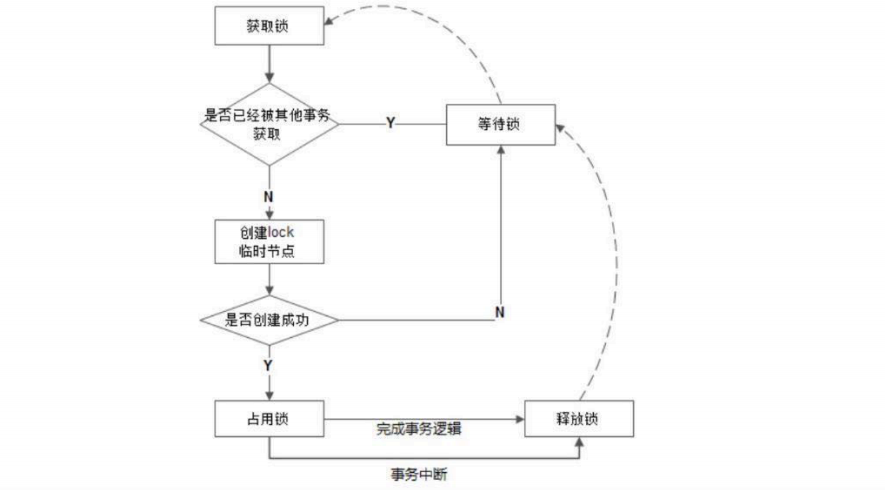
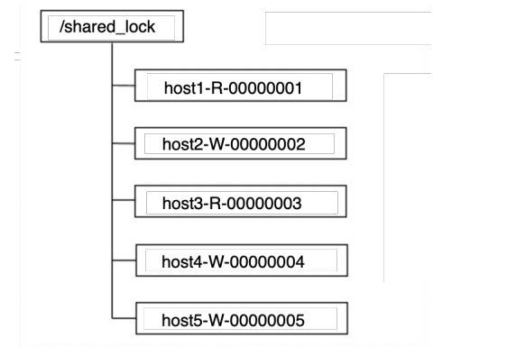
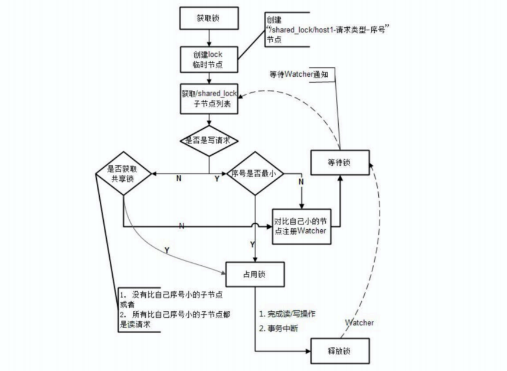

[toc]

### 数据发布/订阅

### 命名服务

通过创建顺序znode，组成分布式id：typex-job00000x

### 集群管理

### Master选举

zookeeper客户端集群选举一个master来为数据做主处理

原理：利用zookeeper数据节点的唯一性，多个客户端同时创建一个临时znode。

zookeeper的强一致性保证只有一个客户端能创建成功，创建znode的客户端被选举为Master，其他客户端向该znode的父节点注册一个**子节点变更Watcher**，当Master挂了会话结束，临时节点自然就被删除。Watcher监听到变更事件，回调通知其他客户端进行znode创建，成功创建znode的客户端重新被选举为Master

### 分布式锁

大型分布式系统，也可直接使用数据库的并发控制策略，来实现不同进程之间的互斥（排他性），即成功写入库的进程获得分布式锁。

然后目前绝大多数大型分布式系统的性能瓶颈都集中在数据库操作上，如果应用层再给数据库添加一些额外的锁，例如行锁、表锁或者事务处理，那么数据库将不堪重负。

##### 分布式锁-排他锁

排他锁（Exclusive Locks，简称 X 锁），⼜称为写锁或独占锁，是⼀种基本的锁类型。如果事务 T1对数据对象 O1加上了排他锁，那么在整个加锁期间，只允许事务 T1对 O1进⾏读取和更新操作，其他任何事务都不能再对这个数据对象进⾏任何类型的操作——直到T1释放了排他锁

原理：实现方式与选举Master一致，利用zookeeper数据节点的唯一性，多个客户端同时创建一个临时znode，创建成功的客户端获得锁，没有获取到锁的客户端就需要到该节点上注册⼀个⼦节点变更的Watcher监听，锁拥有者挂了或者执行完逻辑主动删除节点

##### 分布式锁-共享锁

共享锁（Shared Locks，简称S锁），⼜称为读锁，同样是⼀种基本的锁类型。

如果事务T1对数据对象O1加上了共享锁，那么当前事务只能对O1进⾏读取操作，其他事务也只能对这个数据对象加共享锁——直到该数据对象上的所有共享锁都被释放。共享锁和排他锁最根本的区别在于，加上排他锁后，数据对象只对⼀个事务可⻅，⽽加上共享锁后，数据对所有事务都可⻅。

定义锁：创建临时顺序znode，host1-R-0000001/host2-W-0000001/host3-R-0000001

- 读请求，创建临时顺序znode，若前方没有写znode，则进行读操作。事务完成后删除节点
- 写请求，创建临时顺序znode，若前方没有节点，则进行写操作。事务完成后删除节点
- 若不满足，则等待。收到Watcher的事件通知后，重新获得节点列表，重新进行上述判断。

##### 羊群效应

前面实现的共享锁存在某些问题。当事务1执行完毕删除节点，zk服务端通过**Watcher**向客户端发送通知，然而除了事务2节点外的其余客户端都将收到通知，这些通知是重复的。当前方每一次事务完成，后方的客户端都将收到大量重复无意义通知，这就是羊群效应

##### 改进方案

- 读请求，创建临时顺序znode，若前方没有节点或前方没有写znode，则进行读操作。事务完成后删除节点
- 写请求，创建临时顺序znode，若前方没有节点，则进行写操作。事务完成后删除节点
- 若不满足，则读事务对自己的前一个写节点注册Watcher，写事务对自己的前一个节点注册Watcher

每个客户端的事务都只关心自己前一个事务的znode。

### 分布式队列

##### FIFO模型（先入先出）

与共享锁原理一致，通过创建临时顺序znode，来定义事务的顺序

获得子节点列表判断自己的序号是不是最小，不是的话进行等待，并且对自己的前一个节点注册`Watcher` 监听

##### Barrier模型（分布式屏障）

当所有执行某任务的客户端都完成任务后，聚集到一块儿统一处理

定义一个/queue_barrier，并且设置内容为n（任务个数），客户端完成任务后在/queue_barrier下创建临时节点。统一处理平台通过zk的getData方法获取/queue_barrier的内容n，在通过getchildren获得子节点列表的个数 l 并且注册对子节点个数变更的**Watcher**监听，通过判断 n 是否等于 l ，是的话则进行统一业务处理。否的话
