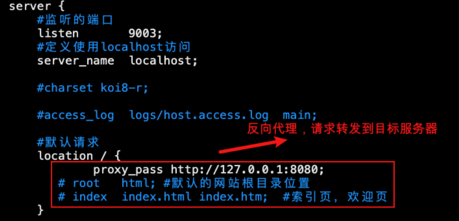
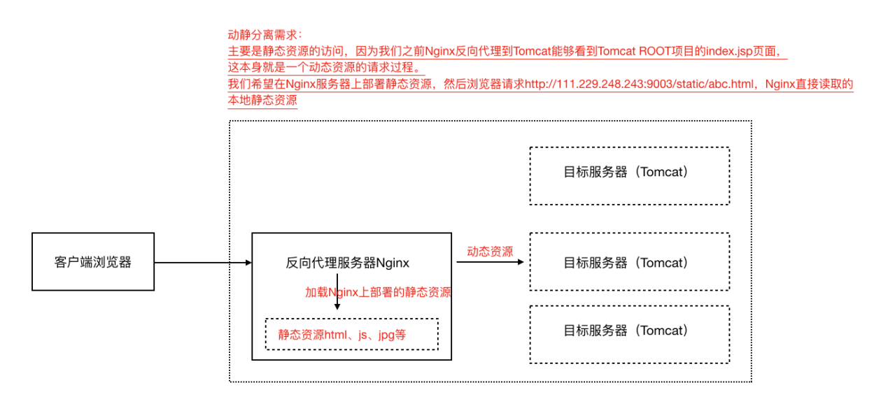
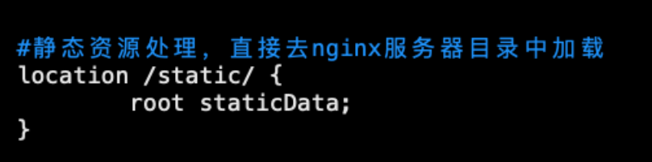
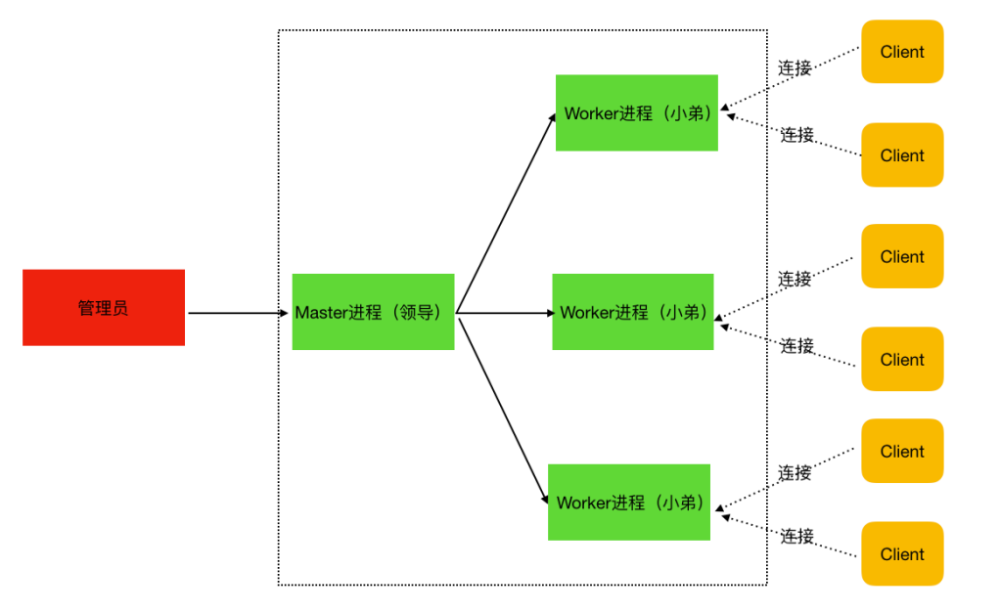

[toc]

## 一、Nginx简介

#### Nginx 是什么?

Nginx是一个高性能的HTTP、反向代理、负载均衡的Web服务器


####Nginx 可以做？

Nginx可以用来Web服务器、反向代理、负载均衡和动静分离

- Web服务器

  ==高性能，占用内存小，并发能力强==

  ⽀持50000个并发连接数，不仅如此，CPU和内存的占⽤也⾮常的低，10000个没有活动的连接才占⽤2.5M的内存。

- 反向代理

  ==反向代理，即Nginx代理服务端，与服务端组成一个整体。并且，服务端不对外暴露ip和端口==

  客户端只能将请求发送给Nginx，由Nginx转发给幕后服务端处理并返回响应

- 负载均衡

  ==服务端若是一个集群，则Nginx可根据对应的负载策略，将请求负载到不同的服务器上==

  负载策略：轮询、权重weight、ip_hash、url_hash

- 动静分离

  Nginx 处理项目的静态资源如：html、css、js等前端资源文件；

  Tomcat 处理项目动态资源如：servlet、jsp等后端资源文件；

#### Nginx 有哪些优点？

- 跨平台：Nginx可以在⼤多数类unix操作系统上编译运⾏，⽽且也有windows版本

- Nginx的上⼿⾮常容易，配置也⽐较简单

- ⾼并发，性能好，稳定性好，宕机概率很低


## 二、Nginx安装及主要命令

#### 安装

- 上传nginx安装包到linux服务器，nginx安装包(.tar⽂件)下载地址：http://nginx.org

- 安装Nginx依赖，pcre、openssl、gcc、zlib（推荐使⽤yum源⾃动安装）

  ```sh
  yum -y install gcc zlib zlib-devel pcre-devel openssl openssl-devel
  ```

- 解包Nginx软件包

  ```sh
  tar -xvf nginx-1.17.8.tar
  ```

- 进⼊解压之后的⽬录 nginx-1.17.8

  ```sh
  cd nginx-1.17.8
  ```

- 命令⾏执⾏./confifigure

- 命令⾏执⾏ make

- 命令⾏执⾏ make install，完毕之后在/usr/local/下会产⽣⼀个nginx⽬录

- 进⼊sbin⽬录中，执⾏启动nginx命令

  ```sh
  cd nginx/sbin
  ./nginx
  ```

#### 主要命令

- **./nginx**

  启动nginx

- **./nginx -s stop** 

  终⽌nginx（当然也可以找到nginx进程号，然后使⽤kill -9 杀掉nginx进程）

- **./nginx -s reload** 

  重新加载nginx.conf配置⽂件


## 三、Nginx使用场景及配置

### 1.反向代理

#### 与正向代理的区别：

- 正向代理：与客户端组成一个整体，客户端已知目标服务器站点，通过正向代理请求目标站点
- 反向代理：与服务端组成一个整体，客户端不知道目标服务器站点。反向代理服务器相当于后端服务器的一个门面。客户端直接请求反向代理服务器即可


#### 反向代理配置：

配置location块，使用`proxy_pass http://ip:port`配置反向代理，转发请求到目标服务器

生效nginx配置，使用`nginx -s reload`



### 2.负载均衡

#### 负载策略

- 轮询

  默认策略，每个请求按时间顺序逐⼀分配到不同的服务器，如果某⼀个服务器下线，能⾃动剔除

  ```
  upstream lagouServer{
   server 111.229.248.243:8080;
   server 111.229.248.243:8082;
  }
  
  location /abc {
   proxy_pass http://lagouServer/;
  }
  ```

  

- weight

  weight代表权重，默认每⼀个负载的服务器都为1，权重越⾼那么被分配的请求越多（⽤于服务器性能不均衡的场景）

  ```
  upstream lagouServer{
   server 111.229.248.243:8080 weight=1;
   server 111.229.248.243:8082 weight=2; 
  }
  ```

  

- ip_hash

  每个请求按照ip的hash结果分配，每⼀个客户端的请求会固定分配到同⼀个⽬标服务器处理，可以保证session一致性问题（会话粘滞）

  ```
  upstream lagouServer{
   ip_hash;
   server 111.229.248.243:8080;
   server 111.229.248.243:8082;
  }
  ```

  

###3.动静分离

动静分离就是讲动态资源和静态资源的请求处理分配到不同的服务器上，⽐较经典的组合就是Nginx+Tomcat架构（Nginx处理静态资源请求，Tomcat处理动态资源请求）



#### Nginx配置




### 四、Nginx底层进程机制剖析

#### Nginx底层模型

Nginx启动后，以**daemon**多进程⽅式在后台运⾏，包括⼀个Master进程和多个Worker进程



- master进程

  主要是管理worker进程，⽐如：

  - 接收外界信号向各worker进程发送信号(./nginx -s reload)

  - 监控worker进程的运⾏状态，当worker进程异常退出后Master进程会⾃动重新启动新的worker进程等

- worker进程

  worker进程处理网络请求，其个数可配置，⼀般设置与机器cpu核数⼀致。多个worker进程可能存在竞争，所以nginx使用互斥锁实现并发控制


#### Master 进程对信号处理

如 Nginx -s reload

1. master进程对配置⽂件进⾏语法检查
2. 尝试配置（⽐如修改了监听端⼝，那就尝试分配新的监听端⼝）
3. 尝试成功则使⽤新的配置，新建worker进程
4. 新建成功，给旧的worker进程发送关闭消息
5. 旧的worker进程收到信号会继续服务，直到把当前进程接收到的请求处理完毕后关闭


#### Worker 进程对请求的处理

例如，我们监听9003端⼝，⼀个请求到来时，如果有多个worker进程，那么每个worker进程都有可能处理这个链接

- master进程创建之后，会建⽴好需要监听的的socket，然后从master进程再fork出多个worker进程。所以，所有worker进程的监听描述符listenfd在新连接到来时都变得可读。

- nginx使⽤互斥锁来保证只有⼀个workder进程能够处理请求，拿到互斥锁的那个进程注册listenfd读事件，在读事件⾥调⽤accept接受该连接，然后解析、处理、返回客户端

#### nginx多进程模型好处

- 每个worker进程都是独⽴的，不需要加锁，节省开销

- 每个worker进程都是独⽴的，互不影响，⼀个异常结束，其他的照样能提供服务

- 多进程模型为reload热部署机制提供了⽀撑