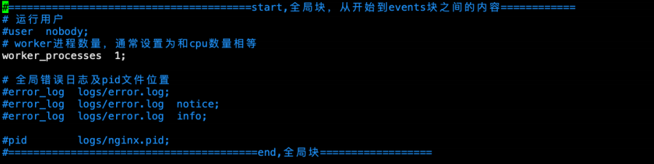
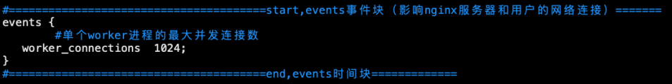
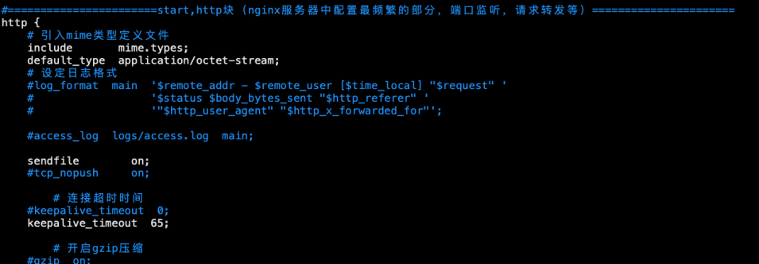
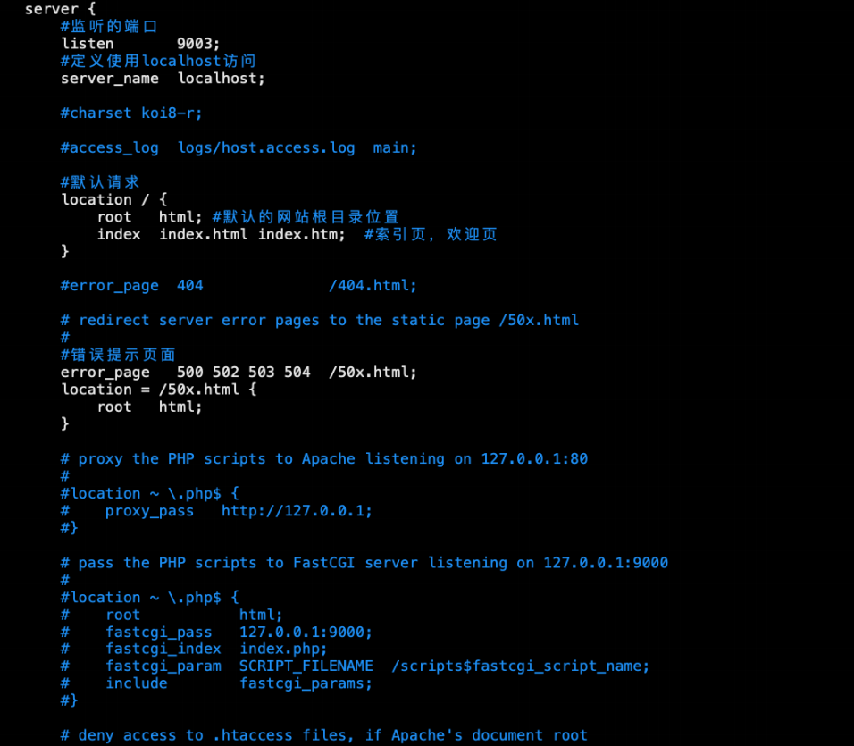
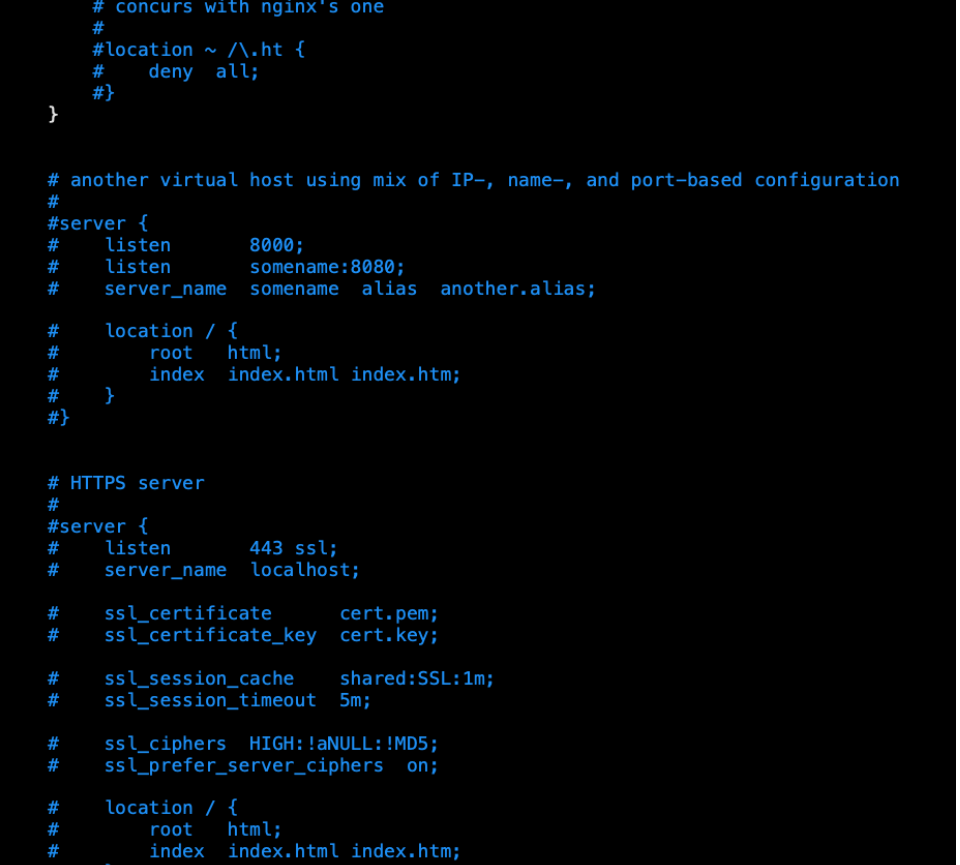

[toc]

## Nginx的核⼼配置⽂件conf/nginx.conf包含以下三个部分

### 1.全局块

从配置⽂件开始到events块之间的内容，此处的配置影响nginx服务器整体的运⾏，⽐如worker进程的数量、错误⽇志的位置等

### 2.events块

events块主要影响nginx服务器与⽤户的⽹络连接，⽐如`worker_connections 1024`，标识每个`workderprocess`⽀持的最⼤连接数为1024

### 3.http块

http块是配置最频繁的部分，**虚拟主机**的配置，监听端⼝**的配置**，**请求转发**、**反向代理**、**负载均衡**等

**http块 **下的 **server块** 相当于 **Tomcat 配置下的Host**

**server块** 下的 **location块** 相当于 **Tomcat 配置Host下的Context**

