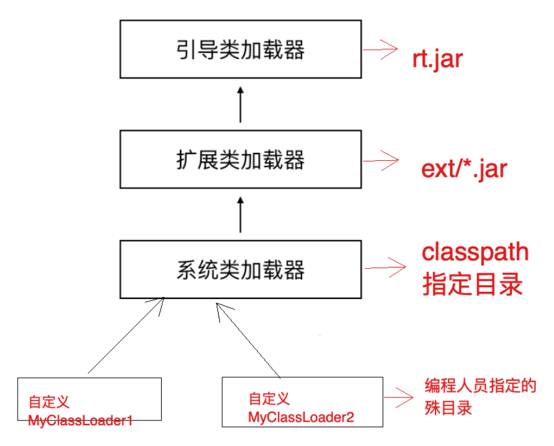
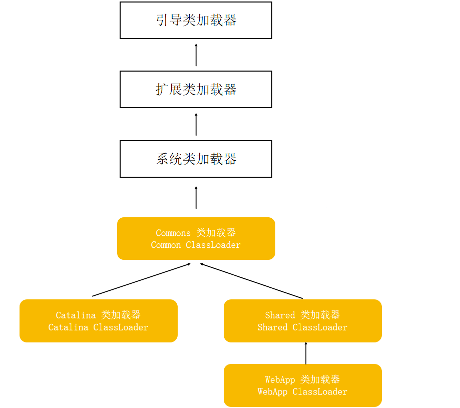

[toc]

### 一、JVM的类加载机制

JVM 的类加载机制中有⼀个⾮常重要的⻆⾊叫做类加载器（ClassLoader），类加载器有⾃⼰的体系，Jvm内置了⼏种类加载器，包括：引导类加载器、扩展类加载器、系统类加载器，他们之间形成⽗⼦关系，通过 Parent 属性来定义这种关系，最终可以形成树形结构。

| 类加载器                                           | 作⽤                                                         |
| -------------------------------------------------- | ------------------------------------------------------------ |
| 引导启动类加载   BootstrapClassLoader              | c++编写，加载java核⼼库 java.*,⽐如rt.jar中的类，构造ExtClassLoader和AppClassLoader |
| 扩展类加载器   ExtClassLoader                      | java编写，加载扩展库 JAVA_HOME/lib/ext⽬录下的jar中的类，如classpath中的jre ，javax.*或者java.ext.dir指定位置中的类 |
| 系统类加载器      SystemClassLoader/AppClassLoader | 默认的类加载器，搜索环境变量 classpath 中指明的路径          |

#### 1.什么是双亲委派机制

当某个类加载器需要加载某个.class⽂件时，首先查找该类是否已被加载，是的话直接返回。否则把这个任务委托给他的上级类加载器，递归这个操作，如果上级的类加载器没有加载，⾃⼰才会去加载这个类

#### 2.双亲委派机制的作⽤

- 防⽌重复加载同⼀个.class。通过委托去向上⾯问⼀问，加载过了，就不⽤再加载⼀遍。保证数据安全

- 保证核⼼.class不能被篡改。

  即使自定义了一个全限定类名一模一样的String，在加载时会逐级向上委托，最终会加载rt.jar中的String类

### 二、Tomcat 的类加载机制

Tomcat 没有严格的遵从双亲委派机制，也可以说打破了双亲委派机制

#### 1.考虑如下场景

有⼀个tomcat，webapps下部署了两个应⽤app1和app2，分别依赖了不同版本的同一个jar包，jar中的类全限定类名一模一样，如

app1/lib/a-1.0.jar com.lagou.edu.Abc

app2/lib/a-2.0.jar com.lagou.edu.Abc

不同版本中Abc类的内容是不同的，代码是不⼀样的

#### 2.Tomcat对类加载器的调整

**部分类加载器变化如下**

- 系统类加载器正常情况下加载的是 CLASSPATH 下的类，但是 Tomcat 的启动脚本并未使⽤该变量，⽽是加载tomcat启动的类，⽐如bootstrap.jar，通常在catalina.bat或者catalina.sh中指定。位于CATALINA_HOME/bin下

- Common 通⽤类加载器加载Tomcat使⽤以及应⽤通⽤的⼀些类，位于CATALINA_HOME/lib下，⽐如servlet-api.jar

- Catalina ClassLoader ⽤于加载服务器内部可⻅类，这些类应⽤程序不能访问

- Shared ClassLoader ⽤于加载应⽤程序共享类，这些类服务器不会依赖
- Webapp ClassLoader，每个应⽤程序都会有⼀个独⼀⽆⼆的Webapp ClassLoader，他⽤来加载本应⽤程序 /WEB-INF/classes 和 /WEB-INF/lib 下的类。

**双亲委派机制变动如下**

- 首先查找类是否已背加载

- 否的话先从 Bootstrap Classloader加载指定的类

- 如果未加载到，则从 /WEB-INF/classes加载

- 如果未加载到，则从 /WEB-INF/lib/*.jar加载

- 如果未加载到，则依次从 System、Common、Shared 加载（在这最后⼀步，遵从双亲委派机制）