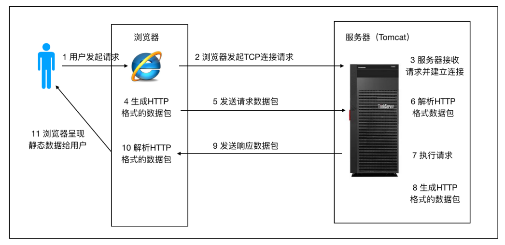
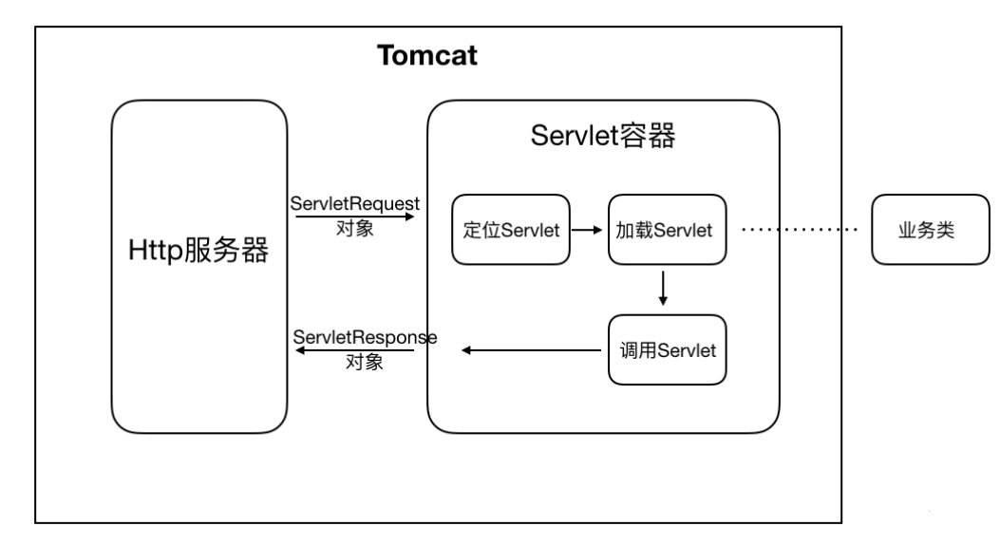
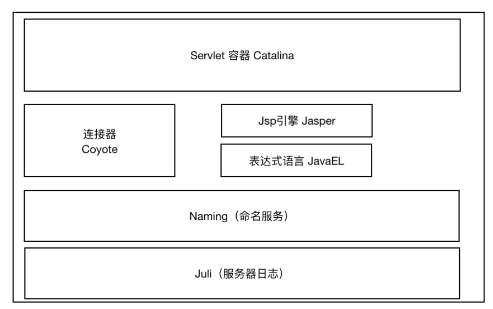
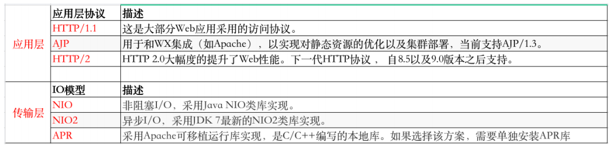
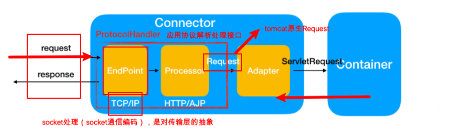
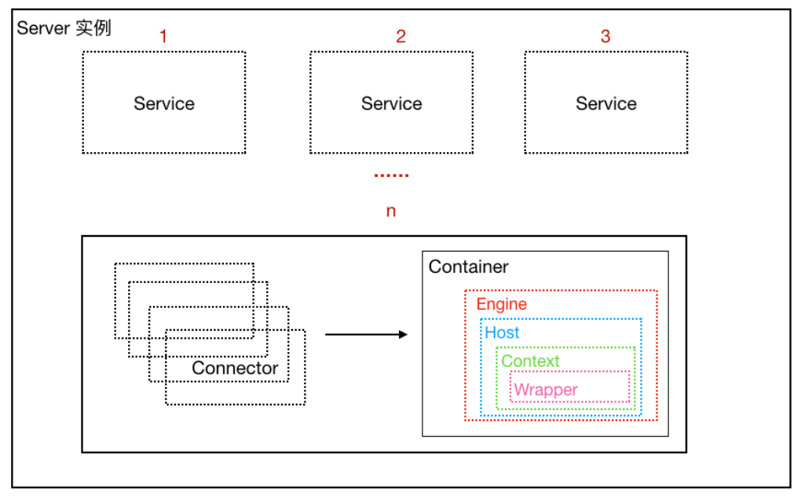

[toc]

## 一、浏览器访问服务器的流程

http请求的处理过程

**注意**：浏览器访问服务器使⽤的是Http协议，Http是应⽤层协议，⽤于定义数据通信的格式，具体的数据传输使⽤的是TCP/IP协议

## 二、Tomcat 系统总体架构（功能）

### 1.Tomcat 的核心功能

##### HTTP服务器：接收并处理了http请求

处理Socket连接操作、解析HTTP数据包和IO操作，封装成一个request对象。与浏览器进行tcp通信，应用层协议为http

**具体实现：**Tomcat连接器组件（**Connector**）的实现是**Coyote**，它是**Catalina**的子组件内部包含**Endpoint**、**Processor**和**Adaper**，分别进行Socket处理，http数据解析和请求/响应对象转换

##### Servlet容器：参照Servlet规范实现，根据请求调用对应的业务类来处理，

注册了业务端所有servclet，根据请求url分发请求到对应servlet

**具体实现：**容器组件（**Container**）：Tomcat的容器组件是**Catalina**

### 2.Tomcat 请求流程：

HTTP 服务器接收到请求之后把请求交给Servlet容器来处理，Servlet 容器通过Servlet接⼝调⽤业务类。**Servlet**接⼝和**Servlet**容器这⼀整套内容叫作**Servlet**规范。

流程如下图：

1. ⽤户请求某个URL资源时

2. HTTP服务器会把请求信息使⽤ServletRequest对象封装起来

3. 进⼀步去调⽤Servlet容器中某个具体的Servlet

4. 在第二步中，Servlet容器拿到请求后，根据URL和Servlet的映射关系，找到相应的Servlet
5. 如果Servlet还没有被加载，就⽤反射机制创建这个Servlet，并调⽤Servlet的init⽅法来完成初始化
6. 接着调⽤这个具体Servlet的service⽅法来处理请求，请求处理结果使⽤ServletResponse对象封装
7. 把ServletResponse对象返回给HTTP服务器，HTTP服务器会把响应发送给客户端

## 三、Tomcat 核心组件（结构）

**Tomcat** 本质上就是⼀款 **Servlet** 容器， 因为 **Catalina** 才是 **Tomcat** 的核⼼ ， 其他模块都是为**Catalina** 提供⽀撑的。 ⽐如 ： 通过 **Coyote** 模块提供链接通信，**Jasper** 模块提供 JSP 引擎，**Naming** 提供JNDI 服务，**Juli** 提供⽇志服务。

### 1.连接器组件 Coyote

**Coyote** 是Tomcat 中连接器的组件名称 , 是对外的接⼝。客户端通过Coyote与服务器建⽴连接、发送请求并接受响应 

##### 1.1 作用

1. Coyote 封装了底层的⽹络通信（Socket 请求及响应处理）
2. Coyote 使Catalina 容器（容器组件）与具体的请求协议及IO操作⽅式完全解耦
3. Coyote 将Socket 输⼊转换封装为 Request 对象，进⼀步封装后交由Catalina 容器进⾏处理，处理请求完成后, Catalina 通过Coyote 提供的Response 对象将结果写⼊输出流
4. Coyote 负责的是**协议**（应⽤层）和**IO**（传输层）相关内容

##### 1.2 Tomcat Coyote ⽀持的 IO模型与协议如下：

默认协议为HTTP/1.1，IO模型为NIO

##### 1.3 内部组件

| 组件            | 作⽤描述                                                     |
| --------------- | ------------------------------------------------------------ |
| EndPoint        | EndPoint 是 Coyote 通信端点，即通信监听的接⼝，是具体Socket接收和发送处理器，是对传输层的抽象，因此EndPoint⽤来实现TCP/IP协议的 |
| Processor       | Processor 是Coyote 协议处理接⼝ ，如果说EndPoint是⽤来实现TCP/IP协议的，那么Processor⽤来实现HTTP协议，Processor接收来⾃EndPoint的Socket，读取字节流解析成Tomcat Request和Response对象，并通过Adapter将其提交到容器处理，Processor是对应⽤层协议的抽象 |
| ProtocolHandler | Coyote 协议接⼝， 通过Endpoint 和 Processor ， 实现针对具体协议的处理能⼒。Tomcat 按照协议和I/O 提供了6个实现类 ： AjpNioProtocol ，AjpAprProtocol， AjpNio2Protocol ， Http11NioProtocol ，Http11Nio2Protocol ，Http11AprProtocol |
| Adapter         | 由于协议不同，客户端发过来的请求信息也不尽相同，Tomcat定义了⾃⼰的Request类来封装这些请求信息。ProtocolHandler接⼝负责解析请求并⽣成Tomcat Request类。但是这个Request对象不是标准的ServletRequest，不能⽤Tomcat Request作为参数来调⽤容器。Tomcat设计者的解决⽅案是引⼊CoyoteAdapter，这是适配器模式的经典运⽤，连接器调⽤CoyoteAdapter的Sevice⽅法，传⼊的是Tomcat Request对象，CoyoteAdapter负责将Tomcat Request转成ServletRequest，再调⽤容器 |

### 2.Servlet容器组件 Catalina

**Tomcat**就是⼀个**Catalina**实例，因为Tomcat 启动的时候先初始化**一个Catalina**实例，**Catalina**实例通过加载 `server.xml` 完成其他实例的创建，**创建并管理⼀个Server**，**Server**创建并管理**多个Service**服务，**每个Service**服务⼜可以有**多个Connector**和**⼀个Container**。

以下Catalina的组件均在server.xml中有所体现

- Catalina

  ​	负责解析 Tomcat 的配置⽂件**server.xml** , 以此来**创建服务器Server**组件并进⾏管理

- Server

  ​	服务器表示整个Catalina Servlet容器以及其它组件，负责组装并启动Servlaet引擎,Tomcat连接器。Server通过实现Lifecycle接⼝，提供了⼀种优雅的启动和关闭整个系统的⽅式

- Service

  ​	服务是Server内部的组件，⼀个Server包含多个Service。它将若⼲个Connector组件绑定到⼀个Container

- Connector（[上文已做介绍](#1.连接器组件 Coyote)）

- Container（负责调用对应Servlet及返回结果）

  - Engine：Catalina的Servlet引擎，⽤来管理多个虚拟站点，只能有⼀个Engine，但是⼀个引擎可包含多个Host

  - Host：代表⼀个虚拟主机，或者说⼀个站点，可以给Tomcat配置多个虚拟主机地址，⽽⼀个虚拟主机下

    可包含多个Context

  - Context：表示⼀个Web应⽤程序， ⼀个Web应⽤可包含多个Wrapper

  - Wrapper：表示⼀个Servlet，Wrapper 作为容器中的最底层，不能包含⼦容器