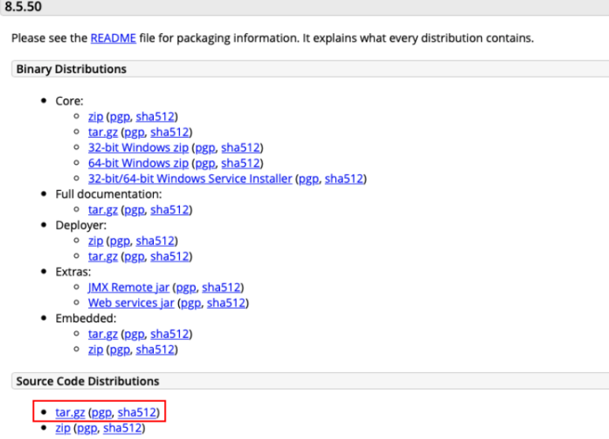
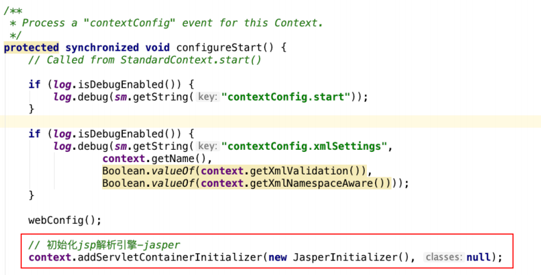
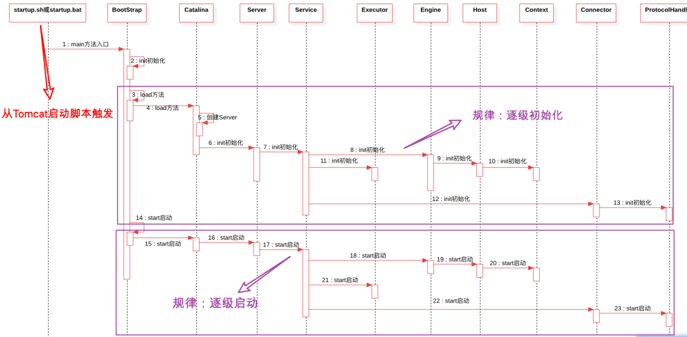
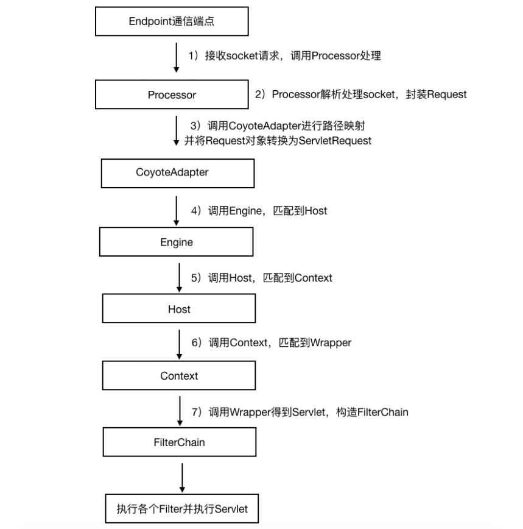
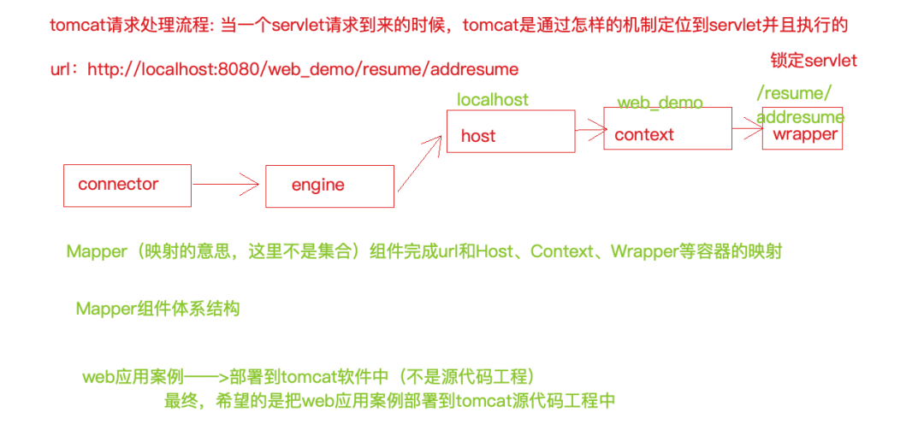
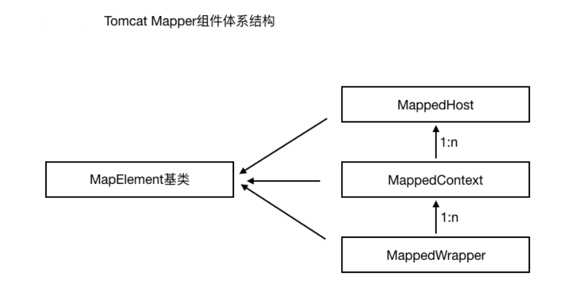

[toc]

## 一、源码环境搭建

####  1.下载源码



#### **1.2** 源码导⼊IDE之前准备⼯作

- 解压 tar.gz 压缩包，得到⽬录 apache-tomcat-8.5.50-src

- 进⼊ apache-tomcat-8.5.50-src ⽬录，创建⼀个pom.xml⽂件，⽂件内容如下

 ```xml
 <?xml version="1.0" encoding="UTF-8"?>
 <project xmlns="http://maven.apache.org/POM/4.0.0"
          xmlns:xsi="http://www.w3.org/2001/XMLSchema-instance"
          xsi:schemaLocation="http://maven.apache.org/POM/4.0.0
 http://maven.apache.org/xsd/maven-4.0.0.xsd">
     <modelVersion>4.0.0</modelVersion>
     <groupId>org.apache.tomcat</groupId>
     <artifactId>apache-tomcat-8.5.50-src</artifactId>
     <name>Tomcat8.5</name>
     <version>8.5</version>
     <build>
         <!--指定源⽬录-->
         <finalName>Tomcat8.5</finalName>
         <sourceDirectory>java</sourceDirectory>
         <resources>
             <resource>
                 <directory>java</directory>
             </resource>
         </resources>
         <plugins>
             <!--引⼊编译插件-->
             <plugin>
                 <groupId>org.apache.maven.plugins</groupId>
                 <artifactId>maven-compiler-plugin</artifactId>
                 <version>3.1</version>
                 <configuration>
                     <encoding>UTF-8</encoding>
                     <source>11</source>
                     <target>11</target>
                 </configuration>
             </plugin>
         </plugins>
     </build>
     <!--tomcat 依赖的基础包-->
     <dependencies>
         <dependency>
             <groupId>org.easymock</groupId>
             <artifactId>easymock</artifactId>
             <version>3.4</version>
         </dependency>
         <dependency>
             <groupId>ant</groupId>
             <artifactId>ant</artifactId>
             <version>1.7.0</version>
         </dependency>
         <dependency>
             <groupId>wsdl4j</groupId>
             <artifactId>wsdl4j</artifactId>
             <version>1.6.2</version>
         </dependency>
         <dependency>
             <groupId>javax.xml</groupId>
             <artifactId>jaxrpc</artifactId>
             <version>1.1</version>
         </dependency>
         <dependency>
             <groupId>org.eclipse.jdt.core.compiler</groupId>
             <artifactId>ecj</artifactId>
             <version>4.5.1</version>
         </dependency>
         <dependency>
             <groupId>javax.xml.soap</groupId>
             <artifactId>javax.xml.soap-api</artifactId>
             <version>1.4.0</version>
         </dependency>
     </dependencies>
 </project>
 ```

- 在 apache-tomcat-8.5.50-src ⽬录中创建 **source** ⽂件夹

- 将 conf、webapps ⽬录移动到刚刚创建的 **source** ⽂件夹中


####  1.3 导⼊源码⼯程到**IDE**并进⾏配置

- 将源码⼯程导⼊到 IDEA 中 

- 给 tomcat 的源码程序启动类 Bootstrap 配置 VM 参数，因为 tomcat 源码运⾏也需要加载配置⽂件等。

```properties
-Dcatalina.home=/Users/yingdian/workspace/servers/apache-tomcat-8.5.50-src/source
-Dcatalina.base=/Users/yingdian/workspace/servers/apache-tomcat-8.5.50-src/source
-Djava.util.logging.manager=org.apache.juli.ClassLoaderLogManager
-Djava.util.logging.config.file=/Users/yingdian/workspace/servers/apache-tomcat-8.5.50-src/source/conf/logging.properties
```

- 需要在tomcat的源码ContextConfifig类中的confifigureStart⽅法中增加⼀⾏代码将 Jsp 引擎初始化，如下



- 启动 Tomcat，正常访问即可。⾄此，Tomcat 源码构建完毕

## 二、Tomcat启动流程

#### Tomcat启动流程图




## 三、Tomcat请求处理流程

#### 请求处理流程示意图



#### 请求处理流程分析



#### Mapper组件体系结构

#### 
