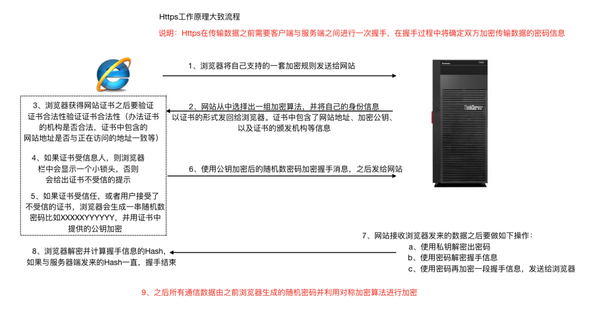
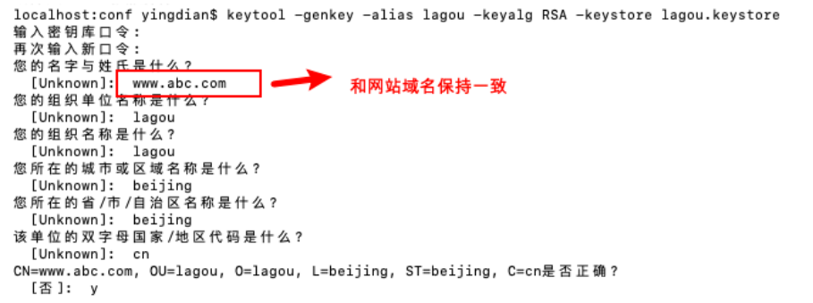
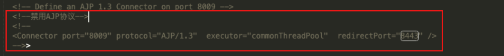

[toc]

## 一、Tomcat 对 HTTPS 的⽀持

#### 1.HTTPS（HTTP SecureSocket Layer）

**Http**超⽂本传输协议，明⽂传输 ，传输不安全

**HTPPS**在传输数据的时候会使用**SSL协议**对数据进⾏加密


#### 2.HTTPS和HTTP的主要区别

- HTTPS协议使⽤时需要到电⼦商务认证授权机构（CA）申请SSL证书

- HTTP默认使⽤8080端⼝，HTTPS默认使⽤8443端⼝

- HTTPS则是具有SSL加密的安全性传输协议，对数据的传输进⾏加密，效果上相当于HTTP的升级版

- HTTP的连接是⽆状态的，不安全的；HTTPS协议是由SSL+HTTP协议构建的可进⾏加密传输、身份认证的⽹络协议，⽐HTTP协议安全


#### 3.HTTPS⼯作原理



#### 4.Tomcat 对 HTTPS 的⽀持

1） 使⽤ JDK 中的 keytool ⼯具⽣成免费的秘钥库⽂件(证书)。 

```sh
keytool -genkey -alias lagou -keyalg RSA -keystore lagou.keystore
```




2） 配置conf/server.xml

```xml
<Connector port="8443" protocol="org.apache.coyote.http11.Http11NioProtocol" maxThreads="150" schema="https" secure="true" SSLEnabled="true">
 <SSLHostConfig>
     <Certificate certificateKeystoreFile="/Users/yingdian/workspace/servers/apache-tomcat-8.5.50/conf/lagou.keystore" certificateKeystorePassword="lagou123" type="RSA"/>
 </SSLHostConfig>
</Connector>
```


3）使⽤https协议访问8443端⼝（https://localhost:8443）

## 二、 Tomcat 性能优化策略

#### 1. Tomcat优化从两个方面进行

Tomcat优化从以下两个方面进行，**调整后不断压测找到最佳性能的参数**

- Tomcat 配置优化（比如共享线程池、IO模式）
- JVM 虚拟机优化（优化内存模型）


#### 4. 虚拟机运行优化（参数调整）

JVM 调优主要是 内存分配 和 垃圾回收策略 的优化

[JVM调优详情](../../../java/JVM/4.JVM性能调优及排故)

#####  4.1 Tomcat中设置JVM参数

###### **在启动脚本bin/catalina.sh中 , 追加如下配置 :**

```sh
JAVA_OPTS="-server -Xms2048m -Xmx2048m -XX:MetaspaceSize=1024m -XX:MaxMetaspaceSize=512m -XX:+UseConcMarkSweepGC"
```


#### 5.**Tomcat** 配置调优

##### 5.1 禁用AJP（Apache JServer Protocol）是定向包协议

Tomcat中启用了**两个连接器**，分别**8080使用HTTP协议** 和 **8009使用AJP协议**，AJP协议主要**用于与其他HTTP服务器集成，使用二进制格式来传输**

**Nginx+tomcat的架构 用不着AJP协议，如果是Tomcat 8及以下则需把AJP连接器禁）**（Tomcat 9 默认禁用）




##### 5.2 调整线程池配置

根据压测结果不断调整**线程池最大值线程数、核心线程数、超时时间、非核心线程存活时间**等


##### 5.3 调整连接器配置

根据压测结果不断调整**连接池最大连接数、等待队列长度、超时时间**


##### 5.4 调整APR IO模式

Tomcat 连接器默认使用NIO模式读写，若**有大并发的场景，则可以使用APR IO模式**

JVM库不含APR模式实现，所以需要**先安装APR和Native**（基于C/C++的本地库，调用操作系统函数）

修改配置`protocol="org.apache.coyote.http11.Http11AprProtocol`


