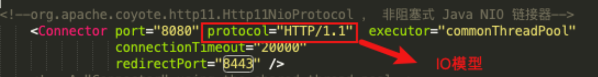

[toc]

### 一、Tomcat 对 HTTPS 的⽀持

##### 1.HTTPS（HTTP SecureSocket Layer）

**Http**超⽂本传输协议，明⽂传输 ，传输不安全

**HTPPS**在传输数据的时候会使用**SSL协议**对数据进⾏加密


##### 2.HTTPS和HTTP的主要区别

- HTTPS协议使⽤时需要到电⼦商务认证授权机构（CA）申请SSL证书

- HTTP默认使⽤8080端⼝，HTTPS默认使⽤8443端⼝

- HTTPS则是具有SSL加密的安全性传输协议，对数据的传输进⾏加密，效果上相当于HTTP的升级版

- HTTP的连接是⽆状态的，不安全的；HTTPS协议是由SSL+HTTP协议构建的可进⾏加密传输、身份认证的⽹络协议，⽐HTTP协议安全


##### 3.HTTPS⼯作原理


##### 4.**Tomcat** 对 **HTTPS** 的⽀持

1） 使⽤ JDK 中的 keytool ⼯具⽣成免费的秘钥库⽂件(证书)。 

```sh
keytool -genkey -alias lagou -keyalg RSA -keystore lagou.keystore
```


2） 配置conf/server.xml

```xml
<Connector port="8443" protocol="org.apache.coyote.http11.Http11NioProtocol" maxThreads="150" schema="https" secure="true" SSLEnabled="true">
 <SSLHostConfig>
     <Certificate certificateKeystoreFile="/Users/yingdian/workspace/servers/apache-tomcat-8.5.50/conf/lagou.keystore" certificateKeystorePassword="lagou123" type="RSA"/>
 </SSLHostConfig>
</Connector>
```


3）使⽤https协议访问8443端⼝（https://localhost:8443）

### 二、 Tomcat 性能优化策略

#### 1.优化的原则

优化思路，调优没有明确的参数值，必须根据⾃⼰的真实⽣产环境来进⾏调整，调优是⼀个过程


#### 2.系统性能的衡量指标，主要是响应时间和吞吐量。

1. 响应时间：执⾏某个操作的耗时；

2. 吞吐量：系统在给定时间内能够⽀持的事务数量，单位为TPS（Transactions PerSecond的缩写，也就是事务数/秒，⼀个事务是指⼀个客户机向服务器发送请求然后服务器做出反应的过程。

#### 3.Tomcat优化从两个⽅⾯进⾏

1. JVM虚拟机优化（优化内存模型）
2. **Tomcat**⾃身配置的优化（⽐如是否使⽤了共享线程池？IO模型？）


#### 4.虚拟机运⾏优化（参数调整）

Java 虚拟机的运⾏优化主要是内存分配和垃圾回收策略的优化：

- 内存直接影响服务的运⾏效率和吞吐量

- 垃圾回收机制会不同程度地导致程序运⾏中断（垃圾回收策略不同，垃圾回收次数和回收效率都是不同的）


#####  4.1 Java 虚拟机内存相关参数调优

| 参数                 | 参数作⽤                                          | 优化建议                |
| -------------------- | ------------------------------------------------- | ----------------------- |
| -server              | 启动Server，以服务端模式运⾏                      | 服务端模式建议开启      |
| -Xms                 | 最⼩堆内存                                        | 建议与-Xmx相同          |
| -Xmx                 | 最大对内存                                        | 建议设置为可用内存的80% |
| -XX:MetaspaceSize    | 元空间初始值                                      |                         |
| -XX:MaxMetaspaceSize | 元空间最大内存                                    | 默认无限                |
| -XX:NewRatio         | 年轻代和⽼年代⼤⼩⽐值，取值为整数，默认为2       | 无需修改                |
| -XX:SurvivorRatio    | Eden区与Survivor区⼤⼩的⽐值，取值为整数，默认为8 | 无需修改                |

###### **JVM内存模型回顾**


###### **在启动脚本bin/catalina.sh中 , 追加如下配置 :**

```sh
JAVA_OPTS="-server -Xms2048m -Xmx2048m -XX:MetaspaceSize=256m -XX:MaxMetaspaceSize=512m
```

调整后查看可使⽤**JDK**提供的内存映射⼯具


##### 4.2 垃圾回收（GC）策略

###### **垃圾回收性能指标**

- 吞吐量：⼯作时间（排除GC时间）占总时间的百分⽐， ⼯作时间并不仅是程序运⾏的时间，还包含内存分配时间。

- 暂停时间：由垃圾回收导致的应⽤程序停⽌响应次数/时间。


###### **垃圾收集器**

- 串⾏收集器（Serial Collector）

  单线程执⾏所有的垃圾回收⼯作， 适⽤于单核CPU服务器

  ⼯作进程**-----|**（单线程）垃圾回收线程进⾏垃圾收集**|---**⼯作进程继续

  

  

- 并⾏收集器（Parallel Collector）

  ⼜称为吞吐量收集器（关注吞吐量）， 以并⾏的⽅式执⾏年轻代的垃圾回收， 该⽅式可以显著降低垃圾回收的开销(指多条垃圾收集线程并⾏⼯作，但此时⽤户线程仍然处于等待状态)。适⽤于多处理器或多线程硬件上运⾏的数据量较⼤的应⽤

  ⼯作进程**-----|**（多线程）垃圾回收线程进⾏垃圾收集**|---**⼯作进程继续

  

  

- 并发收集器（Concurrent Collector）

  以并发的⽅式执⾏⼤部分垃圾回收⼯作，以缩短垃圾回收的暂停时间。适⽤于那些响应时间优先于吞吐量的应⽤， 因为该收集器虽然最⼩化了暂停时间(指⽤户线程与垃圾收集线程同时执⾏,但不⼀定是并⾏的，可能会交替进⾏)， 但是会降低应⽤程序的性能


- CMS收集器（Concurrent Mark Sweep Collector）

  并发标记清除收集器， 适⽤于那些更愿意缩短垃圾回收暂停时间并且负担的起与垃圾回收共享处理器资源的应⽤


- G1收集器（Garbage-First Garbage Collector）

  适⽤于⼤容量内存的多核服务器， 可以在满⾜垃圾回收暂停时间⽬标的同时， 以最⼤可能性实现⾼吞吐量(JDK1.7之后)


###### **垃圾回收器参数**

| 参数                           | 描述                                                         |
| ------------------------------ | ------------------------------------------------------------ |
| -XX:+UseSerialGC               | 启⽤串⾏收集器                                               |
| -XX:+UseParallelGC             | 启⽤并⾏垃圾收集器，配置了该选项，那么 -XX:+UseParallelOldGC默认开启 |
| -XX:+UseParNewGC               | 年轻代采⽤并⾏收集器，如果设置了 -XX:+UseConcMarkSweepGC选项，⾃动启⽤ |
| -XX:ParallelGCThreads          | 年轻代及⽼年代垃圾回收使⽤的线程数。默认值依赖于JVM使⽤的CPU个数 |
| -XX:+UseConcMarkSweepGC（CMS） | 对于⽼年代，启⽤CMS垃圾收集器。 当并⾏收集器⽆法满⾜应⽤的延迟需求是，推荐使⽤CMS或G1收集器。启⽤该选项后， -XX:+UseParNewGC⾃动启⽤。 |
| -XX:+UseG1GC                   | 启⽤G1收集器。 G1是服务器类型的收集器， ⽤于多核、⼤内存的机器。它在保持⾼吞吐量的情况下，⾼概率满⾜GC暂停时间的⽬标。 |


###### **在启动脚本bin/catalina.sh中 , 追加如下配置 :**

```sh
JAVA_OPTS="-XX:+UseConcMarkSweepGC"
```


#### 5.**Tomcat** 配置调优

##### 5.1 调整tomcat线程池


##### 5.2 调整tomcat的连接器

调整tomcat/conf/server.xml 中关于链接器的配置可以提升应⽤服务器的性能

| 参数           | 说明                                                         |
| -------------- | ------------------------------------------------------------ |
| maxConnections | 最⼤连接数，当到达该值后，服务器接收但不会处理更多的请求， 额外的请求将会阻塞直到连接数低于maxConnections 。可通过ulimit -a 查看服务器限制。对于CPU要求更⾼(计算密集型)时，建议不要配置过⼤ ; 对于CPU要求不是特别⾼时，建议配置在2000左右(受服务器性能影响)。 当然这个需要服务器硬件的⽀持 |
| maxThreads     | 最⼤线程数,需要根据服务器的硬件情况，进⾏⼀个合理的设置      |
| acceptCount    | 最⼤排队等待数,当服务器接收的请求数量到达maxConnections ，此时Tomcat会将后⾯的请求，存放在任务队列中进⾏排序， acceptCount指的就是任务队列中排队等待的请求数 。 ⼀台Tomcat的最⼤的请求处理数量，是maxConnections+acceptCount |

##### 5.3 禁⽤ A JP 连接器


##### 5.4 调整 IO 模式

Tomcat8之前的版本默认使⽤BIO（阻塞式IO），对于每⼀个请求都要创建⼀个线程来处理，不适合⾼并发；Tomcat8以后的版本默认使⽤NIO模式（⾮阻塞式IO） 



当Tomcat并发性能有较⾼要求或者出现瓶颈时，我们可以尝试使⽤APR模式，APR（Apache PortableRuntime）是从操作系统级别解决异步IO问题，使⽤时需要在操作系统上安装APR和Native（因为APR原理是使⽤使⽤JNI技术调⽤操作系统底层的IO接⼝）

##### 5.5 动静分离

可以使⽤Nginx+Tomcat相结合的部署⽅案，Nginx负责静态资源访问，Tomcat负责Jsp等动态资源访问处理（因为Tomcat不擅⻓处理静态资源）。