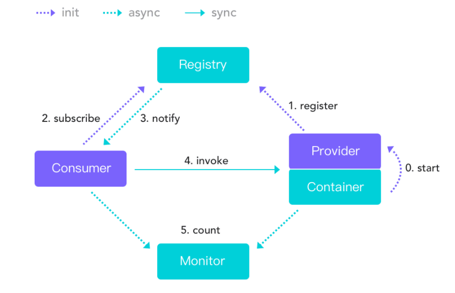

[toc]

## 一、Dubbo简介

#### 1.Dubbo是什么

Apache Dubbo是一款高性能的Java RPC框架。前身是阿里开源的高性能轻量级的Java RPC框架（Dubbo）

#### 2.Dubbo有哪些特性

1. 面向接口代理的高性能RPC调用：屏蔽底层网络通信的细节
2. 智能容错和负载均衡：内置多种负载均衡策略，智能感知下游节点的健康状态，减少调用延时，提高系统吞吐量
3. 服务自动注册和发现：支持多种注册中心，如zk。服务实例上下线实时感知(如zk的watcher)
4. SPA扩展机制
5. 轻松实现灰度发布
6. 可视化的服务治理与运维

#### 3.Dubbo的服务治理(SOA治理)

1. 当服务越来越多，服务的URL接口请求路径配置变得繁杂。通过注册中心，动态注册和发现服务，使服务地址透明可知
2. 服务间依赖关系变得错综复杂，分不清哪个应用在哪个应用之前启动，难以理清应用之间的依赖关系。所以，需要自动画出应用间的依赖关系图以帮助架构师理清关系
3. 服务的调用量越来越多，整个架构的服务容量难以估量，需要多少台服务器支撑？第一步，统计每天的吞吐量，、响应时间，作为容量规划的参考指标。第二步，动态调整权重，在线上将某台机器的权重一直加大，并记录这个过程的响应时间的变化，直达响应时间达到阈值，记录此时的访问量，再以此访问量乘以机器数反推总容量


## 二、Dubbo流程及重要组件

下图为Dubbo工作流程，红色虚线为异步，红色实现为同步，蓝色虚线为启动时异步

Registry（服务注册中心）在其中起着至关重要的作用。Dubbo官方推荐使用Zookeeper作为服务注册中心。Zookeeper 是 Apache Hadoop 的子项目，作为 Dubbo 服务的注册中心，工业强度较高，可用于生产环境



1. 服务提供者在服务容器启动时 向注册中心 注册自己提供的服务

2. 服务消费者在启动时 向注册中心订阅自己所需的服务

3. 注册中心返回服务提供者地址列表给消费者 如果有变更 注册中心会基于长连接推送变更数据给消费者

4. 服务消费者 从提供者地址列表中 基于软负载均衡算法 选一台提供者进行调用 如果调用失败 则重新选择一台

5. 服务提供者和消费者 在内存中的调用次数 和 调用时间 定时每分钟发送给监控中心


## 三、基于注解的Dubbo示例

### [具体案例查看Apache中文官方文档-->](https://dubbo.apache.org/zh/docs/references/configuration/)

### 1.创建父工程，进行统一依赖版本管理

##### 父工程只做maven依赖的版本控制

```xml
<?xml version="1.0" encoding="UTF-8"?>
<project xmlns="http://maven.apache.org/POM/4.0.0"
         xmlns:xsi="http://www.w3.org/2001/XMLSchema-instance"
         xsi:schemaLocation="http://maven.apache.org/POM/4.0.0 http://maven.apache.org/xsd/maven-4.0.0.xsd">
    <modelVersion>4.0.0</modelVersion>

    <groupId>com.tangdi</groupId>
    <artifactId>demo-base</artifactId>
    <packaging>pom</packaging>
    <version>1.0-SNAPSHOT</version>
    <modules>
        <module>xxx-api</module>
        <module>xxx-provider</module>
        <module>xxx-consumer</module>
    </modules>
    <properties>
        <dubbo.version>2.7.5 </dubbo.version>
    </properties>

    <dependencyManagement>
        <dependencies>
            <dependency>
                <groupId>org.apache.dubbo</groupId>
                <artifactId>dubbo</artifactId>
                <version>${dubbo.version}</version>
            </dependency>
            <dependency>
                <groupId>org.apache.dubbo</groupId>
                <artifactId>dubbo-common</artifactId>
                <version>${dubbo.version}</version>
            </dependency>
            <dependency>
                <groupId>org.apache.dubbo</groupId>
                <artifactId>dubbo-registry-zookeeper</artifactId>
                <version>${dubbo.version}</version>
                <exclusions>
                    <exclusion>
                        <groupId>org.apache.dubbo</groupId>
                        <artifactId>dubbo-remoting-api</artifactId>
                    </exclusion>
                    <exclusion>
                        <groupId>org.apache.dubbo</groupId>
                        <artifactId>dubbo-common</artifactId>
                    </exclusion>
                </exclusions>
            </dependency>
            <dependency>
                <groupId>org.apache.dubbo</groupId>
                <artifactId>dubbo-registry-nacos</artifactId>
                <version>${dubbo.version}</version>
            </dependency>
            <dependency>
                <groupId>org.apache.dubbo</groupId>
                <artifactId>dubbo-rpc-dubbo</artifactId>
                <version>${dubbo.version}</version>
                <exclusions>
                    <exclusion>
                        <groupId>org.apache.dubbo</groupId>
                        <artifactId>dubbo-remoting-api</artifactId>
                    </exclusion>
                    <exclusion>
                        <groupId>org.apache.dubbo</groupId>
                        <artifactId>dubbo-common</artifactId>
                    </exclusion>
                </exclusions>
            </dependency>
            <dependency>
                <groupId>org.apache.dubbo</groupId>
                <artifactId>dubbo-remoting-netty4</artifactId>
                <version>${dubbo.version}</version>
                <exclusions>
                    <exclusion>
                        <groupId>org.apache.dubbo</groupId>
                        <artifactId>dubbo-remoting-api</artifactId>
                    </exclusion>
                </exclusions>
            </dependency>
            <dependency>
                <groupId>org.apache.dubbo</groupId>
                <artifactId>dubbo-serialization-hessian2</artifactId>
                <version>${dubbo.version}</version>
                <exclusions>
                    <exclusion>
                        <groupId>org.apache.dubbo</groupId>
                        <artifactId>dubbo-common</artifactId>
                    </exclusion>
                </exclusions>
            </dependency>
        </dependencies>
    </dependencyManagement>

    <dependencies>
        <!-- 日志配置 -->
        <dependency>
            <groupId>log4j</groupId>
            <artifactId>log4j</artifactId>
            <version>1.2.16</version>
        </dependency>
        <dependency>
            <groupId>org.slf4j</groupId>
            <artifactId>slf4j-api</artifactId>
            <version>1.7.5</version>
        </dependency>
        <dependency>
            <groupId>org.slf4j</groupId>
            <artifactId>slf4j-log4j12</artifactId>
            <version>1.7.5</version>
        </dependency>

        <!-- json数据化转换 -->
        <dependency>
            <groupId>com.alibaba</groupId>
            <artifactId>fastjson</artifactId>
            <version>1.2.62</version>
        </dependency>
    </dependencies>


    <build>
        <plugins>
            <plugin>
                <groupId>org.apache.maven.plugins</groupId>
                <artifactId>maven-compiler-plugin</artifactId>
                <version>3.3</version>
                <configuration>
                    <source>1.8</source>
                    <target>1.8</target>
                </configuration>
            </plugin>
        </plugins>
    </build>

</project>
```


### 2.创建子工程-API，定义接口、领域模型、公共组件等规范

##### 定义API工程的pom.xml

```xml
<?xml version="1.0" encoding="UTF-8"?>
<project xmlns="http://maven.apache.org/POM/4.0.0"
         xmlns:xsi="http://www.w3.org/2001/XMLSchema-instance"
         xsi:schemaLocation="http://maven.apache.org/POM/4.0.0 http://maven.apache.org/xsd/maven-4.0.0.xsd">
    <parent>
        <artifactId>demo-base</artifactId>
        <groupId>com.tangdi</groupId>
        <version>1.0-SNAPSHOT</version>
    </parent>
    <modelVersion>4.0.0</modelVersion>

    <artifactId>xxx-api</artifactId>

</project>
```

##### 定义接口

```java
public interface HelloService {
    String  sayHello(String name);
}
```


### 3.创建子工程-provider服务提供者

##### 定义provider工程的pom.xml，引入api工程和dubbo依赖

```xml
<parent>
    <artifactId>demo-base</artifactId>
    <groupId>com.tangdi</groupId>
    <version>1.0-SNAPSHOT</version>
</parent>
<modelVersion>4.0.0</modelVersion>

<artifactId>xxx-provider</artifactId>
<dependencies>

    <dependency>
        <groupId>org.apache.curator</groupId>
        <artifactId>curator-recipes</artifactId>
        <version>4.0.1</version>
    </dependency>
    <dependency>
        <groupId>com.tangdi</groupId>
        <artifactId>xxx-api</artifactId>
        <version>1.0-SNAPSHOT</version>
    </dependency>
    <dependency>
        <groupId>org.apache.dubbo</groupId>
        <artifactId>dubbo</artifactId>
    </dependency>
    <dependency>
        <groupId>org.apache.curator</groupId>
        <artifactId>curator-recipes</artifactId>
        <version>4.2.0</version>
    </dependency>
    <dependency>
        <groupId>org.apache.dubbo</groupId>
        <artifactId>dubbo-registry-zookeeper</artifactId>
    </dependency>
    <dependency>
        <groupId>org.apache.dubbo</groupId>
        <artifactId>dubbo-rpc-dubbo</artifactId>
    </dependency>
    <dependency>
        <groupId>org.apache.dubbo</groupId>
        <artifactId>dubbo-remoting-netty4</artifactId>
    </dependency>
    <dependency>
        <groupId>org.apache.dubbo</groupId>
        <artifactId>dubbo-serialization-hessian2</artifactId>
    </dependency>
</dependencies>
```

##### 编写接口的实现类

使用了Dubbo中的 @Service 注解来声明他是一个服务的提供者

```java
import com.tangdi.service.HelloService;
import org.apache.dubbo.config.annotation.Service;

@Service
public class HelloServiceImpl implements HelloService {
    @Override
    public String sayHello(String name) {
        try {
            Thread.sleep(3000);
        } catch (InterruptedException e) {
            e.printStackTrace();
        }
        return "hello:"+name;
    }
}
```

##### 编写服务提供者的配置文件dubbo-provider.properties ，放入到resources 目录下

```properties
# dubbo-provider.properties
dubbo.application.name=demo-provider
dubbo.registry.address=zookeeper://127.0.0.1:2181
dubbo.protocol.name=dubbo
dubbo.protocol.port=20889
dubbo.application.owner=wwt
```

- dubbo.application.name: 当前提供者的名称

- dubbo.protocol.name: 对外提供的时候使用的协议

- dubbo.protocol.port: 该服务对外暴露的端口是什么，在消费者使用时，则会使用这个端口并且使用指定的协议与提供者建立连接。

##### 编写启动的 main 函数，使用的本机2181端口来作为注册中心

```java
import org.apache.dubbo.config.spring.context.annotation.EnableDubbo;
import org.springframework.context.annotation.AnnotationConfigApplicationContext;
import org.springframework.context.annotation.Configuration;
import org.springframework.context.annotation.PropertySource;

import java.io.IOException;

/**
 * @program: dubbo-demo
 * @description:
 * @author: Wangwentao
 * @create: 2021-08-19 17:25
 **/
public class DubboPureMain {

    public static void main(String[] args) throws IOException {
        AnnotationConfigApplicationContext context = new AnnotationConfigApplicationContext(ProviderConfiguration.class);
        System.in.read();
    }

    @Configuration
    @EnableDubbo(scanBasePackages = "com.tangdi.impl")
    @PropertySource("classpath:dubbo-provider.properties")
    static public class ProviderConfiguration {

    }

}
```


### 4.创建子工程-consumer服务消费者

##### 定义provider工程的pom.xml，引入api工程和dubbo依赖

```xml
<?xml version="1.0" encoding="UTF-8"?>
<project xmlns="http://maven.apache.org/POM/4.0.0"
         xmlns:xsi="http://www.w3.org/2001/XMLSchema-instance"
         xsi:schemaLocation="http://maven.apache.org/POM/4.0.0 http://maven.apache.org/xsd/maven-4.0.0.xsd">
    <parent>
        <artifactId>demo-base</artifactId>
        <groupId>com.tangdi</groupId>
        <version>1.0-SNAPSHOT</version>
    </parent>
    <modelVersion>4.0.0</modelVersion>

    <artifactId>xxx-consumer</artifactId>
    <dependencies>

        <dependency>
            <groupId>com.tangdi</groupId>
            <artifactId>xxx-api</artifactId>
            <version>1.0-SNAPSHOT</version>
        </dependency>
        <dependency>
            <groupId>org.apache.dubbo</groupId>
            <artifactId>dubbo</artifactId>
        </dependency>
        <dependency>
            <groupId>org.apache.dubbo</groupId>
            <artifactId>dubbo-registry-zookeeper</artifactId>
        </dependency>
        <dependency>
            <groupId>org.apache.dubbo</groupId>
            <artifactId>dubbo-rpc-dubbo</artifactId>
        </dependency>
        <dependency>
            <groupId>org.apache.dubbo</groupId>
            <artifactId>dubbo-remoting-netty4</artifactId>
        </dependency>
        <dependency>
            <groupId>org.apache.dubbo</groupId>
            <artifactId>dubbo-serialization-hessian2</artifactId>
        </dependency>
    </dependencies>

</project>
```


#####  编写接口的消费者

引用dubbo接口并使用 @Reference 指向的就是真实的第三方服务接口

```java
import com.tangdi.service.HelloService;
import org.apache.dubbo.config.annotation.Reference;
import org.springframework.stereotype.Component;

@Component
public class ComsumerComponet {
    @Reference
    private HelloService  helloService;
    
    public String sayHello(String name){
        return helloService.sayHello(name);
    }

}
```


##### 编写消费者的配置文件，消费者通过这个注册中心地址，会注册并根据这个注册中心找到服务提供者列表

```properties
# dubbo-consumer.properties
dubbo.application.name=demo-consumer
dubbo.registry.address=zookeeper://127.0.0.1:2181
dubbo.consumer.timeout=3000


dubbo.application.qosEnable=true
dubbo.application.qosPort=33333
dubbo.application.qosAcceptForeignIp=false

```


##### 编写启动类，这其中就会当用户在控制台输入了一次换行后，则会发起一次请求

```java
import com.tangdi.bean.ComsumerComponet;
import org.apache.dubbo.config.spring.context.annotation.EnableDubbo;
import org.springframework.context.annotation.AnnotationConfigApplicationContext;
import org.springframework.context.annotation.ComponentScan;
import org.springframework.context.annotation.Configuration;
import org.springframework.context.annotation.PropertySource;

public class AnnotationConsumerMain  {
    public static void main(String[] args) throws  Exception {
        System.out.println("-------------");
        AnnotationConfigApplicationContext   context = new AnnotationConfigApplicationContext(ConsumerConfiguration.class);
        // 获取消费者组件
        ComsumerComponet  service = context.getBean(ComsumerComponet.class);
        while(true){
             System.in.read();
             String  hello = service.sayHello("world");
             System.out.println("result:"+hello);
        }
    }
    
    @Configuration
    @EnableDubbo
    @PropertySource("classpath:dubbo-consumer.properties")
    @ComponentScan(basePackages = "com.tangdi.component")
    static public class ConsumerConfiguration {

    }
}
```


## 四、基于xml配置的Dubbo示例

### [具体案例查看Apache中文官方文档-->](https://dubbo.apache.org/zh/docs/references/configuration/)

我们一般使用XML会结合Spring应用去进行使用，将Service的注册和引用方式都交给Spring去管理

### 1.父工程与API工程不变

### 2.创建子工程-provider服务提供者

##### pom文件追加spring的依赖

```xml
<dependency> 
    <groupId>org.apache.dubbo</groupId> 
    <artifactId>dubbo-config-spring</artifactId> 
</dependency>
```

##### 编写实现类，不需要引入任何的注解配置

```java
import com.lagou.service.HelloService;

import java.util.concurrent.TimeUnit;


public class HelloServiceImpl  implements HelloService {
    @Override
    public String sayHello(String name){
        try {
            TimeUnit.SECONDS.sleep(3);
        } catch (InterruptedException e) {
            e.printStackTrace();
        }
        return "hello:"+name;
    }
}
```

##### 编写 dubbo-provider.xml 文件，用于对dubbo进行文件统一配置。并且对刚才的配置进行引入

```xml
<?xml version="1.0" encoding="UTF-8"?>
<beans xmlns="http://www.springframework.org/schema/beans"
       xmlns:xsi="http://www.w3.org/2001/XMLSchema-instance"
       xmlns:dubbo="http://dubbo.apache.org/schema/dubbo"
       xsi:schemaLocation="http://www.springframework.org/schema/beans        http://www.springframework.org/schema/beans/spring-beans-4.3.xsd        http://dubbo.apache.org/schema/dubbo        http://dubbo.apache.org/schema/dubbo/dubbo.xsd">

    <!-- 提供方应用信息，用于计算依赖关系 -->
    <dubbo:application name="service-provider2" owner="yingdian" />

    <!-- 使用zookeeper注册中心暴露服务地址 -->
    <dubbo:registry address="zookeeper://127.0.0.1:2181" id="r1" timeout="10000"/>

    <!-- 用dubbo协议在20882端口暴露服务
    <dubbo:protocol name="dubbo" port="20882" /> -->
    <!-- 用dubbo协议在20883端口暴露服务 -->
    <dubbo:protocol name="dubbo" port="20883" />

    <!-- 声明需要暴露的服务接口 -->
    <dubbo:service interface="com.lagou.service.HelloService" ref="helloService"  />

    <!-- 和本地bean一样实现服务 -->
    <bean id="helloService" class="com.lagou.service.impl.HelloServiceImpl" />
</beans>
```

##### 编写模块启动类

```java
import org.springframework.context.support.ClassPathXmlApplicationContext;

public class ProviderApplication {
    public static void main(String[] args) throws  Exception{
        ClassPathXmlApplicationContext   applicationContext  = new ClassPathXmlApplicationContext("classpath:dubbo-provider.xml");
        System.in.read();
    }
}
```


### 3.创建子工程-consumer服务消费者

##### pom文件追加spring的依赖

```xml
<dependency> 
    <groupId>org.apache.dubbo</groupId> 
    <artifactId>dubbo-config-spring</artifactId> 
</dependency>
```

##### 定义spring的配置xml

```xml
<?xml version="1.0" encoding="UTF-8"?>
<beans xmlns="http://www.springframework.org/schema/beans"
       xmlns:xsi="http://www.w3.org/2001/XMLSchema-instance"
       xmlns:dubbo="http://dubbo.apache.org/schema/dubbo"
       xsi:schemaLocation="http://www.springframework.org/schema/beans        http://www.springframework.org/schema/beans/spring-beans-4.3.xsd        http://dubbo.apache.org/schema/dubbo        http://dubbo.apache.org/schema/dubbo/dubbo.xsd">

    <!-- 消费方应用名，用于计算依赖关系，不是匹配条件，不要与提供方一样 -->
    <dubbo:application name="service-consumer"     >
         <dubbo:parameter key="qos.enable" value="true" ></dubbo:parameter>
         <dubbo:parameter key="qos.port" value="33333"></dubbo:parameter>
         <dubbo:parameter key="qos.accept.foreign.ip" value="true" ></dubbo:parameter>
    </dubbo:application>
    <!--    -->
     <dubbo:consumer timeout="2000"   check="false"  ></dubbo:consumer>

    <!-- 使用zookeeper注册中心暴露发现服务地址 -->
    <dubbo:registry address="zookeeper://127.0.0.1:2181"  timeout="10000"/>

    <!-- 生成远程服务代理，可以和本地bean一样使用demoService -->
    <dubbo:reference id="helloService" interface="com.lagou.service.HelloService"  timeout="4000" retries="2" />


</beans>
```

##### 编写启动类，由于dubbo封装了spring，所以可以使用直接以spring的方式启动容器

```java
import com.lagou.service.HelloService;
import org.springframework.context.support.ClassPathXmlApplicationContext;

public class ConsumerApplication {
    public static void main(String[] args) throws  Exception{
        ClassPathXmlApplicationContext applicationContext  = new ClassPathXmlApplicationContext("classpath:dubbo-comsumer.xml");
        HelloService  helloService  = applicationContext.getBean("helloService",HelloService.class);
        System.in.read();
        String result = helloService.sayHello("world");
        System.out.println("result="+result);

    }
}
```


## 五、Dubbo控制台

### 1.作用

主要包含：服务管理 、 路由规则、动态配置、服务降级、访问控制、权重调整、负载均衡等管理功能

### 2.控制台安装步骤

1. 从git 上下载项目 https://github.com/apache/dubbo-admin 

2. 修改项目下的dubbo.properties文件 

   注意dubbo.registry.address对应的值需要对应当前使用的Zookeeper的ip地址和端口号 

   - dubbo.registry.address=zookeeper://zk所在机器ip:zk端口 

   - dubbo.admin.root.password=root 

   - dubbo.admin.guest.password=guest 

3. 切换到项目所在的路径 使用mvn 打包 

   mvn clean package -Dmaven.test.skip=true 

4. java 命令运行 

   java -jar 对应的jar包

### 3.使用控制台

1. 访问http://IP:端口 

2. 输入用户名root,密码root 

3. 点击菜单查看服务提供者和服务消费者信息


## 六、主要配置详解

### [具体配置方式、详解及案例查看Apache中文官方文档-->](https://dubbo.apache.org/zh/docs/references/configuration/)

### 1.配置组件

Dubbo框架的配置项比较繁多，为了更好地管理各种配置，将其按照用途划分为不同的组件，最终所有配置项都会汇聚到URL中，传递给后续处理模块。

常用配置组件如下：

- application: Dubbo应用配置

- registry: 注册中心
- protocol: 服务提供者RPC协议
- config-center: 配置中心
- metadata-report: 元数据中心
- service: 服务提供者配置
- reference: 远程服务引用配置
- **provider: service的默认配置或分组配置**
- **consumer: reference的默认配置或分组配置**
- module: 模块配置
- monitor: 监控配置
- metrics: 指标配置
- ssl: SSL/TLS配置

### 2.API配置(属性与xml配置相似)

略

### 3.注解配置(属性与xml配置相似)

略

### 4. XML配置（官方推荐xml，因为无代码入侵）

#####dubbo:application对应 `org.apache.dubbo.confifig.ApplicationConfifig`, 代表当前应用的信息

1. name: 当前应用程序的名称，在dubbo-admin中我们也可以看到，这个代表这个应用名称。我们在真正时是时也会根据这个参数来进行聚合应用请求。

2. owner: 当前应用程序的负责人，可以通过这个负责人找到其相关的应用列表，用于快速定位到责任人。

3. qosEnable : 是否启动QoS 默认true

4. qosPort : 启动QoS绑定的端口 默认22222

5. qosAcceptForeignIp: 是否允许远程访问 默认是false 

#####dubbo:registry对应`org.apache.dubbo.confifig.RegistryConfifig`代表该模块所使用的注册中心

一个模块中的服务可以将其注册到多个注册中心上，也可以注册到一个上。后面再service和reference也会引入这个注册中心

1. id : 当当前服务中provider或者consumer中存在多个注册中心时，则使用需要增加该配置。在一些公司，会通过业务线的不同选择不同的注册中心，所以一般都会配置该值。

2. address : 当前注册中心的访问地址。

3. protocol : 当前注册中心所使用的协议是什么。也可以直接在 address 中写入，比如使用zookeeper，就可以写成 zookeeper://xx.xx.xx.xx:2181 

4. timeout : 当与注册中心不再同一个机房时，大多会把该参数延长。

#####dubbo:protocol对应`org.apache.dubbo.confifig.ProtocolConfifig`, 指定服务在进行数据传输所使用的协议

1. id : 在大公司，可能因为各个部门技术栈不同，所以可能会选择使用不同的协议进行交互。这里

在多个协议使用时，需要指定。

2. name : 指定协议名称。默认使用 dubbo 。

#####dubbo:service对应`org.apache.dubbo.confifig.ServiceConfifig`, 指定需要对外暴露的服务信息，下面细讲

1. interface : 指定当前需要进行对外暴露的接口是什么。

2. ref : 具体实现对象的引用，一般我们在生产级别都是使用Spring去进行Bean托管的，所以这里面一般也指的是Spring中的BeanId。 

3. version : 对外暴露的版本号。不同的版本号，消费者在消费的时候只会根据固定的版本号进行消费。

#####dubbo:reference对应`org.apache.dubbo.confifig.ReferenceConfifig`, 消费者的配置，下面细讲

1. id : 指定该Bean在注册到Spring中的id。 

2. interface: 服务接口名

3. version : 指定当前服务版本，与服务提供者的版本一致。

4. registry : 指定所具体使用的注册中心地址。这里面也就是使用上面在 dubbo:registry 中所声明的id。

#####dubbo:method对应`org.apache.dubbo.confifig.MethodConfifig`

**用于在制定的 dubbo:service 或者 dubbo:reference 中的更具体一个层级**，指定具体方法级别在进行RPC操作时候的配置，可以理解为对这上面层级中的配置针对于具体方法的特殊处理。

1. name : 指定方法名称，用于对这个方法名称的RPC调用进行特殊配置。

2. **async: 是否异步 默认false**

#####dubbo:service和dubbo:reference详解(与dubbo:provider和dubbo:consumer相似)

1. mock: 用于在方法调用出现错误时，当做服务降级来统一对外返回结果，后面我们也会对这个方法做更多的介绍。

2. timeout: 用于指定当前方法或者接口中所有方法的超时时间。我们一般都会根据提供者的时长来具体规定。比如我们在进行第三方服务依赖时可能会对接口的时长做放宽，防止第三方服务不稳定导致服务受损。

3. check: 用于在启动时，检查生产者是否有该服务。我们一般都会将这个值设置为false，不让其进行检查。因为如果出现模块之间循环引用的话，那么则可能会出现相互依赖，都进行check的话，那么这两个服务永远也启动不起来。

4. retries: 用于指定当前服务在执行时出现错误或者超时时的重试机制。
   1. 注意提供者是否有幂等，否则可能出现数据一致性问题
   2. 注意提供者是否有类似缓存机制，如出现大面积错误时，可能因为不停重试导致雪崩

5. executes: 用于在提供者做配置，来确保最大的并行度。
   1. 可能导致集群功能无法充分利用或者堵塞
   2. 但是也可以启动部分对应用的保护功能
   3. 可以不做配置，结合后面的熔断限流使用

