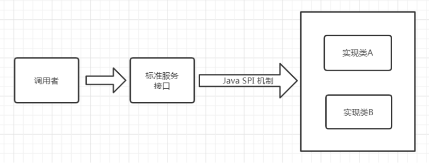
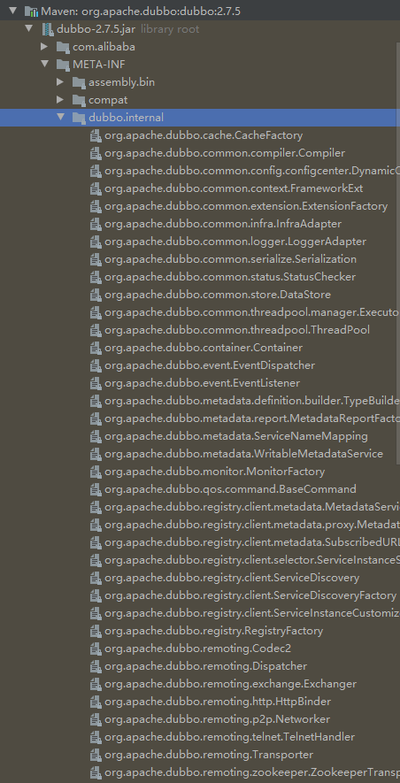
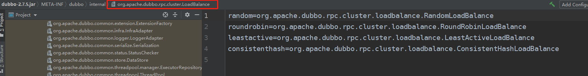
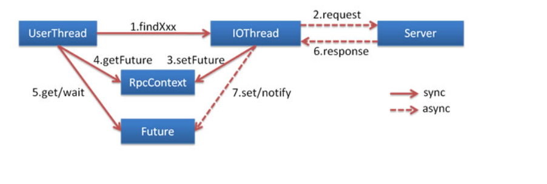

[toc]


## 一、Dubbo的SPI机制

### 1.Dubbo为什么不直接使用JDK自带的SPI机制？

##### [查看JDK SPI机制 -->](../../../java/基础/SPI机制)

##### JDK SPI的缺点：

1. 所有扩展实现都会被初始化并加载，影响了程序启动的耗时，若有扩展实现加载耗时又没被使用，影响了系统资源
2. 并且任意一个扩展实现加载失败，都会影响所有的扩展实现的使用

##### Dubbo SPI的改善

提供了对扩展点包装的功能(Adaptive)，实现动态加载扩展点，并且还支持通过set的方式对其他的扩展点进行注入


### 2.Dubbo SPI简介



Dubbo项目中大量使用Dubbo SPI ，定义了一些接口服务，如协议，负载均衡。并在**META-INF/dubbo.internal**包下提供了大量扩展实现，除此之外，使用Dubbo的开发者也可通过Dubbo SPI自定义实现扩展服务，




##### dubbo提供的默认负载均衡实现如下图所示：




### 3.使用Dubbo SPI自定义扩展实现

`SPI `自定义的扩展实现中，`SPI`声明文件以 `key-value` 形式存储，**key代表了某个扩展实现的标识**，**value为扩展实现的全限定类名**

##### 创建API工程

1. pom文件添加dubbo依赖

```xml
<dependencies>
    <dependency>
        <groupId>org.apache.dubbo</groupId>
        <artifactId>dubbo</artifactId>
        <version>2.7.5</version>
    </dependency>
</dependencies>
```

2. 定义接口服务，接口使用**@SPI**注解

```java
import org.apache.dubbo.common.URL;
import org.apache.dubbo.common.extension.Adaptive;
import org.apache.dubbo.common.extension.SPI;

@SPI
public interface HelloService {
    String  sayHello();
}
```


##### 创建扩展实现工程

1. 导入API工程的依赖
2. 编写两个扩展实现类

```java
import com.tangdi.service.HelloService;
import org.apache.dubbo.common.URL;

public class DogHelloService implements HelloService{
    @Override
    public String sayHello() {
        return "wang wang";
    }
}
```

```java
import com.tangdi.service.HelloService;
import org.apache.dubbo.common.URL;

public class HumanHelloService implements HelloService{
    @Override
    public String sayHello() {
        return "hello 你好";
    }
}
```

3.编写SPI声明文件，在**resources/META-INF/dubbo** （区别于dubbo默认的spi实现文件）目录下创建一个以“**接口全限定名**”为命名的文件，文件内部配置**两个实现类名称和对应的全限定名**

```
human=com.lagou.service.impl.HumanHelloService
dog=com.lagou.service.impl.DogHelloService
```


##### 创建使用工程

1.  导入API工程和扩展实现工程
2. 编写main函数，与jdk spi不同的是 dubbo spi 使用自己实现的**ExtensionLoader**来加载扩展实现类

```java
import com.tangdi.service.HelloService;
import org.apache.dubbo.common.extension.ExtensionLoader;

import java.util.Set;

public class DubboSpiMain {
    public static void main(String[] args) {
        // 获取扩展加载器
        ExtensionLoader<HelloService>  extensionLoader  = ExtensionLoader.getExtensionLoader(HelloService.class);
        // 遍历所有的支持的扩展点 META-INF.dubbo
        Set<String>  extensions = extensionLoader.getSupportedExtensions();
        for (String extension : extensions){
            String result = extensionLoader.getExtension(extension).sayHello();
            System.out.println(result);
        }

    }
}
```


### 4.Dubbo SPI的Adaptive功能

Dubbo中的Adaptive功能，是动态的选择具体的扩展点。通过getAdaptiveExtension 统一对指定接口对应的所有扩展点进行封装，通过URL的方式对扩展点来进行动态选择。 (dubbo中所有的注册信息都是通过URL的形式进行处理的)这里同样采用相同的方式进行实现

##### 在上面的基础上更改API工程

1. **@SPI 注解**的value值代表该接口默认的实现是什么，对应dubbo.internal文件中的key

2. **@Adaptive 注解**代表可以被动态选择的扩展实现方法

3. 在参数中提供URL参数.注意这里的URL参数的类为 `org.apache.dubbo.common.URL`

```java
import org.apache.dubbo.common.URL;
import org.apache.dubbo.common.extension.Adaptive;
import org.apache.dubbo.common.extension.SPI;

@SPI("human")
public interface HelloService {
    String  sayHello();
    @Adaptive
    String  sayHello(URL  url);
}
```


##### 在上面的基础上更改扩展实现工程

1. 实现类方法增加URL形参即可

```java
@Override
public String sayHello(URL url) {
    return "wang url";
}
```

```java
@Override
public String sayHello(URL url) {
    return "hello 你好";
}
```

2. SPI声明文件以key-value形式编写

```
human=com.lagou.service.impl.HumanHelloService
dog=com.lagou.service.impl.DogHelloService
```


##### 在上面的基础上更改使用工程

main 函数中需要传入URL参数，并且在参数中指定具体的实现类参数

URL的地址不限，关键是 `?` 后面跟上全限定接口名，然后指定扩展实现对应的key

```java
import com.tangdi.service.HelloService;
import org.apache.dubbo.common.URL;
import org.apache.dubbo.common.extension.ExtensionLoader;

public class DubboAdaptiveMain {
    public static void main(String[] args) {
        URL url = URL.valueOf("test://localhost/hello?hello.service=dog");
        // 获取所有扩展实现，封装到AdaptiveExtension
        HelloService adptExt = ExtensionLoader.getExtensionLoader(HelloService.class).getAdaptiveExtension();
        String  msg = adaptiveExtension.sayHello(url);
        System.out.println(msg);
    }
}
```


### 5.基于Dubbo SPI的Dubbo过滤器功能


## 二、负载均衡策略

[Dubbo官网文档](https://dubbo.apache.org/zh/docs/advanced/loadbalance/)


## 三、异步调用

[Dubbo官网文档](https://dubbo.apache.org/zh/docs/advanced/async-call/)

从 2.7.0 开始，Dubbo 的所有异步编程接口开始以 [CompletableFuture](https://docs.oracle.com/javase/8/docs/api/java/util/concurrent/CompletableFuture.html) 为基础

基于 NIO 的非阻塞实现并行调用，客户端不需要启动多线程即可完成并行调用多个远程服务，相对多线程开销较小




## 四、线程池

[Dubbo官方文档 - 线程池配置](https://dubbo.apache.org/zh/docs/references/xml/dubbo-provider/)

### 1 Dubbo提供以下两种方式

##### 1.1 fifix（Dubbo默认）：固定大小线程池，启动时建立线程，不关闭，一直持有，默认创建的执行线程数为200，并且没有任何等待队列

在极端的情况下可能会存在问题，比如某个操作大量执行时，可能存在堵塞的情况。后面也会讲相关的处理办法。

##### 1.2 cache:：缓存线程池，空闲一分钟自动删除，当线程不足时，会自动创建新的线程。

如果突然有高TPS的请求过来，方法没有及时完成，则会造成大量的线程创建，极度消耗系统资源，拖慢系统性能甚至导致OOM

##### 1.3 limit：可伸缩线程池，但池中的线程数只会增长不会收缩。只增长不收缩的目的是为了避免收缩时突然来了大流量引起的性能问题

##### 1.4 eager：优先创建`Worker`线程池。

在任务数量大于`corePoolSize`但是小于`maximumPoolSize`时，优先创建`Worker`来处理任务。当任务数量大于`maximumPoolSize`时，将任务放入阻塞队列中。阻塞队列充满时抛出`RejectedExecutionException`。(相比于`cached`:`cached`在任务数量超过`maximumPoolSize`时直接抛出异常而不是将任务放入阻塞队列)


### 2 自定义Dubbo线程池

由于线程池的使用对于业务开发人员是无感的，只有fix模式的线程池中的线程不够处理请求或者cache模式的线程池创建大量线程导致程序OOM，引起的系统故障，业务开发人员才能得知发生问题了。

##### 现在要实现当线程池数量不够用，或者创建了大量线程超过阈值，发生告警

自定义线程池及实现线程池阈值告警


## 五、路由规则


## 六、服务降级
