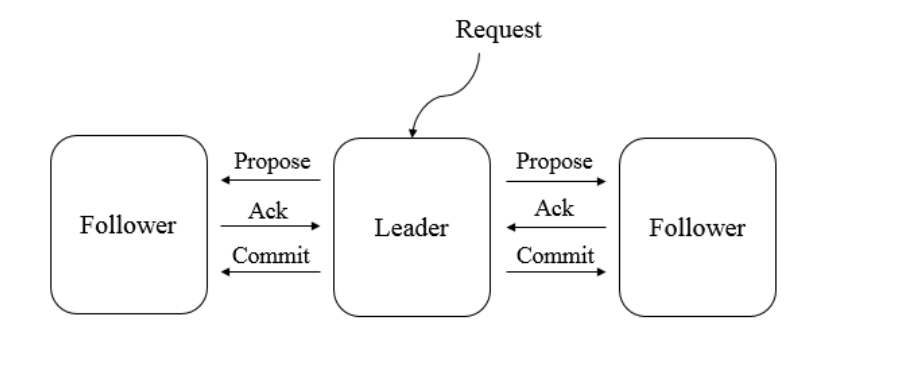

[toc]

### 一、ZAB协议

分布式数据的一致性由**zab协议**保证，具体分为以下两种模式

#### 1. 消息广播模式（保证数据一致性）

在消息⼴播过程中，**Leader服务**器会为每⼀个Follower服务器都各⾃分配⼀个单ᇿ的队列，然后将需要⼴播的事务 **Proposal** 依次放⼊这些队列中去，并且根据 **FIFO**策略进⾏消息发送。每⼀个**Follower服务器**在接收到这个事务Proposal之后，都会⾸先将其以事务⽇志的形式写⼊到本地磁盘中去，并且在成功写⼊后反馈给Leader服务器⼀个**Ack响应**。当Leader服务器接收到超过半数Follower的Ack响应后，就会⼴播⼀个**Commit**消息给所有的Follower服务器以通知其进⾏事务提交，同时Leader⾃身也会完成对事务的提交，⽽每⼀个Follower服务器在接收到Commit消息后，也会完成对事务的提交

#### 2. 崩溃恢复模式（leader崩溃或者与一半Follower失去联系）

根据上⾯的内容，我们了解到，ZAB协议规定了如果⼀个事务Proposal在⼀台机器上被处理成功，那么应该在所有的机器上都被处理成功，哪怕机器出现故障崩溃。接下来我们看看在崩溃恢复过程中，可能会出现的两个数据不⼀致性的隐患及针对这些情况ZAB协议所需要保证的特性。

**数据同步**

完成Leader选举之后，在正式开始⼯作（即接收客户端的事务请求，然后提出新的提案）之前，Leader服务器会⾸先确认事务⽇志中的所有Proposal是否都已经被集群中过半的机器提交了，即是否完成数据同步。下⾯我们就来看看ZAB协议的数据同步过程。

所有正常运⾏的服务器，要么成为 Leader，要么成为 Follower 并和 Leader 保持同步。Leader服务器需要确保所有的Follower服务器能够接收到每⼀条事务Proposal，并且能够正确地将所有已经提交了的事务Proposal应⽤到内存数据库中去。具体的，Leader服务器会为每⼀个Follower服务器都准备⼀个队列，并将那些没有被各Follower服务器同步的事务以Proposal消息的形式逐个发送给Follower服务器，并在每⼀个Proposal消息后⾯紧接着再发送⼀个Commit消息，以表示该事务已经被提交。等到Follower服务器将所有其尚未同步的事务 Proposal 都从 Leader 服务器上同步过来并成功应⽤到本地数据库中后，Leader服务器就会将该Follower服务器加⼊到真正的可⽤Follower列表中，并开始之后的其他流程

### 二、ZAB与Paxos的联系和区别

#### 联系：

- 都存在⼀个类似于Leader进程的⻆⾊，由其负责协调多个Follower进程的运⾏。

- Leader进程都会等待超过半数的Follower做出正确的反馈后，才会将⼀个提议进⾏交。

- 在ZAB协议中，每个Proposal中都包含了⼀个epoch值，⽤来代表当前的Leader周期，在Paxos算法中，同样存在这样的⼀个标识，名字为Ballot

#### 区别：

- Paxos算法中，新选举产⽣的主进程会进⾏两个阶段的⼯作，第⼀阶段称为读阶段，新的主进程和其他进程通信来收集主进程提出的提议，并将它们提交。第⼆阶段称为写阶段，当前主进程开始提出⾃⼰的提议

- ZAB协议在Paxos基础上添加了同步阶段，此时，新的Leader会确保 存在过半的Follower已经提交了之前的Leader周期中的所有事务Proposal。这⼀同步阶段的引⼊，能够有效地保证Leader在新的周期中提出事务Proposal之前，所有的进程都已经完成了对之前所有事务Proposal的提交。

- 总的来说，ZAB协议和Paxos算法的本质区别在于，两者的设计⽬标不太⼀样，ZAB协议主要⽤于构建⼀个⾼可⽤的分布式数据主备系统，⽽Paxos算法则⽤于构建⼀个分布式的⼀致性状态机系统

### 三、ZAB协议-服务器运行时状态

在ZAB协议的设计中，每个进程有如下三种状态

- LOOKING：Leader选举阶段。

- FOLLOWING：Follower服务器和Leader服务器保持同步状态。

- LEADING：Leader服务器作为主进程领导状态。

### 四、服务器启动

#### 3.1 服务端整体架构图

#### 3.2 单机版Zookeeper服务器的启动分为预启动和初始化两部分

##### 3.2.1 启动过程又分为预启动和初始化两部分，流程图如下

1. 配置⽂件解析

2. 初始化数据管理器

3. 初始化⽹络I/O管理器

4. 数据恢复

5. 对外服务

##### 3.2.2 预启动

1. 统⼀由QuorumPeerMain作为启动类。⽆论单机或集群，在zkServer.cmd和zkServer.sh中都配置了QuorumPeerMain作为启动⼊⼝类。

2. 解析配置⽂件zoo.cfg。zoo.cfg配置运⾏时的基本参数，如tickTime、dataDir、clientPort等参数。

3. 创建并启动历史⽂件清理器DatadirCleanupManager。对事务⽇志和快照数据⽂件进⾏定时清理。

4. 判断当前是集群模式还是单机模式启动。若是单机模式，则委托给ZooKeeperServerMain进⾏启动。

5. 再次进⾏配置⽂件zoo.cfg的解析。

6. 创建服务器实例ZooKeeperServer。Zookeeper服务器⾸先会进⾏服务器实例的创建，然后对该服务器实例进⾏初始化，包括连接器、内存数据库、请求处理器等组件的初始化。

##### 3.2.3 初始化

1. 创建服务器统计器ServerStats。ServerStats是Zookeeper服务器运⾏时的统计器。

2. 创建Zookeeper数据管理器FileTxnSnapLog。FileTxnSnapLog是Zookeeper上层服务器和底层数据存储之间的对接层，提供了⼀系列操作数据⽂件的接⼝，如事务⽇志⽂件和快照数据⽂件。Zookeeper根据zoo.cfg⽂件中解析出的快照数据⽬录dataDir和事务⽇志⽬录dataLogDir来创建FileTxnSnapLog。

3. 设置服务器tickTime和会话超时时间限制。

4. 创建ServerCnxnFactory。通过配置系统属性zookeper.serverCnxnFactory来指定使⽤Zookeeper⾃⼰实现的NIO还是使⽤Netty框架作为Zookeeper服务端⽹络连接⼯⼚。

5. 初始化ServerCnxnFactory。Zookeeper会初始化Thread作为ServerCnxnFactory的主线程，然后再初始化NIO服务器。

6. 启动ServerCnxnFactory主线程。进⼊Thread的run⽅法，此时服务端还不能处理客户端请求。

7. 恢复本地数据。启动时，需要从本地快照数据⽂件和事务⽇志⽂件进⾏数据恢复。

8. 创建并启动会话管理器。Zookeeper会创建会话管理器SessionTracker进⾏会话管理。

9. 初始化Zookeeper的请求处理链。Zookeeper请求处理⽅式为责任链模式的实现。会有多个请求处理器依次处理⼀个客户端请求，在服务器启动时，会将这些请求处理器串联成⼀个请求处理链。

10. 注册JMX服务。Zookeeper会将服务器运⾏时的⼀些信息以JMX的⽅式暴露给外部。

11. 注册Zookeeper服务器实例。将Zookeeper服务器实例注册给ServerCnxnFactory，之后Zookeeper就可以对外提供服务。

#### 3.3 集群服务器启动，与单机版总体相似

##### 3.3.1 启动过程分为预启动、初始化、Leader选举、Leader与Follower启动期交互、Leader与Follower启动等过程

##### 3.3.2 预启动

1. 统⼀由QuorumPeerMain作为启动类。

2. 解析配置⽂件zoo.cfg。

3. 创建并启动历史⽂件清理器DatadirCleanupFactory。

4. 判断当前是集群模式还是单机模式的启动。在集群模式中，在zoo.cfg⽂件中配置了多个服务器地址，可以选择集群启动。

##### 3.3.3 初始化

1. 创建ServerCnxnFactory。

2. 初始化ServerCnxnFactory。

3. 创建Zookeeper数据管理器FileTxnSnapLog。4. 创建QuorumPeer实例。Quorum是集群模式下特有的对象，是Zookeeper服务器实例（ZooKeeperServer）的托管者，QuorumPeer代表了集群中的⼀台机器，在运⾏期间，QuorumPeer会不断检测当前服务器实例的运⾏状态，同时根据情况发起Leader选举。

5. 创建内存数据库ZKDatabase。ZKDatabase负责管理ZooKeeper的所有会话记录以及DataTree和事务⽇志的存储。

6. 初始化QuorumPeer。将核⼼组件如FileTxnSnapLog、ServerCnxnFactory、ZKDatabase注册到QuorumPeer中，同时配置QuorumPeer的参数，如服务器列表地址、Leader选举算法和会话超时时间限制等。

7. 恢复本地数据。

8. 启动ServerCnxnFactory主线程

##### 3.3.4  Leader选举

1. 初始化Leader选举。

    集群模式特有，Zookeeper⾸先会根据⾃身的服务器ID（SID）、最新的ZXID（lastLoggedZxid）和当前的服务器epoch（currentEpoch）来⽣成⼀个初始化投票，在初始化过程中，每个服务器都会给⾃⼰投票。然后，根据zoo.cfg的配置，创建相应Leader选举算法实现，Zookeeper提供了三种默认算法（LeaderElection、AuthFastLeaderElection、FastLeaderElection），可通过zoo.cfg中的electionAlg属性来指定，但现只⽀持FastLeaderElection选举算法。在初始化阶段，Zookeeper会创建Leader选举所需的⽹络I/O层QuorumCnxManager，同时启动对Leader选举端⼝的监听，等待集群中其他服务器创建连接。

2. 注册JMX服务。

3. 检测当前服务器状态 运⾏期间，QuorumPeer会不断检测当前服务器状态。在正常情况下，Zookeeper服务器的状态在LOOKING、LEADING、FOLLOWING/OBSERVING之间进⾏切换。在启动阶段，QuorumPeer的初始状态是LOOKING，因此开始进⾏Leader选举。

4. Leader选举

    ZooKeeper的Leader选举过程，简单地讲，就是⼀个集群中所有的机器相互之间进⾏⼀系列投票，选举产⽣最合适的机器成为Leader，同时其余机器成为Follower或是Observer的集群机器⻆⾊初始化过程。关于Leader选举算法，简⽽⾔之，就是集群中哪个机器处理的数据越新（通常我们根据每个服务器处理过的最⼤ZXID来⽐较确定其数据是否更新），其越有可能成为Leader。当然，如果集群中的所有机器处理的ZXID⼀致的话，那么SID最⼤的服务器成为Leader，其余机器称为Follower和Observer

##### 3.3.4 Leader和Follower启动期交互过程

到这⾥为⽌，ZooKeeper已经完成了Leader选举，并且集群中每个服务器都已经确定了⾃⼰的⻆⾊——通常情况下就分为 Leader 和 Follower 两种⻆⾊。下⾯我们来对 Leader和Follower在启动期间的交互进⾏介绍，其⼤致交互流程如图所示。

1. 创建Leader服务器和Follower服务器。完成Leader选举后，每个服务器会根据⾃⼰服务器的⻆⾊创建相应的服务器实例，并进⼊各⾃⻆⾊的主流程。
2. Leader服务器启动Follower接收器LearnerCnxAcceptor。运⾏期间，Leader服务器需要和所有其余的服务器（统称为Learner）保持连接以确集群的机器存活情况，LearnerCnxAcceptor负责接收所有⾮Leader服务器的连接请求。
3. Learner服务器开始和Leader建⽴连接。所有Learner会找到Leader服务器，并与其建⽴连接。
4. Leader服务器创建LearnerHandler。Leader接收到来⾃其他机器连接创建请求后，会创建⼀个LearnerHandler实例，每个LearnerHandler实例都对应⼀个Leader与Learner服务器之间的连接，其负责Leader和Learner服务器之间⼏乎所有的消息通信和数据同步。
5. 向Leader注册。Learner完成和Leader的连接后，会向Leader进⾏注册，即将Learner服务器的基本信息（LearnerInfo），包括SID和ZXID，发送给Leader服务器。
6. Leader解析Learner信息，计算新的epoch。Leader接收到Learner服务器基本信息后，会解析出该Learner的SID和ZXID，然后根据ZXID解析出对应的epoch_of_learner，并和当前Leader服务器的epoch_of_leader进⾏⽐较，如果该Learner的epoch_of_learner更⼤，则更新Leader的epoch_of_leader = epoch_of_learner + 1。然后LearnHandler进⾏等待，直到过半Learner已经向Leader进⾏了注册，同时更新了epoch_of_leader后，Leader就可以确定当前集群的epoch了。
7. 发送Leader状态。计算出新的epoch后，Leader会将该信息以⼀个LEADERINFO消息的形式发送给Learner，并等待Learner的响应。
8. Learner发送ACK消息。Learner接收到LEADERINFO后，会解析出epoch和ZXID，然后向Leader反馈⼀个ACKEPOCH响应。
9. 数据同步。Leader收到Learner的ACKEPOCH后，即可进⾏数据同步。
10. 启动Leader和Learner服务器。当有过半Learner已经完成了数据同步，那么Leader和Learner服务器实例就可以启动了

##### 3.3.5 Leader和Follower启动

1. 创建启动会话管理器。
2. 初始化Zookeeper请求处理链，集群模式的每个处理器也会在启动阶段串联请求处理链。
3. 注册JMX服务。

### 五、leader选举具体实现

##### 4.1 Zookeeper集群中的⼀台服务器出现以下两种情况之⼀时，需要进⼊Leader选举

- 集群服务器初始化启动。

- 集群中leader挂了或者leader无法与一半follower连接

##### 4.2 服务器启动时期的Leader选举

当zk服务器集群中的第二台服务器启动时，进入leader选举流程：

1. 每个Server发出⼀个投票，默认为自己的投票信息为(myid, ZXID)
2. 接受来⾃各个服务器的投票，判断该投票的有效性，过滤LOOKING状态的服务器
3. 处理投票，对所有投票信息进行PK，投票ZXID大的投票信息，若最大ZXID相同，再比较它们的myid，投myid大的投票信息。最终更新自己的投票信息，然后再将投票信息重新发送出去
4. 统计投票，每个Server每收到其他Server发送过来的投票信息，都会统计出数量最大的投票信息，若有投票信息数量过半（n/2+1），则选举投票信息中myid对应的Server为leader
5. 改变服务器状态，确定了 Leader，每个服务器就会更新⾃⼰的状态：如果是 Follower，那么就变更为FOLLOWING，如果是Leader，那么就变更为LEADING

##### 4.3 服务器运⾏时期的Leader选举

当zk服务器集群中的Leader挂了或者leader无法与一半follower连接，整个集群将暂时⽆法对外服务，⽽是进⼊新⼀轮的Leader选举流程：

1. 变更状态，Leader挂后，余下的⾮Observer服务器都会将⾃⼰的服务器状态变更为LOOKING，然后开始进⼊Leader选举过程。
2. 每个Server会发出⼀个投票信息，运行时的每个Server的ZXID可能不同
3. 接收来⾃各个服务器的投票，与启动时过程相同
4. 处理投票。与启动时过程相同，
5. 统计投票。与启动时过程相同
6. 改变服务器的状态。与启动时过程相同