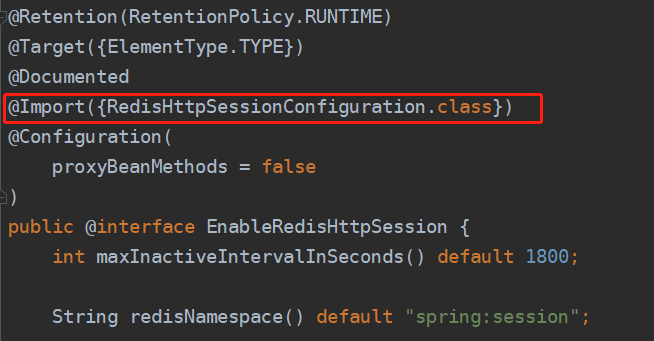
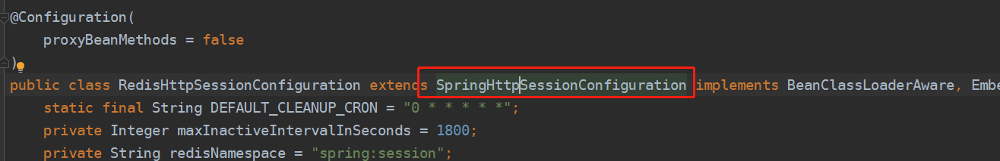
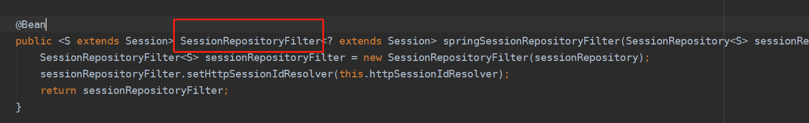
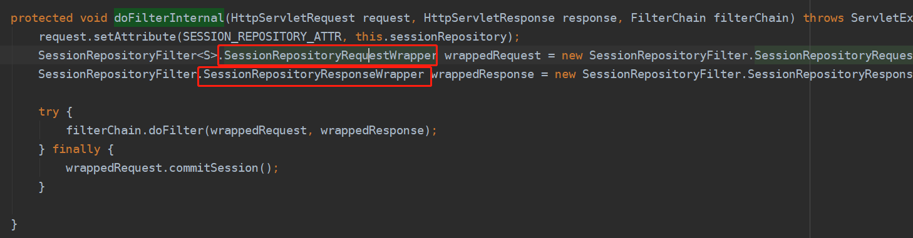
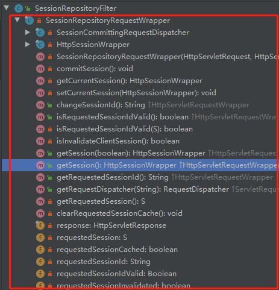
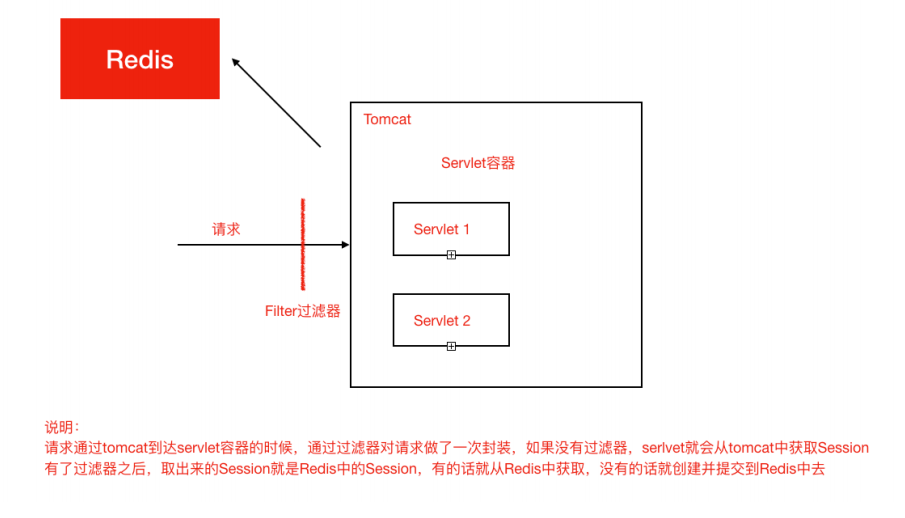

[toc]


## 一、Spring Session应用

项目中若使用Session进行登陆校验，则在已有登陆后Session装配及拦截校验情况下，引入依赖、Redis配置、开启SpringSession的注解，即可实现服务器间Session共享

#### 1. 引⼊Jar

```xml
<dependency>
 <groupId>org.springframework.boot</groupId>
 <artifactId>spring-boot-starter-data-redis</artifactId>
</dependency> 
<dependency>
 <groupId>org.springframework.session</groupId>
 <artifactId>spring-session-data-redis</artifactId>
</dependency>
```

#### 2. 配置Redis

```properties
spring.redis.database=0
spring.redis.host=127.0.0.1
spring.redis.port=6379
```

#### 3. 添加注解@EnableRedisHttpSession

```java
@SpringBootApplication
@EnableCaching
@EnableRedisHttpSession
public class LoginApplication  extends SpringBootServletInitializer {
    ...
}
```

#### 4. 拦截器

```java
import org.springframework.web.servlet.HandlerInterceptor;
import org.springframework.web.servlet.ModelAndView;

import javax.servlet.http.HttpServletRequest;
import javax.servlet.http.HttpServletResponse;
import javax.servlet.http.HttpSession;
import java.util.Enumeration;

/**
 * 请求权限验证
 */
public class RequestInterceptor implements HandlerInterceptor {

    /**
     * 之前执行（进入Handler处理之前）
     * 可以进行权限验证
     * @param request
     * @param response
     * @param handler
     * @return  true放行，false中止程序
     * @throws Exception
     */
    @Override
    public boolean preHandle(HttpServletRequest request, HttpServletResponse response, Object handler) throws Exception {
        HttpSession session = request.getSession();
        System.out.println("==========>>>>sessionId:" + session.getId());
        System.out.println("======SESSION::::" + session);

        Enumeration<String> attrs = session.getAttributeNames();
        // 遍历attrs中的
        while(attrs.hasMoreElements()){
			// 获取session键值
            String name = attrs.nextElement().toString();
            // 根据键值取session中的值
            Object vakue = session.getAttribute(name);
            // 打印结果
            System.out.println("------" + name + ":" + vakue +"--------\n");

        }

        System.out.println("===============>>>>>>当前uri：" + request.getRequestURI());
        Object username = session.getAttribute("username");
        System.out.println("=================>>>>>username:" + username);
        if(username == null) {
            // 没有登录,重定向到登录页
            System.out.println("未登录，请登录");
            response.sendRedirect(request.getContextPath() + "/login/toLogin");
            return false;
        }else{
            System.out.println("已登录，放行请求");
            // 已登录，放行
            return true;
        }
    }

    /**
     * 之中执行（Handler处理完毕但尚未跳转页面）
     * @param request
     * @param response
     * @param handler
     * @param modelAndView
     * @throws Exception
     */
    @Override
    public void postHandle(HttpServletRequest request, HttpServletResponse response, Object handler, ModelAndView modelAndView) throws Exception {
    }

    /**
     * 之后执行（Handler处理完毕而且已经跳转页面）
     * @param request
     * @param response
     * @param handler
     * @param ex
     * @throws Exception
     */
    @Override
    public void afterCompletion(HttpServletRequest request, HttpServletResponse response, Object handler, Exception ex) throws Exception {
    }
}
```


#### 5. 登陆

```java
import org.springframework.stereotype.Controller;
import org.springframework.web.bind.annotation.RequestMapping;

import javax.servlet.http.HttpSession;

@Controller
@RequestMapping("login")
public class LoginController {

    @RequestMapping("toLogin")
    public String toLogin() {
        System.out.println("================++++++++++++++跳转登录页面");
        return "login";
    }

    @RequestMapping("loginSystem")
    public String loginSystem(String username, String password, HttpSession session) {
        // 合法用户，信息写入session，同时跳转到系统主页面
        if("admin".equals(username) && "admin".equals(password)) {
            System.out.println("合法用户");
            session.setAttribute("username",username + System.currentTimeMillis());
            return "redirect:/demo/result";
        }else{
            // 非法用户返回登录页面
            System.out.println("非法，跳转");
            return "redirect:/login/toLogin";
        }
    }
}
```


#### 6. 登陆JSP

```jsp
<%@ page isELIgnored="false" contentType="text/html;charset=UTF-8" language="java" %>
<%@ taglib uri="http://java.sun.com/jsp/jstl/core" prefix="c" %>
<%@ taglib uri="http://java.sun.com/jsp/jstl/fmt"  prefix="fmt"%>
<html>
<head>
    <title>系统登录</title>

    <style>
        div{
            width:300px;
            height:100px;
            position: absolute;
            top:50%;
            left:50%;
            margin-top: -50px ;
            margin-left:-150px;
        }
    </style>
</head>
<body>
<h2>我是服务器：${pageContext.request.localPort}</h2>
<h2>当前sessionId：${pageContext.session.id}</h2>
    <div>
        <form method="post" action="${pageContext.request.contextPath}/login/loginSystem">
            <table>
                <tr>
                    <td>用户名：</td>
                    <td><input type="text" name="username"></td>
                </tr>
                <tr>
                    <td>密码：</td>
                    <td><input type="password" name="password"> <input type="submit" value="登录"></td>
                </tr>
            </table>

        </form>
    </div>
</body>
</html>

```


#### 7. 登陆成功页

```jsp
<%@ page isELIgnored="false" contentType="text/html;charset=UTF-8" language="java" %>
<%@ taglib uri="http://java.sun.com/jsp/jstl/core" prefix="c" %>
<%@ taglib uri="http://java.sun.com/jsp/jstl/fmt"  prefix="fmt"%>
<html>
<head>
</head>
<body>
<h1>欢迎登录xxx系统！</h1><br/>
    <h2>我是服务器：${pageContext.request.localPort}</h2>
    <h2>当前sessionId：${pageContext.session.id}</h2>
</body>
</html>

```


## 二、Spring Session原理

##### 创建⼀个过滤器使得SpringSession替代HttpSession发挥作⽤，找到那个过滤器



##### 观察其⽗类，⽗类中有Filter->SessionRepositoryFilter





##### 这个Filter的核心方法SessionRepositoryFilter#doFilterInternal，以及对HttpServletRequest进行了一次封装

SessionRepositoryRequestWrapper继承了HttpServletRequest，对HttpServletRequest进行了一些包装。





##### 当请求到来时，过滤器先查Redis是否有对应Session，若没有，则创建Session并存入Redis；若有，则直接放行

