[toc]

## 一、分布式和集群的区别

分布式⼀定是集群，但是集群不⼀定是分布式

集群就是多个相同的实例一起工作（也就是复制），系统本身仍是一个单体

分布式是将⼀个系统拆分成多个子系统（也就是拆分）一起工作，必然也就是多个实例，子系统独立部署，各司其职


## 二、一致性Hash算法

### 1. Hash算法应⽤场景

Hash算法，⽐如说在**安全加密领域**MD5、SHA等加密算法，在**数据存储和查找**⽅⾯有Hash表等, 以上都应⽤到了Hash算法。

Hash算法应用场景主要是：**数据存储和查找领域**。

- 最经典的就是Hash表，它的查询效率⾮常之⾼，其中的哈希算法如果设计的⽐较ok的话，那么Hash表的数据查询时间复杂度可以接近于O(1)

- 请求的负载均衡（⽐如nginx的ip_hash策略）
- 分布式存储，集群中有redis1，redis2，redis3 三台Redis服务器那么,在进⾏数据存储时,<key1,value1>数据存储到哪个服务器当中呢？针对key进⾏hash处理hash(key1)%3=index, 使⽤余数index锁定存储的具体服务器节点


### 2.普通Hash算法的使用

##### 需求：给定一组数据，匹配某N是否存在

##### 方案1：顺序查找法（不适用Hash算法）

遍历数组，逐个匹配,，效率低下

##### 方案2：二分查找法（不适用Hash算法）

排序之后折半查找，相对于顺序查找法会提⾼⼀些效率，但是效率也并不是特别好

##### 方案3：直接寻址法

属于线性Hash算法的一种，只是系数为1

把数据和数组的下标绑定到⼀起，查找的时候，直接array[n]就取出了数据

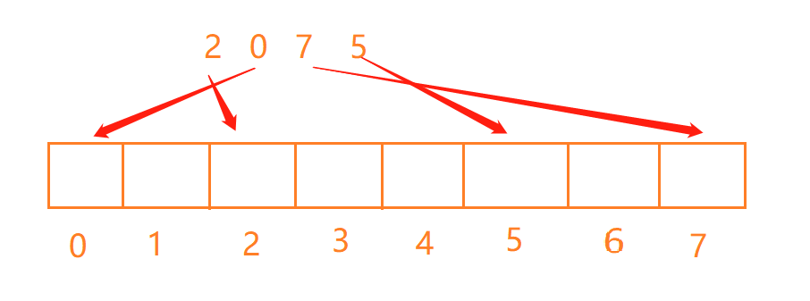

优点：时间复杂度为O(1)

缺点：若数据量小，但是最大值N很大，则需要创建一个长度为N的数组，浪费空间

##### 方案4：除留余数法

是Hash算法的一种，先开辟任意空间长度为 N 的数组，将给定的每个数值与数组长度 N 求模取余，将余数作为存储的下标。

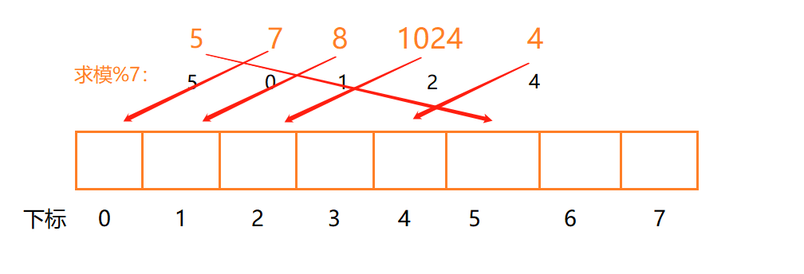

优点：查询效率高，不会浪费空间

缺点：若Hash冲突则会被覆盖

##### 方案5：除留余数法 + 拉链法

除留余数法的基础上，若Hash冲突则使用拉链法，在数组存储位置放一个链表。

优点：若Hash算法设计的好，数据被平均分布，则查询效率很高

缺点：若Hash算法设计很糟糕，数据分布在几个下标中，则查询效率很低，跟顺序查找法相差无几

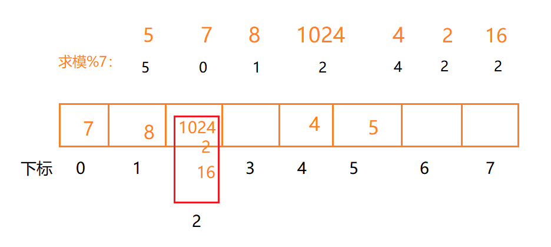


### 3. 普通Hash算法的问题

普通Hash算法存在⼀个问题，以ip_hash为例，假定下载⽤户ip固定没有发⽣改变，现在tomcat3出现了问题，down机了，服务器数量由3个变为了2个，之前所有的求模都需要重新计算。

缩容和扩容都会存在这样的问题，⼤量⽤户的请求会被路由到其他的⽬标服务器处理

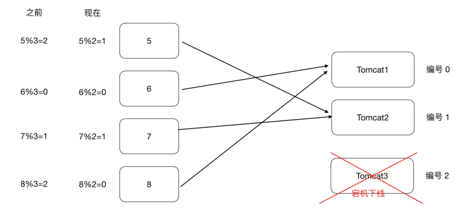


### 4. 一致性Hash算法

##### 4.1 [查看Java代码实现](一致性Hash算法)

##### 4.2 ⼀致性哈希算法思路如下：

⾸先有⼀条直线，直线开头和结尾分别定为为1和2的32次⽅减1，这相当于⼀个地址，对于这样⼀条线，弯过来构成⼀个圆环形成闭环，这样的⼀个圆环称为**hash环**。我们把**服务器的ip或者主机名求hash值然后对应到hash环上**，那么针对**客户端⽤户的ip进⾏hash求值也对应到环上**某个位置，然后如何确定⼀个客户端路由到哪个服务器处理呢？**按照顺时针⽅向找最近的服务器节点**

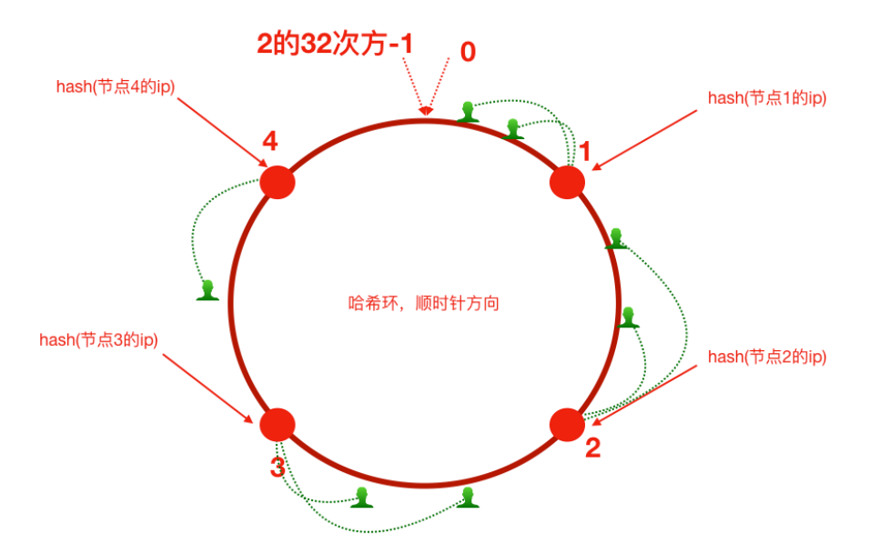

##### 4.3 缩/扩容影响小

假如将服务器3下线，服务器3下线后，原来路由到3的客户端重新路由到服务器4，对于其他客户端没有影响只是这⼀⼩部分受影响（请求的迁移达到了最⼩，这样的算法对分布式集群来说⾮常合适的，避免了⼤量请求迁移 ）

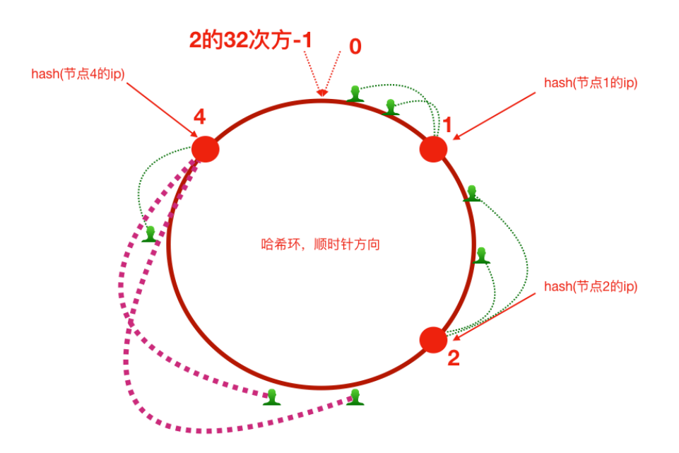


增加服务器5之后，原来路由到3的部分客户端路由到新增服务器5上，对于其他客户端没有影响只是这⼀⼩部分受影响（请求的迁移达到了最⼩，这样的算法对分布式集群来说⾮常合适的，避免了⼤量请求迁移 ）

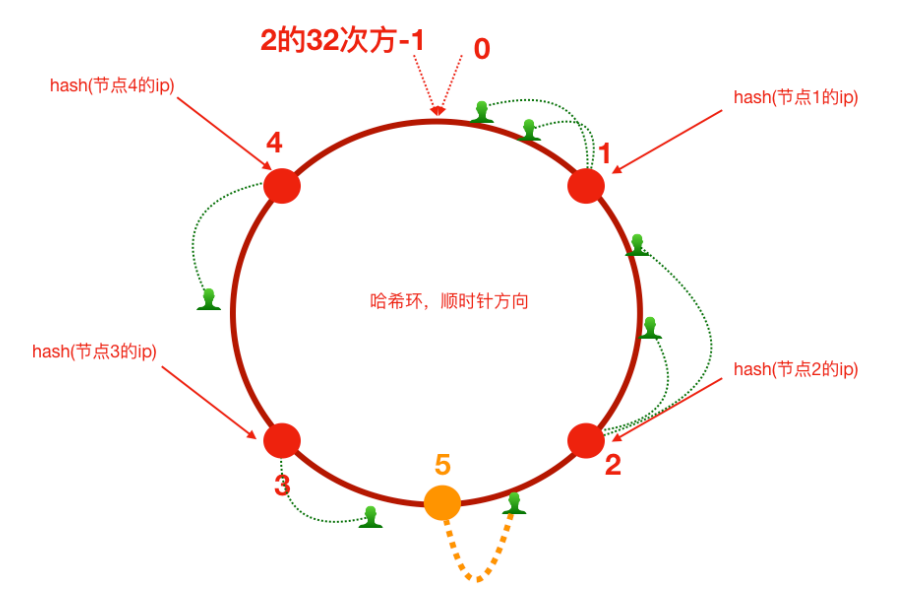


##### 4.4 倾斜问题

⼀致性哈希算法在服务节点太少时，容易因为节点分部不均匀⽽造成数据倾斜问题。例如系统中只有两台服务器，其环分布如下，节点2只能负责⾮常⼩的⼀段，⼤量的客户端请求落在了节点1上，这就是数据（请求）倾斜问题

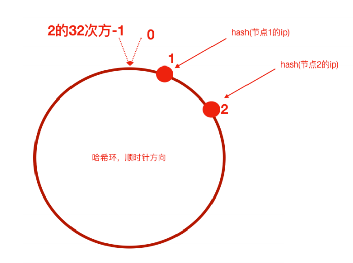

⼀致性哈希算法引⼊了**虚拟节点机制**


##### 4.5 虚拟节点机制

具体做法可以在服务器ip或主机名的后⾯增加编号来实现。⽐如，可以为每台服务器计算三个虚拟节点，于是可以分别计算 “节点1的ip#1”、“节点1的ip#2”、“节点1的ip#3”、“节点2的ip#1”、“节点2的ip#2”、“节点2的ip#3”的哈希值，于是形成六个虚拟节点，当客户端被路由到虚拟节点的时候其实是被路由到该虚拟节点所对应的真实节点

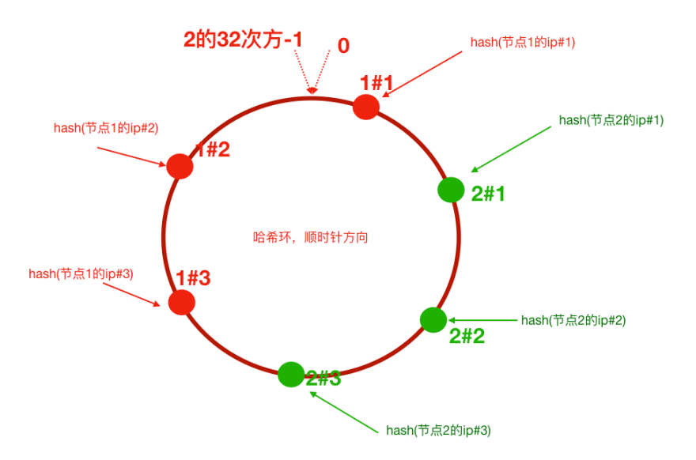


### 5. Nginx配置一致性Hash负载均衡

##### 5.1 ngx_http_upstream_consistent_hash 

`ngx_http_upstream_consistent_hash `  模块是⼀个负载均衡器，使⽤⼀个内部⼀致性hash算法来选择合适的后端节点。

该模块可以根据配置参数采取不同的⽅式将请求均匀映射到后端机器

- consistent_hash $remote_addr：可以根据客户端ip映射

- consistent_hash $request_uri：根据客户端请求的uri映射

- consistent_hash $args：根据客户端携带的参数进⾏映

##### 5.2 下载及配置

`ngx_http_upstream_consistent_hash `模块是⼀个第三⽅模块，需要我们下载安装后使⽤

- github下载nginx⼀致性hash负载均衡模块 https://github.com/replay/ngx_http_consistent_hash

- 将下载的压缩包上传到nginx服务器，并解压

- 我们已经编译安装过nginx，此时进⼊当时nginx的源码⽬录，执⾏如下命令

  ```sh
  ./configure —add-module=/root/ngx_http_consistent_hash-master
  
  make
  
  make install
  ```

- Nginx就可以使⽤啦，在nginx.conf⽂件中配置

  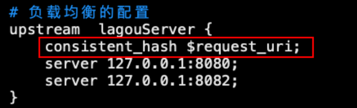

## 三、集群时钟同步

### 1. 集群时间不同步带来的问题

电商业务中，新增⼀条订单，那么势必会在订单表中增加了⼀条记录，该条记录中应该会有“下单时间”这样的字段，往往我们会在程序中获取当前系统时间插⼊到数据库或者直接从数据库服务器获取时间。那我们的订单⼦系统是集群化部署，或者我们的数据库也是分库分表的集群化部署，然⽽他们的系统时钟却不⼀致，⽐如有⼀台服务器的时间是昨天，那么这个时候下单时间就成了昨天，那我们的数据将会混乱！如下


### 2. 集群时钟同步方案

集群时钟同步方案分以下三种情况，不过总体都是通过**NTP（Network Time Protocol）协议**完成同步

#### 2.1 分布式集群中各个服务器节点都可以连外⽹


##### 方案如下

服务器设置定时任务，crond，可以使⽤linux的定时任务，每隔10分钟或一天执⾏⼀次ntpdate命令

```sh
#使⽤ ntpdate ⽹络时间同步命令
ntpdate -u ntp.api.bz #从⼀个时间服务器同步时间
```

#### 2.2 分布式集群中某⼀个服务器可以连外⽹或者所有节点都不能够连外⽹


##### 方案如下

选集群中一台服务器作为时间服务器，若该服务器可以联网则与互联网同步时间，否则自行设置一个时间。其他服务器的时间通过NTP协议与该时间服务器保持一致。

以手动设置时间服务器时间为例，步骤如下

1. 设置好时间服务器A的时间

2. 把A配置为时间服务器（修改/etc/ntp.conf⽂件）

   ```yaml
   1、如果有 restrict default ignore，注释掉它
   2、添加如下⼏⾏内容
    restrict 172.17.0.0 mask 255.255.255.0 nomodify notrap # 放开局
   域⽹同步功能,172.17.0.0是你的局域⽹⽹段
    server 127.127.1.0 # local clock
    fudge 127.127.1.0 stratum 10
   3、重启⽣效并配置ntpd服务开机⾃启动
    service ntpd restart
    chkconfig ntpd on
   ```

   

3. 集群中其他节点可以从A服务器同步时间

   ```sh
   ntpdate 172.17.0.17
   ```


## 四、分布式id

### 1. 为什么需要分布式id

数据库分库分表也就是分布式的情况下，主键不能重复，所以需要全局唯一的id


### 2. 分布式id方案

#### 2.1 UUID(可以⽤)

**UUID** 是通⽤唯⼀识别码

**优点：**产⽣重复 UUID 并造成错误的情况⾮常低

**缺点：**并且无序不可读，查询效率低

#### 2.2 基于独⽴数据库的⾃增ID（不推荐）

单独的创建⼀个Mysql数据库，在这个数据库中创建⼀张表，这张表的ID设置为⾃增，其他地⽅需要全局唯⼀ID的时候，就模拟向这个Mysql数据库的这张表中模拟插⼊⼀条记录，此时ID会⾃增，然后我们可以通过Mysql的select last_insert_id() 获取到刚刚这张表中⾃增⽣成的ID

当分布式集群环境中哪个应⽤需要获取⼀个全局唯⼀的分布式ID的时候，就可以使⽤代码连接这个数据库实例，执⾏如下sql语句即可。

**注意：**这⾥的createtime字段⽆实际意义，是为了随便插⼊⼀条数据以⾄于能够⾃增id。

```java
insert into DISTRIBUTE_ID(createtime) values(NOW());
select LAST_INSERT_ID()；
```

**缺点：**

1. 使⽤独⽴的Mysql实例⽣成分布式id，虽然可⾏，但是性能和可靠性都不够好，因为你需要代码连接到数据库才能获取到id，性能⽆法保障
2. 独立mysql数据库存在单点故障的问题，万一宕机，则整个数据库集群⽆法获取分布式id了
3. 还是单节点，无法扛住高并发

#### 2.3 基于数据库集群模式（不推荐）

分布式系统中，每台数据库设置一个起始值和自增步长。各自从起始值按步长自增ID

**缺点：**

1. 不利于后续扩容，若再增加一台数据库实例，则需重新设置起始值和步长
2. 单个数据库自身压力没变，难以扛住高并发

#### 2.4 基于数据库号段模式（推荐）

号段模式可以理解为从数据库批量的获取自增ID。应用服务启动时从数据库取出一个号段范围（比如生成1~1000），然后将id加载到内存并同时更新数据库该类型的号段范围（比如更新为1001-2000）。需要分布式id时，则从缓存取，当缓存用完id在从数据库取并更新数据库号段范围

**优点：**不强依赖于数据库，不会频繁的访问数据库，对数据库的压力小很多

**缺点：**当服务重新时，会从数据库拉取新的号段范围， 就可能出现断号的现象

#### 2.5 SnowFlake 雪花算法（可以⽤，推荐）

##### [Java实现SnowFlake](雪花算法的Java实现)

雪花算法是Twitter推出的⼀个⽤于⽣成分布式ID的策略。

雪花算法是⼀个算法，基于这个算法可以⽣成ID，⽣成的ID是⼀个long型，那么在Java中⼀个long型是8个字节，算下来是64bit，如下是使⽤雪花算法⽣成的⼀个ID的⼆进制形式示意：


另外，⼀切互联⽹公司也基于上述的⽅案封装了⼀些分布式ID⽣成器，⽐如滴滴的tinyid（基于数据库实现）、百度的uidgenerator（基于SnowFlake）和美团的leaf（基于数据库和SnowFlake）等。

#### 2.6 借助Redis的Incr命令获取全局唯⼀ID（推荐）

Redis Incr 命令将 key 中储存的数字值增⼀。如果 key 不存在，那么 key 的值会先被初始化为0，然后再执⾏ INCR 操作。

具体原理，后续学习Reids原理时再剖析


#### 2.7 zookeeper服务

借助zk的节点顺序或者节点版本号生成分布式唯一且有序id

#### 2.8 第三方公司的成熟方案

美团（Leaf）：Leaf同时支持号段模式(数据库)和snowflake算法模式(zk)，可以切换使用

滴滴（Tinyid）：Tinyid是基于号段模式实现

百度（uid-generator）：uid-generator是基于Snowflake算法实现的，与原始的snowflake算法不同在于，uid-generator支持自定义时间戳、工作机器ID和 序列号 等各部分的位数

## 五、分布式调度问题

### 1. 定时任务场景

- 订单审核、出库
- 订单超时⾃动取消、⽀付退款
- 礼券同步、⽣成、发放作业
- 物流信息推送、抓取作业、退换货处理作业
- 数据积压监控、⽇志监控、服务可⽤性探测作业
- 定时备份数据
- ⾦融系统每天的定时结算
- 数据归档、清理作业
- 报表、离线数据分析作业

### 2. 什么是分布式调度 

- 调度任务集群化部署（同⼀个定时任务程序部署多份，应该有⼀个定时任务在执⾏）

- 分布式调度—>定时任务的分布式—>定时任务的拆分（即为把⼀个⼤的作业任务拆分为多个⼩的作业任务，同时执⾏）


### 3. 定时任务与消息队列的区别

#### 共同点

- 异步处理

  ⽐如注册、下单事件

- 应⽤解耦

  将两个应⽤之间实现应⽤解耦，可以中转数据，当然单体服务不需要考虑这些，服务拆分的时候往往都会考虑

- 流量削峰

  双⼗⼀的时候，任务作业和MQ都可以⽤来扛流量，后端系统根据服务能⼒定时处理订单或者从MQ抓取订单抓取到⼀个订单到来事件的话触发处理，对于前端⽤户来说看到的结果是已经下单成功了，下单是不受任何影响的

#### 本质不同

**定时任务是时间驱动，倾向于批处理**

**MQ是事件驱动，倾向于逐条处理**

时间驱动是不可代替的，⽐如⾦融系统每⽇的利息结算，不是说利息来⼀条（利息到来事件）就算⼀下，⽽往往是通过定时任务批量计算

所以，**定时任务作业更倾向于批处理**，**MQ倾向于逐条处理**；


### 4. 分布式调度框架**Elastic-Job**

##### 4.1 [具体查看分布式调度方案](分布式调度问题)

## 六、分布式Session共享

### 1.什么是Session

早期因为互联网大部分都是静态页面，无所谓有无状态，所以HTTP协议设计为了无状态。

后来有动态的内容更丰富，就需要有状态，出现了两种⽤于**保持Http状态的技术**，那就是Cookie和Session

**Cookie是客户端浏览器保存的信息**

**Session是服务器端保存的信息**

### 2.Session不一致导致什么问题

由于集群部署以及分布式系统的出现，**同一个客户端发起的请求**，通过负载均衡服务器会被**路由到不同的服务器**，而每个服务器的Session都是独有的

当集群或分布式中的Seesion不一致时，每个服务器都将无法通过Session校验，导致一直卡在登录页

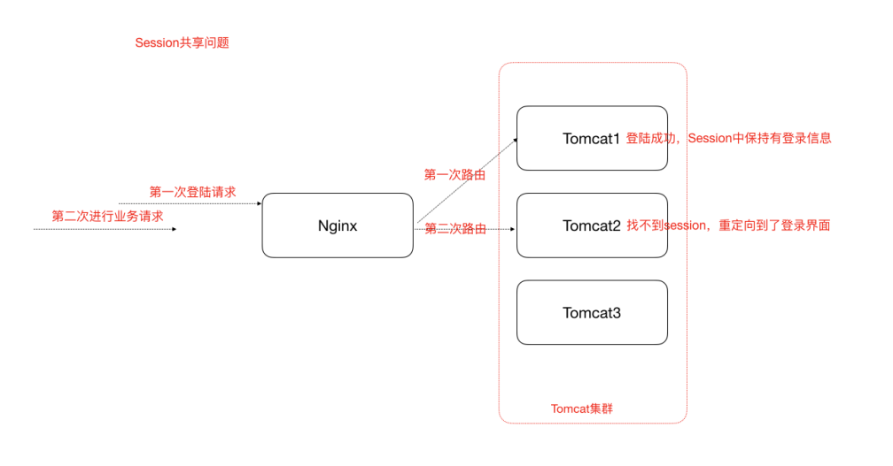

### 3.解决Session⼀致性的⽅案

#### 3.1 Nginx的 IP_Hash 策略（可以使⽤）

同⼀个客户端IP的请求都会被路由到同⼀个⽬标服务器，也叫做会话粘滞

##### 缺点：服务器重启Session丢失、存在单点负载⾼的⻛险、单点故障问题

#### 3.2 Session复制（不推荐）

也即，多个tomcat之间通过修改配置⽂件，达到Session之间的复制

缺点：性能低、内存消耗高、延迟性、大型分布式系统延迟性极高

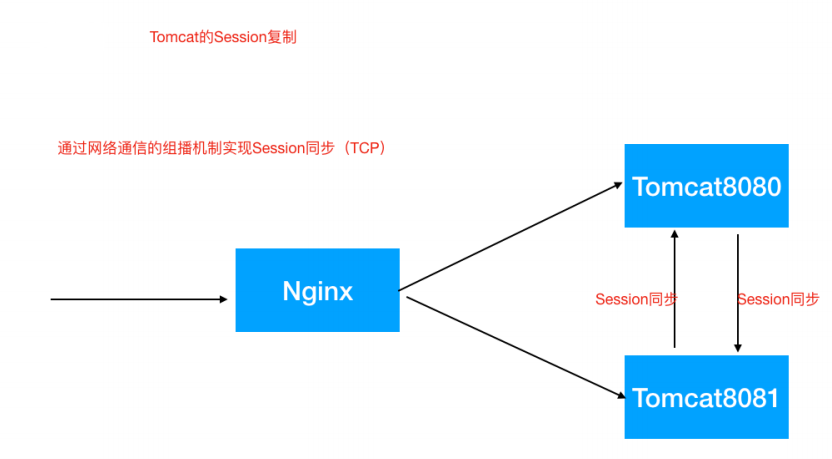

#### 3.3 Session共享，Session集中存储（推荐）

Session的本质就是缓存，那Session数据为什么不交给专业的缓存中间件呢？⽐如Redis

**Spring Session**使得基于**Redis**的**Session**共享应⽤起来⾮常之简单

##### [查看具体应用及原理](Spring Session共享)

##### 优点：

- 适应各种负载均衡策略
- 服务器重启或者宕机不会造成Session丢失
- 适合大型分布式系统使⽤

##### 缺点：对应⽤有⼊侵，引⼊了和Redis的交互代码

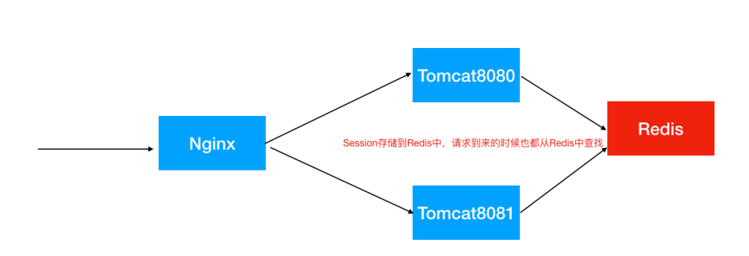
