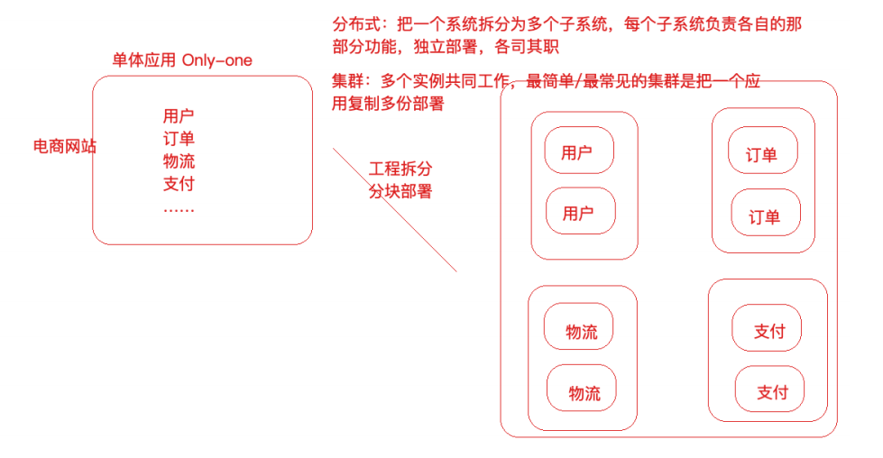
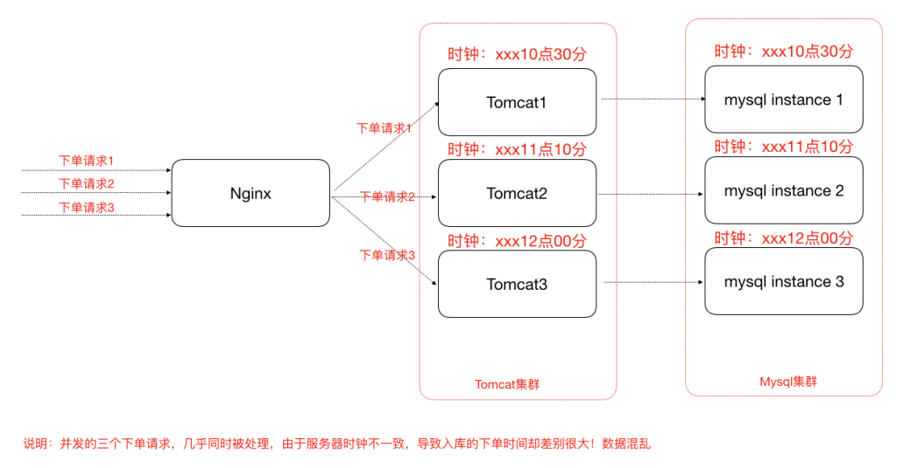
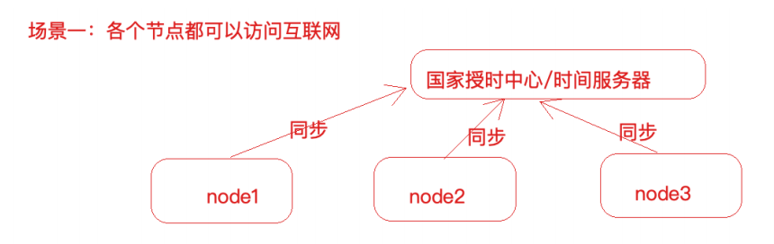
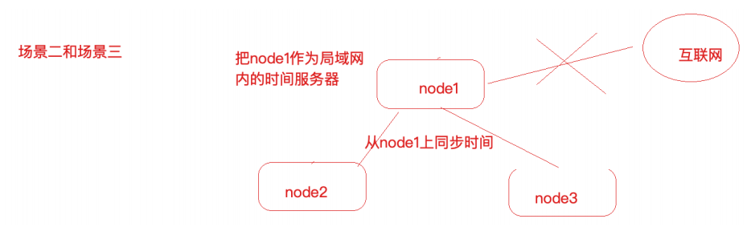
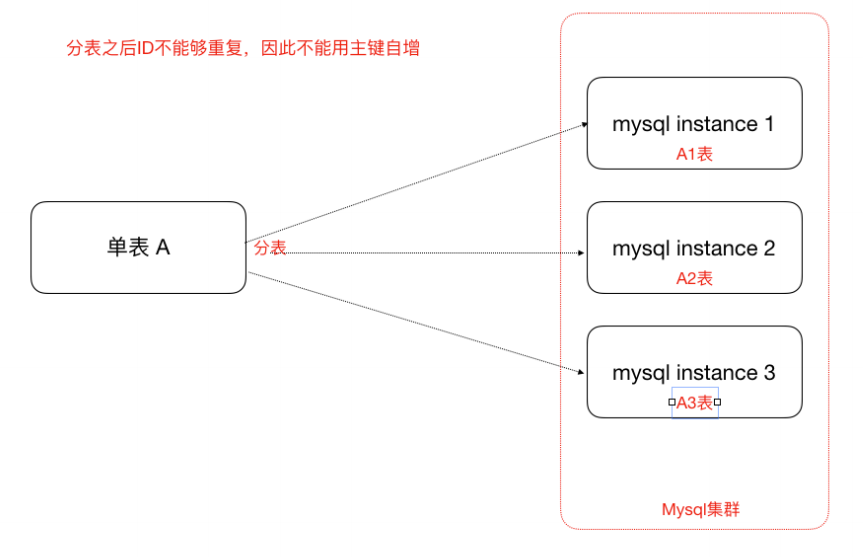
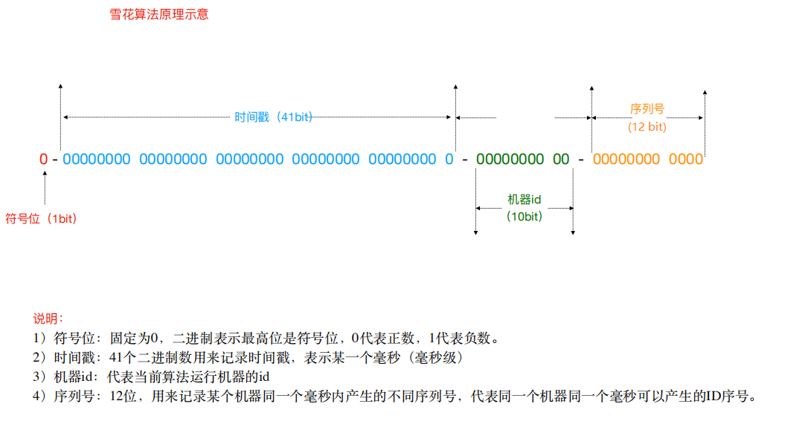
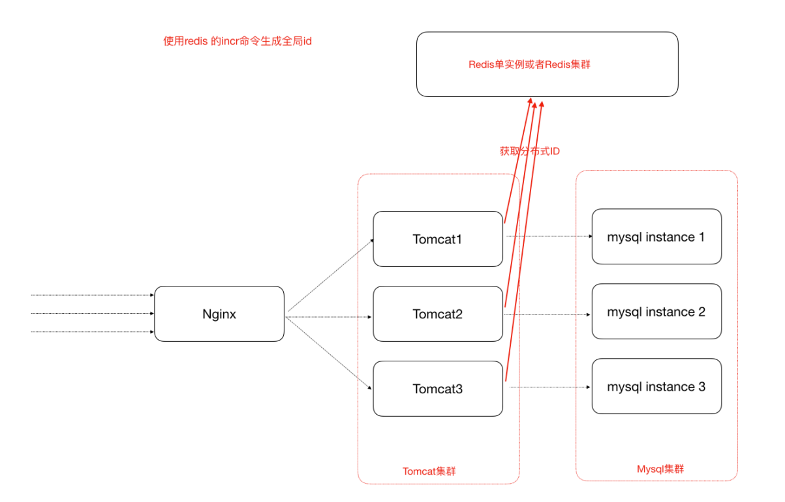
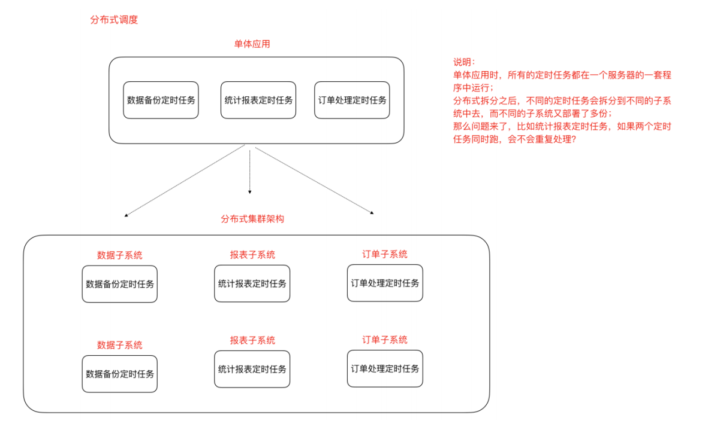

[toc]

## 一、分布式和集群的区别

分布式⼀定是集群，但是集群不⼀定是分布式

集群就是多个相同的实例一起工作（也就是复制），系统本身仍是一个单体

分布式是将⼀个系统拆分成多个子系统（也就是拆分）一起工作，必然也就是多个实例，子系统独立部署，各司其职



## 二、一致性Hash算法


## 三、集群时钟同步

### 1. 集群时间不同步带来的问题

电商业务中，新增⼀条订单，那么势必会在订单表中增加了⼀条记录，该条记录中应该会有“下单时间”这样的字段，往往我们会在程序中获取当前系统时间插⼊到数据库或者直接从数据库服务器获取时间。那我们的订单⼦系统是集群化部署，或者我们的数据库也是分库分表的集群化部署，然⽽他们的系统时钟却不⼀致，⽐如有⼀台服务器的时间是昨天，那么这个时候下单时间就成了昨天，那我们的数据将会混乱！如下



### 2. 集群时钟同步方案

集群时钟同步方案分以下三种情况，不过总体都是通过**NTP（Network Time Protocol）协议**完成同步

#### 2.1 分布式集群中各个服务器节点都可以连外⽹



##### 方案如下

服务器设置定时任务，crond，可以使⽤linux的定时任务，每隔10分钟或一天执⾏⼀次ntpdate命令

```sh
#使⽤ ntpdate ⽹络时间同步命令
ntpdate -u ntp.api.bz #从⼀个时间服务器同步时间
```

#### 2.2 分布式集群中某⼀个服务器可以连外⽹或者所有节点都不能够连外⽹



##### 方案如下

选集群中一台服务器作为时间服务器，若该服务器可以联网则与互联网同步时间，否则自行设置一个时间。其他服务器的时间通过NTP协议与该时间服务器保持一致。

以手动设置时间服务器时间为例，步骤如下

1. 设置好时间服务器A的时间

2. 把A配置为时间服务器（修改/etc/ntp.conf⽂件）

   ```yaml
   1、如果有 restrict default ignore，注释掉它
   2、添加如下⼏⾏内容
    restrict 172.17.0.0 mask 255.255.255.0 nomodify notrap # 放开局
   域⽹同步功能,172.17.0.0是你的局域⽹⽹段
    server 127.127.1.0 # local clock
    fudge 127.127.1.0 stratum 10
   3、重启⽣效并配置ntpd服务开机⾃启动
    service ntpd restart
    chkconfig ntpd on
   ```

   

3. 集群中其他节点可以从A服务器同步时间

   ```sh
   ntpdate 172.17.0.17
   ```

   

## 四、分布式id

### 1. 为什么需要分布式id

数据库分库分表也就是分布式的情况下，主键不能重复，所以需要全局唯一的id



### 2. 分布式id方案

#### UUID(可以⽤)

**UUID** 是通⽤唯⼀识别码

优点：产⽣重复 UUID 并造成错误的情况⾮常低

缺点：并且无序不可读，查询效率低

#### 独⽴数据库的⾃增ID

单独的创建⼀个Mysql数据库，在这个数据库中创建⼀张表，这张表的ID设置为⾃增，其他地⽅需要全局唯⼀ID的时候，就模拟向这个Mysql数据库的这张表中模拟插⼊⼀条记录，此时ID会⾃增，然后我们可以通过Mysql的select last_insert_id() 获取到刚刚这张表中⾃增⽣成的ID

当分布式集群环境中哪个应⽤需要获取⼀个全局唯⼀的分布式ID的时候，就可以使⽤代码连接这个数据库实例，执⾏如下sql语句即可。

```java
insert into DISTRIBUTE_ID(createtime) values(NOW());
select LAST_INSERT_ID()；
```

**注意：**

1. 这⾥的createtime字段⽆实际意义，是为了随便插⼊⼀条数据以⾄于能够⾃增id。

2. 使⽤独⽴的Mysql实例⽣成分布式id，虽然可⾏，但是性能和可靠性都不够好，因为你需要代码连接到数据库才能获取到id，性能⽆法保障，另外mysql数据库实例挂掉了，那么就⽆法获取分布式id了

3. 有⼀些开发者⼜针对上述的情况将⽤于⽣成分布式id的mysql数据库设计成了⼀个集群架构，那么其实这种⽅式现在基本不⽤，因为过于麻烦了

#### SnowFlake 雪花算法（可以⽤，推荐）

[Java实现SnowFlake](雪花算法的Java实现)

雪花算法是Twitter推出的⼀个⽤于⽣成分布式ID的策略。

雪花算法是⼀个算法，基于这个算法可以⽣成ID，⽣成的ID是⼀个long型，那么在Java中⼀个long型是8个字节，算下来是64bit，如下是使⽤雪花算法⽣成的⼀个ID的⼆进制形式示意：



另外，⼀切互联⽹公司也基于上述的⽅案封装了⼀些分布式ID⽣成器，⽐如滴滴的tinyid（基于数据库实现）、百度的uidgenerator（基于SnowFlake）和美团的leaf（基于数据库和SnowFlake）等，他们在。

#### 借助Redis的Incr命令获取全局唯⼀ID（推荐）

Redis Incr 命令将 key 中储存的数字值增⼀。如果 key 不存在，那么 key 的值会先被初始化为0，然后再执⾏ INCR 操作。

具体原理，后续学习Reids原理时再剖析



## 五、分布式调度问题

### 1. 定时任务场景

- 订单审核、出库
- 订单超时⾃动取消、⽀付退款
- 礼券同步、⽣成、发放作业
- 物流信息推送、抓取作业、退换货处理作业
- 数据积压监控、⽇志监控、服务可⽤性探测作业
- 定时备份数据
- ⾦融系统每天的定时结算
- 数据归档、清理作业
- 报表、离线数据分析作业

### 2. 什么是分布式调度 

- 调度任务集群化部署（同⼀个定时任务程序部署多份，应该有⼀个定时任务在执⾏）

- 分布式调度—>定时任务的分布式—>定时任务的拆分（即为把⼀个⼤的作业任务拆分为多个⼩的作业任务，同时执⾏）



### 3. 定时任务与消息队列的区别

#### 共同点

- 异步处理

  ⽐如注册、下单事件

- 应⽤解耦

  将两个应⽤之间实现应⽤解耦，可以中转数据，当然单体服务不需要考虑这些，服务拆分的时候往往都会考虑

- 流量削峰

  双⼗⼀的时候，任务作业和MQ都可以⽤来扛流量，后端系统根据服务能⼒定时处理订单或者从MQ抓取订单抓取到⼀个订单到来事件的话触发处理，对于前端⽤户来说看到的结果是已经下单成功了，下单是不受任何影响的

#### 本质不同

**定时任务是时间驱动，倾向于批处理**

**MQ是事件驱动，倾向于逐条处理**

时间驱动是不可代替的，⽐如⾦融系统每⽇的利息结算，不是说利息来⼀条（利息到来事件）就算⼀下，⽽往往是通过定时任务批量计算

所以，**定时任务作业更倾向于批处理**，**MQ倾向于逐条处理**；


### 4. 分布式调度框架**Elastic-Job**

[具体查看分布式调度方案](分布式调度问题)

## 六、分布式Session共享

