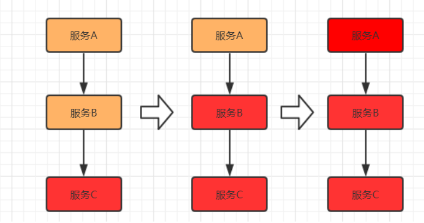

[toc]

### 一、服务协调（分布式锁实现）

==**分布式协调技术**==主要用来解决分布式环境当中==**多个进程之间的同步控制**==，让他们有序的去访问某种临界资源，防止造成”脏数据“的后果。

#### 1.分布式锁是**==分布式协调技术==**的实现，方式有以下两种

##### 1.1 基于缓存（Redis等）实现分布式锁

- 获取锁的时候，使用setnxex加锁锁，value值为一个随机生成的UUID标识上锁的客户端id，释放锁的时候进行判断。

  setnx：key不存在时，set成功；当key存在时，返回失败

  ex：设置ttl

  setnxex：是一个setnx和ex的原子性操作，防止ex失败导致死锁

- 释放锁的时候，通过UUID判断是不是该客户端，若是则执行delete进行锁释放。

  > delete ：删除key

##### 1.2 基于Zookeeper实现分布式锁

[查看zk应用场景](../SOA-分布式/Zookeeper-分布式协调器/zookeeper应用场景)

zk是一个天然的分布式协调器，znode节点的唯一性，保证了只有一个客户端能创建成功

- 创建一个目录mylock
- 线程A想获取锁就在mylock目录下创建临时顺序节点
- 获取mylock目录下所有的子节点，然后获取比自己小的兄弟节点，如果不存在，则说明当前线程顺序号最小，获得锁
- 线程B获取所有节点，判断自己不是最小节点，设置监听比自己次小的节点
- 线程A处理完，删除自己的节点，线程B监听到变更事件，判断自己是不是最小的节点，如果是则获得锁

##### 1.3 Redis分布式锁 和 ZK分布式锁的比较

**Redis是AP模型**，Redis Master执行命令后直接返回结果给客户端，之后才同步给Slaver（增量同步/命令传播到Slaver），Redis集群无法保证分布式锁的一致性。**不过Redis有个RedLock的概念，搭建RedisCluster，在所有Redis Master节点申请锁，当有超过半数成功的，则表示加锁成功。**

**ZK是CP模型**，当ZK集群接收到指令后，由Leader统一发号施令，当一半以上的Fllower执行并提交事务后，Leader才返回响应给客户端。极大的保证了分布式锁的一致性，但无法保证可用性。

### 二、服务流量削峰

互联网的业务场景中，例如，春节火车票抢购，大量的用户需要同一时间去抢购；以及大家熟知的阿里双11秒杀， 短时间上亿的用户涌入，瞬间流量巨大（高并发）

消息队列中间件主要解决应用耦合，异步消息， 流量削锋等问题。常用消息队列系统：目前在生产环境，使用较多的消息队列有 ActiveMQ、RabbitMQ、 ZeroMQ、Kafka、RocketMQ 等[查看消息中间件]()

#### 1. 流量削峰方案，有以下两种

##### 1.1 消息队列削峰

用消息队列来缓冲瞬时流量，把同步的直接调用转换成异步的消息推送，通过一个队列逐条处理消息

##### 1.2 流量削峰漏斗：层层削峰

分层过滤其实就是采用“漏斗”式设计来处理请求的，这样就像漏斗一样，尽量把数据量和请求量一层一层地过滤和减少了。如下图所示

分层过滤的核心思想

- 通过在不同的层次尽可能地过滤掉无效请求。

- 通过CDN过滤掉大量的图片，静态资源的请求。

- 再通过类似Redis这样的分布式缓存过滤请求

分层过滤的基本原则

- 对写数据进行基于时间的合理分片，过滤掉过期的失效请求。

- 对写请求做限流保护，将超出系统承载能力的请求过滤掉。

- 涉及到的读数据不做强一致性校验，减少因为一致性校验产生瓶颈的问题。

- 对写数据进行强一致性校验，只保留最后有效的数据。

### 三、服务降级

整个架构整体的负载超出了预设的上限阈值或即将到来的流量预计将会超过预设的阈值时，为了保证重要或基本的服务能正常运行，我们可以将一些 不重要 或 不紧急 的服务或任务进行服务的 **==延迟使用==**或 **==暂停使用==**

#### 1. 降级策略

##### 1.1 从架构全局的视角来看，降级处理方案

- 页面降级 —— 可视化界面禁用点击按钮、调整静态页面

- 延迟服务 —— 如定时任务延迟处理、消息入MQ后延迟处理

- 写降级 —— 直接禁止相关写操作的服务请求

  下游接口出现异常，可采用**有损、异步的降级处理方案**

  - 比如库存扣减接口异常，可先生成订单，但是提醒用户正在出库，但是有可能无库存需要排队
  - 比如视频/文章风控校验接口异常，可先发布但只能自己看，通过异步方式进行校验（如MQ分发、人工等）

- 读降级 —— 直接禁止相关读的服务请求

- 缓存降级 —— 使用缓存方式来降级部分读频繁的服务接口

##### 1.2 针对后端代码层面的降级处理策略

- 抛异常

- 返回NULL

- 调用Mock数据

- 调用Fallback处理逻辑

### 四、服务限流

限流的目的是通过对并发访问请求进行限速或者一个时间窗口内的的请求数量进行限速来保护系统，一旦达到限制速率则可以拒绝服务、排队或等待

#### 1. 限流算法策略

#### 2. 限流算法

##### 2.1 限流算法-计数器(固定窗口)

**==存在问题==**：客户端在第一分钟的59秒请求100次，在第二分钟的第1秒又请求了100次, 2秒内后端会受到200次请求的压力，形成了流量突刺

##### 2.2 限流算法-计数器(滑动窗口)

滑动窗口其实是细分后的计数器，它将每个时间窗口又细分成若干个时间片段，每过一个时间片段，整个时间窗口就会往右移动一格。**新的一格时间片段能接收的请求数 = 100 - 其他片段已接收的请求，*时间窗口划分的越细，滑动窗口的滚动就越平滑，限流的效果就会越精确**

##### 2.3 限流算法-漏桶

漏桶算法类似一个限制出水速度的水桶，通过一个固定大小FIFO队列+定时取队列元素的方式实现，请求进入队列后会被匀速的取出处理（桶底部开口匀速出水），当队列被占满后后来的请求会直接拒绝（水倒的太快从桶中溢出来）

**==优点：削峰填谷，不论请求多大多快，都只会匀速发给后端，不会出现突刺现象，保证下游服务正常运行==** 

**==缺点：在桶队列中的请求会排队，响应时间拉长==**

##### 2.4 限流算法-令牌桶

令牌桶算法是以一个恒定的速度往桶里放置令牌（如果桶里的令牌满了就废弃），每进来一个请求去桶里找令牌，有的话就拿走令牌继续处理，没有就拒绝请求

**==令牌桶的优点：应对突发流量，当桶里有令牌时请求可以快速的响应，也不会产生漏桶队列中的等待==**

**==令牌桶的缺点：相对漏桶一定程度上减小了对下游服务的保护==**

### 五、服务熔断

【熔断】, 熔断这一概念来源于电子工程中的断路器（Circuit Breaker）。在互联网系统中，当下游服务因访问压力过大而响应变慢或失败，上游服务为了保护系统整体的可用性，可以暂时切断对下游服务的调用。**这种牺牲局部，保全整体的措施就叫做熔断。**

一旦下游服务C因某些原因变得不可用，积压了大量请求，服务B的请求线程也随之阻塞。线程资源逐渐耗尽，使得服务B也变得不可用。紧接着，服务 A也变为不可用，整个调用链路被拖垮。

这种调用链路的**连锁故障**，叫做**==服务雪崩==**。

#### 1. 熔断机制

- 开启熔断

  在固定时间窗口内，接口调用超时比率达到一个阈值，会开启熔断。

  进入熔断状态后，后续对该服务接口的调用不再经过网络，直接执行本地的默认方法，达到服务降级的效果。

- 熔断恢复

   熔断不可能是永久的。当经过了规定时间之后，服务将从熔断状态回复过来，再次接受调用方的远程调用。

#### 2. 熔断实现方式有以下两种

##### 2.1 Spring Cloud Hystrix

- 熔断**关闭**状态（Closed）

  服务没有故障时，熔断器所处的状态，对调用方的调用不做任何限制。

- 熔断**开启**状态（Open）

  在==固定时间内（Hystrix默认是10秒）==，接口调用==出错比率达到一个阈值（Hystrix默认为50%）==，会进入熔断开启状态。进入熔断状态后， 后续对该服务接口的调用==不再经过网络，直接执行本地的fallback方法==。

- **半熔断**状态（Half-Open）

  在==进入熔断开启状态一段时间之后（Hystrix默认是5秒）==，熔断器会进入半熔断状态。所谓半熔断就是尝试恢复服务调用，允许有限的流量调用该服务，并监控调用成功率。如果成功率达到预期，则说明服务已恢复，进入熔断关闭状态；如果成功率仍旧很低，则重新进入熔断开启状态。

##### 2.2 Sentinel

- 通过并发线程数进行限制

- 通过响应时间对资源进行降级

- 系统负载保护

### 六、服务链路追踪

分布式链路追踪（Distributed Tracing），也叫分布式链路跟踪，分布式跟踪，分布式追踪 等等。

将一次分布式请求还原成调用链路。显示的在后端查看一次分布式请求的调用情况，比如各个节点上的耗时、请求具体打到了哪台机器上、每个服务节点的请求状态等等。

#### 1. 链路跟踪具备的作用

- 故障快速定位

  开发中可以在业务日志中添加调用链ID，可以通过调用链结合业务日志快速定位错误信息

- 各个调用环节的性能分析

  在调用链的各个环节分别添加调用时延，可以分析系统的性能瓶颈，可以进行针对性的优化。通过分析各个环节的平均时延，QPS等信息，可以找到系统的薄弱环节，对一些模块做调整。

- 数据分析

  调用链绑定业务后查看具体每条业务数据对应的链路问题，可以得到用户的行为路径，经过了哪些服务器上的哪个服务，汇总分析应用在很多业务场景。

- 生成服务调用拓扑图

  通过可视化分布式系统的模块和他们之间的相互联系来理解系统拓扑。点击某个节点会展示这个模块的详情，比如它当前的状态和请求数量

#### 2. 链路跟踪设计原则

##### 2.1 设计目标

- 低侵入性，应用透明

- 低损耗

- 大范围部署，扩展性

##### 2.2 埋点和生成日志

埋点即系统在当前节点的上下文信息，可以分为客户端埋点、服务端埋点，以及客户端和服务端双向型埋点。埋点日志通常要包含以下内容：

 TraceId、RPCId、调用的开始时间，调用类型，协议类型，调用方ip和端口，请求的服务名等信息；调用耗时，调用结果，异常信息，消息报文等

##### 2.3 抓取和存储日志

日志的采集和存储有许多开源的工具可以选择，一般来说，会使用离线+实时的方式去存储日志，主要是分布式日志采集的方式。典型的解决方案如Flume结合Kafka。 

##### 2.4 分析和统计调用链数据

一条调用链的日志散落在调用经过的各个服务器上，首先需要按 TraceId 汇总日志，然后按照RpcId 对调用链进行顺序整理。调用链数据不要求百分之百准确，可以允许中间的部分日志丢失。

##### 2.5 计算和展示

汇总得到各个应用节点的调用链日志后，可以针对性的对各个业务线进行分析。需要对具体日志进行整理，进一步储存在HBase或者关系型数据库中，可以进行可视化的查询。

#### 3. 链路跟踪Trace模型

| 术语             | 解释                                                         |
| ---------------- | ------------------------------------------------------------ |
| Trace            | 一次完整的分布式调用跟踪链路                                 |
| Span             | 跟踪服务调用基本结构，表示跨服务的一次调用； 多span形成树形结构，组合成一次Trace追踪记录 |
| Annotation       | 在span中的标注点，记录整个span时间段内发生的事件:                                                                 Cs CLIENT_SEND，客户端发起请求                                                                                                     Cr CLIENT_RECIEVE，客户端收到响应                                                                                                Sr SERVER_RECIEVE，服务端收到请求                                                                                                                          Ss SERVER_SEND，服务端发送结果 |
| BinaryAnnotation | 可以认为是特殊的Annotation，用户自定义事件:                                                                        Event 记录普通事件                                                                                                                                                          Exception 记录异常事件 |

#### 4. 链路跟踪系统实现:

大的互联网公司都有自己的分布式跟踪系统，比如==**Google的Dapper，Twitter的zipkin，淘宝的鹰眼，新浪的Watchman，京东的Hydra**==等等

