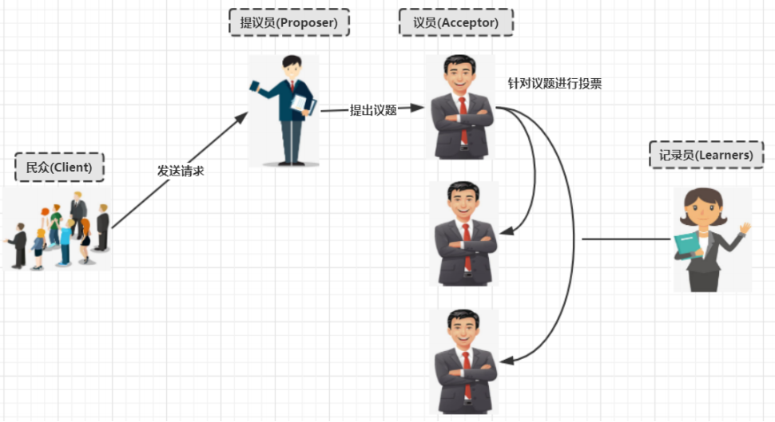
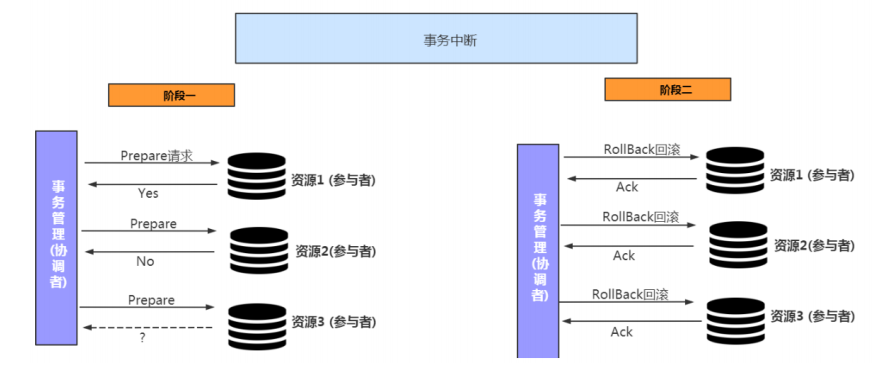

[toc]

# 分布式理论基础

## 数据一致性

#### 1. 数据一致性的难点

分布式系统中，数据往往会有**==多个副本==**，多个副本就需要**==保证数据的一致性==**。

这就带来了同步的问题，因为网络延迟等因素，**==几乎没法保证可以同时更新所有节点的备份数据==**，就会有数据不一致的情况

由于无法找到一种能够满足分布式系统中数据一致性解决方案。因此，**==如何既保证数据的一致性，同时又不影响系统运行的性能==**，是每一个分布式系统都需要重点考虑和权衡的。于是，一致性级别由此诞生

#### 2. 一致性的分类

##### 2.1 强一致性（实时）

在**==写操作完成后开始的任何读操作都必须返回该值==**，或者后续写操作的结果。也就是说，在强一致性系统中，一旦客户端将值写入任何一台服务器，该服务器再将数据同步到集群中其他的服务器，同步完成后响应给客户端写操作完成，那么之后client从其他任何服务器读取的都是刚写入的数据

这种一致性级别是最符合用户直觉的，它要求系统写入什么，读出来的也会是什么，用户体验好，但实现起来往往对系统的性能影响大。但是强一致性很难实现。

##### 2.2 弱一致性

这种一致性级别约束了系统在写入成功后，不承诺立即可以读到写入的值，也不承诺多久之后数据能够达到一致，但会尽可能地保证到某个时间级别（比如秒级别）后，数据能够达到一致状态。

##### 2.3 最终一致性（允许延时）

**最终一致性也是弱一致性的一种**，它无法保证数据更新后，所有后续的访问都能看到最新数值，而是需要一个时间，在这个时间之后可以保证这一点（**就是在一段时间后，节点间的数据会最终达到一致状态**），而在这个时间内，数据也许是不一致的，这个系统无法保证强一致性的时间片段被称为「不一致窗口」。不一致窗口的时间长短取决于很多因素，比如备份数据的个数、网络传输延迟速度、系统负载等。

## CAP理论（强一致性）

**==CAP定理（CAP theorem），又被称作布鲁尔定理（Brewer's theorem）==**

它指出对于一个分布式计算系统来说，不可能同时满足以下三点

- 一致性（Consistency）

  **==CAP理论的C是强一致性==**，所有节点访问时都是同一份最新的数据副本

- 可用性（Availability）

  **==即使集群中的部分节点故障后，集群仍然可以提供服务并正常的响应==**，但是不保证获取的数据为最新数据

- 分区容错性（Partition tolerance）

  分布式系统**==出现网络分区后，仍然能够对外提供满足一致性 或者 可用性的服务==**，除非整个网络环境都发生了故障，分布式架构的分区容错性是必须要保证的

#### 1. CAP不可同时满足论证

假如出现网络分区，集群要同时满足强一致性和可用性

1. 出现分区后，客户端向G1写入V1数据，由于G1和G2网络不同无法同步数据

2. 若要满足可用性，所以集群的G1和G2都能提供服务，却无法满足数据一致性

3. 若要满足数据一致性，分区后的集群进行服务降级，只读不写，能保证数据一致性，但无法满足可用性

#### 2. CAP如何权衡

| 组合 | 描述                                                         |
| ---- | ------------------------------------------------------------ |
| CA   | 放弃分区容错性，加强一致性和可用性，其实就是传统的单机数据库的选择 |
| AP   | 放弃一致性(这里说的是强一致性)，追求分区容错性和可用性，这是很多分布式系统设计时的选择，例如很多NoSQL系统就是如此 |
| CP   | 放弃可用性，追求一致性和分区容错性，基本不会选择，网络问题会直接让整个系统不可以 |

- 对于互联网应用来说，机器数量庞大，节点分散，网络故障再正常不过了，那么此时就是保障AP，放弃C的场景，而从实际中理解，像网站这种偶尔没有一致性是能接受的，但不能访问问题就非常大了
- 对于银行来说，就是必须保证强一致性，也就是说C必须存在，那么就只用CA和CP两种情况，当保障强一致性和可用性（CA），那么一旦出现通信故障，系统将完全不可用。另一方面，如果保障了强一致性和分区容错（CP），那么就具备了部分可用性。实际究竟应该选择什么，是需要通过业务场景进行权衡的（并不是所有情况都是CP好于CA，只能查看信息但不能更新信息有时候还不如直接拒绝服务）

## BASE理论（最终一致性）

**==Base 理论是对 CAP 中一致性和可用性权衡的结果==**，其来源于对大型互联网分布式实践的总结，是基于 CAP 定理逐步演化而来的。

其核心思想是：**即使无法做到强一致性，但应用可以采用适合的方式达到最终一致性**

- **Basically Available(基本可用)**

  相对于系统正常功能，基本可用指的是当出现系统故障时，对服务进行降级处理

  - 响应时间上的损失：正常情况下的搜索引擎 0.5 秒即返回给用户结果，而**基本可用**的搜索引擎可以在 1 秒返回结果

  - 功能上的损失：在一个电商网站上，正常情况下，用户可以顺利完成每一笔订单，但是到了大促期间，为了保护购物系统的稳定性，部分消费者可能会被引导到一个降级页面

  

- **Soft state（软状态）**

  硬状态：要求多个节点的数据副本都是一致的

  软状态指的是：允许系统在多个不同节点的数据副本存在数据延时（短时间内），并认为该状态不会影响系统的整体可用性

- **Eventually consistent（最终一致性）**

  经过软状态后，数据的最终状态应该是一致的

## CAP与BASE

BASE：保证事务的原子性和持久性，为了保证系统的可用性、性能和服务降级的需求，降低了对一致性和隔离性的要求。

BASE 解决了 CAP 理论中没有考虑到的网络延迟问题，在BASE中用软状态和最终一致，保证了延迟后的一致性

# 分布式一致性协议及算法

## NWR协议

NWR是一种在分布式存储系统中用于控制一致性级别的一种策略。在亚马逊的云存储系统中，就应用NWR来控制一致性。

- N：在分布式存储系统中，有多少份备份数据（分布式系统中N往往不能为1，工业界标准为3）

- W：代表一次成功的更新操作要求至少有w份数据写入成功

- R： 代表一次成功的读数据操作要求至少有R份数据成功读取

#### 1. 原理

NWR值的不同组合会产生不同的一致性效果，当W+R>N的时候，整个系统对于客户端来讲能保证强一致性。

##### 1.1 当W+R > N的时

如果R+W>N,则读取操作和写入操作成功的数据一定会有交集（如图中的Node2），这样就可以保证一定能够读取到最新版本的更新数据，数据的强一致性得到了保证

##### 1.1 当W+R <= N的时

因为成功写和成功读集合可能不存在交集，这样读操作无法读取到最新的更新数值，也就无法保证数据的强一致性。R或者W设置的越大，则系统延迟越大，因为这取决于最慢的备份数据的响应时间。

## Gossip协议(著名的多主协议)

gossip 协议利用一种随机的方式将信息传播到整个网络中，并在一定时间内使得系统内的所有节点数据一致。Gossip 是一种去中心化思路的分布式协议，解决状态在集群中的传播和状态一致性的保证两个问题

数据通过节点像病毒一样逐个传播。因为是指数级传播，整体传播速度非常快。

#### 1. 原理

Gossip 协议的消息传播方式有两种：反熵传播 和 谣言传播

- 反熵传播

  保证最终、完全的一致。缺点是消息数量非常庞大，且无限制；通常只用于新加入节点的数据初始化。

-  谣言传播

  谣言消息在某个时间点之后会被标记为 removed，并且不再被传播。

  缺点是系统有一定的概率会不一致，通常用于节点间数据增量同步

#### 2. 通信方式

Gossip 协议最终目的是将数据分发到网络中的每一个节点。**根据不同的具体应用场景，网络中两个节点之间存在三种通信方式：推送模式、拉取模式、推/拉模式**

- Push

  节点 A 将数据 (key,value,version) 推送给 B 节点，B 节点更新 A 中比自己新的数据

  

- Pull

  A 仅将数据 (key, version) 推送给 B，B 将本地比 A 新的数据（Key, value, version）推送给 A，A 更新本地

  

- Push/Pull

  与 Pull 类似，只是多了一步，A 再将本地比 B 新的数据推送给 B，B 则更新本地

#### 3. 优缺点

Gossip 协议适合于**AP场景的数据一致性处理**，常见应用有：P2P 网络通信、RedisCluster、Consul。

优点

- 扩展性强，允许任意节点新增/删除
- 去中心化，只要网络连通，任意节点可把消息散播到全网

- 最终一致性，信息指数级的快速传播，在有新信息需要传播时，消息可以快速地发送到全局节点

缺点

- 消息延迟
- 消息冗余

## Paxos协议（解决分布式系统共识问题-2PC/3PC中单协调者故障问题）

Paxos协议就是Paxos算法, Paxos算法是基于==**消息传递**==且具有==**高度容错特性**==的==**一致性算法**==，是目前公认的==**解决分布式一致性（共识）问题最有效的算法**==。（世界上**只有一种分布式一致性算法，那就是Paxos**，其它的算法都是**残次品**。）

Paxos由 莱斯利·兰伯特(Leslie Lamport)于1998年在《The Part-Time Parliament》论文中首次公开，最初的描述使用希腊的一个小岛Paxos，描述了Paxos小岛中通过决议的流程，并以此命名这个算法，但是这个描述理解起来比较有挑战性。后来在2001年，莱斯利·兰伯特重新发表了朴实的算法描述版本《Paxos Made Simple》 

自Paxos问世以来就==**持续垄断了分布式一致性算法**==，Paxos这个名词几乎等同于分布式一致性。Google的很多大型分布式系统都采用了Paxos算法来解决分布式一致性问题，如Chubby、Megastore以及Spanner等。开源的==**ZooKeeper**==，以及MySQL 5.7推出的用来取代传统的==**主从复制的MySQL Group Replication**==等纷纷采用**==Paxos算法解决分布式一致性问题==**。然而，Paxos的最大特点就是难，不仅难以理解，更难以实现

#### 1. Paxos解决什么问题

通过paxos实现多个副本节点达成共识，选举出新的协调者，解决分布式事务一致性带来的可用性问题（2PC单协调者故障）

Paxos算法解决的问题是上述多个协议无法解决的问题。即**分布式系统发生诸如机器宕机**或**网络异常**（包括消息的延迟、丢失、重复、乱序，还有网络分区）等情况，如何在一个可能发生上述异常的分布式系统中，快速且正确地在集群内部对**某个数据的值**达成**共识**，并且保证不论发生以上任何异常，都不会破坏整个系统的一致性。

上述2PC 和 3PC的，在一定程度上是可以解决数据一致性问题的. 但是并没有完全解决就是协调者宕机的情况。

#### 2. 解决方案

##### 2.1 引入协调者集群，并设置一个主协调者

##### 2.2 引入主协调者,以他的命令为基准

其实在引入多个协调者之后又引入主协调者.那么这个就是最简单的一种Paxos 算法

Paxos的版本有: Basic Paxos , Multi Paxos, Fast-Paxos, 具体**==落地有Raft 和zk的ZAB协议==**

#### 3. Basic-Paxos

##### 3.1 Basic-Paxos模型

##### 3.2 basic paxos流程

- Prepare（Proposer第一次请求）

  Proposer提出一个提案,编号为N, 此N大于这个Proposer之前提出所有提出的编号, 请求Accpetor的多数人接受这个提案

- Promise

  如果编号N大于此Accpetor之前接收的任意提案编号则接收并响应给Proposer， 否则拒绝

- Accept（Proposer第二次请求）

  如果达到多数派, Proposer会发出accept请求, 此请求包含提案编号和对应的内容

- Accepted

  如果此Accpetor在此期间没有接受到任何大于N的提案，则接收此提案内容, 否则忽略

##### 3.3 无故障的basic paxos时序图

1. Client发起一个修改V=1的请求
2. Proposer接收请求，发起一个编号=1的提议给Accpetor集群
3. Accpetor接收到提议并与上次的提议编号（初始为0）进行比较，若大于上次并且多数Accpetor同意，则Accpetor将请求提议保存
4. Proposer发起第二次请求，携带提议编号和修改内容给Accpetor集群
5. Accpetor比较提议编号是否为为最新的，是的话则接收修改内容

##### 3.4 Acceptor失败时的basic paxos时序图

在下图中，多数派中的一个Acceptor发生故障，因此多数派大小变为2。在这种情况下，BasicPaxos协议仍然成功。

##### 3.5 Proposer失败时的basic paxos时序图

Proposer在提出提案之后但在达成协议之前失败。具体来说，传递到Acceptor的时候失败了,这个时候需要选出新的Proposer（提案人）,那么 Basic Paxos协议仍然成功

##### 3.6 当多个提议者发生冲突时的basic Paxos

最复杂的情况是多个Proposer都进行提案,导致Paxos的活锁问题

**针对活锁问题解决起来非常简单：只需要在每个Proposer再去提案的时候随机加上一个等待时间即可**

#### 4. Multi-Paxos

针对basic Paxos是存在一定得问题,首先就是流程复杂,实现及其困难, 其次效率低(达成一致性需要2轮RPC调用),针对basic Paxos流程进行拆分为选举和复制的过程. 

##### 4.1 第一次流程-确定Leader

- Proposer还是会进行两次RPC调用Acceptor，目的是给Acceptor提供一个Leader选举的时机
- 事务的状态和修改由Leader决定，其他Acceptor附议和复制修改结果

##### 4.2 第二次流程-直接由Leader确认

发起过一次事务提交请求后，由于在第一次请求中确认了Leader，所以后续的请求直接由Leader决定

##### 4.3 Multi-Paxos角色重叠流程图

Multi-Paxos在实施的时候会将Proposer，Acceptor和Learner的角色合并统称为“服务器”。因此，最后只有“客户端”和“服务器”。

## Raft协议（Paxos的具体实现，解决分布式系统共识问题-2PC/3PC中单协调者故障问题）

Paxos协议的出现为分布式强一致性提供了很好的理论基础，但是Paxos协议理解起来较为困难，实现比较复杂。

然后斯坦福大学RamCloud项目中提出了易实现，易理解的分布式一致性复制协议 Raft。Java，C++，Go 等都有其对应的实现之后出现的Raft相对要简洁很多。引入主节点，通过竞选确定主节点。节点类型：**Follower、Candidate 和 Leader**

**==Leader 会周期性的发送心跳包给 Follower==**。每个 Follower 都设置了`一个随机的竞选超时时间`，一般为 150ms~300ms，如果**==在这个时间内没有收到 Leader 的心跳包，就会变成 Candidate==**，进入竞选阶段, **==通过竞选阶段的投票多的人成为Leader==**

设置一个**随机的竞选超时时间**，这是**解决活锁问题的经典解决方案。**

#### 1. 状态

- Leader（主节点）

  接受 client 更新请求，写入本地后，然后同步到其他副本中

- Follower（从节点）

  从 Leader 中接受更新请求，然后写入本地日志文件。对客户端提供读请求

- Candidate（候选节点）

  如果 follower 在一段时间内未收到 leader 心跳。则判断 leader可能故障，发起选主提议。节点状态从 Follower 变为 Candidate 状态，直到选主结束

- termId（任期号）

  每次选举后都会产生一个新的 termId，一个任期内只有一个 leader

#### 2. 竞选阶段流程 

这个是Raft完整版http://thesecretlivesofdata.com/raft/动画演示

1. 分布式系统的最初阶段，只有 Follower，没有 Leader。**==Follower A 等待一个随机的竞选超时时间之后==**，没收到 Leader 发来的心跳包，**==最先进入竞选阶段==**。

   

2. 最先进入竞选阶段的 **==A 发送投票请求给其它所有节点==**

   

3. 其它节点会对请求进行回复，如果**==超过一半的节点回复了==**，那么 **==Candidate A就会变成 Leader==**

   

4. 之后 Leader 会周期性地发送心跳包给 Follower，**==Follower 接收到心跳包==**，**==会重新开始计时==**

   

#### 3. 多个 Candidate 竞选

1. 如果有多个 Follower 成为 Candidate，并且所获得票数相同，那么就需要重新开始投票

   

2. 当重新开始投票时，由于每个节点设置的随机竞选超时时间不同，因此能下一次再次出现多个Candidate 并获得同样票数的概率很低

   

#### 4. 日志复制

1. 来自客户端的修改都会被传入 Leader。注意该修改还未被提交，只是写入日志中

   

2. Leader 会把修改复制到所有 Follower

   

3. Leader 会等待大多数的 Follower 也进行了修改，收到大多数反馈后，然后才将修改提交

   

4. Leader 会通知的所有 Follower 让它们也提交修改，此时所有节点的值达成一致

   

#### 5. 网络分区

1. 最初始正常情况下状态,Leader B节点会对其他4个节点发送心跳

   

2. 集群出现网络分区情况，Leader B只能对 A 发送心跳，同时其他三个节点会再次选出一个leader节点

   

3. 网络分区导致集群脑裂，不过少数派的集群将无法提交事务，多数派可正常工作

   

#### 6. 网络分区后恢复

1. 出现网络分区，导致两个集群数据不同，但只有多数派的集群可正常提交事务

2. 网络恢复后，Termid 最大的Leader成为新集群的Leader，重新同步节点数据，达成数据一致性

   

## Lease机制

Lease机制，翻译过来即是租约机制，是一种在分布式系统常用的协议

Lease机制有以下几个特点：

- Lease是颁发者对一段时间内数据一致性的承诺；

- 颁发者发出Lease后，不管是否被接收，只要Lease不过期，颁发者都会按照协议遵守承诺；

- Lease的持有者只能在Lease的有效期内使用承诺，一旦Lease超时，持有者需要放弃执行，重新申请Lease

#### 1. Lease的原理

##### 1.1 引入中心节点负责下发Lease

##### 1.2 出现网络问题

在01:05期间如果出现网络抖动导致其他节点申请Lease会申请失败, 因为中心节点在01:10之前都会承认有主节点,不允许其他节点在申请Lease

##### 1.3 如果网络恢复

##### 1.4 如果到01:10时间,主节点会进行续约操作,然后在下发新的Lease

##### 1.5 如果主节点宕机,其他节点申请Lease也会失败,承认主节点存在

##### 1.6 副节点申请Lease,申请成功. 因为Lease过期

#### 2. lease的容错

**==lease时间长短一般取经验值1-10秒即可。太短网络压力大，太长则收回承诺时间过长影响可用性。==**

- 主节点宕机

  lease机制天生即可容忍网络、lease接收方的出错，时间即Lease剩余过期时长

- 中心节点异常

  颁发者宕机可能使得全部节点没有lease，系统处于不可用状态，解决的方法就是使用一个小集群而不是单一节点作为颁发者。

- 时差问题

  中心节点与主节点之间的时钟可能也存在误差，只需要中心节点考虑时钟误差即可

#### 3. 应用

- GFS(Google 文件系统)

  Master通过lease机制决定哪个是主副本，lease在给各节点的心跳响应消息中携带。收不到心跳时，则等待lease过期，再颁发给其他节点。

- chubby

  paxos选主后，从节点会给主颁发 lease，在期限内不选其他节点为主。另一方面，主节点给每个client节点发送lease，用于判断client死活。

# 分布式事务一致性

分布式事务，主要是实现分布式环境中一条请求链路下多个服务的事务的原子性，以保证事务的一致性

涉及分布式事务的主要有以下两种情况：

- **分库分表场景**，事务跨越多个库导致分布式事务
- **微服务场景**，事务跨越多个服务（每个服务由独立的数据库）

分布式事务可分为柔性事务和刚性事务，柔性满足[BASE理论](#BASE理论（最终一致性）)，刚性满足[CP理论](#CAP理论（强一致性）)。分别包含以下种类

- 柔性事务（最终一致）
  - 消息补偿、消息表
  - 最大努力通知型（MQ事务）
  - TCC
  - saga
- 刚性事务（强一致）
  - 2PC
  - XA

## 消息补偿事务（最终一致，异步体验好）

核心思想：将分布式事务拆分成本地事务进行处理，通过消息日志的方式来异步执行

1. 系统收到下单请求，将**订单业务数据存入到订单库**中，并且**同时存储该订单对应的消息数据**，比如购买商品的 ID 和数量，**消息数据与订单库为同一库，更新订单和存储消息为一个本地事务**，要么都成功，要么都失败。**发送消息到MQ**
2. **库存服务通过 MQ 收到库存更新消息**，调用库存服务进行业务操作，将 **处理结果写入 MQ**。
3. 消息生产方**订单服务收到处理结果后**，将**本地消息表的数据删除或者设置为已完成**。
4. 设置异步任务，定时去扫描本地消息表，发现有未完成的任务则重试，保证最终一致性。

**发送消息，可结合MQ事务，如下**

Kafka和RocketMQ 都支持事务的操作，其中RocketMQ**提供事务反查的机制**来解决事务消息提交失败的情况。而Kafka事务消息提交失败则会抛异常，需要开发编写重试代码。

RocketMQ 事务消息功能实现分布式事务的流程如下：

## 2PC-两阶段提交协议（强一致、阻塞）

2PC是比较常用的**==解决分布式事务问题==**的方式，要么所有参与进程都提交事务，要么都取消事务，即实现ACID中的原子性(A)的常用手段将事务的提交过程分为两个阶段来进行处理。事务的发起者称协调者，事务的执行者称参与者，协调者统一协调参与者执行。

- **阶段 1：prepare**

  - 事务询问

    协调者向所有参与者发送事务内容，询问**是否可以提交事务**，并**等待所有参与者反馈**

  - 执行事务

    所有参与者执行事务，但不提交，将undo和redo 写入日志缓存

  - **若协调者等待超时（只要有参与者没反馈）** 或者 **只要有一个参与者返回no：**

    协调者向所有参与者发送**rollback请求回滚（阶段2）**，参与者接收到abort请求之后，**根据undo日志进行回滚操作**， 并在完成回滚之后释放所有的事务资源。事务回滚之后，向协调者发送ACK消息。协调者接收到所有参与者反馈的ACK消息之后，执行事务的中断。

    

  - 若**所有参与者返回yes**

    则进入commit阶段

    

- **阶段 2：commit**

  - 发送commit请求

    参与者收到commit请求后，提交事务并释放资源。然后给协调者反馈ACK。

  - **若协调者等待超时（只要有参与者没反馈）**

    不断重试发起commit请求（次数有限）

#### 3. 问题

- **同步阻塞：**由于**参与者没有超时策略**，所以在commit阶段发生网络问题时，**参与者会一直阻塞无法释放资源**

- **单点问题：（可通过paxos共享算法，选举新的协调者）**如果协调者存在单点故障问题，如果协调者出现故障，参与者将一直处于锁定状态。

- 空回滚：由于网络问题，RM未收到一阶段或者收到一阶段尚未处理完，就收到了二阶段的回滚指令

  空回滚无法避免，影响也不大

  

- **一阶段悬挂导致数据不一致：**由于网络问题，多种情况导致悬挂

  - RM空回滚后，此时又收到了一阶段（网络拥堵导致延时）

    有回滚记录，拒绝一阶段

  - RM只收到一阶段，一直未收到二阶段

    TC会一直重试发送指令（有限制），直到RM要么提交要么回滚

  

## 3PC-三阶段提交协议（强一致，但是成本太高暂无实现）

3PC 三阶段提交，是两阶段提交的改进版本，**同时在协调者和参与者中都引入超时机制**。但**由于实现成本太高，市面上暂无3PC的实现**

3PC将2PC中的 **Prepare准备阶段 拆分成了CanCommit 和 PreCommit**。CanCommit 阶段确定参与者是否是可提交的状态

- **阶段1：canCommit**

  - **发送canCommit事务询问：**

    协调者向参与者发送CanCommit请求。询问是否可以执行提交操作。然后开始**等待所有参与者的响应**。

  - **若该阶段协调者等待超时（只要有参与者没反馈）** 或者 **只要有一个参与者返回no：**

    协调者向所有参与者发送**abort请求中断事务**

  - **所有参与者返回yes**

    参与者接到CanCommit请求之后，正常情况下， 如果其自身认为可以顺利执行事务，则返回Yes响应，并进入precommit状态。 

- **阶段2：preCommit**

  - **发送preCommit事务请求**

    协调者向所有参与者发出 preCommit 请求，参与者收到preCommit 请求后，执行事务操作，但不提交；将 undo 和 redo 信息记入事务日志中；各参与者向协调者反馈 yes 响应或 no 响应，并等待最终指令。

  - **若参与者等待超时，未收到协调者的请求时，则中断事务**

  - **若该阶段协调者等待超时（只要有参与者没反馈）** 或者 **只要有一个参与者返回no：**

    协调者向所有参与者发送**rollback请求回滚**，参与者接收到abort请求之后，**根据undo日志进行回滚操作**， 并在完成回滚之后释放所有的事务资源。事务回滚之后，向协调者发送ACK消息。协调者接收到所有参与者反馈的ACK消息之后，执行事务的中断。

  - **所有参与者返回yes**

    进入docommit状态。 

- **阶段3：doCommit（必须被保证成功）**

  - **发送doCommit事务请求**

    协调者向所有参与者发送doCommit请求，参与者接收到doCommit请求之后，执行事务提交。 并在完成事务提交之后释放所有事务资源。事务提交完之后，向协调者发送ACK响应。协调者接收到所有参与者的ACK响应之后，完成事务。

  - **该阶段参与者等待超时，未收到协调者的请求时，会自动执行事务的提交**

#### 1. 问题

- **单点问题：（可通过paxos共享算法，选举新的协调者）**

  协调者挂了，导致整个分布式系统的事务失效

  

## 2PC与3PC的比较

#### 1. 3PC改进后的优势

- **参与者引入超时策略**

  - precommit阶段未收到协调者指令，则中断事务；

  - docommit阶段未收到协调者指令，则自动提交事务

#### 2. 2PC的劣势

**参与者无超时策略**，所以存在空回滚和悬挂的情况

- 空回滚：由于网络问题，RM未收到一阶段或者收到一阶段尚未处理，就收到了二阶段的回滚指令

  空回滚无法避免，影响也不大

  

- 悬挂：由于网络问题，多种情况导致悬挂

  - RM一阶段被拥堵，收到了二阶段的回滚，此时又收到了一阶段。
  - RM只收到一阶段，一直未收到二阶段。

  TC会一直重试发送指令（有限制），直到RM要么提交要么回滚

  

# 分布式事务模式

## XA 模式（强一致，基于2PC协议，基于数据库本地事务）

XA**基于2PC协议**。 XA规范主要定义了全局事务管理器（TM）和局部资源管理器（RM）之间的接口。目前主流的关系型数据库产品都是实现了XA接口。代码无侵入性，由代理自动开、提交、回滚事务

## TCC 模式（最终一致，基于2PC协议，基于业务层应用）

TCC 模式需要⽤户根据自己的业务场景实现Try、Confirm 和 Cancel 三个操作。

事务发起方在一阶段 执行 Try 方式，在⼆阶段提交执行 Confirm⽅法，⼆阶段回滚执⾏ Cancel 方法

- Try：资源的检测和预留；

- Confirm：执⾏的业务操作提交；要求 Try 成功 Confirm ⼀定要能成功；

- Cancel：预留资源释放。

**以”扣钱“场景进行说明：**

在接⼊ TCC 前，对 A 账户的扣钱，只需⼀条更新账户余额的 SQL 便能完成；但是在接⼊ TCC 之后，⽤户就需要考虑如何将原来⼀步就能完成的扣钱操作，拆成两阶段，实现成三个方法，并且保证⼀阶段 Try 成功的话 ⼆阶段 Confirm ⼀定能成功。

- Try 要做的事情是就是检查账户余额是否充足，预留转账资⾦，预留的⽅式就是冻结 A 账户的 转账资⾦。Try 方法执行之后，账号 A 余额虽然还是 100，但是其中 30 元已经被冻结了，不能被其他事务使⽤
- Confirm 方法执行真正的扣钱操作。Confirm 会使⽤ Try 阶段冻结的资⾦，执⾏账号扣款。Confirm 方法执行之后，账号 A 在一阶段中冻结的 30 元已经被扣除，账号 A 余额变成 70 元 。
- 如果⼆阶段是回滚的话，就需要在 Cancel 方法内释放⼀阶段 Try 冻结的 30 元，使账号 A 的回到初始状态，100 元全部可⽤

**TCC模式的难度及效果**

由于需要用户自己实现try（预留资源）、Confirm（提交事务）和Cancel（撤销事务）三个方法，所以**代码具有较多的侵入性**。但由于TCC在try阶段就已经执行并提交了事务，所以**TCC并不需要加全局事务的行锁**，所以**性能优于AT模式**。并且TCC通过cancel方法撤销事务，所以也无需生成undo日志

## Saga 模式（最终一致）

在 Saga 模式下，分布式事务内有多个参与者，每⼀个参与者都是⼀个冲正补偿服务，需要⽤户根据业务场景**实现其正向操作和逆向回滚操作**

分布式事务执⾏过程中，依次执⾏各参与者的正向操作，如果所有正向操作均执⾏成功，那么分布式事务提交。如果任何⼀个正向操作执⾏失败，那么分布式事务会去退回去执⾏前⾯各参与者的逆向回滚操作，回滚已提交的参与者，使分布式事务回到初始状态。

**适用场景**

- 业务流程⻓、业务流程多

- 参与者包含第三⽅公司或遗留系统服务，⽆法提供 TCC 模式要求的三个接⼝

- 典型业务系统：如⾦融⽹络（与外部⾦融机构对接）、互联⽹微贷、渠道整合等业务系统

## Seata 框架

[分布式事务解决方案-原生Seata](../微服务架构/SCA/SCA-Seata分布式事务)

含AT模式和TCC模式案例
