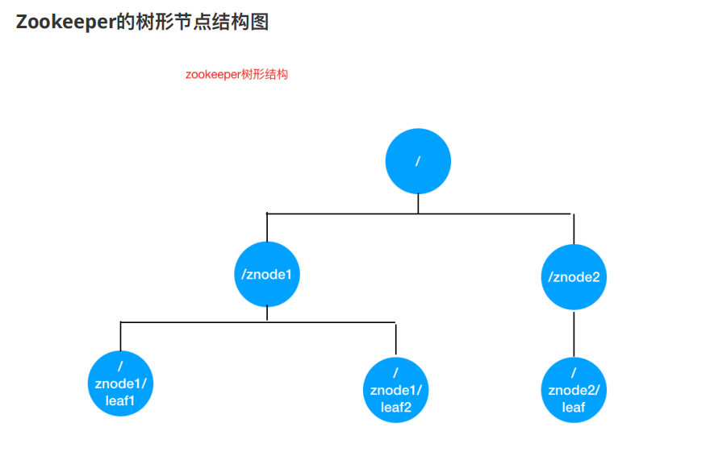
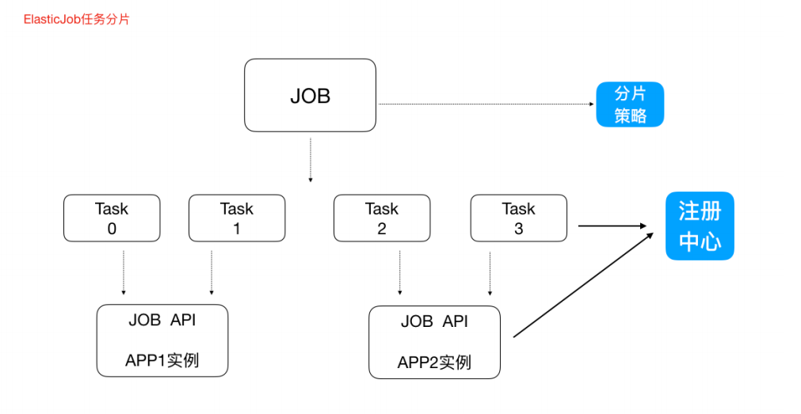
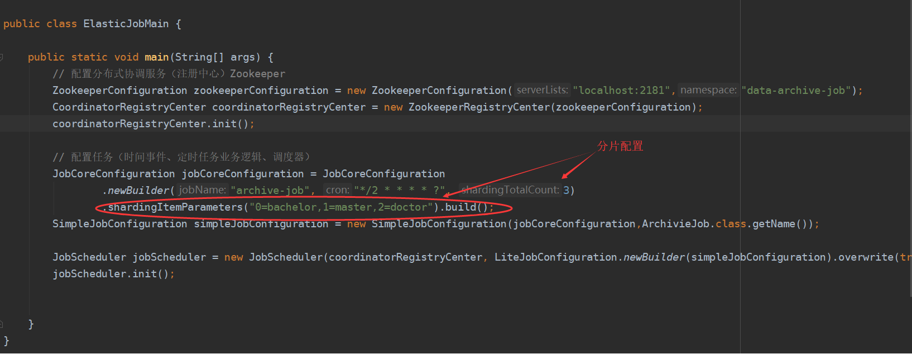
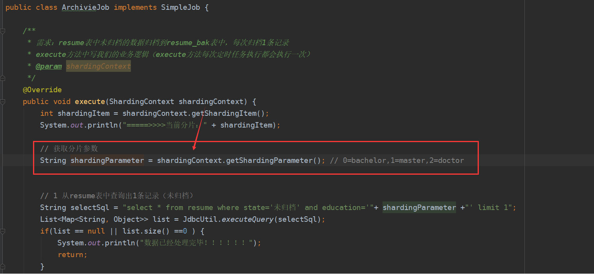
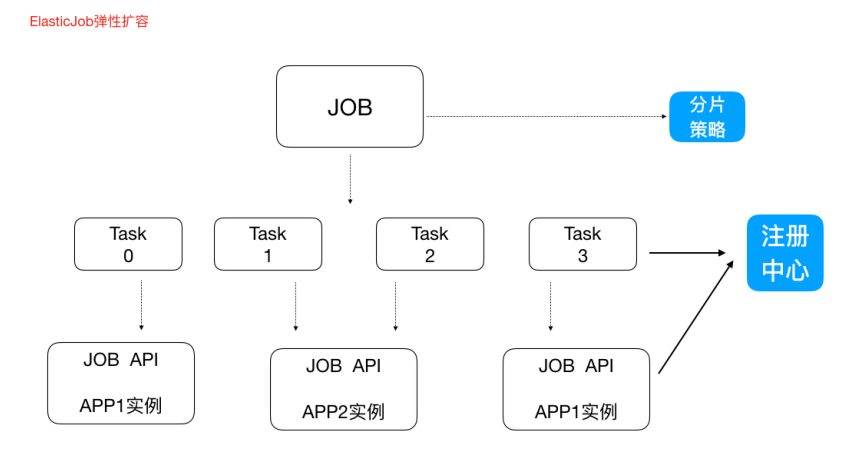

[toc]

### 一、原生定时任务Quartz

#### 1. 引入依赖

```xml
<!--任务调度框架quartz-->
<!-- https://mvnrepository.com/artifact/org.quartz-scheduler/quartz -->
<dependency>
    <groupId>org.quartz-scheduler</groupId>
    <artifactId>quartz</artifactId>
    <version>2.3.2</version>
</dependency>
```


#### 2.定义一个任务Job

```java
import org.quartz.Job;
import org.quartz.JobExecutionContext;
import org.quartz.JobExecutionException;

public class DemoJob implements Job {
    @Override
    public void execute(JobExecutionContext jobExecutionContext) throws JobExecutionException {
        String love = (String)context.getMergedJobDataMap().get("love");
        System.out.println("我是一个定时任务执行逻辑"+love);
    }
}
```


#### 3.定义调度类

```java
import org.quartz.*;
import org.quartz.impl.StdSchedulerFactory;

public class QuartzMan {

    // 1、创建任务调度器（好比公交调度站）
    public static Scheduler createScheduler() throws SchedulerException {
        SchedulerFactory schedulerFactory = new StdSchedulerFactory();
        Scheduler scheduler = schedulerFactory.getScheduler();
        return scheduler;
    }


    // 2、创建一个任务（好比某一个公交车的出行）
    public static JobDetail createJob() {
        JobBuilder jobBuilder = JobBuilder.newJob(DemoJob.class); // TODO 自定义任务类
        jobBuilder.withIdentity("jobName","myJob");
        JobDetail jobDetail = jobBuilder.build();
        return jobDetail;
    }


    /**
     * 3、创建作业任务时间触发器（类似于公交车出车时间表）
     * cron表达式由七个位置组成，空格分隔
     * 1、Seconds（秒）  0~59
     * 2、Minutes（分）  0~59
     * 3、Hours（小时）  0~23
     * 4、Day of Month（天）1~31,注意有的月份不足31天
     * 5、Month（月） 0~11,或者 JAN,FEB,MAR,APR,MAY,JUN,JUL,AUG,SEP,OCT,NOV,DEC
     * 6、Day of Week(周)  1~7,1=SUN或者  SUN,MON,TUE,WEB,THU,FRI,SAT
     * 7、Year（年）1970~2099  可选项
     *示例：
     * 0 0 11 * * ? 每天的11点触发执行一次
     * 0 30 10 1 * ? 每月1号上午10点半触发执行一次
     */
    public static Trigger createTrigger() {
        // 创建时间触发器
        CronTrigger cronTrigger = TriggerBuilder.newTrigger()
                .withIdentity("triggerName","myTrigger")
                .startNow()
                .withSchedule(CronScheduleBuilder.cronSchedule("*/2 * * * * ?")).build();
        return cronTrigger;
    }


    /**
     * main函数中开启定时任务
     * @param args
     */
    public static void main(String[] args) throws SchedulerException {
        // 1、创建任务调度器（好比公交调度站）
        Scheduler scheduler = QuartzMan.createScheduler();
        // 2、创建一个任务（好比某一个公交车的出行）
        JobDetail job = QuartzMan.createJob();
        job.getJobDataMap().put("love","我爱你");// 往JobDetail传参
        // 3、创建任务的时间触发器（好比这个公交车的出行时间表）
        Trigger trigger = QuartzMan.createTrigger();
        // 4、使用任务调度器根据时间触发器执行我们的任务
        scheduler.scheduleJob(job,trigger);
        scheduler.start();
        
        try {
                Thread.sleep(20000);
            } catch (InterruptedException e) {
                e.printStackTrace();
            }
            scheduler.deleteJob(new JobKey("demoDetail","myJobGroup"));//取消任务
    }
}
```


### 二、分布式调度框架Elastic-Job

#### 1. Elastic-Job介绍

Elastic-Job是当当⽹开源的⼀个分布式调度解决⽅案，基于Quartz⼆次开发的，由两个相互独⽴的⼦项⽬Elastic-Job-Lite和Elastic-Job-Cloud组成。我们要学习的是 Elastic-Job-Lite，它定位为轻量级⽆中⼼化解决⽅案，使⽤Jar包的形式提供分布式任务的协调服务，⽽Elastic-Job-Cloud⼦项⽬需要结合Mesos以及Docker在云环境下使⽤。

Elastic-Job的github地址：https://github.com/elasticjob


#### 2. 主要功能介绍

- 分布式调度协调

  在分布式环境中，任务能够按指定的调度策略执⾏，并且能够避免同⼀任务多实例重复执⾏

- 丰富的调度策略 基于成熟的定时任务作业框架Quartz cron表达式执⾏定时任务

- 弹性扩容缩容

  集群中增加或者减少一个实例，可自动选举并执行任务或者转移任务到别的实例执行

- 失效转移

  某实例在任务执⾏失败后，会被转移到其他实例执⾏

- 错过执⾏作业重触发

  若因某种原因导致作业错过执⾏，⾃动记录错过执⾏的作业，并在上次作业完成后⾃动触发。

- ⽀持并⾏调度 ⽀持任务分⽚，任务分⽚是指将⼀个任务分为多个⼩任务项在多个实例同时执⾏。

- 作业分⽚⼀致性 当任务被分⽚后，保证同⼀分⽚在分布式环境中仅⼀个执⾏实例。

#### 3. Elastic-Job-Lite应⽤及大致原理

##### 3.1 原理

Elastic-Job依赖于Zookeeper进⾏分布式协调，所以需要安装Zookeeper软件（3.4.6版本以上），关于Zookeeper，此处我们不做详解，后续学习Zookeeper再具体剖析，我们此处需要明⽩Zookeeper的本质功能：存储+通知。



**Leader节点选举机制**

每个Elastic-Job的任务实例App作为Zookeeper的客户端来操作ZooKeeper的znode

- 多个实例同时创建/leader节点

- /leader节点只能创建⼀个，后创建的会失败，创建成功的实例会被选为leader节点，执⾏任务


##### 3.2 需求：

- 每隔两秒钟执⾏⼀次定时任务（resume表中未归档的数据归档到resume_bak表中，每次归档1条记录）

- resume_bak和resume表结构完全⼀样
- resume表中数据归档之后不删除，只将state置为"已归档"


##### 3.3 引⼊Jar包

```xml
<!-- https://mvnrepository.com/artifact/com.dangdang/elastic-job-lite-core -->
<!--elastic-job-lite核心包-->
<dependency>
    <groupId>com.dangdang</groupId>
    <artifactId>elastic-job-lite-core</artifactId>
    <version>2.1.5</version>
</dependency>
```


##### 3.4 定义一个Job

```java
import com.dangdang.ddframe.job.api.ShardingContext;
import com.dangdang.ddframe.job.api.simple.SimpleJob;

import java.util.List;
import java.util.Map;

/**
 * ElasticJobLite定时任务业务逻辑处理类
 */
public class ArchivieJob implements SimpleJob {

    /**
     * 需求：resume表中未归档的数据归档到resume_bak表中，每次归档1条记录
     * execute方法中写我们的业务逻辑（execute方法每次定时任务执行都会执行一次）
     * @param shardingContext
     */
    @Override
    public void execute(ShardingContext shardingContext) {
        int shardingItem = shardingContext.getShardingItem();
        System.out.println("=====>>>>当前分片：" + shardingItem);

        // 获取分片参数
        String shardingParameter = shardingContext.getShardingParameter(); // 0=bachelor,1=master,2=doctor


        // 1 从resume表中查询出1条记录（未归档）
        String selectSql = "select * from resume where state='未归档' and education='"+ shardingParameter +"' limit 1";
        List<Map<String, Object>> list = JdbcUtil.executeQuery(selectSql);
        if(list == null || list.size() ==0 ) {
            System.out.println("数据已经处理完毕！！！！！！");
            return;
        }
        // 2 "未归档"更改为"已归档"
        Map<String, Object> stringObjectMap = list.get(0);
        long id = (long) stringObjectMap.get("id");
        String name = (String) stringObjectMap.get("name");
        String education = (String) stringObjectMap.get("education");

        System.out.println("=======>>>>id：" + id + "  name：" + name + " education：" + education);

        String updateSql = "update resume set state='已归档' where id=?";
        JdbcUtil.executeUpdate(updateSql,id);

        // 3 归档这条记录，把这条记录插入到resume_bak表
        String insertSql = "insert into resume_bak select * from resume where id=?";
        JdbcUtil.executeUpdate(insertSql,id);
    }
}
```


##### 3.5 定义调度类

```java
import com.dangdang.ddframe.job.config.JobCoreConfiguration;
import com.dangdang.ddframe.job.config.simple.SimpleJobConfiguration;
import com.dangdang.ddframe.job.lite.api.JobScheduler;
import com.dangdang.ddframe.job.lite.config.LiteJobConfiguration;
import com.dangdang.ddframe.job.reg.base.CoordinatorRegistryCenter;
import com.dangdang.ddframe.job.reg.zookeeper.ZookeeperConfiguration;
import com.dangdang.ddframe.job.reg.zookeeper.ZookeeperRegistryCenter;

public class ElasticJobMain {

    public static void main(String[] args) {
        // 配置分布式协调服务（注册中心）Zookeeper
        ZookeeperConfiguration zookeeperConfiguration = new ZookeeperConfiguration("localhost:2181","data-archive-job");
        CoordinatorRegistryCenter coordinatorRegistryCenter = new ZookeeperRegistryCenter(zookeeperConfiguration);
        coordinatorRegistryCenter.init();

        // 配置任务（时间事件、定时任务业务逻辑、调度器）
        JobCoreConfiguration jobCoreConfiguration = JobCoreConfiguration
                .newBuilder("archive-job", "*/2 * * * * ?", 3)
            	// 使用条件，将任务分片
               .shardingItemParameters("0=bachelor,1=master,2=doctor").build();
        SimpleJobConfiguration simpleJobConfiguration = new SimpleJobConfiguration(jobCoreConfiguration,ArchivieJob.class.getName());

        JobScheduler jobScheduler = new JobScheduler(coordinatorRegistryCenter, LiteJobConfiguration.newBuilder(simpleJobConfiguration).overwrite(true).build());
        jobScheduler.init();


    }
}
```


##### 3.6 JdbcUtil⼯具类

```java
import java.sql.*;
import java.util.ArrayList;
import java.util.HashMap;
import java.util.List;
import java.util.Map;

public class JdbcUtil {
    //url
    private static String url = "jdbc:mysql://localhost:3306/job?characterEncoding=utf8&useSSL=false";
    //user
    private static String user = "root";
    //password
    private static String password = "123456";
    //驱动程序类
    private static String driver = "com.mysql.jdbc.Driver";

    static {
        try {
            Class.forName(driver);
        } catch (ClassNotFoundException e) {
            // TODO Auto-generated catch block
            e.printStackTrace();
        }
    }

    public static Connection getConnection() {

        try {
            return DriverManager.getConnection(url, user, password);
        } catch (SQLException e) {
            // TODO Auto-generated catch block
            e.printStackTrace();
        }
        return null;

    }

    public static void close(ResultSet rs, PreparedStatement ps, Connection con) {
        if (rs != null) {
            try {
                rs.close();
            } catch (SQLException e) {
                // TODO Auto-generated catch block
                e.printStackTrace();
            } finally {
                if (ps != null) {
                    try {
                        ps.close();
                    } catch (SQLException e) {
                        // TODO Auto-generated catch block
                        e.printStackTrace();
                    } finally {
                        if (con != null) {
                            try {
                                con.close();
                            } catch (SQLException e) {
                                // TODO Auto-generated catch block
                                e.printStackTrace();
                            }
                        }
                    }
                }
            }
        }
    }


    /***
     * DML操作（增删改）
     * 1.获取连接数据库对象
     * 2.预处理
     * 3.执行更新操作
     * @param sql
     * @param obj
     */
    //调用者只需传入一个sql语句，和一个Object数组。该数组存储的是SQL语句中的占位符
    public static void executeUpdate(String sql,Object...obj) {
        Connection con = getConnection();//调用getConnection()方法连接数据库
        PreparedStatement ps = null;
        try {
            ps = con.prepareStatement(sql);//预处理
            for (int i = 0; i < obj.length; i++) {//预处理声明占位符
                ps.setObject(i + 1, obj[i]);
            }
            ps.executeUpdate();//执行更新操作
        } catch (SQLException e) {
            // TODO Auto-generated catch block
            e.printStackTrace();
        } finally {
            close(null, ps, con);//调用close()方法关闭资源
        }
    }


    /***
     * DQL查询
     * Result获取数据集
     *
     * @param sql
     * @param obj
     * @return
     */
    public static List<Map<String,Object>> executeQuery(String sql, Object...obj) {
        Connection con = getConnection();
        ResultSet rs = null;
        PreparedStatement ps = null;
        try {
            ps = con.prepareStatement(sql);
            for (int i = 0; i < obj.length; i++) {
                ps.setObject(i + 1, obj[i]);
            }
            rs = ps.executeQuery();
            //new 一个空的list集合用来存放查询结果
            List<Map<String, Object>> list = new ArrayList<>();
            //获取结果集的列数
            int count = rs.getMetaData().getColumnCount();
            //对结果集遍历每一条数据是一个Map集合，列是k,值是v
            while (rs.next()) {
                //一个空的map集合，用来存放每一行数据
                Map<String, Object> map = new HashMap<String, Object>();
                for (int i = 0; i < count; i++) {
                    Object ob = rs.getObject(i + 1);//获取值
                    String key = rs.getMetaData().getColumnName(i + 1);//获取k即列名
                    map.put(key, ob);
                }
                list.add(map);
            }
            return list;
        } catch (SQLException e) {
            // TODO Auto-generated catch block
            e.printStackTrace();
        } finally {

            close(rs, ps, con);
        }

        return null;
    }
}
```

##### 3.7 测试

1. 可先启动⼀个进程，然后再启动⼀个进程（两个进程模拟分布式环境下，通⼀个定时任务部署了两份在⼯作）
2. 两个进程逐个启动，观察现象
3. 关闭其中执⾏的进程，观察现象

#### 4. 任务分片

⼀次要处理⼀亿的数据，那这⼀亿的数据存储在数据库中，如果⽤⼀个作业节点处理⼀亿数据要很久，在互联⽹领域是不太能接受的，互联⽹领域更希望机器的增加去横向扩展处理能⼒。

所以，ElasticJob可以把作业分为多个的task（每⼀个task就是⼀个任务分⽚），每⼀个task交给具体的⼀个机器实例去处理（⼀个机器实例是可以处理多个task的），但是具体每个task执⾏什么逻辑由我们⾃⼰来指定。




Strategy策略定义这些分⽚项怎么去分配到各个机器上去，默认是平均去分，可以定制，⽐如某⼀个机器负载 ⽐较⾼或者预配置⽐较⾼，那么就可以写策略。分⽚和作业本身是通过⼀个注册中⼼协调的，因为在分布式环境下，状态数据肯定集中到⼀点，才可以在分布式中沟通。

**分⽚代码**

通过分片策略，Job任务随机获取分片（0,1,2三个之一）参数进执行任务






#### 5. 弹性扩容，高可用

新增加⼀个运⾏实例app3，它会⾃动注册到注册中⼼，注册中⼼发现新的服务上线，注册中⼼会通知ElasticJob 进⾏重新分⽚

**注意：**

1. 分⽚项也是⼀个JOB配置，修改配置，重新分⽚，在下⼀次定时运⾏之前会重新调⽤分⽚算法，那么这个分⽚算法的结果就是：哪台机器运⾏哪⼀个⼀⽚，这个结果存储到zk中的，主节点会把分⽚给分好放到注册中⼼去，然后执⾏节点从注册中⼼获取信息(执⾏节点在定时任务开启的时候获取相应的分⽚)。 
2. 如果所有的节点挂掉值剩下⼀个节点，所有分⽚都会指向剩下的⼀个节点，这也是ElasticJob的⾼可⽤。

