[toc]

## 两阶段提交协议（2PC）

2PC将事务分成两个阶段，一阶段发起事务询问（执行事务并不提交），二阶段发起提交请求

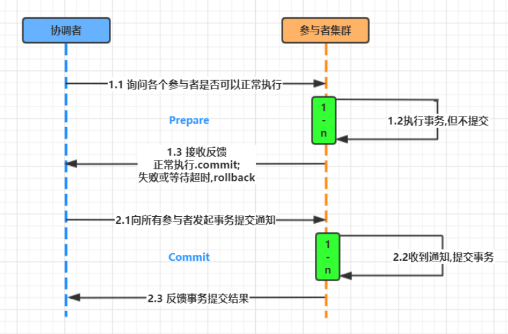

#### 1. 执行成功

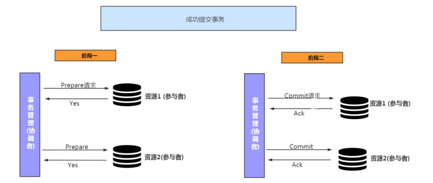

#### 2. 执行失败

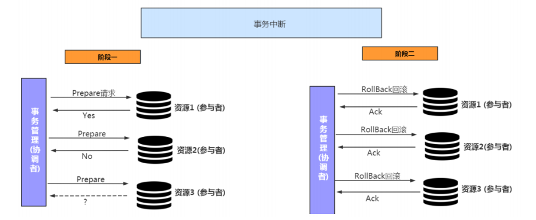

#### 3. 优缺点

优点：

- 原理简单

缺点

- 协调器单点问题

  协调者出现故障，将导致整个分布式系统的事务失效。无法发起一二阶段操作或者在一二阶段中途挂掉，将导致分布式环境数据不一致

## 三阶段提交协议（3PC）

 3PC，全称 “three phase commit”，是 2PC 的改进版，将 2PC 的 “提交事务请求” 过程一分为二，共形成了由CanCommit、PreCommit和doCommit三个阶段组成的事务处理协议

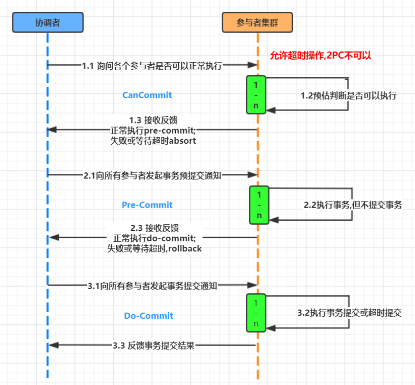

#### 1. 与2PC的比较

- 首先对于协调者和参与者都设置了超时机制（在2PC中，只有协调者拥有超时机制，即如果在一定时间内没有收到参与者的消息则默认失败）,主要是避免了参与者在长时间无法与协调者节点通讯（协调者挂掉了）的情况下，无法释放资源的问题，因为参与者自身拥有超时机制会在超时后，自动进行本地commit从而进行释放资源。而这种机制也侧面降低了整个事务的阻塞时间和范围。

- 通过**CanCommit、PreCommit、DoCommit**三个阶段的设计，相较于2PC而言，多设置了一个**缓冲阶段**保证了在最后提交阶段之前各参与节点的状态是一致的 。 

- PreCommit是一个缓冲，保证了在最后提交阶段之前各参与节点的状态是一致的。

#### 2. 问题

- 协调器单点问题

  虽然3PC相对于2PC在参与者上也这是了超时机制，保证协调者挂掉时参与者可主动释放资源。但整体还是依赖于协调者来保证分布式系统的一致性事务。协调者挂了，导致整个分布式系统的事务失效

## NWR协议

NWR是一种在分布式存储系统中用于控制一致性级别的一种策略。在亚马逊的云存储系统中，就应用NWR来控制一致性。

- N：在分布式存储系统中，有多少份备份数据（分布式系统中N往往不能为1，工业界标准为3）

- W：代表一次成功的更新操作要求至少有w份数据写入成功

- R： 代表一次成功的读数据操作要求至少有R份数据成功读取

#### 1. 原理

NWR值的不同组合会产生不同的一致性效果，当W+R>N的时候，整个系统对于客户端来讲能保证强一致性。

##### 1.1 当W+R > N的时

如果R+W>N,则读取操作和写入操作成功的数据一定会有交集（如图中的Node2），这样就可以保证一定能够读取到最新版本的更新数据，数据的强一致性得到了保证

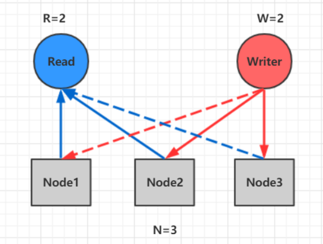

##### 1.1 当W+R <= N的时

因为成功写和成功读集合可能不存在交集，这样读操作无法读取到最新的更新数值，也就无法保证数据的强一致性。R或者W设置的越大，则系统延迟越大，因为这取决于最慢的备份数据的响应时间。

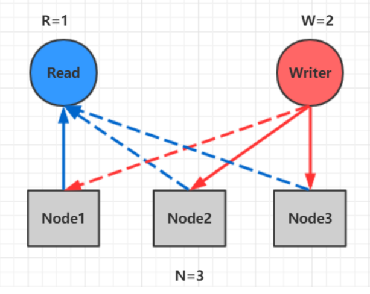

## Gossip协议(流行病协议)

gossip 协议利用一种随机的方式将信息传播到整个网络中，并在一定时间内使得系统内的所有节点数据一致。Gossip 是一种去中心化思路的分布式协议，解决状态在集群中的传播和状态一致性的保证两个问题

数据通过节点像病毒一样逐个传播。因为是指数级传播，整体传播速度非常快。

#### 1. 原理

Gossip 协议的消息传播方式有两种：反熵传播 和 谣言传播

- 反熵传播

  保证最终、完全的一致。缺点是消息数量非常庞大，且无限制；通常只用于新加入节点的数据初始化。

-  谣言传播

  谣言消息在某个时间点之后会被标记为 removed，并且不再被传播。

  缺点是系统有一定的概率会不一致，通常用于节点间数据增量同步

#### 2. 通信方式

Gossip 协议最终目的是将数据分发到网络中的每一个节点。**根据不同的具体应用场景，网络中两个节点之间存在三种通信方式：推送模式、拉取模式、推/拉模式**

- Push

  节点 A 将数据 (key,value,version) 推送给 B 节点，B 节点更新 A 中比自己新的数据

  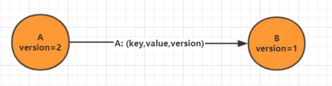

- Pull

  A 仅将数据 (key, version) 推送给 B，B 将本地比 A 新的数据（Key, value, version）推送给 A，A 更新本地

  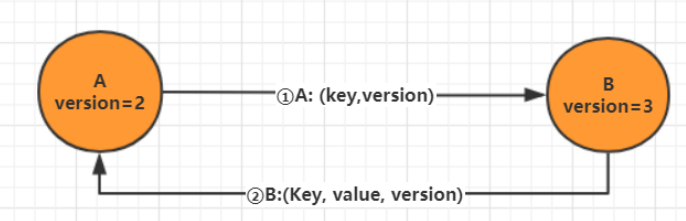

- Push/Pull

  与 Pull 类似，只是多了一步，A 再将本地比 B 新的数据推送给 B，B 则更新本地

#### 3. 优缺点

Gossip 协议适合于**AP场景的数据一致性处理**，常见应用有：P2P 网络通信、Redis Cluster、Consul。

优点

- 扩展性强，允许任意节点新增/删除
- 去中心化，只要网络连通，任意节点可把消息散播到全网

- 最终一致性，信息指数级的快速传播，在有新信息需要传播时，消息可以快速地发送到全局节点

缺点

- 消息延迟
- 消息冗余

## Paxos协议（学术界的理论）

Paxos协议就是Paxos算法, Paxos算法是基于==**消息传递**==且具有==**高度容错特性**==的==**一致性算法**==，是目前公认的==**解决分布式一致性问题最有效的算法之一**==。

自Paxos问世以来就==**持续垄断了分布式一致性算法**==，Paxos这个名词几乎等同于分布式一致性。Google的很多大型分布式系统都采用了Paxos算法来解决分布式一致性问题，如Chubby、Megastore以及Spanner等。开源的==**ZooKeeper**==，以及MySQL 5.7推出的用来取代传统的==**主从复制的MySQL**== GroupReplication等纷纷采用Paxos算法解决分布式一致性问题。然而，Paxos的最大特点就是难，不仅难以理解，更难以实现

#### 1. Paxos解决什么问题

Paxos算法解决的问题是上述多个协议无法解决的问题，即分布式系统发生诸如**机器宕机**或**网络异常**（包括消息的延迟、丢失、重复、乱序，还有网络分区）等情况，从而导致无法实现事务一致性的问题

#### 2. 解决方案

**==引入协调者集群，并设置一个主协调者==**

Paxos的版本有: Basic Paxos , Multi Paxos, Fast-Paxos, 具体**==落地有Raft 和zk的ZAB协议==**

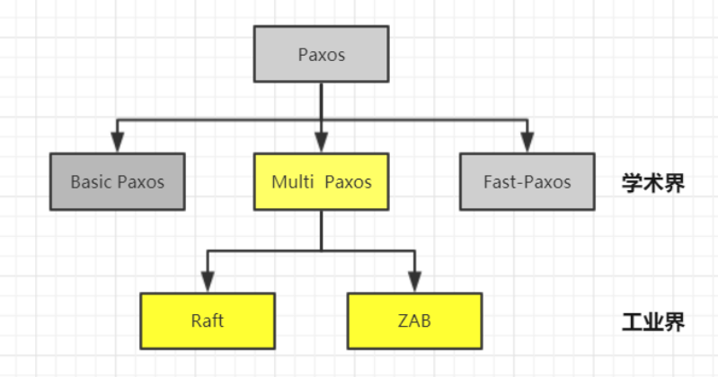

#### 3. Basic-Paxos

##### 3.1 Basic-Paxos模型

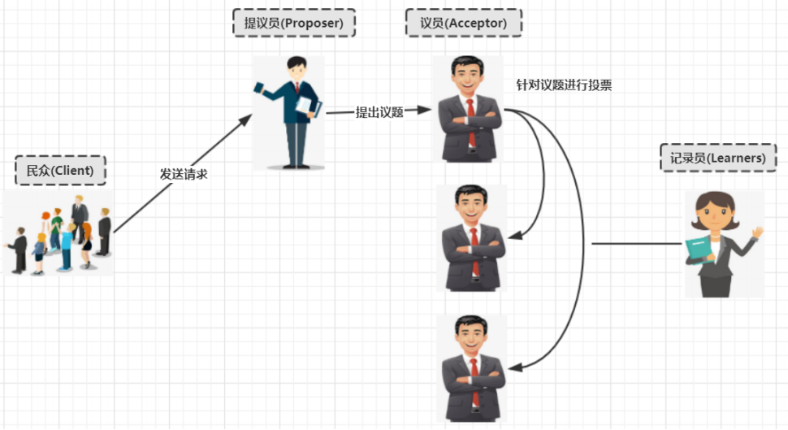

##### 3.2 basic paxos流程

- Prepare

  Proposer提出一个提案,编号为N, 此N大于这个Proposer之前提出所有提出的编号, 请求Accpetor的多数人接受这个提案

- Promise

  如果编号N大于此Accpetor之前接收的任提案编号则接收, 否则拒绝

- Accept

  如果达到多数派, Proposer会发出accept请求, 此请求包含提案编号和对应的内容

- Accepted

  如果此Accpetor在此期间没有接受到任何大于N的提案,则接收此提案内容, 否则忽略

##### 3.3 无故障的basic paxos流程

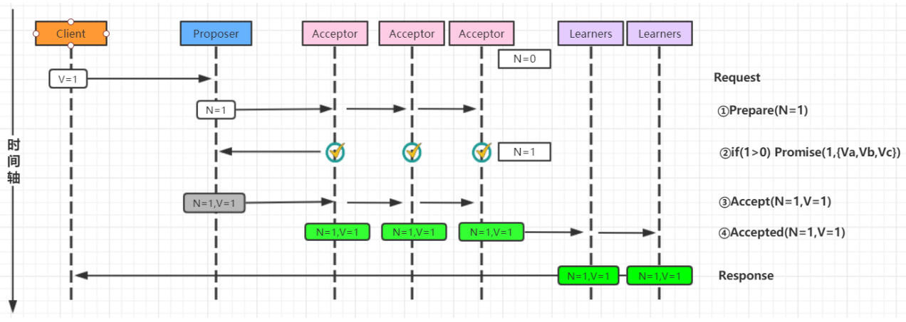

##### 3.4 Acceptor失败时的basic paxos流程

在下图中，多数派中的一个Acceptor发生故障，因此多数派大小变为2。在这种情况下，BasicPaxos协议仍然成功。

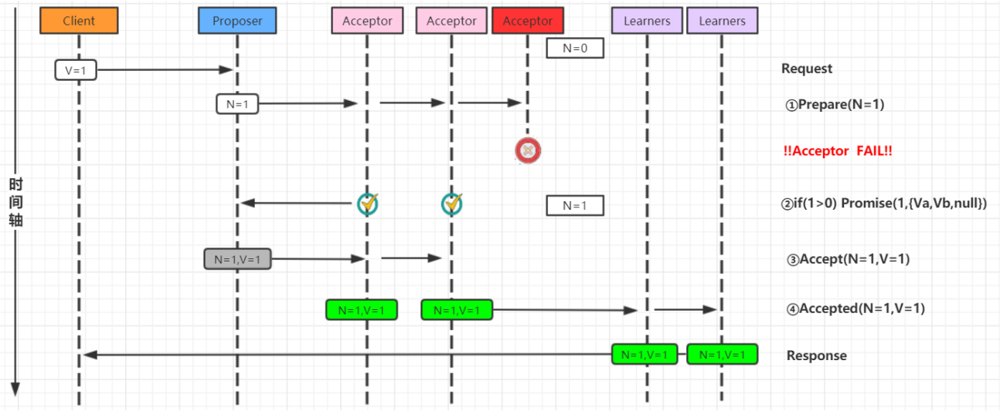

##### 3.5 Proposer失败时的basic paxos流程

Proposer在提出提案之后但在达成协议之前失败。具体来说，传递到Acceptor的时候失败了,这个时候需要选出新的Proposer（提案人）,那么 Basic Paxos协议仍然成功

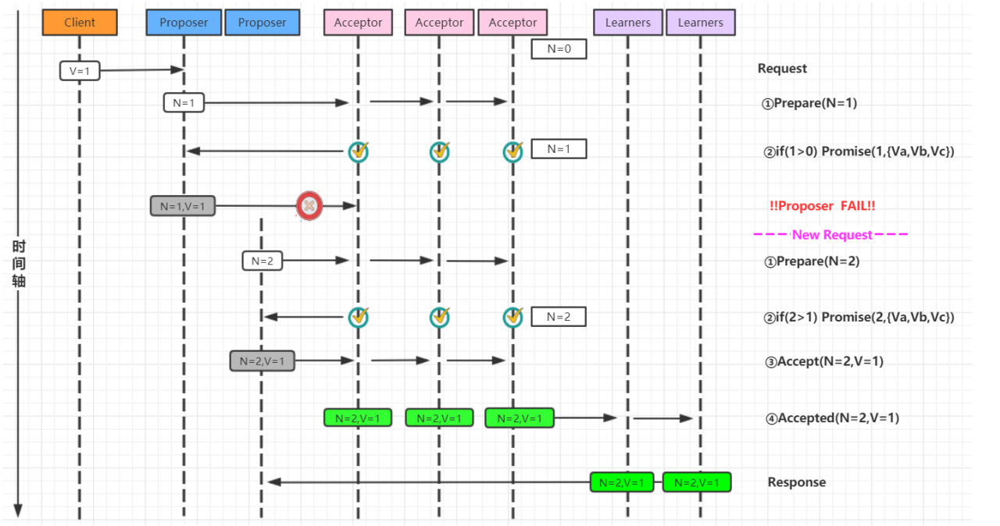

##### 3.6 当多个提议者发生冲突时的basic Paxos

最复杂的情况是多个Proposer都进行提案,导致Paxos的活锁问题

**针对活锁问题解决起来非常简单：只需要在每个Proposer再去提案的时候随机加上一个等待时间即**

**可**

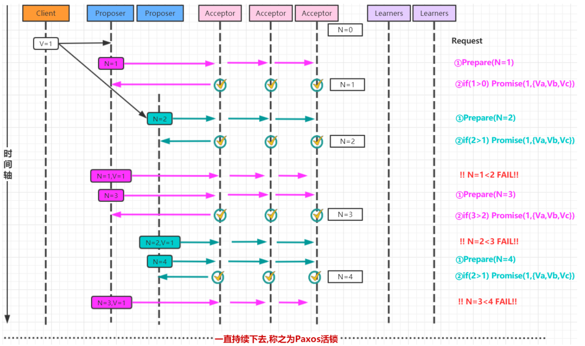

#### 4. Multi-Paxos

针对basic Paxos是存在一定得问题,首先就是流程复杂,实现及其困难, 其次效率低(达成一致性需要2轮RPC调用),针对basic Paxos流程进行拆分为选举和复制的过程. 

##### 4.1 第一次流程-确定Leader

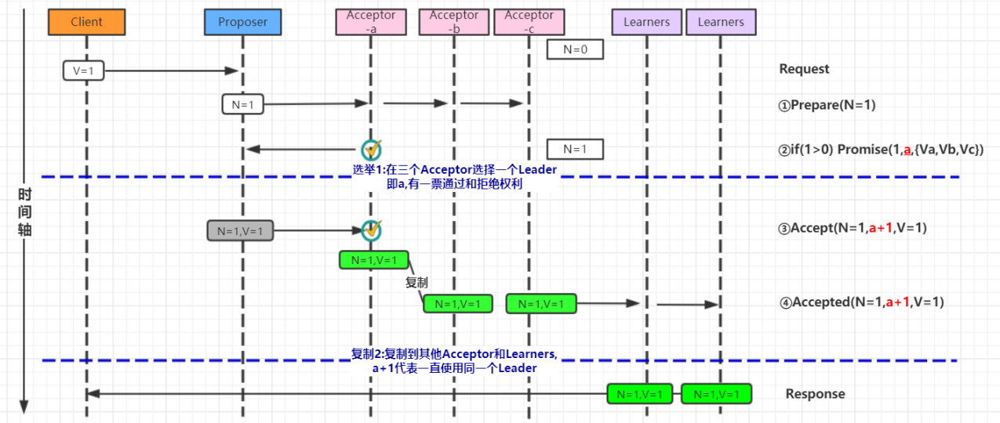

##### 4.2 第二次流程-直接由Leader确认

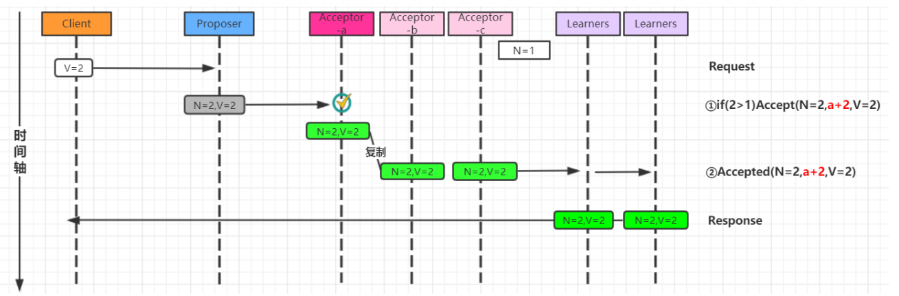

##### 4.3 Multi-Paxos角色重叠流程图

Multi-Paxos在实施的时候会将Proposer，Acceptor和Learner的角色合并统称为“服务器”。因此，最后只有“客户端”和“服务器”。

## Raft协议（Paxos的具体实现）

## Lease机制