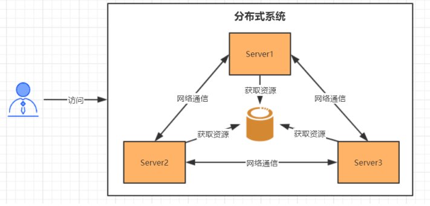
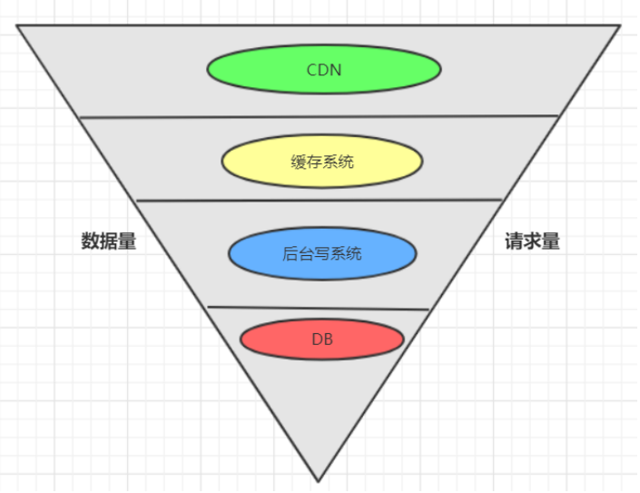
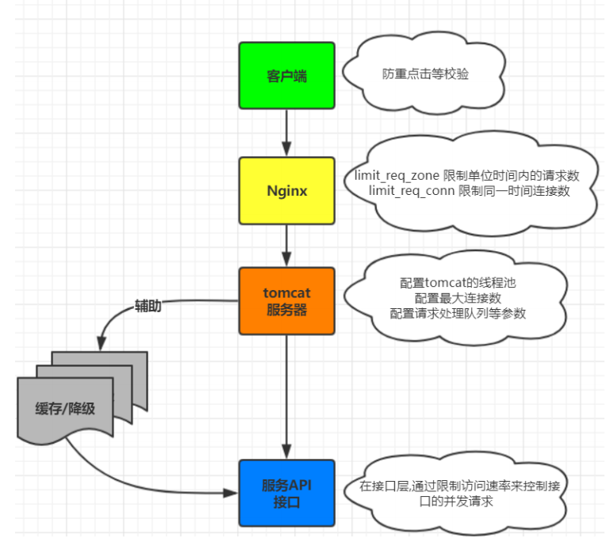
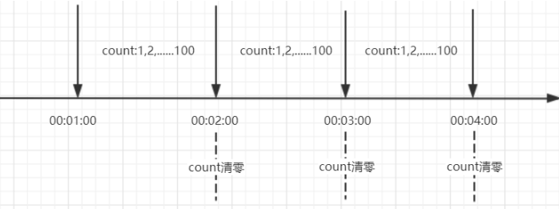
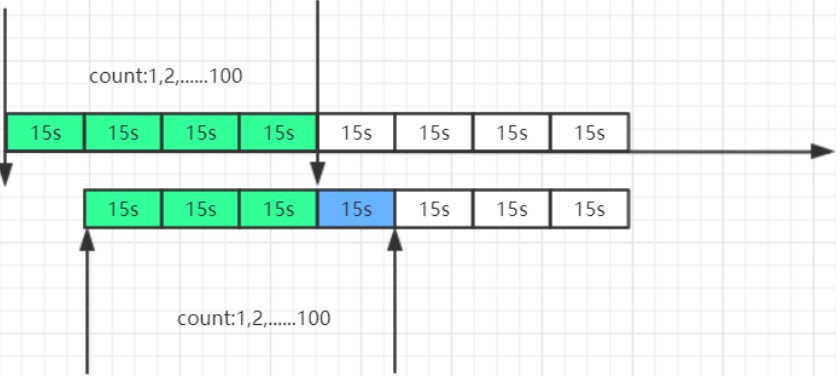
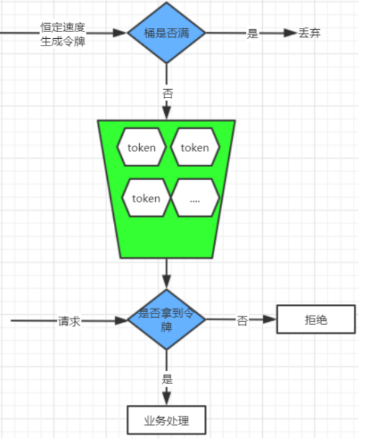

[toc]

### 服务协调（分布式锁实现）

==**分布式协调技术**==主要用来解决分布式环境当中==**多个进程之间的同步控制**==，让他们有序的去访问某种临界资源，防止造成”脏数据“的后果。

#### 1.分布式锁是**==分布式协调技术==**的实现，方式有以下两种

##### 1.1 基于缓存（Redis等）实现分布式锁

- 获取锁的时候，使用setnx加锁，并使用expire命令为锁添加一个超时时间，超过该时间则自动释放锁，锁的value值为一个随机生成的UUID, 释放锁的时候进行判断。

  > SETNX ：set一个key为value的字符串，返回1；若key存在，则什么都不做，返回0。

- 获取锁的时候还设置一个获取的超时时间，若超过这个时间则放弃获取锁。

  > expire: 为key设置一个超时时间，单位为second，超过这个时间锁会自动释放，避免死锁。

- 释放锁的时候，通过UUID判断是不是该锁，若是该锁，则执行delete进行锁释放。

  > delete ：删除key

##### 1.2 基于Zookeeper实现分布式锁

[查看zk应用场景](../SOA-分布式/Zookeeper-分布式协调器/zookeeper应用场景)

zk是一个天然的分布式协调器，znode节点的唯一性，保证了只有一个客户端能创建成功

- 创建一个目录mylock

- 线程A想获取锁就在mylock目录下创建临时顺序节点

- 获取mylock目录下所有的子节点，然后获取比自己小的兄弟节点，如果不存在，则说明当前线程顺序号最小，获得锁

- 线程B获取所有节点，判断自己不是最小节点，设置监听比自己次小的节点

- 线程A处理完，删除自己的节点，线程B监听到变更事件，判断自己是不是最小的节点，如果是则获得锁

### 服务流量削峰

互联网的业务场景中，例如，春节火车票抢购，大量的用户需要同一时间去抢购；以及大家熟知的阿里双11秒杀， 短时间上亿的用户涌入，瞬间流量巨大（高并发）

消息队列中间件主要解决应用耦合，异步消息， 流量削锋等问题。常用消息队列系统：目前在生产环境，使用较多的消息队列有 ActiveMQ、RabbitMQ、 ZeroMQ、Kafka、RocketMQ 等[查看消息中间件]()

#### 1. 流量削峰方案，有以下两种

##### 1.1 消息队列削峰

用消息队列来缓冲瞬时流量，把同步的直接调用转换成异步的消息推送，通过一个队列逐条处理消息

##### 1.2 流量削峰漏斗：层层削峰

分层过滤其实就是采用“漏斗”式设计来处理请求的，这样就像漏斗一样，尽量把数据量和请求量一层一层地过滤和减少了。如下图所示

分层过滤的核心思想

- 通过在不同的层次尽可能地过滤掉无效请求。

- 通过CDN过滤掉大量的图片，静态资源的请求。

- 再通过类似Redis这样的分布式缓存过滤请求

分层过滤的基本原则

- 对写数据进行基于时间的合理分片，过滤掉过期的失效请求。

- 对写请求做限流保护，将超出系统承载能力的请求过滤掉。

- 涉及到的读数据不做强一致性校验，减少因为一致性校验产生瓶颈的问题。

- 对写数据进行强一致性校验，只保留最后有效的数据。

### 服务降级

整个架构整体的负载超出了预设的上限阈值或即将到来的流量预计将会超过预设的阈值时，为了保证重要或基本的服务能正常运行，我们可以将一些 不重要 或 不紧急 的服务或任务进行服务的 **==延迟使用==**或 **==暂停使用==**

#### 1. 降级策略

##### 1.1 从架构全局的视角来看，降级处理方案

- 页面降级 —— 可视化界面禁用点击按钮、调整静态页面

- 延迟服务 —— 如定时任务延迟处理、消息入MQ后延迟处理

- 写降级 —— 直接禁止相关写操作的服务请求

- 读降级 —— 直接禁止相关读的服务请求

- 缓存降级 —— 使用缓存方式来降级部分读频繁的服务接口

##### 1.2 针对后端代码层面的降级处理策略

- 抛异常

- 返回NULL

- 调用Mock数据

- 调用Fallback处理逻辑

### 服务限流

限流的目的是通过对并发访问请求进行限速或者一个时间窗口内的的请求数量进行限速来保护系统，一旦达到限制速率则可以拒绝服务、排队或等待

#### 1. 限流算法策略

#### 2. 限流算法

##### 2.1 限流算法-计数器(固定窗口)

**==存在问题==**：客户端在第一分钟的59秒请求100次，在第二分钟的第1秒又请求了100次, 2秒内后端会受到200次请求的压力，形成了流量突刺

##### 2.2 限流算法-计数器(滑动窗口)

滑动窗口其实是细分后的计数器，它将每个时间窗口又细分成若干个时间片段，每过一个时间片段，整个时间窗口就会往右移动一格。**新的一格时间片段能接收的请求数 = 100 - 其他片段已接收的请求，*时间窗口划分的越细，滑动窗口的滚动就越平滑，限流的效果就会越精确**

##### 2.3 限流算法-漏桶

漏桶算法类似一个限制出水速度的水桶，通过一个固定大小FIFO队列+定时取队列元素的方式实现，请求进入队列后会被匀速的取出处理（桶底部开口匀速出水），当队列被占满后后来的请求会直接拒绝（水倒的太快从桶中溢出来）

**==优点：削峰填谷，不论请求多大多快，都只会匀速发给后端，不会出现突刺现象，保证下游服务正常运行==** 

 **==缺点：在桶队列中的请求会排队，响应时间拉长==**

##### 2.4 限流算法-令牌桶

令牌桶算法是以一个恒定的速度往桶里放置令牌（如果桶里的令牌满了就废弃），每进来一个请求去桶里找令牌，有的话就拿走令牌继续处理，没有就拒绝请求

**==令牌桶的优点：应对突发流量，当桶里有令牌时请求可以快速的响应，也不会产生漏桶队列中的等待==**

**==令牌桶的缺点：相对漏桶一定程度上减小了对下游服务的保护==**

### 服务熔断

### 服务链路追踪