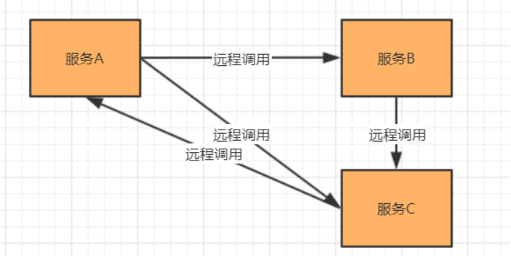

[toc]

### 一、服务调用

和传统的单体系统相比，分布式架构拆分成不同层级和类型的服务，那么服务之间必然涉及到通信和调用，这就涉及到了不同进程服务之间的远程调用



### 二、实现方式

#### 1. HTTP应用协议的通信框架

##### 1.1 HttpURLConnection 

##### 1.2 Apache Common HttpClient

##### 1.3 OKhttp3

OKHttp是一个当前主流的网络请求的开源框架, 用于替代HttpUrlConnection和Apache HttpClient

- 支持http2.0，对一台机器的请求共享一个socket。

- 采用连接池技术，可以有效的减少Http连接数量。

- 无缝集成GZIP压缩技术。

- 支持Response Cache，避免重复请求

- 域名多IP支持

##### 1.4 RestTemplate

[详情查看SCN笔记](../微服务架构/SCN/。。。。)

Spring RestTemplate 是 Spring 提供的用于访问 Rest 服务的客户端，RestTemplate 提供了多种便捷访问远程Http服务的方法

- 面向 URL 组件，必须依赖于主机 + 端口 + URI

- RestTemplate 不依赖于服务接口，仅关注 REST 响应内容

- Spring Cloud Feign

#### 2. RPC远程过程调用框架

[详情查看RPC笔记](../SOA-分布式/Dubbo-RPC框架/什么是RPC？)

### 三、跨域调用

#### 1. 跨域

在分布式系统中，会有调用其他业务系统，导致出现跨域问题，==**跨域实质上是浏览器的一种保护处理**==。==**如果产生了跨域，服务器在返回结果时就会被浏览器拦截**==（注意：此时请求是可以正常发起的，只是浏览器对其进行了拦截），导致响应的内容不可用。

对于非同源的请求进行响应拦截，同源URL为：

- 同应用协议
- 同域名
- 同port

#### 2. 解决方案

##### 1. 使用jsonp解决网站跨域

缺点：不支持post请求，代码书写比较复杂

##### 2. 后台内部调用跨域的接口返回给前端

##### 3. 设置响应头允许跨域

设置响应头允许跨域

response.setHeader(“Access-Control-Allow-Origin”, “*”); 

##### 4. 基于Nginx搭建企业级API接口网关

```
location / {
	# 设置跨域url
	set $cors_origin "";
	if ($http_origin ~* "^http://api.xxx.com$"){
        set $cors_origin $http_origin;
	}

    add_header Access-Control-Allow-Origin $cors_origin always;
    add_header Access-Control-Allow-Credentials true always;
    add_header Access-Control-Max-Age 86400 always;
    add_header Access-Control-Allow-Methods GET,POST,OPTIONS always;
    add_header Access-Control-Allow-Headers $http_access_control_request_headers;

	# 预检请求处理
	if ($request_method = OPTIONS){
        return 200;
	}

    root /usr/share/nginx/html;
    index index.html index.htm;

    # 解决代理后Swagger无法使用
    proxy_pass http://myweb;
    proxy_set_header Host $host;
    proxy_set_header X-Forwarded-For $proxy_add_x_forwarded_for;
    proxy_set_header X-Forwarded-Proto $scheme;
    proxy_set_header X-Forwarded-Port $server_port;
}
```


##### 5. 使用Zuul、gateWay搭建微服务API接口网关

Zuul、gateWay是spring cloud中的微服务网关。网关： 是一个网络整体系统中的前置门户入口。请求首先通过网关，进行路径的路由，定位到具体的服务节点上。可以使用zuul的过滤器的请求转发去解决跨域问题


