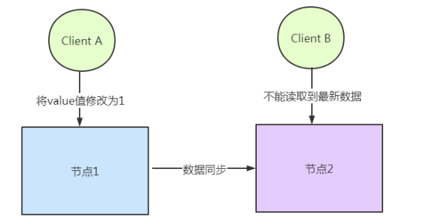
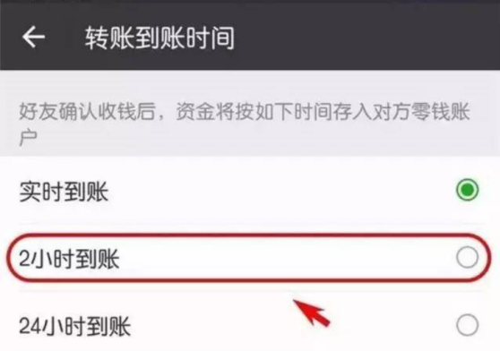
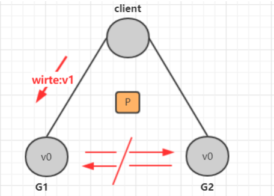
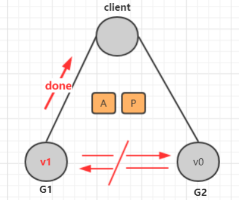
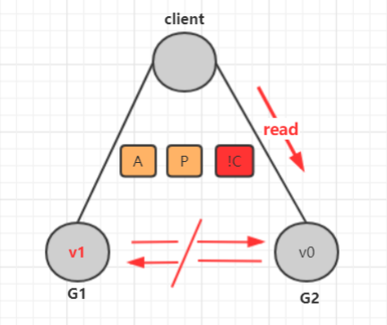
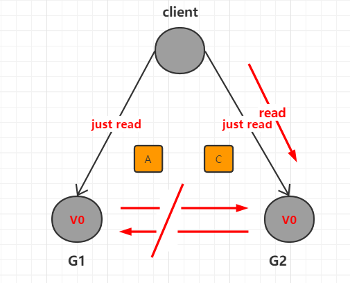

[toc]

## 一、数据一致性

#### 1. 数据一致性的难点

分布式系统中，数据往往会有**==多个副本==**，多个副本就需要**==保证数据的一致性==**。

这就带来了同步的问题，因为网络延迟等因素，**==几乎没法保证可以同时更新所有节点的备份数据==**，就会有数据不一致的情况

由于无法找到一种能够满足分布式系统中数据一致性解决方案。因此，**==如何既保证数据的一致性，同时又不影响系统运行的性能==**，是每一个分布式系统都需要重点考虑和权衡的。于是，一致性级别由此诞生

#### 2. 一致性的分类

##### 2.1. 强一致性

在**==写操作完成后开始的任何读操作都必须返回该值==**，或者后续写操作的结果。也就是说，在强一致性系统中，一旦客户端将值写入任何一台服务器，该服务器再将数据同步到集群中其他的服务器，同步完成后响应给客户端写操作完成，那么之后client从其他任何服务器读取的都是刚写入的数据

这种一致性级别是最符合用户直觉的，它要求系统写入什么，读出来的也会是什么，用户体验好，但实现起来往往对系统的性能影响大。但是强一致性很难实现。

##### 2.2 弱一致性

这种一致性级别约束了系统在写入成功后，不承诺立即可以读到写入的值，也不承诺多久之后数据能够达到一致，但会尽可能地保证到某个时间级别（比如秒级别）后，数据能够达到一致状态。

##### 2.3最终一致性

**最终一致性也是弱一致性的一种**，它无法保证数据更新后，所有后续的访问都能看到最新数值，而是需要一个时间，在这个时间之后可以保证这一点（**就是在一段时间后，节点间的数据会最终达到一致状态**），而在这个时间内，数据也许是不一致的，这个系统无法保证强一致性的时间片段被称为「不一致窗口」。不一致窗口的时间长短取决于很多因素，比如备份数据的个数、网络传输延迟速度、系统负载等。

## 二、CAP理论

**==CAP定理（CAP theorem），又被称作布鲁尔定理（Brewer's theorem）==**，它指出对于一个分布式计算系统来说，不可能同时满足以下三点

- 一致性（Consistency）

  **==CAP理论的C是强一致性==**，所有节点访问时都是同一份最新的数据副本

- 可用性（Availability）

  **==即使集群中的部分节点故障后，集群仍然可以提供服务并正常的响应==**，但是不保证获取的数据为最新数据

- 分区容错性（Partition tolerance）

  分布式系统**==出现网络分区后，仍然能够对外提供满足一致性 或者 可用性的服务==**，除非整个网络环境都发生了故障，分布式架构的分区容错性是必须要保证的

#### 1. CAP不可同时满足论证

假如出现网络分区，集群要同时满足强一致性和可用性

1. 出现分区后，客户端向G1写入V1数据，由于G1和G2网络不同无法同步数据

2. 若要满足可用性，所以集群的G1和G2都能提供服务，却无法满足数据一致性

3. 若要满足数据一致性，分区后的集群进行服务降级，只读不写，能保证数据一致性，但无法满足可用性

#### 2. CAP如何权衡

| 组合 | 描述                                                         |
| ---- | ------------------------------------------------------------ |
| CA   | 放弃分区容错性，加强一致性和可用性，其实就是传统的单机数据库的选择 |
| AP   | 放弃一致性(这里说的是强一致性)，追求分区容错性和可用性，这是很多分布式系统设计时的选择，例如很多NoSQL系统就是如此 |
| CP   | 放弃可用性，追求一致性和分区容错性，基本不会选择，网络问题会直接让整个系统不可以 |

- 对于互联网应用来说，机器数量庞大，节点分散，网络故障再正常不过了，那么此时就是保障AP，放弃C的场景，而从实际中理解，像网站这种偶尔没有一致性是能接受的，但不能访问问题就非常大了
- 对于银行来说，就是必须保证强一致性，也就是说C必须存在，那么就只用CA和CP两种情况，当保障强一致性和可用性（CA），那么一旦出现通信故障，系统将完全不可用。另一方面，如果保障了强一致性和分区容错（CP），那么就具备了部分可用性。实际究竟应该选择什么，是需要通过业务场景进行权衡的（并不是所有情况都是CP好于CA，只能查看信息但不能更新信息有时候还不如直接拒绝服务）

## 三、BASE理论

BASE：全称：Basically Available(基本可用)，Soft state（软状态），和 Eventually consistent（最终一致性）

**==Base 理论是对 CAP 中一致性和可用性权衡的结果==**，其来源于对大型互联网分布式实践的总结，是基于 CAP 定理逐步演化而来的。其核心思想是： 既是无法做到强一致性（Strong consistency），但每个应用都可以根据自身的业务特点，**==采用适当的方式来使系统达到最终一致性（Eventual consistency）==**。 

- Basically Available(基本可用)

  相对于系统正常功能，基本可用指的是当出现系统故障时，对服务进行降级处理

  - 响应时间上的损失：正常情况下的搜索引擎 0.5 秒即返回给用户结果，而**基本可用**的搜索引擎可以在 1 秒返回结果

  - 功能上的损失：在一个电商网站上，正常情况下，用户可以顺利完成每一笔订单，但是到了大

    促期间，为了保护购物系统的稳定性，部分消费者可能会被引导到一个降级页面

  

- Soft state（软状态）

  什么是软状态呢？相对于原子性而言，要求多个节点的数据副本都是一致的，这是一种 “硬状态”。

  软状态指的是：允许系统中的数据存在中间状态，并认为该状态不会影响系统的整体可用性，即允许系统在多个不同节点的数据副本存在数据延时。

-  Eventually consistent（最终一致性）

  上面说软状态，然后不可能一直是软状态，必须有个时间期限。在期限过后，应当保证所有副本保持数据一致性。从而达到数据的最终一致性。这个时间期限取决于网络延时，系统负载，数据复制方案设计等等因素。

