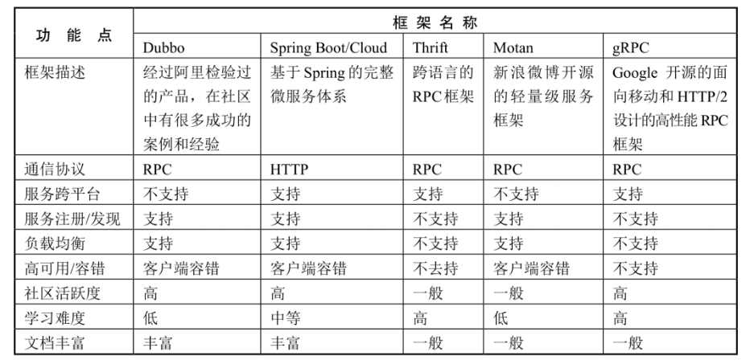

### 框架选型对比

### Dubbo作为一个分布式框架，通常与zk一起使用

Zk分布式协调器作为注册中心、配置中心。

Dubbo框架则实现了RPC、负载均衡、路由规则服务降级等诸多规则

##### Dubbo缺点：

- 太笨重、所有的功能模块都在集成在了Dubbo中
- 无法实现跨语言的RPC调用
- 分布式体系的组件不够健全，如服务注册发现依赖zk

##### Dubbo优点：

- 内部服务通信使用轻量级的RPC，效率更快

### SpringCloud将微服务各个功能模块划分为粒度更细的服务组件

更加的轻量级

一般外部服务调用通过Feign（http协议），Feign也是对RPC的一种实现，只不过使用了应用层协议的数据报文

##### Feign缺点：

- 相对于Dubbo的轻量级RPC，Feign的RPC实现相对于比较重量级

- 使用HTTP协议的网络通信，效率相对于RPC慢些

##### Feign优点:

- 使用HTTP协议的网络通信，可以实现跨语言的RPC调用

