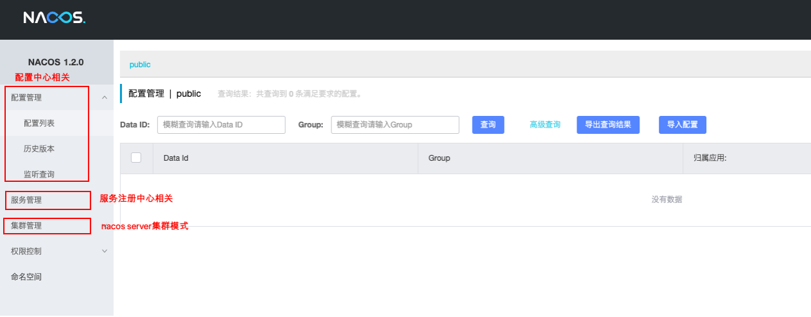
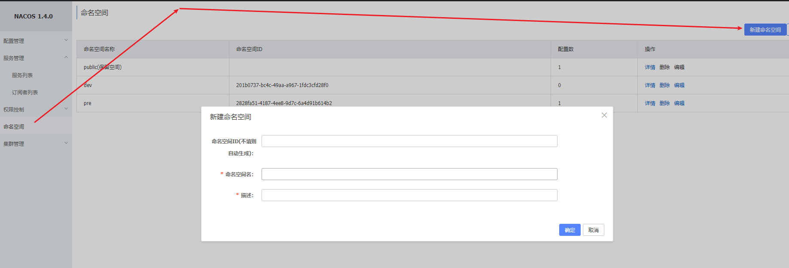
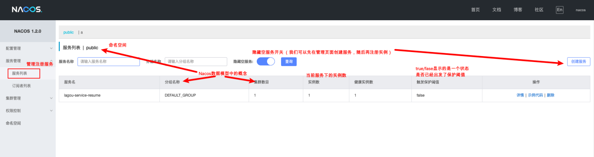
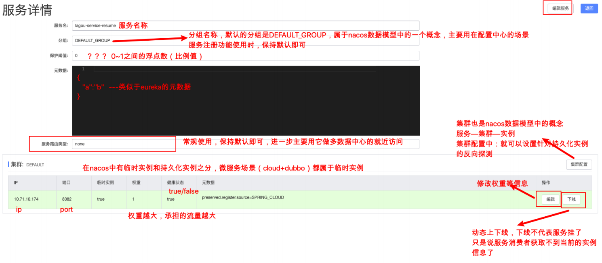
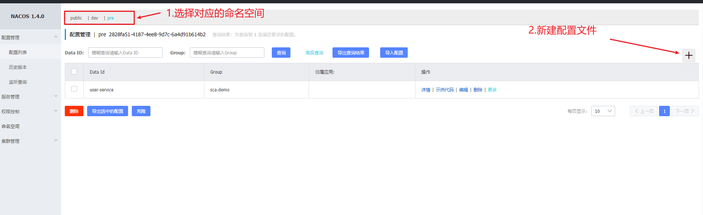
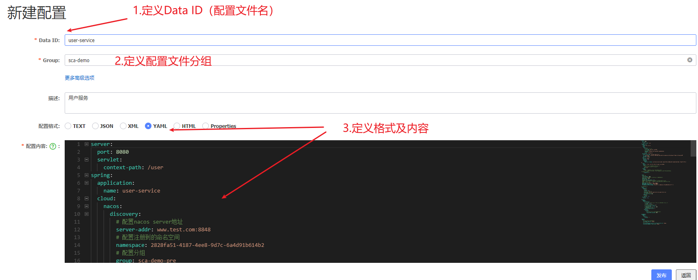
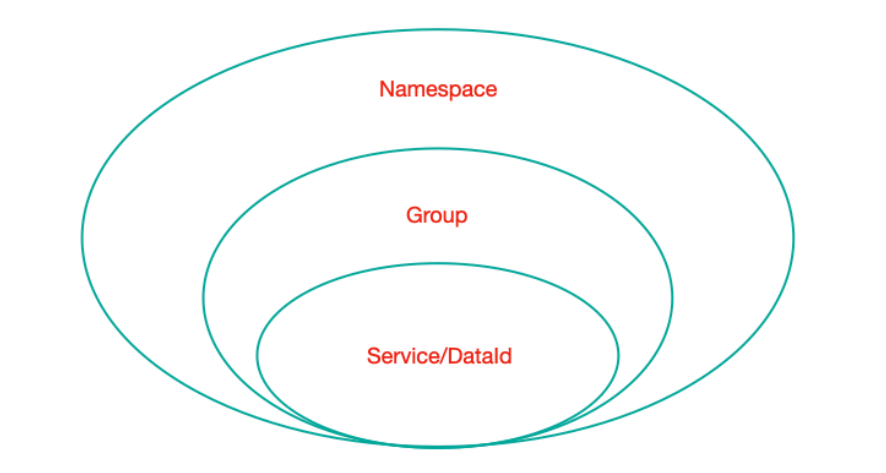
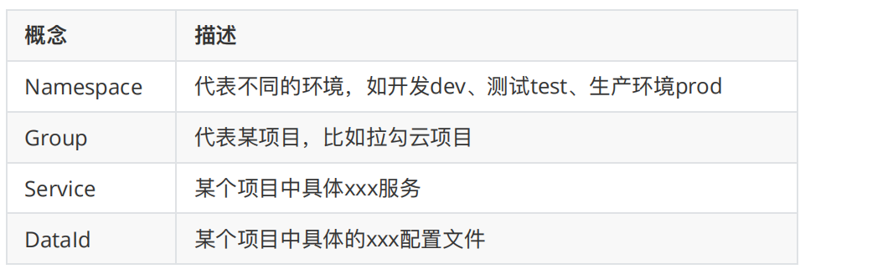

[toc]

## 一、简介

Nacos （Dynamic Naming and Confifiguration Service）是阿⾥巴巴开源的⼀个针对微服务架构中服务发现、配置管理和服务管理平台。

Nacos就是注册中⼼+配置中⼼的组合，相当于SCN中三个组件的功能（Eureka+Config+Bus）

官⽹：https://nacos.io 下载地址：https://github.com/alibaba/Nacos


### 1. 主要功能如下：

- 服务发现与健康检查

- 动态配置管理

- 动态DNS服务

- 服务和元数据管理，动态的服务权重调整、动态服务优雅下线

  管理平台的⻆度，nacos也有⼀个ui⻚⾯，可以看到注册的服务及其实例信息（元数据信息）等


### 2. 相比Eureka，Nacos的优势

Nacos 不用像Eureka那样需要自己搭建一个注册中心的工程，**==只需从官网下载对应版本的Nacos软件包运行即可==**，比如Redis、ZK、MQ。

提供了**==UI界面==**，所有的**==服务管理==**、**==动态配置管理==**、**==负载均衡权重比等等==**功能，无需Eureka那样硬编码


## 二、Nacos 之部署

### 1. Nacos 单例服务部署

#### 1.1 下载解压安装包，执行命令启动（稳定的版本1.2.0或者1.4.0）

```shell
linux/mac：sh startup.sh -m standalone
windows：cmd startup.cmd -m standalone
```


#### 1.2 访问nacos管理界⾯：http://127.0.0.1:8848/nacos（账号和密码 nacos/nacos）




### 2. Nacos 集群服务部署

#### 2.1 集群需要3个或3个以上的Nacos

本地演示：复制解压后的nacos⽂件夹，分别命名为nacos-01、nacos-02、nacos-03，application.properties中的server.port分别改为 8848、8849、8850


#### 2.2 修改配置⽂件

当前实例节点绑定ip，因为服务器可能绑定多个ip

```properties
nacos.inetutils.ip-address=127.0.0.1
```

复制⼀份conf/cluster.conf.example⽂件，命名为cluster.conf在配置⽂件中设置集群中每⼀个节点的信息

```
# 集群节点配置
127.0.0.1:8848
127.0.0.1:8849
127.0.0.1:8850
```


#### 2.3 分别启动每⼀个实例（可以批处理脚本完成）

```shell
sh startup.sh -m cluster
```


## 三、微服务注册（在SCN基础上修改造）

### 1. 在父工程 pom中引⼊SCA依赖

```xml
<dependencyManagement>
    <dependencies>
        <!--SCA -->
        <dependency>
            <groupId>com.alibaba.cloud</groupId>
            <artifactId>spring-cloud-alibaba-dependencies</artifactId>
            <version>2.1.2.RELEASE</version>
            <type>pom</type>
            <scope>import</scope>
        </dependency>
    </dependencies>
    <!--SCA -->
</dependencyManagement>
```


### 2. 引入nacos客户端依赖（注释eureka客户端）

```xml
<dependency>
    <groupId>com.alibaba.cloud</groupId>
    <artifactId>spring-cloud-starter-alibaba-nacos-discovery</artifactId>
</dependency>
```


### 3. 创建命名空间




### 4. 全局配置文件，添加nacos信息

```yaml
# nacos配置
spring:
  cloud:
    nacos:
      discovery:
        # 配置nacos server地址,集群中各节点信息都配置在这里（域名-VIP-绑定映射到各个实例的地址信息）
        server-addr: www.test.com:8848,www.test.com:8849,www.test.com:8850
        # 配置注册到的命名空间id
        namespace: 2828fa51-4187-4ee8-9d7c-6a4d91b614b2
        # 配置注册到的分组
        group: sca-demo
```


### 5. 启动简历微服务，观察nacos控制台






### 6. 保护阈值

#### 6.1 场景

Nacos 向服务消费者**==返回服务提供者实例信息时==**，默认会**==返回健康的实例==**，所以当某个服务集群中的**==大部分实例不健康时==**，上游的流量洪峰将会**==压到仅剩的健康实例==**，最终可能**==导致整个服务A的集群不可用==**，**==引起服务熔断和降级==**


#### 6.2 配置

每个服务都可以设置保护阈值，数值是 `[0-1]` 之间的浮点数


#### 6.3 作用

**==当服务A健康实例数/总实例数 < 保护阈值==** 的时候，说明健康实例比例太小了，这个时候**==保护阈值被触发（状态true）==**，**==Nacos 返回服务的任意实例（不论健康与否）==**


## 四、负载均衡及服务调用

**==Nacos客户端引⼊的时候，会关联引⼊Ribbon的依赖包==**

SCA和SCN的组件可任意搭配，所以也能使用OpenFiegn，**==OpenFiegn、Ribbon和Hystrix 都按在 SCN 中的使用方式使用即可==**


## 五、Nacos 之配置中心

### 1. 在Nacos Server的UI界面添加配置集

#### 1.1 先选择需要新建配置的命名空间



#### 1.2 再新建配置文件并填写配置信息 




### 2. 微服务改造为nacos config client

#### 2.1 添加依赖

```xml
<dependency>
    <groupId>com.alibaba.cloud</groupId>
    <artifactId>spring-cloud-starter-alibaba-nacos-config</artifactId>
</dependency>
```


#### 2.2 创建bootstrap.yml配置文件，锁定刚刚server端配置的文件

配置nacos server地址，编写远程配置文件坐标

通过 Namespace + Group + dataId 来锁定刚刚再server端配置的信息，bootstrap.yml配置如下

```yaml
# nacos配置
spring:
  cloud:
    nacos:
      # nacos config 配置
      config:
        server-addr: www.test.com:8848
        # 锁定server端的配置文件（读取它的配置项）
        namespace: 2828fa51-4187-4ee8-9d7c-6a4d91b614b2  # 命名空间id
        group: sca-demo  # 默认分组就是DEFAULT_GROUP，如果使用默认分组可以不配置
        prefix: user-service # 指定配置文件名 默认为spring.application.name
        file-extension: yaml   #默认properties
```

Namespace不指定就默认public，Group不指定就默认 DEFAULT_GROUP，dataId 的完整格式如下

```properties
${prefix}-${spring.profile.active}.${file-extension}
```

- **prefix**

  默认为 `spring.application.name` 的值，也可以通过配置项 `spring.cloud.nacos.config.prefix` 来配置

- **spring.profile.active**

  当spring.profile.active 为空时，对应的连接符 - 也将不存在，dataId 的拼接格式变成 `${prefix}.${file-extension}`

- **file-extension**

  配置内容的数据格式，可以通过配置项 `spring.cloud.nacos.config.file-extension` 来配置。⽬前只⽀持 properties 和 yaml 类型


### 3. 配置文件加载优先级说明

##### 3.1 首先加载bootstrap.yml配置信息，根据namespace、group、DataId去分布式配置中心拉取配置

##### 3.2 优先加载从配置中心下载的配置，再加载application-{profile}.yml配置，最后加载公共application.yml配置

##### 3.3 若配置中心找不到配置，则加载application-{profile}.yml配置，最后加载公共application.yml配置


### 4. 通过 Spring Cloud 原生注解 @RefreshScope 实现配置自动更新

原则上，所有涉及全局配置文件的属性，在被用到的类上都得加该注解，才能被读到并重新加载到IOC容器中

```java
/**
* 该类⽤于模拟，我们要使⽤共享的那些配置信息做⼀些事情
*/
@RestController
@RequestMapping("/config")
@RefreshScope
public class ConfigController {
    // 和取本地配置信息⼀样
    @Value("${lagou.message}")
    private String lagouMessage;
    
    @Value("${mysql.url}")
    private String mysqlUrl;
    
    
    // 内存级别的配置信息
    // 数据库，redis配置信息
    @GetMapping("/viewconfig")
    public String viewconfig() {
        return "lagouMessage==>" + lagouMessage + " mysqlUrl=>" + mysqlUrl;
    }
}
```


### 5. 从Nacos server中获取多个dataId的配置信息

优先级：根据规则⽣成的dataId > 扩展的dataId（对于扩展的dataId，[n] n越⼤优先级越⾼）

```yaml
# nacos配置
spring:
  cloud:
    nacos:
      discovery:
        # 配置nacos server地址,集群中各节点信息都配置在这里（域名-VIP-绑定映射到各个实例的地址信息）
        server-addr: www.test.com:8848,www.test.com:8849,www.test.com:8850
        # 配置注册到的命名空间id
        namespace: 2828fa51-4187-4ee8-9d7c-6a4d91b614b2
        # 配置分组
        group: sca-demo
      # nacos config 配置
      config:
        server-addr: www.test.com:8848,www.test.com:8849,www.test.com:8850
        # 锁定server端的配置文件（读取它的配置项）
        namespace: 2828fa51-4187-4ee8-9d7c-6a4d91b614b2  # 命名空间id
        group: sca-demo  # 默认分组就是DEFAULT_GROUP，如果使用默认分组可以不配置
        prefix: user-service # 指定配置文件名 默认为spring.application.name
        file-extension: yaml   #默认properties
        # 根据规则拼接出来的dataId效果：lagou-service-resume.yaml
        ext-config[0]:
          data-id: abc.yaml
          group: DEFAULT_GROUP
          refresh: true  #开启扩展dataId的动态刷新
        ext-config[1]:
          data-id: def.yaml
          group: DEFAULT_GROUP
          refresh: true  #开启扩展dataId的动态刷新
```


## 六、Nacos 之数据模型

### 1. 模型简介

Namespace 命名空间、Group分组、集群这些都是为了进⾏归类管理，把 **==服务和配置==** ⽂件进⾏归类，归类之后就可以实现⼀定的效果，⽐如隔离

**==对于服务来说，不同命名空间中的服务不能够互相访问调⽤==**



- Namespace：命名空间，对不同的环境进⾏隔离，⽐如隔离开发环境、测试环境和⽣产环境
- Group：分组，将若⼲个服务或者若⼲个配置集归为⼀组，通常习惯⼀个系统归为一个组
- Service：某⼀个服务，⽐如简历微服务
- DataId：配置集或者可以认为是⼀个配置⽂件


### 2. 最佳实践

- Namespace + Group + Service 

  如同 Maven 中的GAV坐标，GAV坐标是为了锁定Jar，⼆这⾥是为了锁定服务

- Namespace + Group + DataId

   如同 Maven 中的GAV坐标，GAV坐标是为了锁定Jar，⼆这⾥是为了锁定配置⽂件




## 七、Nacos 之持久化

Nacos 默认使⽤嵌⼊式数据库进⾏数据存储，它⽀持改为外部Mysql存储

### 1. 创建 nacos_config 库，并执行DDL脚本

新建数据库 nacos_config，数据库初始化脚本⽂件在${nacoshome}/conf/nacos-mysql.sql中


### 2. 修改${nacoshome}/conf/application.properties，增加Mysql数据源配置

```properties
spring.datasource.platform=mysql
### Count of DB:
db.num=1
### Connect URL of DB:
db.url.0=jdbc:mysql://127.0.0.1:3306/nacos_config?
characterEncoding=utf8&connectTimeout=1000&socketTimeout=3000&au
toReconnect=true
db.user=root
db.password=123456
```

