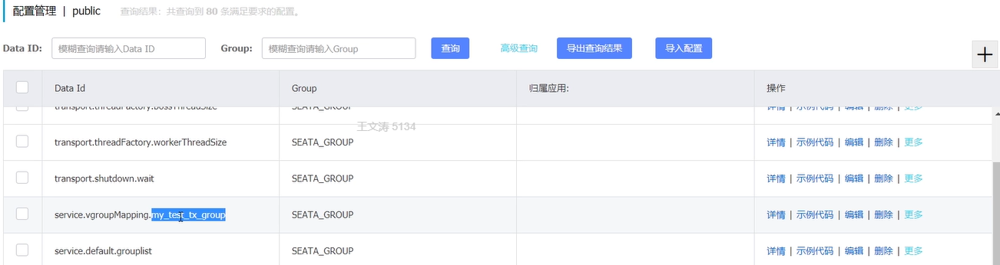

[toc]

## 一、Seata

### 1. 简介

Seata（Simple Extensible Autonomous Transaction Architecture）是一套一站式分布式事务解决方案，是阿里集团和蚂蚁金服联合打造的分布式事务框架。Seata目前的事务模式有AT、TCC、Saga和XA，默认是AT模式，AT本质上是2PC协议的一种实现。


### 2. 支持功能

#### 2.1 可集成的框架

⽬前已⽀持 Dubbo、Spring Cloud、Sofa-RPC、Motan 和 grpc 等RPC框架，其他框架持续集成中

#### 2.2 AT 模式（强一致，基于2PC协议，基于数据库本地事务，有全局行锁以及undo日志用于回滚）

##### 简介

AT 模式是⼀种⽆侵⼊的分布式事务解决⽅案。在 AT 模式下，⽤户只需关注⾃⼰的  ”业务 SQL” ，⽬前已⽀持 MySQL、 Oracle 、PostgreSQL和 TiDB的AT模式，H2 开发中。


##### 原理

 AT 模式的⼀阶段、⼆阶段提交和回滚均由 Seata 框架自动⽣成，⽤户只需编写“业务SQL”，便能轻松接⼊分布式事务，AT 模式是⼀种对业务无任何侵⼊的分布式事务解决⽅案。

- 一阶段

  Seata 拦截“业务 SQL”，首先解析 SQL 语义，找到“业务 SQL”要更新的业务数据，在业务数据被更新前，将其保存成“before image”，然后执行“业务 SQL”更新业务数据，在业务数据更新之后，再将其保存成“after image”，最后生成行锁。以上操作全部在⼀个数据库事务内完成，这样保证了⼀阶段操作的原⼦性。

  

  实际应用中，将生成undo log存储于各个RM的undo_log表中

  

- 二阶段

  - 提交

    因为“业务 SQL”在⼀阶段已经提交⾄数据库， 所以 Seata 框架只需将⼀阶段保存的快照数据和⾏锁删掉，完成数据清理即可。

    

  - 回滚

    Seata 就需要回滚⼀阶段已经执⾏的“业务 SQL”，还原业务数据。回滚⽅式便是⽤“before image”还原业务数据；但在还原前要⾸先要校验脏写，对⽐“数据库当前业务数据”和 “after image”，如果两份数据完全⼀致就说明没有脏写，可以还原业务数据，如果不⼀致就说明有脏写，出现脏写就需要转⼈⼯处理

    


#### 2.3 TCC 模式（最终一致，基于2PC协议，基于业务层应用）

TCC 模式需要⽤户根据自己的业务场景实现Try、Confirm 和 Cancel 三个操作。

事务发起方在一阶段 执行 Try 方式，在⼆阶段提交执行 Confirm⽅法，⼆阶段回滚执⾏ Cancel 方法


- Try：资源的检测和预留；

- Confirm：执⾏的业务操作提交；要求 Try 成功 Confirm ⼀定要能成功；

- Cancel：预留资源释放。

**以”扣钱“场景进行说明：**

在接⼊ TCC 前，对 A 账户的扣钱，只需⼀条更新账户余额的 SQL 便能完成；但是在接⼊ TCC 之后，⽤户就需要考虑如何将原来⼀步就能完成的扣钱操作，拆成两阶段，实现成三个方法，并且保证⼀阶段 Try 成功的话 ⼆阶段 Confirm ⼀定能成功。


- Try 要做的事情是就是检查账户余额是否充足，预留转账资⾦，预留的⽅式就是冻结 A 账户的 转账资⾦。Try 方法执行之后，账号 A 余额虽然还是 100，但是其中 30 元已经被冻结了，不能被其他事务使⽤
-  Confirm 方法执行真正的扣钱操作。Confirm 会使⽤ Try 阶段冻结的资⾦，执⾏账号扣款。Confirm 方法执行之后，账号 A 在一阶段中冻结的 30 元已经被扣除，账号 A 余额变成 70 元 。
- 如果⼆阶段是回滚的话，就需要在 Cancel 方法内释放⼀阶段 Try 冻结的 30 元，使账号 A 的回到初始状态，100 元全部可⽤

**TCC模式的难度及效果**

由于需要用户自己实现try（预留资源）、Confirm（提交事务）和Cancel（撤销事务）三个方法，所以代码具有较多的侵入性。但由于TCC在try阶段就已经执行并提交了事务，所以**TCC并不需要加全局事务的行锁**，所以**性能优于AT模式**。并且TCC通过cancel方法撤销事务，所以也无需生成undo日志

#### 2.4 Saga 模式（最终一致）

在 Saga 模式下，分布式事务内有多个参与者，每⼀个参与者都是⼀个冲正补偿服务，需要⽤户根据业务场景**实现其正向操作和逆向回滚操作**

分布式事务执⾏过程中，依次执⾏各参与者的正向操作，如果所有正向操作均执⾏成功，那么分布式事务提交。如果任何⼀个正向操作执⾏失败，那么分布式事务会去退回去执⾏前⾯各参与者的逆向回滚操作，回滚已提交的参与者，使分布式事务回到初始状态。


**适用场景**

- 业务流程⻓、业务流程多

- 参与者包含第三⽅公司或遗留系统服务，⽆法提供 TCC 模式要求的三个接⼝

- 典型业务系统：如⾦融⽹络（与外部⾦融机构对接）、互联⽹微贷、渠道整合等业务系统

#### 2.5 XA 模式（强一致，基于2PC协议，基于数据库本地事务）

支持已实现 XA 接⼝的数据库的 XA 模式

#### 2.6 高可用

支持基于数据库存储的集群模式，⽔平扩展能⼒强


#### 2.7 各种模式对比

|            | AT                                         | TCC                                                | Saga                   |
| ---------- | ------------------------------------------ | -------------------------------------------------- | ---------------------- |
| 集成难度   | 低                                         | 非常高                                             | 中等                   |
| 隔离性     | 保证（全局事务行锁）                       | 保证（通过预留资源）                               | 不保证                 |
| 推荐度     | 高                                         | 中                                                 | 低                     |
| 数据库改造 | UNDO_LOG                                   | 有（添加预留资源字段）/无（通过redis存储冻结数据） | 流程与实例表           |
| 实现机制   | DataSource代理                             | TCC实现（try、confirm、cancel）                    | 状态机                 |
| 场景       | ⾃研项⽬全场景拥有数据访问权限快速集成场景 | 高性能且复杂的场景                                 | 长流程及大量第三方调用 |


- AT 模式是无侵⼊的分布式事务解决方案，适用于不希望对业务进行改造的场景，几乎0学习成本。
  - 加全局行锁
  - 分支事务执行后不主动提交事务，而是TC通知提交/回滚事务
  - 通过undo日志回滚事务
- TCC 模式是⾼性能分布式事务解决方案，适用于核⼼系统等对性能有很高要求的场景。
  - 无全局行锁
  - 分支事务在第一阶段try预留资源时执行并提交事务，通过TC通知提交/回滚事务
  - 由于提供了撤销事务的方法，所以无需undo日志
- Saga 模式是长事务解决方案，适用于业务流程长且需要保证事务最终一致性的业务系统，Saga 模式⼀阶段就会提交本地事务，无锁，长流程情况下可以保证性能，多用于渠道层、集成层业务系统。事务参与者可能是其它公司的服务或者是遗留系统的服务，无法进行改造和提供 TCC 要求的接口，也可以使用Saga 模式。


### 3. 模块及原理

#### 3.1 结构

Seata 内部包含三大模块：TM、RM 和 TC。

- TC 作为 Seata 的 Server独⽴部署。
- TM 和 RM 是作为 Seata 的 Client与业务系统集成在⼀起，它们同TC建立长连接，在整个事务生命周期内，保持RPC通信。

#### 3.2 模块职能

- **TC (Transaction Coordinator) - 事务协调器**

  维护全局和分⽀事务的状态，驱动全局事务提交或回滚。

- **TM (Transaction Manager) - 事务管理器**

  发起全局事务，并负责全局事务的begin和commit/rollback

- **RM (Resource Manager) - 资源管理器**

  参与全局事务，负责分支事务的执行结果上报，并且通过TC的协调进行commit/rollback。

#### 3.3 原理


在 Seata 中，AT模式分为两个阶段，第一阶段：各个阶段本地提交操作；第二阶段：根据第一阶段的情况决定进行全局提交或者全局回滚操作。具体的执行流程如下：

1. TM 开启分布式事务, **TM会 向 TC 注册全局事务记录**；
2. RM开启本地事务，**RM 向 TC 注册分支事务，并向 TC 上报执行结果**；
3. **RM分支事务结束，事务一阶段结束**；
4. 当业务操作完事后，**TM会通知 TC 提交/回滚分布式事务**；
5. **TC 汇总事务信息**，决定分布式事务是提交还是回滚
6. **TC 通知所有 RM 提交/回滚 资源**，事务⼆阶段结束。


## 二、准备案例

基于SCA项目，各个微服务通过Dubbo或Feign进行服务调用，各个服务再操作各自的数据库（及各服务本地的事务），所以这就涉及到了分布式事务。

- Bussiness服务作为client端，角色是TM，发起全局事务
- Order服务作为订单server端，角色是RM，参与全局事务
- Points服务作为会员积分server端，角色是RM，参与全局事务
- Storage服务作为库存server端，角色是RM，参与全局事务

用户购买某商品同事增加会员积分：请求到Bussiness层，Bussiness调用Order服务生成订单，再调用Storage服务扣减库存，再调用Points服务增加会员积分，


## 三、经典问题

- 空回滚：由于网络问题，RM未收到一阶段或者收到一阶段尚未处理，就收到了二阶段的回滚指令

  空回滚无法避免，影响也不大

  

- 悬挂：由于网络问题，多种情况导致悬挂

  - RM一阶段被拥堵，收到了二阶段的回滚，此时又收到了一阶段

    有回滚记录，拒绝一阶段

  - RM只收到一阶段，一直未收到二阶段。

    TC会一直重试发送指令（有限制），直到RM要么提交要么回滚

  

  

- TC宕机

  使用协调者集群（内部通过公式算法选举新的Leader TC）；或者重启TC可以继续工作


## 四、引入Seata-AT解决分布式事务

### 1. 事务协调器TC（Seata Server）

TC 即Seata Server，是独立部署的服务，直接从官⽅仓库下载启动即可，下载地址：https://github.com/seata/seata/releases

##### 1.1 Seata Server 注册到注册中心

其他服务通过注册中 与 Seata Server 进⾏通信。

Seata 支持多款注册中心服务：nacos 、eureka、redis、zk、consul、etcd3、sofa。

在 seata/conf/registry.conf⽂件中配置注册到注册中心

```
#注册中⼼
registry {
	# file 、nacos 、eureka、redis、zk、consul、etcd3、sofa
 	# 这⾥选择 nacos 注册配置
 	type = "nacos"
 	loadBalance = "RandomLoadBalance"
 	loadBalanceVirtualNodes = 10

 	nacos {
 		application = "seata-server" # 服务名称
 		serverAddr = "127.0.0.1:8848" # 服务地址
 		group = "SEATA_GROUP" # 分组（默认SEATA_GROUP即可）
 		namespace = ""
 		cluster = "default" # 集群
 		username = "nacos" # ⽤户名
 		password = "nacos" # 密码
 	}
 	
 	eureka {
 		serviceUrl = "http://localhost:8761/eureka"
 		application = "default"
 		weight = "1"
 	}
 	
 	redis {
 		serverAddr = "localhost:6379"
 		db = 0
 		password = ""
 		cluster = "default"
 		timeout = 0
 	}
 	
 	zk {
 		cluster = "default"
 		serverAddr = "127.0.0.1:2181"
 		sessionTimeout = 6000
 		connectTimeout = 2000
 		username = ""
 		password = ""
 	}
 	
 	consul {
 		cluster = "default"
 		serverAddr = "127.0.0.1:8500"
 	}
 	
 	etcd3 {
 		cluster = "default"
 		serverAddr = "http://localhost:2379"
 	}
 	
 	sofa {
 		serverAddr = "127.0.0.1:9603"
 		application = "default"
 		region = "DEFAULT_ZONE"
 		datacenter = "DefaultDataCenter"
 		cluster = "default"
 		group = "SEATA_GROUP"
 		addressWaitTime = "3000"
 	}
 	
 	file {
 		name = "file.conf"
 	}
}


#配置中⼼
config { 
	# file、nacos 、apollo、zk、consul、etcd3
	type = "nacos"
	nacos {
		serverAddr = "127.0.0.1:8848"
		namespace = ""
		group = "SEATA_GROUP"
		username = "nacos"
		password = "nacos"
	}

	consul {
		serverAddr = "127.0.0.1:8500"
	}

	apollo {
		appId = "seata-server"
		apolloMeta = "http://192.168.1.204:8801"
		namespace = "application"
		apolloAccesskeySecret = ""
	}
	
	zk {
		serverAddr = "127.0.0.1:2181"
		sessionTimeout = 6000
		connectTimeout = 2000
		username = ""
		password = ""
	}

 	etcd3 {
 		serverAddr = "http://localhost:2379"
 	}

 	file {
 		name = "file.conf"
 	}
}
```


##### 1.2 向Seata中添加配置信息

- 下载配置config.txt https://github.com/seata/seata/tree/develop/script/config-center

  

- https://seata.io/zh-cn/docs/user/configurations.html针对每个⼀项配置介绍，如下图：

  

  

  

  ```properties
  transport.type=TCP
  transport.server=NIO
  transport.heartbeat=true
  transport.enableClientBatchSendRequest=true
  transport.threadFactory.bossThreadPrefix=NettyBoss
  transport.threadFactory.workerThreadPrefix=NettyServerNIOWorker
  transport.threadFactory.serverExecutorThreadPrefix=NettyServerBizHandler
  transport.threadFactory.shareBossWorker=false
  transport.threadFactory.clientSelectorThreadPrefix=NettyClientSelector
  transport.threadFactory.clientSelectorThreadSize=1
  transport.threadFactory.clientWorkerThreadPrefix=NettyClientWorkerThread
  transport.threadFactory.bossThreadSize=1
  transport.threadFactory.workerThreadSize=default
  transport.shutdown.wait=3
  service.vgroupMapping.default_tx_group=default
  service.default.grouplist=127.0.0.1:8091
  service.enableDegrade=false
  service.disableGlobalTransaction=false
  client.rm.asyncCommitBufferLimit=10000
  client.rm.lock.retryInterval=10
  client.rm.lock.retryTimes=30
  client.rm.lock.retryPolicyBranchRollbackOnConflict=true
  client.rm.reportRetryCount=5
  client.rm.tableMetaCheckEnable=false
  client.rm.tableMetaCheckerInterval=60000
  client.rm.sqlParserType=druid
  client.rm.reportSuccessEnable=false
  client.rm.sagaBranchRegisterEnable=false
  client.rm.sagaJsonParser=fastjson
  client.rm.tccActionInterceptorOrder=-2147482648
  client.tm.commitRetryCount=5
  client.tm.rollbackRetryCount=5
  client.tm.defaultGlobalTransactionTimeout=60000
  client.tm.degradeCheck=false
  client.tm.degradeCheckAllowTimes=10
  client.tm.degradeCheckPeriod=2000
  client.tm.interceptorOrder=-2147482648
  store.mode=file
  store.lock.mode=file
  store.session.mode=file
  store.publicKey=
  store.file.dir=file_store/data
  store.file.maxBranchSessionSize=16384
  store.file.maxGlobalSessionSize=512
  store.file.fileWriteBufferCacheSize=16384
  store.file.flushDiskMode=async
  store.file.sessionReloadReadSize=100
  store.db.datasource=druid
  store.db.dbType=mysql
  store.db.driverClassName=com.mysql.jdbc.Driver
  store.db.url=jdbc:mysql://127.0.0.1:3306/seata?useUnicode=true&rewriteBatchedStatements=true
  store.db.user=username
  store.db.password=password
  store.db.minConn=5
  store.db.maxConn=30
  store.db.globalTable=global_table
  store.db.branchTable=branch_table
  store.db.distributedLockTable=distributed_lock
  store.db.queryLimit=100
  store.db.lockTable=lock_table
  store.db.maxWait=5000
  store.redis.mode=single
  store.redis.single.host=127.0.0.1
  store.redis.single.port=6379
  store.redis.sentinel.masterName=
  store.redis.sentinel.sentinelHosts=
  store.redis.maxConn=10
  store.redis.minConn=1
  store.redis.maxTotal=100
  store.redis.database=0
  store.redis.password=
  store.redis.queryLimit=100
  server.recovery.committingRetryPeriod=1000
  server.recovery.asynCommittingRetryPeriod=1000
  server.recovery.rollbackingRetryPeriod=1000
  server.recovery.timeoutRetryPeriod=1000
  server.maxCommitRetryTimeout=-1
  server.maxRollbackRetryTimeout=-1
  server.rollbackRetryTimeoutUnlockEnable=false
  server.distributedLockExpireTime=10000
  client.undo.dataValidation=true
  client.undo.logSerialization=jackson
  client.undo.onlyCareUpdateColumns=true
  server.undo.logSaveDays=7
  server.undo.logDeletePeriod=86400000
  client.undo.logTable=undo_log
  client.undo.compress.enable=true
  client.undo.compress.type=zip
  client.undo.compress.threshold=64k
  log.exceptionRate=100
  transport.serialization=seata
  transport.compressor=none
  metrics.enabled=false
  metrics.registryType=compact
  metrics.exporterList=prometheus
  metrics.exporterPrometheusPort=9898
  tcc.fence.logTableName=tcc_fence_log
  tcc.fence.cleanPeriod=1h
  ```

- 将config.txt⽂件放⼊seata⽬录下⾯

  

- 修改config.txt信息的store.mode和db信息，其他属性保持不变即可

  Server端存储的模式（store.mode）现有file,db,redis三种。主要存储全局事务会话信息,分⽀事务信息, 锁记录表信息。

  - 默认file，仅支持单机Seata Server
  - db，将全局事务会话信息存入数据库
  - redis，将全局事务会话信息存入redis

  **配置Seata Server端连接数据库，注意事先创建Seata数据库**

  ```properties
  store.mode=db
  
  store.db.datasource=druid
  store.db.dbType=mysql
  store.db.driverClassName=com.mysql.jdbc.Driver
  store.db.url=jdbc:mysql://127.0.0.1:3306/seata?useUnicode=true
  store.db.user=root
  store.db.password=root
  store.db.minConn=5
  store.db.maxConn=30
  store.db.globalTable=global_table
  store.db.branchTable=branch_table
  store.db.queryLimit=100
  store.db.lockTable=lock_table
  store.db.maxWait=5000
  ```

- 在seata数据库中，创建表

  创建global_table、branch_table、lock_table三张表,seata1.0以上就不⾃带数据库⽂件了，要⾃⼰去github下载，https://github.com/seata/seata/tree/develop/script/server/db

  - global_table
  
    Seata Serve存储全局事务信息的表，事务结束，表清空
  
    
  
  - branch_table
  
    Seata Serve存储分支事务信息的表，事务结束，表清空
  
    
  
  - lock_table
  
    Seata Serve存储行锁信息的表，事务结束，表清空
  
    
  
  
  
  ```sql
   -- -------------------------------- The script used when storeMode is 'db' -------------------------------
   -- the table to store GlobalSession data
   CREATE TABLE IF NOT EXISTS `global_table`
   (
   	`xid` VARCHAR(128) NOT NULL,
    	`transaction_id` BIGINT,
  	`status` TINYINT NOT NULL,
  	`application_id` VARCHAR(32),
  	`transaction_service_group` VARCHAR(32),
  	`transaction_name` VARCHAR(128),
  	`timeout` INT,
  	`begin_time` BIGINT,
  	`application_data` VARCHAR(2000),
  	`gmt_create` DATETIME,
  	`gmt_modified` DATETIME,
  	PRIMARY KEY (`xid`),
  	KEY `idx_gmt_modified_status` (`gmt_modified`, `status`),
  	KEY `idx_transaction_id` (`transaction_id`)
  ) ENGINE = InnoDB DEFAULT CHARSET = utf8;
  -- the table to store BranchSession data
  CREATE TABLE IF NOT EXISTS `branch_table`
  (
  	`branch_id` BIGINT NOT NULL,
  	`xid` VARCHAR(128) NOT NULL,
  	`transaction_id` BIGINT,
  	`resource_group_id` VARCHAR(32),
  	`resource_id` VARCHAR(256),
  	`branch_type` VARCHAR(8),
  	`status` TINYINT,
  	`client_id` VARCHAR(64),
  	`application_data` VARCHAR(2000),
  	`gmt_create` DATETIME(6),
  	`gmt_modified` DATETIME(6),
  	PRIMARY KEY (`branch_id`),
  	KEY `idx_xid` (`xid`)
  ) ENGINE = InnoDB DEFAULT CHARSET = utf8;
  -- the table to store lock data
  CREATE TABLE IF NOT EXISTS `lock_table`
  (
  	`row_key` VARCHAR(128) NOT NULL,
  	`xid` VARCHAR(96),
  	`transaction_id` BIGINT,
  	`branch_id` BIGINT NOT NULL,
  	`resource_id` VARCHAR(256),
  	`table_name` VARCHAR(32),
  	`pk` VARCHAR(36),
  	`gmt_create` DATETIME,
  	`gmt_modified` DATETIME,
  	PRIMARY KEY (`row_key`),
  	KEY `idx_branch_id` (`branch_id`)
  ) ENGINE = InnoDB DEFAULT CHARSET = utf8;
  ```
  
  

##### 1.3 使用nacos-config.sh 向 Nacos 中导入配置

- 下载地址:https://github.com/seata/seata/tree/develop/script/config-center/nacos


- 将nacos-config.sh放在seata/conf⽂件夹中

  

- 打开git bash here 执⾏nacos-config.sh，需要提前将nacos启动，-h 代表注册中心的服务地址

  ```shell
  sh nacos-config.sh -h 127.0.0.1
  ```

  

  

- 登录nacos查看配置信息

  


##### 1.4 配置seata分组（集群）

若需要添加事务分组，则可添加`service.vgroupMapping.xxx`以及`service.yyy.grouplist`配置





##### 1.5 启动Seata Server

- 注意：Seata-1.3的运行环境基于jdk1.8，而Seata-1.4环境基于jdk11


- 观察Seata Server是否注册到Nacos

  


### 2. TM/RM端整合Seata

##### 2.1 整合流程

RM(资源管理器)端 整合Seata 与 TM(事务管理器) 端步骤类似，流程如下

- RM和TM工程添加seata依赖
- RM和TM工程添加registry.conf配置，注册到注册中心以及配置中心
- RM和TM工程通过配置`spring.cloud.alibaba.seata.tx-service-group=xxx`，获取TC服务地址并注册到TC集群，配置规则如下：
  - 根据xxx，读取service.vgroupMapping.xxx配置的value
  - 根据value，读取service.value.grouplist的值

- TM工程 需要在service方法上添加@GlobalTransactional注解，用于控制全局事务的开启/提交/回滚
- RM工程 设置数据源代理即可，用于本地事务的开启/提交/回滚
- 若既是TM也是RM，则需要加上@GlobalTransactional注解，也要配置数据源代理


##### 2.2 TM和RM库中都添加UNDO_LOG表

AT 模式在TM和RM端需要 `UNDO_LOG `表，来记录每个RM的事务信息，主要包含数据修改前/后的相关信息，⽤于回滚处理，所以在所有数据库中分别执⾏

```sql
-- 注意此处0.3.0+ 增加唯⼀索引 ux_undo_log
CREATE TABLE `undo_log` (
 `id` bigint(20) NOT NULL AUTO_INCREMENT,
 `branch_id` bigint(20) NOT NULL,
 `xid` varchar(100) NOT NULL,
 `context` varchar(128) NOT NULL,
 `rollback_info` longblob NOT NULL,
 `log_status` int(11) NOT NULL,
 `log_created` datetime NOT NULL,
 `log_modified` datetime NOT NULL,
 `ext` varchar(100) DEFAULT NULL,
 PRIMARY KEY (`id`),
 UNIQUE KEY `ux_undo_log` (`xid`,`branch_id`)
) ENGINE=InnoDB AUTO_INCREMENT=1 DEFAULT CHARSET=utf8;
```


##### 2.3 TM和RM工程配置seata依赖

**父工程配置seata依赖管理**

```xml
<dependencyManagement>
    <dependencies>
        <!--spring cloud依赖管理，引入了Spring Cloud的版本-->
        <dependency>
            <groupId>org.springframework.cloud</groupId>
            <artifactId>spring-cloud-dependencies</artifactId>
            <version>Greenwich.RELEASE</version>
            <type>pom</type>
            <scope>import</scope>
        </dependency>


        <!--SCA -->
        <dependency>
            <groupId>com.alibaba.cloud</groupId>
            <artifactId>spring-cloud-alibaba-dependencies</artifactId>
            <version>2.1.0.RELEASE</version>
            <type>pom</type>
            <scope>import</scope>
        </dependency>
        <!--SCA -->
        <dependency>
            <groupId>mysql</groupId>
            <artifactId>mysql-connector-java</artifactId>
            <version>5.1.47</version>
        </dependency>
        <!--用于锁定高版本seata依赖 -->
        <dependency>
            <groupId>io.seata</groupId>
            <artifactId>seata-all</artifactId>
            <version>1.3.0</version>
        </dependency>
    </dependencies>
</dependencyManagement>
```

**配置seata依赖**

```xml
<!--添加seata依赖 -->
<dependency>
    <groupId>com.alibaba.cloud</groupId>
    <artifactId>spring-cloud-alibaba-seata</artifactId>
    <exclusions>
        <!--排除低版本-->
        <exclusion>
            <groupId>io.seata</groupId>
            <artifactId>seata-all</artifactId>
        </exclusion>
    </exclusions>
</dependency>
<!--添加⾼版本seata依赖-->
<dependency>
    <groupId>io.seata</groupId>
    <artifactId>seata-all</artifactId>
</dependency>
```


##### 2.4 TM和RM工程添加resource/registry.conf文件

```
registry {
  # file 、nacos 、eureka、redis、zk、consul、etcd3、sofa
  type = "nacos"

  nacos {
    application = "seata-server"
    serverAddr = "127.0.0.1:8848"
    group = "SEATA_GROUP"
    namespace = ""
    cluster = "default"
    username = "nacos"
    password = "nacos"
  }
  eureka {
    serviceUrl = "http://localhost:8761/eureka"
    application = "default"
    weight = "1"
  }
  redis {
    serverAddr = "localhost:6379"
    db = 0
    password = ""
    cluster = "default"
    timeout = 0
  }
  zk {
    cluster = "default"
    serverAddr = "127.0.0.1:2181"
    sessionTimeout = 6000
    connectTimeout = 2000
    username = ""
    password = ""
  }
  consul {
    cluster = "default"
    serverAddr = "127.0.0.1:8500"
  }
  etcd3 {
    cluster = "default"
    serverAddr = "http://localhost:2379"
  }
  sofa {
    serverAddr = "127.0.0.1:9603"
    application = "default"
    region = "DEFAULT_ZONE"
    datacenter = "DefaultDataCenter"
    cluster = "default"
    group = "SEATA_GROUP"
    addressWaitTime = "3000"
  }
  file {
    name = "file.conf"
  }
}

config {
  # file、nacos 、apollo、zk、consul、etcd3
  type = "nacos"

  nacos {
    serverAddr = "127.0.0.1:8848"
    namespace = ""
    group = "SEATA_GROUP"
    username = "nacos"
    password = "nacos"
  }
  consul {
    serverAddr = "127.0.0.1:8500"
  }
  apollo {
    appId = "seata-server"
    apolloMeta = "http://192.168.1.204:8801"
    namespace = "application"
  }
  zk {
    serverAddr = "127.0.0.1:2181"
    sessionTimeout = 6000
    connectTimeout = 2000
    username = ""
    password = ""
  }
  etcd3 {
    serverAddr = "http://localhost:2379"
  }
  file {
    name = "file.conf"
  }
}
```


##### 2.5 TM和RM工程添加公共配置

通过`spring.cloud.alibaba.seata.tx-service-group`配置注册到哪个seata事务分组中（TC），可在[nacos导入TC配置后](#1.4 配置seata分组（集群）)，对应`service.vgroupMapping.xxx`配置中的 `xxx`


```properties
# 配置使用的seata事务分组
spring.cloud.alibaba.seata.tx-service-group=my_test_tx_group
logging.level.io.seata=debug
```


##### 2.6 RM工程创建代理数据源，并排除springboot自动装配数据源

```java
import com.alibaba.druid.pool.DruidDataSource;
import io.seata.rm.datasource.DataSourceProxy;
import org.springframework.boot.context.properties.ConfigurationProperties;
import org.springframework.context.annotation.Bean;
import org.springframework.context.annotation.Configuration;
import org.springframework.context.annotation.Primary;

import javax.sql.DataSource;

/**
 * 数据源代理
 */
@Configuration
public class DataSourceConfiguration {


    @Bean
    @ConfigurationProperties("spring.datasource")
    public DataSource druidDataSource() {
        return new DruidDataSource();
    }

    /**
     * 设置代理数据源
     *
     * @param druidDataSource
     * @return
     */
    @Primary // 设置首选数据源
    @Bean("datasource")
    public DataSourceProxy dataSource(DataSource druidDataSource) {
        return new DataSourceProxy(druidDataSource);
    }
}
```

```java
import org.mybatis.spring.annotation.MapperScan;
import org.springframework.boot.SpringApplication;
import org.springframework.boot.autoconfigure.SpringBootApplication;
import org.springframework.boot.autoconfigure.jdbc.DataSourceAutoConfiguration;
import org.springframework.cloud.client.discovery.EnableDiscoveryClient;

@SpringBootApplication(scanBasePackages = "com.tangdi",
        exclude = DataSourceAutoConfiguration.class)
@EnableDiscoveryClient
@MapperScan(basePackages = {"com.tangdi.points.mapper"}) // mybatis包扫描
public class PointsApplication {

    public static void main(String[] args) {
        SpringApplication.run(PointsApplication.class, args);
    }
}

```


##### 2.7 TM工程service方法添加注解@GlobalTransactional

```java
import com.lagou.bussiness.feign.OrderServiceFeign;
import com.lagou.bussiness.feign.PointsServiceFeign;
import com.lagou.bussiness.feign.StorageServiceFeign;
import com.lagou.bussiness.service.BussinessService;
import com.lagou.bussiness.utils.IdWorker;
import io.seata.spring.annotation.GlobalTransactional;
import org.springframework.beans.factory.annotation.Autowired;
import org.springframework.stereotype.Service;
import org.springframework.transaction.annotation.Transactional;

/**
 * 业务逻辑
 */
@Service
public class BussinessServiceImpl implements BussinessService {

    @Autowired
    OrderServiceFeign orderServiceFeign;
    @Autowired
    PointsServiceFeign pointsServiceFeign;

    @Autowired
    StorageServiceFeign storageServiceFeign;

    @Autowired
    IdWorker idWorker;

    /**
     * 商品销售
     *
     * @param goodsId  商品id
     * @param num      销售数量
     * @param username 用户名
     * @param money    金额
     */
    //@Transactional
    @GlobalTransactional(rollbackFor = Exception.class,timeoutMills = 60000,name = "sale")
    public void sale(Integer goodsId, Integer num, Double money, String username) {
        //创建订单
        orderServiceFeign.addOrder(idWorker.nextId(), goodsId, num, money, username);
        //增加积分
        pointsServiceFeign.increase(username, (int) (money / 10));
        //扣减库存
        storageServiceFeign.decrease(goodsId, num);
    }
}
```


##### 2.8 重构（提取改造配置到公共模块中）

创建一个新的工程，命名common-seata。分别将TM和RM改造的如下三步引入common-seata中：

- [common-seata工程引入seata依赖](#2.3 TM和RM工程配置seata依赖)

- [common-seata工程添加registry.conf文件](#2.4 TM和RM工程添加resource/registry.conf文件)

- [common-seata工程添加application-seata.properties文件](#2.5 TM和RM工程添加公共配置)

- [common-seata工程添加代理数据源配置，但不用创建启动类](2.6 RM工程创建代理数据源，并排除springboot自动装配数据源)

- 原来的RM和TM删除seata依赖、删除registry.conf、删除添加的seata公共配置

- 原来的RM和TM依赖common-seata工程

- 原来的RM和TM分别在全局配置文件中，添加 `spring.profiles.active=seata`

- 原来的RM删除代理数据源配置，并在启动类上添加 `扫描common-seata工程的代理数据源Bean `的路径

  ```java
  import org.mybatis.spring.annotation.MapperScan;
  import org.springframework.boot.SpringApplication;
  import org.springframework.boot.autoconfigure.SpringBootApplication;
  import org.springframework.boot.autoconfigure.jdbc.DataSourceAutoConfiguration;
  import org.springframework.cloud.client.discovery.EnableDiscoveryClient;
  
  @SpringBootApplication(scanBasePackages = "com.tangdi",
          exclude = DataSourceAutoConfiguration.class)
  @EnableDiscoveryClient
  @MapperScan(basePackages = {"com.tangdi.points.mapper"}) // mybatis包扫描
  public class PointsApplication {
  
      public static void main(String[] args) {
          SpringApplication.run(PointsApplication.class, args);
      }
  }
  
  ```
  
  

##### 2.9 依次启动并测试，观察TC的三张表以及RM的undo表


**生成全局事务**


**以AT模式生成分支事务**


**AT模式执行事务加全局行锁**


**执行事务时，生成的undo日志，用于各分支事务回滚**


## 五、引入Seata-TCC解决分布式事务

### 1. 事务协调器TC（Seata Server）

与AT模式一致

### 2. TM/RM端整合Seata（含代码讲解）

##### 2.1 流程流程

- RM和TM工程添加seata依赖
- RM和TM工程添加registry.conf配置，注册到注册中心以及配置中心
- RM和TM工程通过配置`spring.cloud.alibaba.seata.tx-service-group=xxx`，获取TC服务地址并注册到TC集群，配置规则如下：
  - 根据xxx，读取service.vgroupMapping.xxx配置的value
  - 根据value，读取service.value.grouplist的值
- TM工程 需要在service方法上添加@GlobalTransactional注解，用于控制全局事务的开启/提交/回滚
- RM工程
  - 参与全局事务的service接口上添加@LocalTCC注解
  - 在预检查方法上添加@TwoPhaseBusinessAction（注解属性注意全局唯一性）
  - 分别添加commit方法和rollback方法（方法名同预检查方法上的注解属性一致）
- 若服务既是TM也是RM，则上面两步都要有


##### 2.2 修改表结构，RM涉及分布式事务的表添加Try状态字段，作为预留检查字段

也可不改表结构，预留检查数据可存入redis

```sql
ALTER TABLE `seata_order`.`t_order` ADD COLUMN `status` int(0) NULL COMMENT '订单状态-0不可⽤,事务未提交 , 1-可⽤,事务提交' ;
ALTER TABLE `seata_points`.`t_points` ADD COLUMN `frozen_points` int(0) NULL DEFAULT 0 COMMENT '冻结积分' AFTER `points`;
ALTER TABLE `seata_storage`.`t_storage` ADD COLUMN `frozen_storage` int(0) NULL DEFAULT 0 COMMENT '冻结库存' AFTER `goods_id`;
```


##### 2.3 以下四步与AT模式一致

[RM和TM服务配置依赖](#2.3 TM和RM工程配置seata依赖)

[RM和TM端添加resource/registry.conf文件](#2.4 TM和RM工程添加resource/registry.conf文件)

[RM和TM添加公共配置](#2.5 TM和RM工程添加公共配置)

[TM全局事务service方法添加@GlobalTransactional注解](#2.7 TM工程service方法添加注解@GlobalTransactional)


##### 2.4 RM分支事务service接口

- 接口添加注解@LocalTCC
- try方法添加注解@TwoPhaseBusinessAction
  - 注解属性name全局唯一性
  - commitMethod和rollbackMethod分别指定confirm、cancel方法名

- try方法形参使用注解@BusinessActionContextParameter

  TCC模式通过@BusinessActionContextParameter注解标记参数，将其参数绑定到canfirm和cancel方法的入参中

- 新增confirm、cancel方法

  入参指定为BusinessActionContext context，try方法会将预留资源对象以 json格式 的参数传入context中

**订单service接口**

```java
import com.baomidou.mybatisplus.extension.service.IService;
import com.tangdi.order.entity.Order;
import io.seata.rm.tcc.api.BusinessActionContext;
import io.seata.rm.tcc.api.BusinessActionContextParameter;
import io.seata.rm.tcc.api.LocalTCC;
import io.seata.rm.tcc.api.TwoPhaseBusinessAction;

/**
 * 接口被seata管理. 根据事务的状态完成提交或回滚操作
 */
@LocalTCC
public interface OrderService extends IService<Order> {

    @TwoPhaseBusinessAction(name = "addTCC",
            commitMethod = "addCommit",rollbackMethod = "addRollBack")
    void add(@BusinessActionContextParameter(paramName = "order") Order order);

    public boolean addCommit(BusinessActionContext context);


    public boolean addRollBack(BusinessActionContext context);

}
```

**会员积分service接口**

```java
import com.baomidou.mybatisplus.extension.service.IService;
import com.tangdi.points.entity.Points;
import io.seata.rm.tcc.api.BusinessActionContext;
import io.seata.rm.tcc.api.BusinessActionContextParameter;
import io.seata.rm.tcc.api.LocalTCC;
import io.seata.rm.tcc.api.TwoPhaseBusinessAction;

@LocalTCC
public interface PointsService extends IService<Points> {

    @TwoPhaseBusinessAction(name = "increaseTCC",
            commitMethod = "increaseCommit",rollbackMethod = "increaseRollBack")
    public void increase(@BusinessActionContextParameter(paramName = "username") String username,
                         @BusinessActionContextParameter(paramName = "points")  Integer points);


    public boolean increaseCommit(BusinessActionContext context);

    public boolean increaseRollBack(BusinessActionContext context);

}
```

**库存service接口**

```java
import com.baomidou.mybatisplus.extension.service.IService;
import com.tangdi.storage.entity.Storage;
import io.seata.rm.tcc.api.BusinessActionContext;
import io.seata.rm.tcc.api.BusinessActionContextParameter;
import io.seata.rm.tcc.api.LocalTCC;
import io.seata.rm.tcc.api.TwoPhaseBusinessAction;

/**
 * 仓库服务
 */
@LocalTCC
public interface StorageService extends IService<Storage> {


    @TwoPhaseBusinessAction(name = "decreaseTCC",
            commitMethod = "decreaseCommit", rollbackMethod = "decreaseRollBack")
    public void decrease(@BusinessActionContextParameter(paramName = "goodsId")
                                 Integer goodsId, @BusinessActionContextParameter(paramName = "quantity") Integer quantity);


    public boolean decreaseCommit(BusinessActionContext context);

    public boolean decreaseRollBack(BusinessActionContext context);
}
```


##### 2.5 RM分支事务service实现

**订单service实现**

```java
import com.alibaba.fastjson.JSON;
import com.alibaba.fastjson.JSONPath;
import com.baomidou.mybatisplus.extension.service.impl.ServiceImpl;
import com.tangdi.order.entity.Order;
import com.tangdi.order.mapper.OrderMapper;
import com.tangdi.order.service.OrderService;
import io.seata.rm.tcc.api.BusinessActionContext;
import lombok.extern.slf4j.Slf4j;
import org.springframework.stereotype.Service;

import java.util.Date;

@Slf4j
@Service
public class OrderServiceImpl extends ServiceImpl<OrderMapper, Order> implements OrderService {

    @Override
    public void add(Order order) {
        order.setCreateTime(new Date());//设置订单创建时间
        order.setStatus(0);//try阶段-预检查
        this.save(order);//保存订单
    }

    @Override
    public boolean addCommit(BusinessActionContext context) {
        Object jsonOrder = context.getActionContext("order");
        Order order = JSON.parseObject(jsonOrder.toString(), Order.class);
        order = this.getById(order.getId());
        if (order != null) {
            order.setStatus(1);//commit提交操作.1订单可用
            this.saveOrUpdate(order);
        }
        log.info("-------->xid" + context.getXid() + " 提交成功!");
        return true;//注意: 方法必须返回为true
    }

    @Override
    public boolean addRollBack(BusinessActionContext context) {
        Object jsonOrder = context.getActionContext("order");
        Order order = JSON.parseObject(jsonOrder.toString(), Order.class);
        order = this.getById(order.getId());
        if (order != null) {
            this.removeById(order.getId());//回滚操作-删除订单
        }
        log.info("-------->xid" + context.getXid() + " 回滚成功!");
        return true;
    }
}
```

**会员积分service实现**

```java
import com.baomidou.mybatisplus.core.conditions.query.QueryWrapper;
import com.baomidou.mybatisplus.extension.service.impl.ServiceImpl;
import com.tangdi.points.mapper.PointsMapper;
import com.tangdi.points.entity.Points;
import com.tangdi.points.service.PointsService;
import io.seata.rm.tcc.api.BusinessActionContext;
import lombok.extern.slf4j.Slf4j;
import org.springframework.beans.factory.annotation.Autowired;
import org.springframework.stereotype.Service;

/**
 * 会员积分服务
 */
@Slf4j
@Service
public class PointsServiceImpl extends ServiceImpl<PointsMapper, Points> implements PointsService {
    @Autowired
    PointsMapper pointsMapper;

    /**
     * 会员增加积分
     *
     * @param username 用户名
     * @param points   增加的积分
     * @return 积分对象
     */
    public void increase(String username, Integer points) {
        QueryWrapper<Points> wrapper = new QueryWrapper<Points>();
        wrapper.lambda().eq(Points::getUsername, username);
        Points userPoints = this.getOne(wrapper);
        if (userPoints == null) {
            userPoints = new Points();
            userPoints.setUsername(username);
            //userPoints.setPoints(points);
            userPoints.setFrozenPoints(points);//try-设置冻结积分
        } else {
            //userPoints.setPoints(userPoints.getPoints() + points);
            userPoints.setFrozenPoints(points);//try-设置冻结积分
        }
        this.saveOrUpdate(userPoints);
    }

    @Override
    public boolean increaseCommit(BusinessActionContext context) {
        QueryWrapper<Points> wrapper = new QueryWrapper<Points>();
        wrapper.lambda().eq(Points::getUsername,
                context.getActionContext("username"));
        Points userPoints = this.getOne(wrapper);
        if(userPoints!=null){
            //增加用户积分
            userPoints.setPoints(userPoints.getPoints()+ userPoints.getFrozenPoints());
            userPoints.setFrozenPoints(0);//冻结积分清零
            this.saveOrUpdate(userPoints);
        }
        log.info("-------->xid" + context.getXid() + " 提交成功!");
        return true;
    }

    @Override
    public boolean increaseRollBack(BusinessActionContext context) {
        QueryWrapper<Points> wrapper = new QueryWrapper<Points>();
        wrapper.lambda().eq(Points::getUsername,
                context.getActionContext("username"));
        Points userPoints = this.getOne(wrapper);
        if(userPoints!=null){
            userPoints.setFrozenPoints(0);//冻结积分清零
            this.saveOrUpdate(userPoints);
        }
        log.info("-------->xid" + context.getXid() + " 回滚成功!");
        return true;
    }
}
```

**库存service实现**

```java
import com.baomidou.mybatisplus.core.conditions.query.QueryWrapper;
import com.baomidou.mybatisplus.extension.service.impl.ServiceImpl;
import com.tangdi.storage.entity.Storage;
import com.tangdi.storage.mapper.StorageMapper;
import com.tangdi.storage.service.StorageService;
import io.seata.rm.tcc.api.BusinessActionContext;
import lombok.extern.slf4j.Slf4j;
import org.springframework.stereotype.Service;

/**
 * 仓库服务
 */
@Slf4j
@Service
public class StorageServiceImpl extends ServiceImpl<StorageMapper, Storage> implements StorageService {

    /**
     * 减少库存
     *
     * @param goodsId  商品ID
     * @param quantity 减少数量
     * @return 库存对象
     */
    public void decrease(Integer goodsId, Integer quantity) {
        QueryWrapper<Storage> wrapper = new QueryWrapper<Storage>();
        wrapper.lambda().eq(Storage::getGoodsId, goodsId);
        Storage goodsStorage = this.getOne(wrapper);
        if (goodsStorage.getStorage() - goodsStorage.getFrozenStorage()  >= quantity) {
            //设置冻结库存
            goodsStorage.setFrozenStorage(quantity);
        } else {
            throw new RuntimeException(goodsId + "库存不足,目前剩余库存:" + goodsStorage.getStorage());
        }
        this.saveOrUpdate(goodsStorage);
    }

    @Override
    public boolean decreaseCommit(BusinessActionContext context) {
        QueryWrapper<Storage> wrapper = new QueryWrapper<Storage>();
        wrapper.lambda().eq(Storage::getGoodsId, context.getActionContext("goodsId"));
        Storage goodsStorage = this.getOne(wrapper);
        if (goodsStorage != null) {
            //扣减库存
            goodsStorage.setStorage(goodsStorage.getStorage() - goodsStorage.getFrozenStorage());
            goodsStorage.setFrozenStorage(0);//冻结库存清零
            this.saveOrUpdate(goodsStorage);
        }
        log.info("-------->xid" + context.getXid() + " 提交成功!");
        return true;
    }

    @Override
    public boolean decreaseRollBack(BusinessActionContext context) {
        QueryWrapper<Storage> wrapper = new QueryWrapper<Storage>();
        wrapper.lambda().eq(Storage::getGoodsId, context.getActionContext("goodsId"));
        Storage goodsStorage = this.getOne(wrapper);
        if (goodsStorage != null) {
            goodsStorage.setFrozenStorage(0);//冻结库存清零
            this.saveOrUpdate(goodsStorage);
        }
        log.info("-------->xid" + context.getXid() + " 回滚成功!");
        return true;
    }
}
```


##### 2.6 依次启动并测试，观察TC的两张表（TCC模式无行锁）


**TCC模式生成分支事务**


**生成全局事务**


