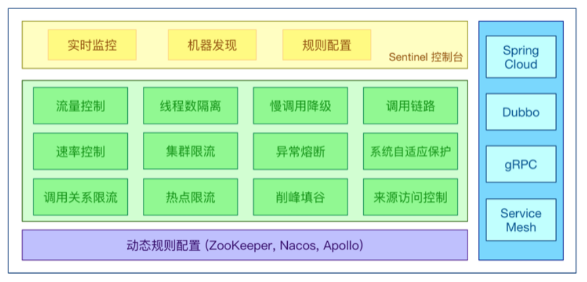
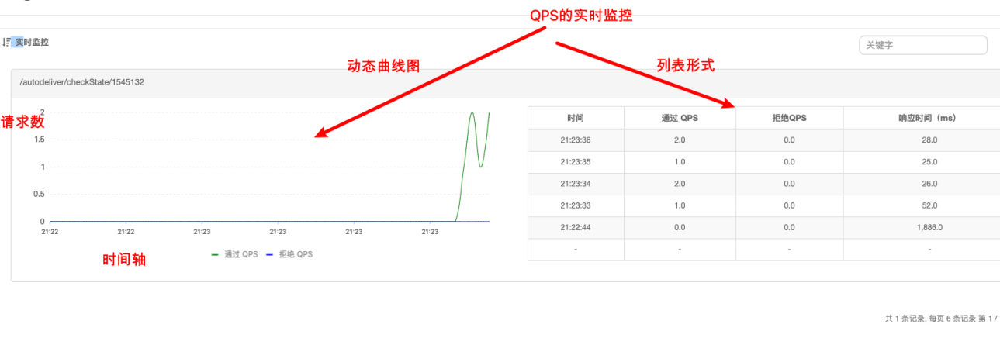
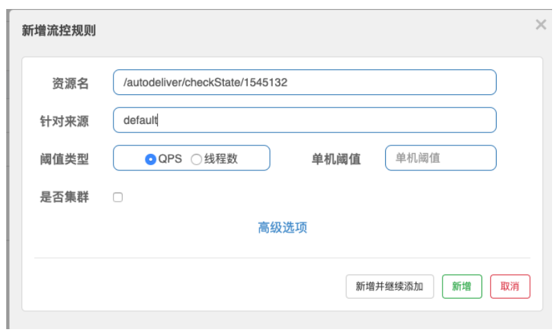
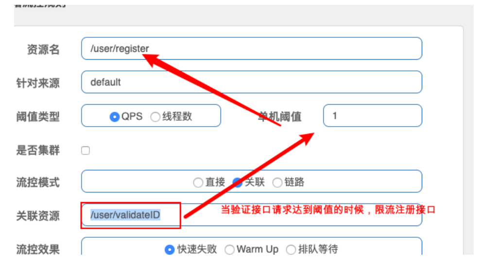
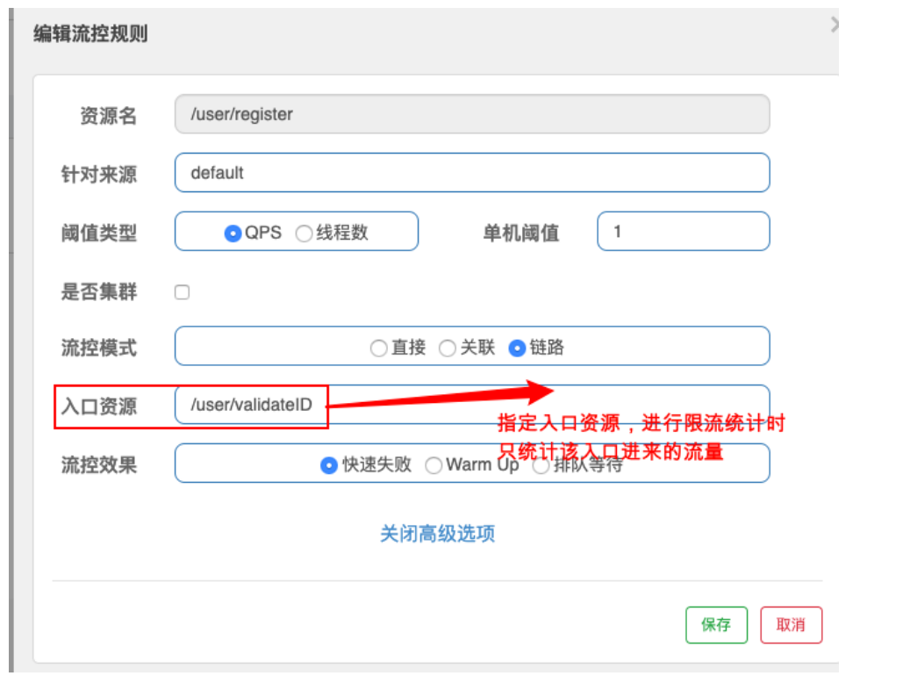
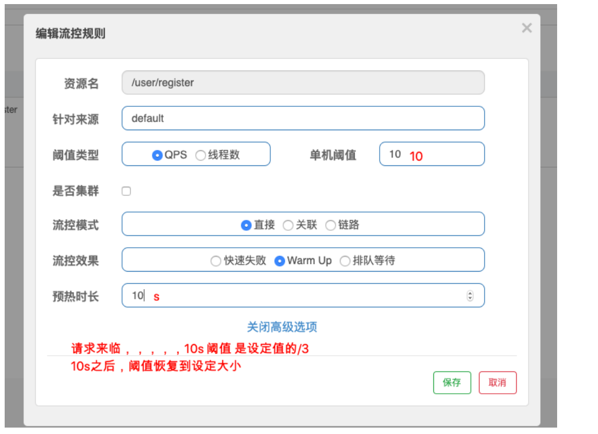

[toc]

## 一、SCA Sentinel 分布式系统的流量防卫兵

### 1. 简介

Sentinel 是⼀个⾯向云原⽣微服务的流量控制、熔断降级组件，可替代Hystrix，针对问题：

- 服务雪崩
- 服务熔断
- 服务降级
- 服务限流


### 2. Sentinel 分为两个部分

- **核心库：**（Java 客户端）不依赖任何框架/库，能够运⾏于所有 Java 运⾏时环境，同时对 Dubbo / Spring Cloud 等框架也有较好的支持
- **控制台：**（Dashboard）基于 Spring Boot 开发，打包后可以直接运⾏，不需要额外的 Tomcat 等应⽤容器


### 3. Hystrix和Sentinel的对比

**Sentinel**

- Sentinel 主要以预防为主，流控、降级措施都是防止服务被压宕机
- **在服务提供者设置流控及降级的规则**

- 提供 jar包，**==可独立部署Dashboard==**/控制台组件
- 在**==调用方的微服务中==**，无需像 Hystrix 那样硬编码，**==减少了代码入侵==**
- 仅通过**==UI界面配置规则==**即可完成对微服务的细粒度控制

**Hystrix**

- Hystrix 主要以调用方为主，当服务提供者正常返回太少时，执行熔断、降级措施，返回兜底数据
- **在服务消费者设置熔断及降级的规则**
- 通过编码实现
- Hystrix Dashboard需要单独建立工程部署

### 4. Sentinel 的功能

- **丰富的应用场景**

  Sentinel 承接了阿⾥巴巴近 10 年的双十一⼤促流量的核⼼场景，例如秒杀（即突发流量控制在系统容量可以承受的范围）、消息削峰填⾕、集群流量控制、实时熔断下游不可⽤应⽤等。

- **完备的实时监控**

  Sentinel 同时提供实时的监控功能。您可以在控制台中看到接⼊应⽤的单台机器秒级数据，甚⾄ 500 台以下规模的集群的汇总运⾏情况。

- **广泛的开源生态**

  Sentinel 提供开箱即⽤的与其它开源框架/库的整合模块，例如与 Spring Cloud、Dubbo的整合。您只需要引入相应的依赖并进⾏简单的配置即可快速地接⼊ Sentinel。

- **完善的 SPI 扩展点**

  Sentinel 提供简单易⽤、完善的 SPI 扩展接⼝。您可以通过实现扩展接⼝来快速地定制逻辑。例如定制规则管理、适配动态数据源等。




## 二、Sentinel 部署

**下载地址：**https://github.com/alibaba/Sentinel/releases 我们使⽤v1.7.1

**启动：**java -jar sentinel-dashboard-1.7.1.jar &

**用户名/密码：**sentinel/sentinel


## 三、改造微服务（服务消费者）对接到Sentinel 

### 1. 添加Sentinel 核心依赖

```xml
<!--sentinel 核⼼环境 依赖-->
<dependency>
    <groupId>com.alibaba.cloud</groupId>
    <artifactId>spring-cloud-starter-alibaba-sentinel</artifactId>
</dependency>
```


### 2. 添加全局配置文件

配置sentinel dashboard，暴露断点依然要有，**==删除原有hystrix配置==**，**==删除原有OpenFeign的降级配置==**

```yaml
server:
  port: 8098
spring:
  application:
    name: lagou-service-autodeliver
  cloud:
    nacos:
      discovery:
        server-addr: 127.0.0.1:8848,127.0.0.1:8849,127.0.0.1:8850
    sentinel:
      transport:
        dashboard: 127.0.0.1:8080 # sentinel dashboard/console 地址
        port: 8719   #  sentinel会在该端口启动http server，那么这样的话，控制台定义的一些限流等规则才能发送传递过来，
                      #如果8719端口被占用，那么会依次+1
      # Sentinel Nacos数据源配置，Nacos中的规则会自动同步到sentinel流控规则中
      datasource:
        # 自定义的流控规则数据源名称
        flow:
          nacos:
            server-addr: ${spring.cloud.nacos.discovery.server-addr}
            data-id: ${spring.application.name}-flow-rules
            groupId: DEFAULT_GROUP
            data-type: json
            rule-type: flow  # 类型来自RuleType类
        # 自定义的降级规则数据源名称
        degrade:
          nacos:
            server-addr: ${spring.cloud.nacos.discovery.server-addr}
            data-id: ${spring.application.name}-degrade-rules
            groupId: DEFAULT_GROUP
            data-type: json
            rule-type: degrade  # 类型来自RuleType类
management:
  endpoints:
    web:
      exposure:
        include: "*"
  # 暴露健康接口的细节
  endpoint:
    health:
      show-details: always
#针对的被调用方微服务名称,不加就是全局生效
lagou-service-resume:
  ribbon:
    #请求连接超时时间
    ConnectTimeout: 2000
    #请求处理超时时间
    ##########################################Feign超时时长设置
    ReadTimeout: 3000
    #对所有操作都进行重试
    OkToRetryOnAllOperations: true
    ####根据如上配置，当访问到故障请求的时候，它会再尝试访问一次当前实例（次数由MaxAutoRetries配置），
    ####如果不行，就换一个实例进行访问，如果还不行，再换一次实例访问（更换次数由MaxAutoRetriesNextServer配置），
    ####如果依然不行，返回失败信息。
    MaxAutoRetries: 0 #对当前选中实例重试次数，不包括第一次调用
    MaxAutoRetriesNextServer: 0 #切换实例的重试次数
    NFLoadBalancerRuleClassName: com.netflix.loadbalancer.RoundRobinRule #负载策略调整
logging:
  level:
    # Feign日志只会对日志级别为debug的做出响应
    com.lagou.edu.controller.service.ResumeServiceFeignClient: debug
```


### 3. 触发一次服务请求，再查看控制台




## 四、Sentinel 流量控制

### 1. 普通设置属性



#### 1.1 资源名

默认填写**==请求路径==**

#### 1.2 针对来源

Sentinel可以**==针对调用者进行限流==**，填写微服务名称，默认**==default（不区分来源）==**

#### 1.3 阈值类型/单机阈值

- QPS：当调⽤该资源的**==QPS达到阈值时进⾏限流==**
- 线程数：当**==调⽤该资源的线程数达到阈值的时候进行限流==**（线程处理请求的时候，如果说业务逻辑执⾏时间很⻓，流量洪峰来临时，会耗费很多线程资源，这些线程资源会堆积，最终可能造成服务不可⽤，进⼀步上游服务不可⽤，最终可能服务雪崩）

#### 1.4 是否集群

是否集群限流


### 2. 高级设置选项

#### 2.1 流控模式

- **==直接==**：资源调⽤达到限流条件时，直接限流
- **==关联==**：关联的资源调⽤达到阈值时候限流⾃⼰
- **==链路==**：指定链路上的流量控制

#### 2.2 流控效果

- 快速失败：**==直接失败，抛出异常==**
- Warm Up（预热模式）：根据冷加载因⼦（默认3）的值，从阈值/冷加载因⼦，经过预热时⻓，才达到设置的QPS阈值
- 排队等待：匀速排队，**==让请求匀速通过==**，**==阈值类型必须设置为QPS==**，否则⽆效


### 3. 流控模式-关联

**关联限流（下游达到阈值被限流，则上游也被关联限流）**

关联的资源调⽤达到阈值时候限流⾃⼰，⽐如⽤户注册接⼝，需要调⽤身份证校验接⼝，如果身份证校验接⼝请求达到阈值，使⽤关联，可以对⽤户注册接⼝进⾏限流




### 4. 流控模式-链路

链路模式下会控制该资源所在的调⽤链路⼊⼝的流量。需要在规则中配置⼊⼝资源




### 5. 流控效果-Warm UP

当系统⻓期处于空闲的情况下，当流量突然增加时，直接把系统拉升到⾼⽔位可能瞬间把系统压垮，⽐如电商⽹站的秒杀模块。

Warm Up 模式控制流量，默认**==从设置的 QPS 阈值的 1/3在设置的预热时间内缓慢增加至 QPS 设置阈值==**。



### 6. 流控效果-排队等待

匀速让请求通过，需设置具体的超时时间，当计算的**==等待时间大于超时时间==**时请求就会**==被拒绝==**。


## 五、Sentinel 降级规则

