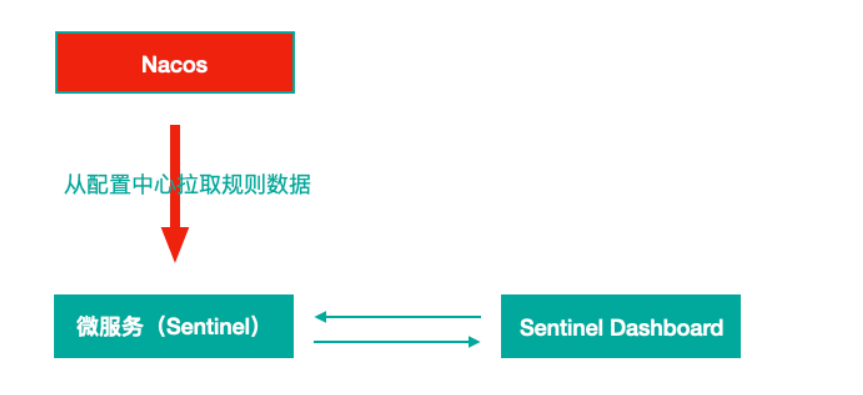
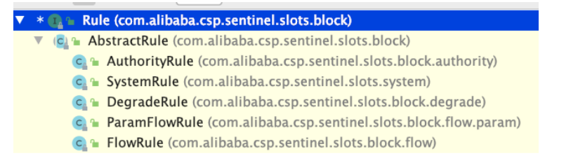

[toc]

## 一、SCA Sentinel 分布式系统的流量防卫兵

### 1. 简介

Sentinel 是⼀个⾯向云原⽣微服务的流量控制、熔断降级组件，可替代Hystrix，针对问题：

- 服务雪崩
- 服务熔断
- 服务降级
- 服务限流


### 2. Sentinel 分为两个部分

- **核心库：**（Java 客户端）不依赖任何框架/库，能够运⾏于所有 Java 运⾏时环境，同时对 Dubbo / Spring Cloud 等框架也有较好的支持
- **控制台：**（Dashboard）基于 Spring Boot 开发，打包后可以直接运⾏，不需要额外的 Tomcat 等应⽤容器


### 3. Hystrix和Sentinel的对比

**Sentinel**

- Sentinel 主要以预防为主，流控、降级措施都是防止服务被压宕机
- **在服务提供者设置==流控及降级==的规则**

- 提供 jar包，**==可独立部署Dashboard==**/控制台组件
- 在**==调用方的微服务中==**，无需像 Hystrix 那样硬编码，**==减少了代码入侵==**
- 仅通过**==UI界面配置规则==**即可完成对微服务的细粒度控制

**Hystrix**

- Hystrix 主要以调用方为主，当服务提供者正常返回太少时，执行熔断、降级措施，返回兜底数据
- **在服务消费者设置==熔断及降级==的规则**
- 通过编码实现
- Hystrix Dashboard需要单独建立工程部署

### 4. Sentinel 的功能

- **丰富的应用场景**

  Sentinel 承接了阿⾥巴巴近 10 年的双十一⼤促流量的核⼼场景，例如秒杀（即突发流量控制在系统容量可以承受的范围）、消息削峰填⾕、集群流量控制、实时熔断下游不可⽤应⽤等。

- **完备的实时监控**

  Sentinel 同时提供实时的监控功能。您可以在控制台中看到接⼊应⽤的单台机器秒级数据，甚⾄ 500 台以下规模的集群的汇总运⾏情况。

- **广泛的开源生态**

  Sentinel 提供开箱即⽤的与其它开源框架/库的整合模块，例如与 Spring Cloud、Dubbo的整合。您只需要引入相应的依赖并进⾏简单的配置即可快速地接⼊ Sentinel。

- **完善的 SPI 扩展点**

  Sentinel 提供简单易⽤、完善的 SPI 扩展接⼝。您可以通过实现扩展接⼝来快速地定制逻辑。例如定制规则管理、适配动态数据源等。


## 二、Sentinel 部署

**下载地址：**https://github.com/alibaba/Sentinel/releases 我们使⽤v1.7.1

**启动：**java -jar sentinel-dashboard-1.7.1.jar

**访问地址：**http://localhost:8080（Sentinel默认端口为8080）

**用户名/密码：**sentinel/sentinel


## 三、改造服务提供者，对接到Sentinel（在服务提供者设置限流、降级规则） 

### 1. 添加Sentinel 核心环境的依赖

```xml
<!--sentinel 核⼼环境 依赖-->
<dependency>
    <groupId>com.alibaba.cloud</groupId>
    <artifactId>spring-cloud-starter-alibaba-sentinel</artifactId>
</dependency>
```


### 2. 添加全局配置文件

配置sentinel dashboard，暴露断点依然要有

```yaml
server:
  port: 6060
  servlet:
    context-path: /user
spring:
  application:
    name: user-service
  cloud:
    nacos:
      discovery:
        # 配置nacos server地址
        server-addr: www.test.com:8848
        # 配置注册到的命名空间
        namespace: 2828fa51-4187-4ee8-9d7c-6a4d91b614b2
        # 配置注册到的分组
        group: sca-demo
    sentinel:
      transport:
        dashboard: 127.0.0.1:8080 # sentinel dashboard/console 地址
        port: 8719   #  sentinel会在该端口启动http server，那么这样的话，控制台定义的一些限流等规则才能发送传递过来，如果8719端口被占用，那么会依次+1
      # Sentinel Nacos数据源配置，Nacos中的规则会自动同步到sentinel流控规则中
      datasource:
        # 自定义的流控规则数据源名称
        flow:
          nacos:
            server-addr: ${spring.cloud.nacos.discovery.server-addr}
            data-id: ${spring.application.name}-flow-rules
            groupId: DEFAULT_GROUP
            data-type: json
            rule-type: flow  # 类型来自RuleType类
        # 自定义的降级规则数据源名称
        degrade:
          nacos:
            server-addr: ${spring.cloud.nacos.discovery.server-addr}
            data-id: ${spring.application.name}-degrade-rules
            groupId: DEFAULT_GROUP
            data-type: json
            rule-type: degrade  # 类型来自RuleType类
  datasource:
    driver-class-name: com.mysql.jdbc.Driver
    url: jdbc:mysql://localhost:3306/demo_jpa?useSSL=false&characterEncoding=utf-8&serverTimezone=GMT
    username: root
    password: 123456
  jpa:
    database: MySQL
    show-sql: true
    hibernate:
      naming:
        physical-strategy: org.hibernate.boot.model.naming.PhysicalNamingStrategyStandardImpl  #避免将驼峰命名转换为下划线命名
  zipkin:
    base-url: http://127.0.0.1:9411 # zipkin server的请求地址
    sender:
      # web 客户端将踪迹日志数据通过网络请求的方式传送到服务端，另外还有配置
      # kafka/rabbit 客户端将踪迹日志数据传递到mq进行中转
      type: web
  sleuth:
    sampler:
      # 采样率 1 代表100%全部采集 ，默认0.1 代表10% 的请求踪迹数据会被采集
      # 生产环境下，请求量非常大，没有必要所有请求的踪迹数据都采集分析，对于网络包括server端压力都是比较大的，可以配置采样率采集一定比例的请求的踪迹数据进行分析即可
      probability: 1


ribbon:
  #请求连接超时时间
  ConnectTimeout: 2000
  #请求处理超时时间,Feign超时时长设置,默认1秒超时。与Hystrix超时时长比较，取最短的生效
  ReadTimeout: 10000
  #对所有操作都进行重试
  OkToRetryOnAllOperations: true
  ####根据如上配置，当访问到故障请求的时候，它会再尝试访问一次当前实例（次数由MaxAutoRetries配置），
  ####如果不行，就换一个实例进行访问，如果还不行，再换一次实例访问（更换次数由MaxAutoRetriesNextServer配置），
  ####如果依然不行，返回失败信息。
  MaxAutoRetries: 0 #对当前选中实例重试次数，不包括第一次调用
  MaxAutoRetriesNextServer: 0 #切换实例的重试次数
  NFLoadBalancerRuleClassName: com.netflix.loadbalancer.RoundRobinRule #负载策略调整

# 开启Feign的熔断功能
feign:
  compression:
    request:
      # 开启请求压缩
      enabled: true
      # 设置压缩的数据类型，此处也是默认值
      mime-types: text/html,application/xml,application/json
      # 设置触发压缩的⼤⼩下限，此处也是默认值
      min-request-size: 2048
    response:
      # 开启响应压缩
      enabled: true
  hystrix:
    enabled: true

hystrix:
  command:
    default:
      circuitBreaker:
        # 强制打开熔断器，如果该属性设置为true，强制断路器进⼊打开状态，将会拒绝所有的请求。 默认false关闭的
        forceOpen: false
        # 触发熔断错误⽐例阈值，默认值50%
        errorThresholdPercentage: 50
        # 熔断后休眠时⻓，默认值5秒
        sleepWindowInMilliseconds: 3000
        # 熔断触发最⼩请求次数，默认值是20
        requestVolumeThreshold: 2
      execution:
        isolation:
          thread:
            # 熔断超时设置，默认为1秒。与ribbon的超时时长比较，最短的生效
            timeoutInMilliseconds: 9900

management:
  endpoints:
    web:
      exposure:
        include: "*"

logging:
  level:
    # Feign日志只会对日志级别为debug的做出响应
    com.tangdi.webserver: debug
    # 分布式链路追踪日志
    org.springframework.web.servlet.DispatcherServlet: debug
    org.springframework.cloud.sleuth: debug
```


### 3. 触发一次服务请求，再查看控制台


## 四、Sentinel 流量控制

### 1. 普通设置属性


#### 1.1 资源名

默认填写**==请求路径==**

#### 1.2 针对来源

Sentinel可以**==针对调用者进行限流==**，填写微服务名称，默认**==default（不区分来源）==**

#### 1.3 阈值类型/单机阈值

- QPS：当调⽤该资源的**==QPS达到阈值时进行限流==**，**==该秒内的剩余请求被拒绝==**
- 线程数：当**==调⽤该资源的线程数达到阈值的时候进行限流==**（线程处理请求的时候，如果说业务逻辑执⾏时间很⻓，流量洪峰来临时，会耗费很多线程资源，这些线程资源会堆积，最终可能造成服务不可⽤，进⼀步上游服务不可⽤，最终可能服务雪崩）

#### 1.4 是否集群

是否集群限流


### 2. 高级设置选项

#### 2.1 流控模式

- **==直接==**：资源调⽤达到限流条件时，直接限流
- **==关联==**：关联的资源调⽤达到阈值时候限流⾃⼰
- **==链路==**：指定链路上的流量控制

#### 2.2 流控效果

- 快速失败：**==直接失败，抛出异常==**
- Warm Up（预热模式）：根据冷加载因⼦（默认3）的值，从阈值/冷加载因⼦，经过预热时⻓，才达到设置的QPS阈值
- 排队等待：匀速排队，**==让请求匀速通过==**，**==阈值类型必须设置为QPS==**，否则⽆效


### 3. 流控模式-关联

**关联限流（下游达到阈值被限流，则上游也被关联限流）**

关联的资源调⽤达到阈值时候限流⾃⼰，⽐如⽤户注册接⼝，需要调⽤身份证校验接⼝，如果身份证校验接⼝请求达到阈值，使⽤关联，可以对⽤户注册接⼝进⾏限流


### 4. 流控模式-链路

链路模式下会控制该资源所在的调⽤链路⼊⼝的流量。需要在规则中配置⼊⼝资源


### 5. 流控效果-Warm UP

当系统⻓期处于空闲的情况下，当流量突然增加时，直接把系统拉升到⾼⽔位可能瞬间把系统压垮，⽐如电商⽹站的秒杀模块。

Warm Up 模式控制流量，默认**==从设置的 QPS 阈值的 1/3在设置的预热时间内缓慢增加至 QPS 设置阈值==**。


### 6. 流控效果-排队等待

匀速让请求通过，需设置具体的超时时间，当计算的**==等待时间大于超时时间==**时请求就会**==被拒绝==**。


## 五、Sentinel 降级规则（等于Hystrix的熔断）

Sentinel不会像Hystrix那样放过⼀个请求尝试⾃我修复，就是明明确确按照时间窗⼝来，熔断触发后，**==时间窗口内拒绝请求，时间窗⼝后就恢复==**

### 1. RT（平均响应时间 ） 

当 1s 内持续进⼊ >=5 个请求，平均响应时间超过阈值（以 ms 为单位），那么在接下的时间窗⼝（以 s 为单位）之内，对这个⽅法的调⽤都会⾃动地熔断（抛出 DegradeException）。注意 Sentinel 默认统计的 RT 上限是 4900 ms，超出此阈值的都会算作 4900 ms，若需要变更此上限可以通过启动配置项 -Dcsp.sentinel.statistic.max.rt=xxx 来配置。

### 2. 异常⽐例

当资源的每秒请求量 >= 5，并且每秒异常总数占通过量的⽐值超过阈值之后，资源进⼊降级状态，即在接下的时间窗⼝（以 s 为单位）之内，对这个⽅法的调⽤都会⾃动地返回。异常⽐率的阈值范围是 [0.0, 1.0] ，代表 0% - 100%

### 3. 异常数

当资源近 1 分钟的异常数⽬超过阈值之后会进⾏熔断。注意由于统计时间窗⼝是分钟级别的，若 timeWindow ⼩于 60s，则结束熔断状态后仍可能再进⼊熔断状态。

时间窗⼝ >= 60s


## 六、Sentinel 自定义兜底逻辑（被降级返回的兜底数据）

**@SentinelResource**注解类似于Hystrix中的@HystrixCommand注解，属性如下

- value：定义资源名
- blockHandlerClass：指定Sentinel规则异常兜底逻辑所在class类
- blockHandler：指定Sentinel规则异常兜底逻辑具体哪个⽅法
- fallbackClass：指定Java运⾏时异常兜底逻辑所在class类
- fallback：指定Java运⾏时异常兜底逻辑具体哪个⽅法

### 1. 在API接口资源处配置（提供者方法）

```java
import com.alibaba.csp.sentinel.annotation.SentinelResource;
import com.alibaba.csp.sentinel.slots.block.BlockException;
import com.lagou.edu.config.SentinelHandlersClass;
import com.lagou.edu.controller.service.ResumeServiceFeignClient;
import org.springframework.beans.factory.annotation.Autowired;
import org.springframework.web.bind.annotation.GetMapping;
import org.springframework.web.bind.annotation.PathVariable;
import org.springframework.web.bind.annotation.RequestMapping;
import org.springframework.web.bind.annotation.RestController;

@RestController
@RequestMapping("/autodeliver")
public class AutodeliverController {


    @Autowired
    private ResumeServiceFeignClient resumeServiceFeignClient;

    @GetMapping("/checkState/{userId}")
    @SentinelResource(value = "findResumeOpenState",blockHandlerClass = SentinelHandlersClass.class,
            blockHandler = "handleException",fallbackClass = SentinelHandlersClass.class,fallback = "handleError")
    public Integer findResumeOpenState(@PathVariable Long userId) {
        // 模拟降级：
        /*try {
            Thread.sleep(1000);
        } catch (InterruptedException e) {
            e.printStackTrace();
        }*/
        // 模拟降级：异常比例
        //int i = 1/0;
        Integer defaultResumeState = resumeServiceFeignClient.findDefaultResumeState(userId);
        return defaultResumeState;
    }
}
```


### 2. 自定义兜底逻辑类

```java
import com.alibaba.csp.sentinel.slots.block.BlockException;

public class SentinelHandlersClass {

    // 整体要求和当时Hystrix一样，这里还需要在形参中添加BlockException参数，用于接收异常
    // 注意：方法是静态的
    public static Integer handleException(Long userId, BlockException blockException) {
        return -100;
    }

    public static Integer handleError(Long userId) {
        return -500;
    }

}
```


## 七、基于 Nacos 实现 Sentinel 规则持久化

⽬前，Sentinel Dashboard中添加的**规则数据存储在内存**，微服务停掉规则数据就消失。我们可以**将Sentinel规则数据持久化到Nacos配置中⼼**，让微服务**从Nacos获取规则数据**




### 1. 接入Sentinel的微服务添加pom.xml依赖

```xml
<!-- Sentinel⽀持采⽤ Nacos 作为规则配置数据源，引⼊该适配依赖 -->
<dependency>
    <groupId>com.alibaba.csp</groupId>
    <artifactId>sentinel-datasource-nacos</artifactId>
</dependency>
```


### 2. 全局配置文件中添加Nacos数据源

```yaml
spring:
  cloud:
    sentinel:
      # Sentinel Nacos数据源配置，Nacos中的规则会自动同步到sentinel流控规则中
      datasource:
        # 自定义的流控规则数据源名称
        flow:
          nacos:
            server-addr: ${spring.cloud.nacos.discovery.server-addr}
            data-id: ${spring.application.name}-flow-rules
            groupId: DEFAULT_GROUP
            data-type: json
            rule-type: flow  # 类型来自RuleType类
        # 自定义的降级规则数据源名称
        degrade:
          nacos:
            server-addr: ${spring.cloud.nacos.discovery.server-addr}
            data-id: ${spring.application.name}-degrade-rules
            groupId: DEFAULT_GROUP
            data-type: json
            rule-type: degrade  # 类型来自RuleType类
```


### 3. Nacos Server中添加对应规则配置集（public命名空间—>DEFAULT_GROUP中添加）

#### 3.1 流控规则配置集取名为 lagou-service-autodeliver-flow-rules

```
[
 {
 
 "resource":"findResumeOpenState",
 "limitApp":"default",
 "grade":1,
 "count":1,
 "strategy":0,
 "controlBehavior":0,
 "clusterMode":false
 }
]
```

**所有属性来⾃源码FlowRule类**

- resource：资源名称

- limitApp：来源应⽤

- grade：阈值类型 0 线程数 1 QPS

- count：单机阈值

- strategy：流控模式，0 直接 1 关联 2 链路

- controlBehavior：流控效果，0 快速失败 1 Warm Up 2 排队等待

- clusterMode：true/false 是否集群

#### 3.2 降级规则配置集 lagou-service-autodeliver-degrade-rules

```
[
 {
 
 "resource":"findResumeOpenState",
 "grade":2,
 "count":1,
 "timeWindow":5
 }
]
```

**所有属性来⾃源码DegradeRule类**

- resource：资源名称
- grade：降级策略 0 RT 1 异常⽐例 2 异常数
- count：阈值
- timeWindow：时间窗


#### 3.3 **Rule** 源码体系结构



- ⼀个资源可以同时有多个限流规则和降级规则，所以配置集中是⼀个json数 组

- Sentinel控制台中修改规则，仅是内存中⽣效，不会修改Nacos中的配置值，重启后恢复原来的值； Nacos控制台中修改规则，不仅内存中⽣效，Nacos中持久化规则也⽣效，重启后规则依然保持

