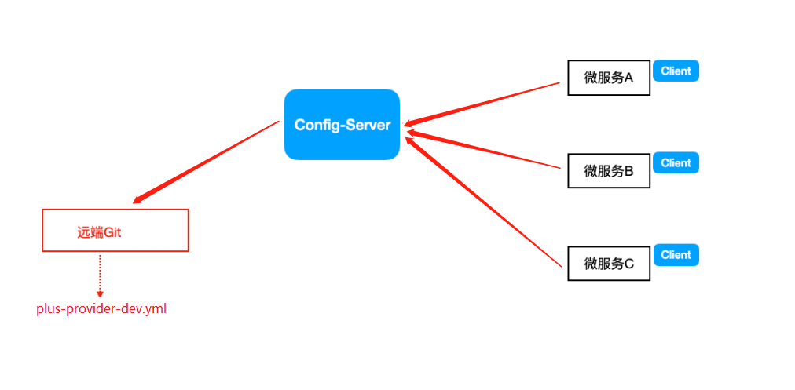

[toc]

## 一、Spring Cloud Config 应用场景

- 微服务架构中，分布式集群环境中微服务众多，不可能⼀个⼀个去修改配置然后重启⽣效，在⼀定场景下我们还需要在运⾏期间动态调整配置信息，⽐如：根据各个微服务的负载情况，动态调整数据源连接池⼤⼩，我们希望配置内容发⽣变化的时候，微服务可以⾃动更新。


## 二、Spring Cloud Config 简介

Spring Cloud Confifig是⼀个分布式配置管理⽅案，包含了 Server端和 Client端两个部分。

- Config Server：从云端的Git获取配置文件存入本地缓存，为Client提高获取配置数据的接口，通过使⽤@EnableConfifigServer注解在 Spring boot 应⽤中⾮常简单的嵌⼊

- Config Client：通过Config Server的接⼝获取配置数据并初始化⾃⼰的应⽤




## 三、Spring Cloud Config 应用

#### 1. 在远程Git仓库创建项目：config-repo


#### 2. 上传配置文件至config-repo，命名规范如下

{application}-{profifile}.yml 

示例：service-resume-dev.yml、service-resume-test.yml、service-resume-prod.yml

application为应⽤名称，profifile指的是环境（⽤于区分开发环境，测试环境、⽣产环境等）


#### 3. 创建Config 分布式配置管理中心工程

##### 3.1 pom.xml

```xml
<?xml version="1.0" encoding="UTF-8"?>
<project xmlns="http://maven.apache.org/POM/4.0.0"
         xmlns:xsi="http://www.w3.org/2001/XMLSchema-instance"
         xsi:schemaLocation="http://maven.apache.org/POM/4.0.0 http://maven.apache.org/xsd/maven-4.0.0.xsd">
    <parent>
        <artifactId>scn-parent</artifactId>
        <groupId>com.tangdi</groupId>
        <version>1.0-SNAPSHOT</version>
    </parent>
    <modelVersion>4.0.0</modelVersion>

    <artifactId>lagou-cloud-configserver-9006</artifactId>

    <dependencies>
        <!--eureka client 客户端依赖引入-->
        <dependency>
            <groupId>org.springframework.cloud</groupId>
            <artifactId>spring-cloud-starter-netflix-eureka-client</artifactId>
        </dependency>
        <!--config配置中心服务端-->
        <dependency>
            <groupId>org.springframework.cloud</groupId>
            <artifactId>spring-cloud-config-server</artifactId>
        </dependency>
        <dependency>
            <groupId>org.springframework.cloud</groupId>
            <artifactId>spring-cloud-starter-bus-amqp</artifactId>
        </dependency>
    </dependencies>
</project>
```


##### 3.2 创建启动类

使⽤注解@EnableConfigServer开启配置中⼼服务器功能

```java
import org.springframework.boot.SpringApplication;
import org.springframework.boot.autoconfigure.SpringBootApplication;
import org.springframework.cloud.client.discovery.EnableDiscoveryClient;
import org.springframework.cloud.config.server.EnableConfigServer;


@SpringBootApplication
@EnableDiscoveryClient
@EnableConfigServer  // 开启配置中心功能
public class ConfigServerApplication9006 {

    public static void main(String[] args) {
        SpringApplication.run(ConfigServerApplication9006.class,args);
    }
}
```


##### 3.3 全局配置文件

```yaml
server:
  port: 9006
#注册到Eureka服务中心
eureka:
  client:
    service-url:
      # 注册到集群，就把多个Eurekaserver地址使用逗号连接起来即可；注册到单实例（非集群模式），那就写一个就ok
      defaultZone: http://LagouCloudEurekaServerA:8761/eureka,http://LagouCloudEurekaServerB:8762/eureka
  instance:
    #服务实例中显示ip，而不是显示主机名（兼容老的eureka版本）
    prefer-ip-address: true
    # 实例名称： 192.168.1.103:lagou-service-resume:8080，我们可以自定义它
    instance-id: ${spring.cloud.client.ip-address}:${spring.application.name}:${server.port}:@project.version@

spring:
  application:
    name: configserver
  cloud:
    config:
      server:
        git:
          uri: https://github.com/5173098004/config-repo.git #配置git服务地址
          username: 495003879@qq.com #配置git用户名
          password: 123456 #配置git密码
          search-paths:
            - config-repo
      # 读取分支
      label: master
  rabbitmq:
    host: 127.0.0.1
    port: 5672
    username: guest
    password: guest

management:
  endpoints:
    web:
      exposure:
        include: "*"
  # 暴露健康接口的细节
  endpoint:
    health:
      show-details: always
```


##### 3.4 测试访问：http://localhost:9006/master/lagou-service-resume-dev.yml，查看到配置⽂件内容


#### 4. 改造已有微服务为Config Client工程

##### 4.1 在已有工程加上依赖

```xml
<dependency>
    <groupId>org.springframework.cloud</groupId>
    <artifactId>spring-cloud-config-client</artifactId>
</dependency>
```


##### 4.2 创建系统级的全局配置文件bootstrap

把与分布式配置中⼼连接的配置信息放到bootstrap.yml

bootstrap为系统级别的SpringBoot配置文件，优先级⽐application.yml⾼。系统启动时，先加载bootstrap文件去Config Server拉取application配置文件并加载

```yaml
spring:
  cloud:
    # config客户端配置,和ConfigServer通信，并告知ConfigServer希望获取的配置信息在哪个⽂件中
    config:
      name: lagou-service-resume #配置⽂件名称
      profile: dev #后缀名称
      label: master #分⽀名称
      uri: http://localhost:9006 #ConfigServer配置中⼼地址
```


## 四、Spring Cloud Config 手动刷新

Git上的配置文件更新后，不⽤重启微服务，客户端使⽤post去触发refresh，获取最新数据，之后再访问即可

### 1. 前提条件

#### 1.1 Client客户端需要依赖springboot-starter-actuator

#### 1.2 Client客户端bootstrap.yml中添加配置（暴露通信端点）

```yaml
management:
  endpoints:
    web:
      exposure:
        include: "*"
```

#### 1.3 Client客户端使⽤到配置信息的类上添加@RefreshScope

#### 1.4 ⼿动向Client客户端发起POST请求，http://localhost:8080/actuator/refresh，刷新配置信息


## 五、Spring Cloud Config 自动刷新

### 1. ZK的分布式配置天然的自动刷新

若分布式配置中心用的是ZK（存储+通知），ZK中数据变更，可以通知各个监听的客户端，客户端收到通知之后可以做出相应的操作（对于数据库连接信息、连接池等信息变化更新的，那么会在通知逻辑中进⾏处理，⽐如重新初始化连接池）

### 2. Spring Cloud Config的分布式配置中心可配合消息总线

在微服务架构中，我们可以结合消息总线（Bus）实现分布式配置的⾃动更新（Spring Cloud Config+Spring Cloud Bus）

### 3. 消息总线Bus

Spring Cloud Bus（基于MQ的，⽀持RabbitMq/Kafka） 是Spring Cloud中的消息总线⽅案，构建⼀个共⽤的Topic，通过这个Topic连接各个微服务实例，MQ⼴播的消息会被所有在注册中⼼的微服务实例监听和消费

Spring Cloud Confifig + Spring Cloud Bus 结合可以实现配置信息的⾃动更新。


### 4. 基于消息总线实现自动配置刷新

MQ消息代理，我们可选择使⽤RabbitMQ

*ConfifigServer*和*ConfifigClient*都添加消息总线的⽀持以及与RabbitMq的连接信息

##### 4.1 Confifig Server/ConfifigClient 添加消息总线⽀持

```xml
<dependency>
    <groupId>org.springframework.cloud</groupId>
    <artifactId>spring-cloud-starter-bus-amqp</artifactId>
</dependency>
```


##### 4.2 ConfifigServer/ConfifigClient 添加配置

```yaml
spring:
  rabbitmq:
    host: 127.0.0.1
    port: 5672
    username: guest
    password: guest
```


##### 4.3 微服务暴露端⼝

```yaml
management:
  endpoints:
    web:
      exposure:
        include: "*"
```


##### 4.4 向配置中⼼服务端发送post请求Config Server的接口地址http://localhost:9006/actuator/bus-refresh，各个客户端配置即可⾃动刷新

##### 4.5 定向更新，在发起刷新请求的时候http://localhost:9006/actuator/bus-refresh/lagou-service-resume:8081
