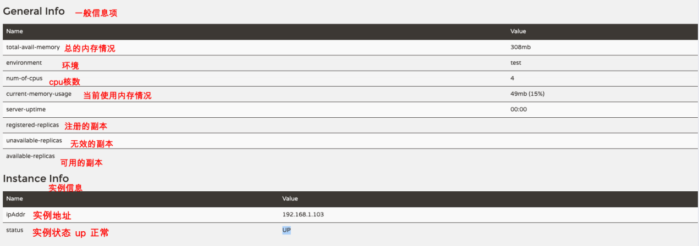

[toc]


## 一、Eureka 架构及原理

### 1. 基础架构

Eureka 包含两个组件

- Eureka Client：服务提供者作为Eureka客户端，封装了与Eureka服务端的交互操作；
- Eureka Server：**==即所谓的服务注册与发现中心==**，提供注册服务（存储服务提供者的信息），发现服务功能

- 服务提供者启动时，通过eureka client注册信息到注册中心
- 服务提供者通过eureka client定时发送renew心跳（续约）
- 服务消费者通过eureka client定时从注册中心拉取服务列表


### 2. 具体流程

#### [可查看SCN的常见问题](SCN-常见问题)


Eureka Server集群

- 每个Eureka Server同时也是Eureka Client，将自身注册到其他注册中心，以便数据互相同步
- 当有服务通过Eureka Client注册到Eureka Server时，Eureka Server集群会进行数据同步
- Eureka Server接收到服务的注册信息，将服务信息缓存在**==registry注册表（ConcurrentHashMap）==**中，并且还额外提供两级缓存，分别是一级（只读缓存）和二级（读写缓存），**==一级缓存默认30秒从二级缓存拉取一次信息==**。**==二级缓存与注册表实时同步==**
- **==每隔 60S（默认值） 扫描一次服务列表==**，若服务**==超过 90S（默认值）  未续约==**，则**==剔除该服务==**


Eureka Client

1. 服务启动时，将信息注册到注册中心
2. **==每隔 30S（默认值）==**，发送一次**==心跳/renew（续约）==**
3. **==每隔 30S（默认值）==**，从**==注册中心拉取服务列表并缓存在本地==**
4. **==Ribbon每隔 30S（默认值）==**，从Eureka Client获取服务信息并缓存在本地


### 3.Eureka Server的三级缓存

[详情查看Eureka Server配置](#3.Eureka Server配置)

Eureka Server存在三个变量：

- registry
- readWriteCacheMap
- readOnlyCacheMap

客户端注册到Eureka Server后，默认情况下定时任务**==每30s将readWriteCacheMap同步至readOnlyCacheMap==**，**==每60s清理超过90s未续约的节点==**


| **缓存**              | 类型                       | 说明                                                         |
| --------------------- | -------------------------- | ------------------------------------------------------------ |
| **registry**          | ConcurrentHashMap          | **实时更新**，类AbstractInstanceRegist成员变量，UI端请求的是这里的服务注册信息 |
| **readWriteCacheMap** | Guava /Cache /LoadingCache | **实时更新**，类ResponseCacheImpl成员变量，缓存时间180秒。当服务下线、过期、注册、状态变更，都会来清除此缓存中的数据。 |
| **readOnlyCacheMap**  | ConcurrentHashMap          | **周期更新**，类ResponseCacheImpl成员变量，默认每30s从readWriteCacheMap更新，Eureka client默认从这里更新服务注册信息，可配置直接从readWriteCacheMap更新 |


### 4.Eureka Client的两级缓存

[详情查看Eureka Client配置](#2.Eureka Client配置)

Eureka Client存在两种角色：

- 服务消费者，默认情况下 **==每30s从Eureka Server一级缓存readOnlyCacheMap拉取服务注册信息==**

- **==Ribbon 默认每30s 从Eureka Client拉取注册信息==**，通过`ribbon.server-list-refresh-interval`配置


| **缓存**            | 类型              | 说明                                                         |
| ------------------- | ----------------- | ------------------------------------------------------------ |
| localRegionApps     | AtomicReference   | **周期更新** ，类DiscoveryClient成员变量，Eureka Client保存服务注册信息，启动后立即向Server全量更新，默认每30s增量更新 |
| upServerListZoneMap | ConcurrentHashMap | **周期更新** ，类LoadBalancerStats成员变量，Ribbon保存使用且状态为UP的服务注册信息，启动后延时1s向Client更新，默认每30s更新 |


## 二、Eureka 配置详情

### 1.元数据

Eureka的元数据有两种：标准元数据和⾃定义元数据。

#### 1.1 标准元数据

主机名、IP地址、端⼝号等信息，这些信息都会被注册在服务注册表中，⽤于服务之间的调⽤。

#### 1.2 ⾃定义元数据

可以使⽤eureka.instance.metadata-map配置，符合K-V的存储格式。这些元数据可以在远程客户端中访问。

```yaml
#注册到Eureka服务中心
eureka:
  instance:
    # 自定义Eureka元数据
    metadata-map:
      cluster: cl1
      region: rn1
```


### 2.Eureka Client配置

```yaml
#注册到Eureka服务中心
eureka:
  client:
    # 每隔多久拉取⼀次服务列表
    registry-fetch-interval-seconds: 30
    service-url:
      # 注册到集群，就把多个Eurekaserver地址使用逗号连接起来即可
      defaultZone: http://localhost:8761/eureka,http://localhost:8762/eureka
  instance:
    #使⽤ip注册，否则会使⽤主机名注册了（此处考虑到对⽼版本的兼容，新版本经过实验都是ip）
    prefer-ip-address: true  
    # 实例名称： 192.168.1.103:lagou-service-resume:8080，我们可以自定义它
    instance-id: ${spring.cloud.client.ip-address}:${spring.application.name}:${server.port}
    # 租约续约间隔时间，默认30秒
    lease-renewal-interval-in-seconds: 30
    # 租约到期，服务时效时间，默认值90秒,服务超过90秒没有发⽣⼼跳，EurekaServer会将服务从列表移除
    lease-expiration-duration-in-seconds: 90

```


### 3.Eureka Server配置

```yaml
# eureka 客户端配置（和Server交互），Eureka Server 其实也是一个Client
eureka:
  server:
    # 定时扫描服务列表，若服务在一定时间内没有续约（默认90秒），则会注销此实例，默认60秒
    eviction-interval-timer-in-ms: 60000
    # 关闭一级缓存readOnlyCacheMap
    use-read-only-response-cache: false
    # readOnlyCacheMap从二级缓存拉取注册信息间隔
    responsec-cache-update-interval-ms: 30000
    # 关闭⾃我保护模式（缺省为打开）
    enable-self-preservation: false 
  instance:
    hostname: LagouCloudEurekaServerA  # 当前eureka实例的主机名
    # 租约到期，服务时效时间，默认值90秒,服务超过90秒没有发⽣⼼跳，EurekaServer会将服务从列表移除
    lease-expiration-duration-in-seconds: 90
  client:
    service-url:
      # 配置客户端所交互的Eureka Server的地址（Eureka Server集群中每一个Server其实相对于其它Server来说都是Client）
      # 集群模式下，defaultZone应该指向其它Eureka Server，如果有更多其它Server实例，逗号拼接即可
      defaultZone: http://localhost:8762/eureka
    register-with-eureka: true  # 集群模式下可以改成true,是否注册到注册中心
    fetch-registry: true # 集群模式下可以改成true
  dashboard:
    enabled: true
```


## 三、Eureka 基础应用

### 1.创建父类工程

#### 1.1 pom.xml

```xml
<?xml version="1.0" encoding="UTF-8"?>
<project xmlns="http://maven.apache.org/POM/4.0.0"
         xmlns:xsi="http://www.w3.org/2001/XMLSchema-instance"
         xsi:schemaLocation="http://maven.apache.org/POM/4.0.0 http://maven.apache.org/xsd/maven-4.0.0.xsd">
    <modelVersion>4.0.0</modelVersion>

    <groupId>com.tangdi</groupId>
    <artifactId>scn-parent</artifactId>
    <version>1.0-SNAPSHOT</version>
    <!--父工程打包方式为pom-->
    <packaging>pom</packaging>

    <!--spring boot 父启动器依赖-->
    <parent>
        <groupId>org.springframework.boot</groupId>
        <artifactId>spring-boot-starter-parent</artifactId>
        <version>2.1.6.RELEASE</version>
    </parent>

    <dependencyManagement>
        <dependencies>
            <!--spring cloud依赖管理，引入了Spring Cloud的版本-->
            <dependency>
                <groupId>org.springframework.cloud</groupId>
                <artifactId>spring-cloud-dependencies</artifactId>
                <version>Greenwich.RELEASE</version>
                <type>pom</type>
                <scope>import</scope>
            </dependency>
        </dependencies>
    </dependencyManagement>


    <dependencies>
        <!--web依赖-->
        <dependency>
            <groupId>org.springframework.boot</groupId>
            <artifactId>spring-boot-starter-web</artifactId>
        </dependency>
        <!--日志依赖-->
        <dependency>
            <groupId>org.springframework.boot</groupId>
            <artifactId>spring-boot-starter-logging</artifactId>
        </dependency>
        <!--测试依赖-->
        <dependency>
            <groupId>org.springframework.boot</groupId>
            <artifactId>spring-boot-starter-test</artifactId>
            <scope>test</scope>
        </dependency>
        <!--lombok工具-->
        <dependency>
            <groupId>org.projectlombok</groupId>
            <artifactId>lombok</artifactId>
            <version>1.18.4</version>
            <scope>provided</scope>
        </dependency>
        <!-- Actuator可以帮助你监控和管理Spring Boot应用-->
        <dependency>
            <groupId>org.springframework.boot</groupId>
            <artifactId>spring-boot-starter-actuator</artifactId>
        </dependency>
        <!--热部署-->
        <dependency>
            <groupId>org.springframework.boot</groupId>
            <artifactId>spring-boot-devtools</artifactId>
            <optional>true</optional>
        </dependency>

        <!--eureka server 需要引入Jaxb，开始-->
        <dependency>
            <groupId>com.sun.xml.bind</groupId>
            <artifactId>jaxb-core</artifactId>
            <version>2.2.11</version>
        </dependency>
        <dependency>
            <groupId>javax.xml.bind</groupId>
            <artifactId>jaxb-api</artifactId>
        </dependency>
        <dependency>
            <groupId>com.sun.xml.bind</groupId>
            <artifactId>jaxb-impl</artifactId>
            <version>2.2.11</version>
        </dependency>
        <dependency>
            <groupId>org.glassfish.jaxb</groupId>
            <artifactId>jaxb-runtime</artifactId>
            <version>2.2.10-b140310.1920</version>
        </dependency>
        <dependency>
            <groupId>javax.activation</groupId>
            <artifactId>activation</artifactId>
            <version>1.1.1</version>
        </dependency>
        <!--引入Jaxb，结束-->

        <dependency>
            <groupId>org.springframework.cloud</groupId>
            <artifactId>spring-cloud-commons</artifactId>
        </dependency>
    </dependencies>

    <build>
        <plugins>
            <!--编译插件-->
            <plugin>
                <groupId>org.apache.maven.plugins</groupId>
                <artifactId>maven-compiler-plugin</artifactId>
                <configuration>
                    <source>1.8</source>
                    <target>1.8</target>
                    <encoding>utf-8</encoding>
                </configuration>
            </plugin>
            <!--打包插件-->
            <plugin>
                <groupId>org.springframework.boot</groupId>
                <artifactId>spring-boot-maven-plugin</artifactId>
            </plugin>
        </plugins>
    </build>
</project>
```


### 2.创建Eureka Server工程（创建两个用作集群）

#### 2.1 pom.xml

```xml
<?xml version="1.0" encoding="UTF-8"?>
<project xmlns="http://maven.apache.org/POM/4.0.0"
         xmlns:xsi="http://www.w3.org/2001/XMLSchema-instance"
         xsi:schemaLocation="http://maven.apache.org/POM/4.0.0 http://maven.apache.org/xsd/maven-4.0.0.xsd">
    <parent>
        <artifactId>scn-parent</artifactId>
        <groupId>com.tangdi</groupId>
        <version>1.0-SNAPSHOT</version>
    </parent>
    <modelVersion>4.0.0</modelVersion>

    <artifactId>scn-eureka-server</artifactId>

    <dependencies>
        <!--Eureka server依赖-->
        <dependency>
            <groupId>org.springframework.cloud</groupId>
            <artifactId>spring-cloud-starter-netflix-eureka-server</artifactId>
        </dependency>
    </dependencies>
</project>
```

#### 2.2 启动类及说明

通过@EnableEurekaServer声明为Eureka Server注册中心

```java
import org.springframework.boot.SpringApplication;
import org.springframework.boot.autoconfigure.SpringBootApplication;
import org.springframework.cloud.netflix.eureka.server.EnableEurekaServer;

@SpringBootApplication
// 声明当前项目为Eureka服务
@EnableEurekaServer
public class LagouEurekaServerApp8761 {

    public static void main(String[] args) {
        SpringApplication.run(LagouEurekaServerApp8761.class,args);
    }
}
```


#### 2.3 全局配置文件及说明

在 ⼀个实例中，把另外的实例作为了集群中的镜像节点，那么这个http://EurekaServerB:8762/eureka URL 中的EurekaServerB 就要和其它个profifile 中的eureka.instance.hostname 保持⼀致

```yaml
server:
  port: 8761
spring:
  application:
    name: scn-eureka-server
# eureka 客户端配置（和Server交互），Eureka Server 其实也是一个Client
eureka:
  server:
    # 定时扫描服务列表，若服务在一定时间内没有续约（默认90秒），则会注销此实例，默认60秒
    eviction-interval-timer-in-ms: 30000
    # 关闭一级缓存
    use-read-only-response-cache: false
  instance:
    hostname: EurekaServerB  # 当前eureka实例的主机名
  client:
    service-url:
      # 配置客户端所交互的Eureka Server的地址（Eureka Server集群中每一个Server其实相对于其它Server来说都是Client）
      # 集群模式下，defaultZone应该指向其它Eureka Server，如果有更多其它Server实例，逗号拼接即可
      defaultZone: http://localhost:8761/eureka,http://localhost:8762/eureka
    # 集群模式下可以改成true,是否注册到注册中心
    register-with-eureka: true
    # 集群模式下可以改成true
    fetch-registry: true
  dashboard:
    enabled: true
```


#### 2.4 管理界面元素介绍

访问网址:http://127.0.0.1:8761/





### 3.创建公共API工程

#### 3.1 pom.xml

```xml
<?xml version="1.0" encoding="UTF-8"?>
<project xmlns="http://maven.apache.org/POM/4.0.0"
         xmlns:xsi="http://www.w3.org/2001/XMLSchema-instance"
         xsi:schemaLocation="http://maven.apache.org/POM/4.0.0 http://maven.apache.org/xsd/maven-4.0.0.xsd">
    <parent>
        <artifactId>scn-demo</artifactId>
        <groupId>com.tangdi</groupId>
        <version>1.0-SNAPSHOT</version>
    </parent>
    <modelVersion>4.0.0</modelVersion>

    <artifactId>api-service</artifactId>


    <dependencies>
        <dependency>
            <groupId>org.springframework.boot</groupId>
            <artifactId>spring-boot-starter-data-jpa</artifactId>
        </dependency>
        <dependency>
            <groupId>mysql</groupId>
            <artifactId>mysql-connector-java</artifactId>
            <scope>runtime</scope>
        </dependency>
        <dependency>
            <groupId>org.springframework.boot</groupId>
            <artifactId>spring-boot-starter-data-redis</artifactId>
        </dependency>

        <!--链路追踪-->
        <dependency>
            <groupId>org.springframework.cloud</groupId>
            <artifactId>spring-cloud-starter-sleuth</artifactId>
        </dependency>
        <!--Zipkin Client聚合链路sleuth-->
        <dependency>
            <groupId>org.springframework.cloud</groupId>
            <artifactId>spring-cloud-starter-zipkin</artifactId>
        </dependency>
    </dependencies>
</project>
```


#### 3.2 创建domain以及接口interface

```java
import lombok.Data;

import javax.persistence.*;
import java.util.Date;

@Table(name="auth_code")
@Entity
@Data
public class AuthCode {

    @Id
    @GeneratedValue(strategy = GenerationType.IDENTITY)
    private Integer id;
    private String email;
    private String code;
    private Date createtime;
    private Date expiretime;

}
```

```java
package com.tangdi.service.email;


import com.tangdi.domain.email.MailEntity;

public interface MailService {
    void sendSimpleMail(MailEntity entity);
}
```


### 4.创建Eureka Client-服务提供者工程

#### 4.1 pom.xml

```xml
<?xml version="1.0" encoding="UTF-8"?>
<project xmlns="http://maven.apache.org/POM/4.0.0"
         xmlns:xsi="http://www.w3.org/2001/XMLSchema-instance"
         xsi:schemaLocation="http://maven.apache.org/POM/4.0.0 http://maven.apache.org/xsd/maven-4.0.0.xsd">
    <parent>
        <artifactId>scn-demo</artifactId>
        <groupId>com.tangdi</groupId>
        <version>1.0-SNAPSHOT</version>
    </parent>
    <modelVersion>4.0.0</modelVersion>

    <artifactId>code-service</artifactId>


    <dependencies>
        <dependency>
            <groupId>com.tangdi</groupId>
            <artifactId>api-service</artifactId>
            <version>1.0-SNAPSHOT</version>
        </dependency>

        <!--eureka client 客户端依赖引入-->
        <dependency>
            <groupId>org.springframework.cloud</groupId>
            <artifactId>spring-cloud-starter-netflix-eureka-client</artifactId>
        </dependency>

        <!-- &lt;!&ndash;分布式配置中心config client&ndash;&gt;
        <dependency>
            <groupId>org.springframework.cloud</groupId>
            <artifactId>spring-cloud-config-client</artifactId>
        </dependency>

        &lt;!&ndash;openfeign&ndash;&gt;
        <dependency>
            <groupId>org.springframework.cloud</groupId>
            <artifactId>spring-cloud-starter-openfeign</artifactId>
        </dependency>-->
    </dependencies>
</project>
```


#### 4.2 启动类及说明

从Spring Cloud Edgware版本开始，@EnableDiscoveryClient 或@EnableEurekaClient 可省略

**==@EnableDiscoveryClient和@EnableEurekaClient⼆者的功能相同==**。但是如果选⽤的是eureka服务器，那么就推荐@EnableEurekaClient，如果是其他的注册中⼼，那么推荐使⽤@EnableDiscoveryClient

考虑到通⽤性，我们使⽤@EnableDiscoveryClient

```java
import org.springframework.boot.SpringApplication;
import org.springframework.boot.autoconfigure.SpringBootApplication;
import org.springframework.boot.autoconfigure.domain.EntityScan;
import org.springframework.cloud.client.discovery.EnableDiscoveryClient;
import org.springframework.context.annotation.Bean;
import org.springframework.context.support.PropertySourcesPlaceholderConfigurer;

@SpringBootApplication
@EntityScan("com.lagou.edu.pojo")
//@EnableEurekaClient  // 开启Eureka Client（Eureka独有）
// 说明：从SpringCloud的Edgware版本开始，不加注解也ok，但是建议大家加上
@EnableDiscoveryClient // 开启注册中心客户端 （通用型注解，比如注册到Eureka、Nacos等）                
public class CodeServiceApplication {
    public static void main(String[] args) {
        SpringApplication.run(CodeServiceApplication.class,args);
    }

}

```


#### 3.3 全局配置文件及说明

```yaml
server:
  port: 7071
  servlet:
    context-path: /code

spring:
  application:
    name: code-service
  datasource:
    driver-class-name: com.mysql.jdbc.Driver
    url: jdbc:mysql://localhost:3306/demo_jpa?useSSL=false&characterEncoding=utf-8&serverTimezone=GMT
    username: root
    password: 123456
  jpa:
    database: MySQL
    show-sql: true
    hibernate:
      naming:
        #避免将驼峰命名转换为下划线命名
        physical-strategy: org.hibernate.boot.model.naming.PhysicalNamingStrategyStandardImpl  


#注册到Eureka服务中心
eureka:
  client:
    # 每隔多久拉取⼀次服务列表
    registry-fetch-interval-seconds: 10
    service-url:
      # 注册到集群，就把多个Eurekaserver地址使用逗号连接起来即可
      defaultZone: http://localhost:8761/eureka,http://localhost:8762/eureka
  instance:
    prefer-ip-address: true  #使⽤ip注册，否则会使⽤主机名注册了（此处考虑到对⽼版本的兼容，新版本经过实验都是ip）
    # 实例名称： 192.168.1.103:lagou-service-resume:8080，我们可以自定义它
    instance-id: ${spring.cloud.client.ip-address}:${spring.application.name}:${server.port}
    # 租约续约间隔时间，默认30秒
    lease-renewal-interval-in-seconds: 10
    # 租约到期，服务时效时间，默认值90秒,服务超过90秒没有发⽣⼼跳，EurekaServer会将服务从列表移除
    lease-expiration-duration-in-seconds: 30
```


#### 3.4 提供服务的Controller略


### 5.创建Eureka Client-服务消费者工程

#### 5.1 pom.xml

```xml
<?xml version="1.0" encoding="UTF-8"?>
<project xmlns="http://maven.apache.org/POM/4.0.0"
         xmlns:xsi="http://www.w3.org/2001/XMLSchema-instance"
         xsi:schemaLocation="http://maven.apache.org/POM/4.0.0 http://maven.apache.org/xsd/maven-4.0.0.xsd">
    <parent>
        <artifactId>scn-demo</artifactId>
        <groupId>com.tangdi</groupId>
        <version>1.0-SNAPSHOT</version>
    </parent>
    <modelVersion>4.0.0</modelVersion>

    <artifactId>user-service</artifactId>


    <dependencies>
        <dependency>
            <groupId>com.tangdi</groupId>
            <artifactId>api-service</artifactId>
            <version>1.0-SNAPSHOT</version>
        </dependency>

        <!--eureka client 客户端依赖引入-->
        <dependency>
            <groupId>org.springframework.cloud</groupId>
            <artifactId>spring-cloud-starter-netflix-eureka-client</artifactId>
        </dependency>

        <!-- &lt;!&ndash;分布式配置中心config client&ndash;&gt;
        <dependency>
            <groupId>org.springframework.cloud</groupId>
            <artifactId>spring-cloud-config-client</artifactId>
        </dependency>

        &lt;!&ndash;openfeign&ndash;&gt;
        <dependency>
            <groupId>org.springframework.cloud</groupId>
            <artifactId>spring-cloud-starter-openfeign</artifactId>
        </dependency>-->
    </dependencies>
</project>
```


#### 5.2 启动类及说明

从Spring Cloud Edgware版本开始，@EnableDiscoveryClient 或@EnableEurekaClient 可省略

**==@EnableDiscoveryClient和@EnableEurekaClient⼆者的功能相同==**。但是如果选⽤的是eureka服务器，那么就推荐@EnableEurekaClient，如果是其他的注册中⼼，那么推荐使⽤@EnableDiscoveryClient

考虑到通⽤性，我们使⽤@EnableDiscoveryClient

```java
import org.springframework.boot.SpringApplication;
import org.springframework.boot.autoconfigure.SpringBootApplication;
import org.springframework.boot.web.servlet.ServletRegistrationBean;
import org.springframework.cloud.client.circuitbreaker.EnableCircuitBreaker;
import org.springframework.cloud.client.discovery.EnableDiscoveryClient;
import org.springframework.cloud.client.loadbalancer.LoadBalanced;
import org.springframework.cloud.openfeign.EnableFeignClients;
import org.springframework.context.annotation.Bean;
import org.springframework.web.client.RestTemplate;

@SpringBootApplication
@EntityScan("com.lagou.edu.pojo")
//@EnableEurekaClient  // 开启Eureka Client（Eureka独有）
// 说明：从SpringCloud的Edgware版本开始，不加注解也ok，但是建议大家加上
@EnableDiscoveryClient // 开启注册中心客户端 （通用型注解，比如注册到Eureka、Nacos等）
public class UserServiceApplication {

    public static void main(String[] args) {
        SpringApplication.run(UserServiceApplication.class,args);
    }

    /**
     * 注⼊RestTemplate
     * @return
     */
    @Bean
    public RestTemplate getRestTemplate() {
        return new RestTemplate();
    }

}

```


#### 3.3 全局配置文件及说明

```yaml
server:
  port: 7070
  servlet:
    context-path: /user
spring:
  application:
    name: user-service
  datasource:
    driver-class-name: com.mysql.jdbc.Driver
    url: jdbc:mysql://localhost:3306/demo_jpa?useSSL=false&characterEncoding=utf-8&serverTimezone=GMT
    username: root
    password: 123456
  jpa:
    database: MySQL
    show-sql: true
    hibernate:
      naming:
        #避免将驼峰命名转换为下划线命名
        physical-strategy: org.hibernate.boot.model.naming.PhysicalNamingStrategyStandardImpl  


#注册到Eureka服务中心
eureka:
  client:
    # 每隔多久拉取⼀次服务列表
    registry-fetch-interval-seconds: 10
    service-url:
      # 注册到集群，就把多个Eurekaserver地址使用逗号连接起来即可
      defaultZone: http://localhost:8761/eureka,http://localhost:8762/eureka
  instance:
    prefer-ip-address: true  #使⽤ip注册，否则会使⽤主机名注册了（此处考虑到对⽼版本的兼容，新版本经过实验都是ip）
    # 实例名称： 192.168.1.103:lagou-service-resume:8080，我们可以自定义它
    instance-id: ${spring.cloud.client.ip-address}:${spring.application.name}:${server.port}
    # 租约续约间隔时间，默认30秒
    lease-renewal-interval-in-seconds: 10
    # 租约到期，服务时效时间，默认值90秒,服务超过90秒没有发⽣⼼跳，EurekaServer会将服务从列表移除
    lease-expiration-duration-in-seconds: 30
```


#### 5.4 通过Eureka发现服务并调用RestFul接口

```java
import com.netflix.hystrix.contrib.javanica.annotation.HystrixCommand;
import com.netflix.hystrix.contrib.javanica.annotation.HystrixProperty;
import org.springframework.beans.factory.annotation.Autowired;
import org.springframework.cloud.client.discovery.DiscoveryClient;
import org.springframework.web.bind.annotation.GetMapping;
import org.springframework.web.bind.annotation.PathVariable;
import org.springframework.web.bind.annotation.RequestMapping;
import org.springframework.web.bind.annotation.RestController;
import org.springframework.web.client.RestTemplate;

@RestController
@RequestMapping("/autodeliver")
public class AutodeliverController {

    @Autowired
    private RestTemplate restTemplate;

    @Autowired
    private DiscoveryClient discoveryClient;


    /**
     * 服务注册到Eureka之后的改造
     * @param userId
     * @return
     */
    @GetMapping("/checkState/{userId}")
    public Integer findResumeOpenState(@PathVariable Long userId) {

        // 从eureka server根据服务名获取实例列表
        List<ServiceInstance> instances = discoveryClient.getInstances("code-service");
        
        // 如果有多个实例，选择一个使用(负载均衡的过程)
        ServiceInstance serviceInstance = instances.get(0);
        
        // 从元数据信息获取host port
        String host = serviceInstance.getHost();
        int port = serviceInstance.getPort();
        String url = "http://" + host + ":" + port + "/resume/openstate/" + userId;
        System.out.println("===============>>>从EurekaServer集群获取服务实例拼接的url：" + url);
        // 调用远程服务
        Integer forObject = restTemplate.getForObject(url, Integer.class);
        return forObject;
    }
}
```


## 四、自我保护机制

### 1. 自我保护机制作用

自我保护机制是**Eureka 在CAP理论中 AP 的体现**，即可用性和分区容错性

如果Eureka Server在⼀定时间内（默认90秒）没有接收到某个微服务实例的⼼跳，Eureka Server将会移除该实例。但是当⽹络分区故障发⽣时，微服务与Eureka Server之间⽆法正常通信，⽽微服务本身是正常运⾏的，此时不应该移除这个微服务，所以引⼊了⾃我保护机制

在**==15分钟内超过85%的客户端节点都没有正常的⼼跳==**，那么Eureka就认为客户端与注册中⼼出现了⽹络故障，**==Eureka Server⾃动进⼊⾃我保护机制==**

### 2. 自我保护时的状态

**建议⽣产环境打开⾃我保护机制**

Eureka Server处于自我保护时，新的client仍可以向注册中心注册，但注册中心并不会互相同步数据。当网络恢复时，Server集群才会互相同步信息


## 五、源码剖析

### 1. Server启动过程

##### 1.1 利用SpringBoot自动装配原理，提供自动配置类EurekaServerAutoConfifiguration

eureka-server的jar包，META-INF下⾯有spring.factories配置⽂件，配置了Eureka**==自动配置类EurekaServerAutoConfifiguration==**


##### 1.2 自动配置类的初始化条件

@ConditionalOnBean声明了条件：必须存在名为Marker的bean

开启注册中心的注解**==@EnableEurekaServer，利用@Import向容器注入Marker==**


##### 1.3 EurekaServerAutoConfifiguration注入相关RestFul接口


### 2. EurekaClient定时拉取服务

EurekaClient的**com.netflflix.discovery.DiscoveryClient.initScheduledTasks() **⽅法中，初始化了⼀个 **CacheRefreshThread 定时任务**专⻔⽤来拉取 Eureka Server 的实例信息到本地。

### 3.注册表

com.netflix.eureka.registry.AbstractInstanceRegistry，保存服务注册信息， 持有registry和 responseCache成员变量 

com.netflix.eureka.registry.ResponseCacheImpl ，持有readWriteCacheMap 和readOnlyCacheMap 成员变量
