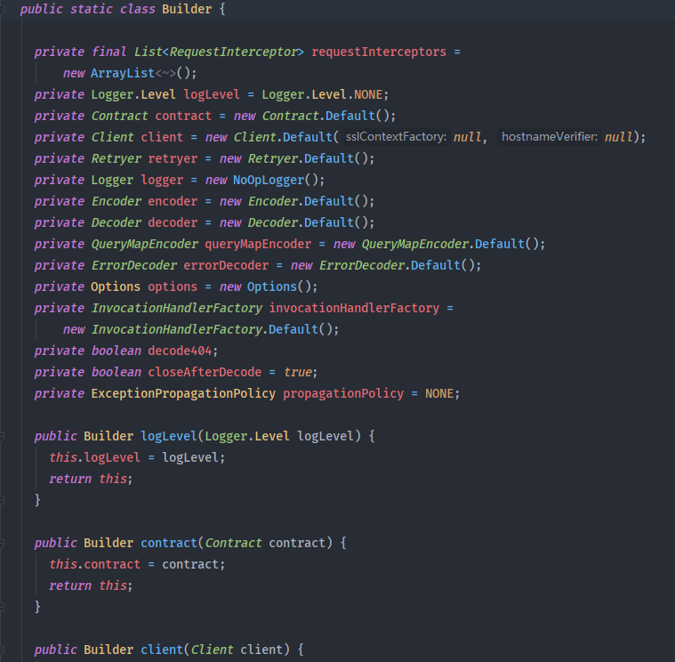
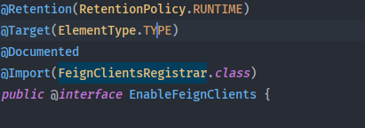
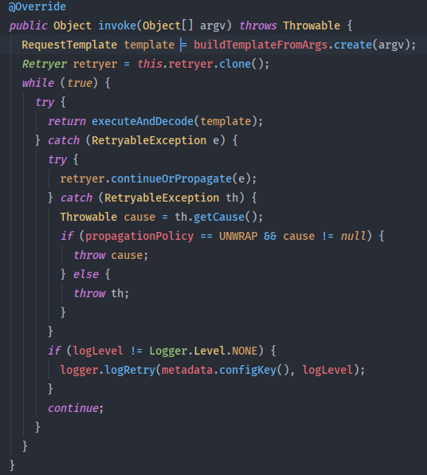
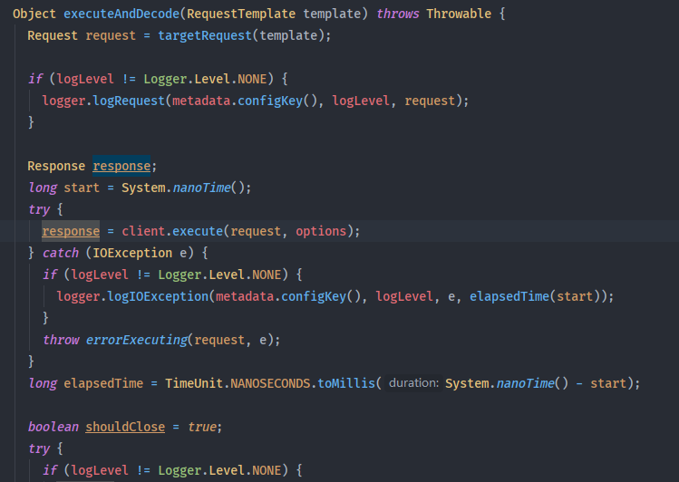
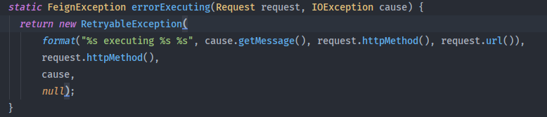
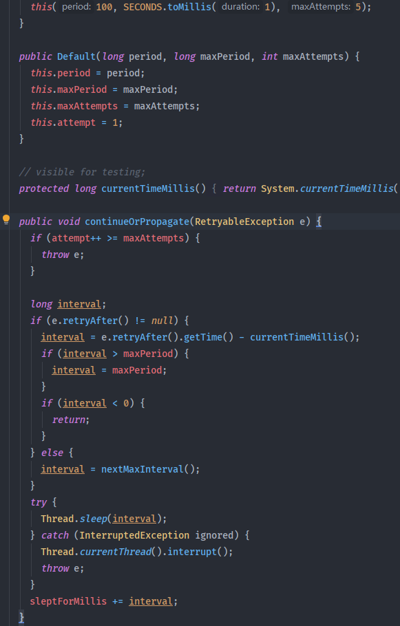

[toc]

## 一、Feign 基础

### 1. 简介

Feign是由Netflix开发的**==轻量级RestFul风格的HTTP服务客户端==**，用于远程过程调用。

类似于Dubbo，也是**==通过java接口生成代理类，去调用远程服务==**。不同于Dubbo，Feign发起的是**==HTTP请求并且Feign的接口需要配置注解使用==**，底层基于RestTemplate实现远程服务调用

（效果）**==Feign==** = **==RestTemplate==** + **==Ribbon==** + **==Hystrix==**

### 2. 衍生OpenFeign

SpringCloud对Feign进⾏了增强，产生了**==OpenFeign==**，它**==⽀持SpringMVC的注解==**

### 3. Feign组件

| 接口 | 作用 | 默认值|
| ---- | ---- | ---- |
|Feign.Builder|Feign的入口|Feign.Builder|
|Client|Feign底层用什么去请求|和Ribbon配合时：LoadBalancerFeignClient                            不和Ribbon配合时：Fgien.Client.Default|
|Contract|契约，注解支持|SpringMVCContract|
|Encoder|解码器，用于将独享转换成HTTP请求消息体|SpringEncoder|
|Decoder|编码器，将相应消息体转成对象|ResponseEntityDecoder|
|Logger|日志管理器|Slf4jLogger|
|RequestInterceptor|用于为每个请求添加通用逻辑（拦截器，例子：比如想给每个请求都带上heared）|无|


## 二、Feign 简单应用及注意事项

### 1. 消费者

#### 1.1 pom文件引入openFeign

若引入openFein，则无需额外引入Hystrix的依赖了

```xml
<!--openfeign-->
<dependency>
    <groupId>org.springframework.cloud</groupId>
    <artifactId>spring-cloud-starter-openfeign</artifactId>
</dependency>
```


#### 1.2 在启动类开启Feign

由于Feign内部集成了熔断器Hystrix，所以可省略@EnableCircuitBreaker来开启熔断器

```java
package com.tangdi;

import org.springframework.boot.SpringApplication;
import org.springframework.boot.autoconfigure.SpringBootApplication;
import org.springframework.cloud.client.discovery.EnableDiscoveryClient;
import org.springframework.cloud.openfeign.EnableFeignClients;

/**
 * @program: scn-demo
 * @description:
 * @author: Wangwentao
 * @create: 2021-08-30 17:31
 **/
@SpringBootApplication
@EnableDiscoveryClient // 开启服务发现
@EnableFeignClients // 开启Feign
public class UserServiceApplication {

    public static void main(String[] args) {
        SpringApplication.run(UserServiceApplication.class,args);
    }
}
```


#### 1.3 创建Feign接口

- @FeignClient注解的name属性用于指定调用的服务名，是服务提供者的applicationName
- contextId 作为多FeignClient上下文id，当有多个FeignClient请求到同个微服务（即多个FeignClient的name相同）时，用以区分
- OpenFeign可以使⽤@PathVariable、@RequestParam、@RequestHeader注解进行参数绑定，这也是OpenFeign对SpringMVC注解的⽀持，但是需要注意value必须设置，否则会抛出异常

```java
package com.tangdi.webservice;

import org.springframework.cloud.openfeign.FeignClient;
import org.springframework.web.bind.annotation.PathVariable;
import org.springframework.web.bind.annotation.RequestMapping;

@FeignClient(value = "code-service",contextId = "code")
public interface CodeFeginClient {

    //调⽤的请求路径
    @RequestMapping("/code/fromEmail/validate/{email}/{code}")
    public Integer vaildAuthCode(@PathVariable String email, @PathVariable String code);
}
```


#### 1.4 使用接口调用远程服务

```java
@Autowired
private CodeFeginClient codeFeginClient;

@Test
public void testFeignClient(){
    Integer state = codeFeginClient.vaildAuthCode(2341231@qq.com,321242);
    System.out.println("=======>>>vaildAuthCode state：" + state);
}
```


## 三、Feign 对Ribbon负载均衡的⽀持

Feign内部集成了Ribbon以及自动配置，所以无需额外引入依赖。相关设置只需在全局配置文件配置即可

### 1.Feign关于Ribbon负载均衡的相关配置

Feign默认的请求处理**==超时时⻓为1s==**，Feign⾃⼰有超时设置，**==如果配置Ribbon的超时，则会以Ribbon的为准==**

Ribbon与Hystrix的超时时长比较，取最短的生效

```yaml
# 针对的被调用方微服务名称.比如此处如果不加user-service，则对所有调用的服务生效
user-service:
  ribbon:
    #请求连接超时时间
    ConnectTimeout: 2000
    #请求处理超时时间,Feign超时时长设置,默认1秒超时。与Hystrix超时时长比较，取最短的生效
    ReadTimeout: 10000
    #对所有操作都进行重试
    OkToRetryOnAllOperations: true
    ####根据如上配置，当访问到故障请求的时候，它会再尝试访问一次当前实例（次数由MaxAutoRetries配置），
    ####如果不行，就换一个实例进行访问，如果还不行，再换一次实例访问（更换次数由MaxAutoRetriesNextServer配置），
    ####如果依然不行，返回失败信息。
    MaxAutoRetries: 0 #对当前选中实例重试次数，不包括第一次调用
    MaxAutoRetriesNextServer: 0 #切换实例的重试次数
    NFLoadBalancerRuleClassName: com.netflix.loadbalancer.RoundRobinRule #负载策略调整
```


## 四、Feign 对熔断器的⽀持

### 1. Feign开启熔断支持

在消费者工程的全局配置中，开启Feign对熔断器的⽀持

开启Hystrix之后，Feign中的⽅法都会被进⾏⼀个管理，⼀旦出现问题就进⼊对应的回退逻辑处理

```yaml
# 开启Feign的熔断功能
feign:
  hystrix:
   enabled: true
```


### 2. 熔断的相关配置

针对超时这⼀点，当前有两个超时时间设置（Feign/hystrix），熔断是根据最小的超时时间为主，最先熔断进⼊回退降级逻辑

```yaml
hystrix:
  command:
    default:
      circuitBreaker:
        # 强制打开熔断器，如果该属性设置为true，强制断路器进⼊打开状态，将会拒绝所有的请求。 默认false关闭的
        forceOpen: false
        # 触发熔断错误⽐例阈值，默认值50%
        errorThresholdPercentage: 50
        # 熔断后休眠时⻓，默认值5秒
        sleepWindowInMilliseconds: 3000 
        # 熔断触发最⼩请求次数，默认值是20
        requestVolumeThreshold: 2
      execution:
        isolation:
          thread:
            # 熔断超时设置，默认为1秒。与ribbon的超时时长比较，最短的生效
            timeoutInMilliseconds: 10000
```


### 3. Feign熔断的降级处理

#### 3.1 ⾃定义FallBack处理类（需要实现FeignClient接⼝）

```java
import org.springframework.stereotype.Component;

/**
* 降级回退逻辑需要定义⼀个类，实现FeignClient接⼝，实现接⼝中的⽅法
**
*/
@Component // 别忘了这个注解，还应该被扫描到
public class CodeFallback implements CodeFeginClient {
    @Override
    public Integer vaildAuthCode(String email,String code) {
        return 0;
    }
}
```

#### 3.2 FeignClient相关修改

##### @FeignClient注解中添加fallback属性

```java
package com.tangdi.webservice;

import org.springframework.cloud.openfeign.FeignClient;
import org.springframework.web.bind.annotation.PathVariable;
import org.springframework.web.bind.annotation.RequestMapping;

@FeignClient(value = "code-service",contextId = "code",fallback = CodeFallback.class)
public interface CodeFeginClient {

    //调⽤的请求路径
    @RequestMapping("/code/fromEmail/validate/{email}/{code}")
    public Integer vaildAuthCode(@PathVariable String email, @PathVariable String code);
}
```


## 五、Feign 对请求/响应压缩的支持

Feign ⽀持对请求和响应进⾏GZIP压缩，以减少通信过程中的性能损耗。通过下⾯的参数 即可开启请求与响应的压缩功能：

```yaml
feign:
  compression:
    request:
      # 开启请求压缩
      enabled: true 
      # 设置压缩的数据类型，此处也是默认值
      mime-types: text/html,application/xml,application/json 
      # 设置触发压缩的⼤⼩下限，此处也是默认值
      min-request-size: 2048 
    response:
      # 开启响应压缩
      enabled: true 
```


## 六、Feign 的日志配置

Feign是http请求客户端，类似于浏览器，它在请求和接收响应的时候，可以打印出⽐较详细的⼀些⽇志信息（响应头，状态码等等）

| 日志级别     | 打印内容                                                     |
| ------------ | ------------------------------------------------------------ |
| NONE（默认） | 不记录任何日志（性能最好）                                   |
| BASIC        | 仅记录请求方法，URL，响应状态代码以及执行时间（适合生产环境） |
| HEADERS      | 记录BASIC级别的基础上，记录请求和响应的header                |
| FULL         | 记录请求和响应header，body和元数据（适⽤于开发及测试环境定位问题） |

### 1. 默认情况下Feign的⽇志没有开启，需要手动配置

```java
import feign.Logger;
import org.springframework.context.annotation.Bean;
import org.springframework.context.annotation.Configuration;

@Configuration
public class FeignLog {
    @Bean
    Logger.Level feignLevel() {
        return Logger.Level.BASIC;
    }
}
```


### 2. 配置log⽇志级别为debug

##### 2.1 Feign日志只会对日志级别为debug的做出响应

```yaml
logging:
  level:
    # 设置所有feignClient的日志级别为debug
    # Feign日志只会对日志级别为debug的做出响应
    com.tangdi.webservice: debug
```


## 七、Feign 完整配置

### 1. Feign 配置项



| 配置项                           | 作用                                                         |
| -------------------------------- | ------------------------------------------------------------ |
| Logger.Level                     | 指定日志级别                                                 |
| Retryer                          | 指定重试策略（默认Retryer.NEVER_RETRY，不重试，直接抛异常）                                                 Retryer.Default 重试5次 |
| ErrorDecoder                     | 指定错误解码器                                               |
| Request.Options                  | 超时时间                                                     |
| `Collection<RequestInterceptor>` | 拦截器                                                       |
| SetterFactory                    | 用于设置Hystrix的配置属性，Fgien整合Hystrix才会用            |

##### 1.1 Feign 默认配置

查看 `EnableFeignClients#defaultConfiguration` 和 `FeignClient#configuration` 属性文档注释

feign默认的配置类为 `org.springframework.cloud.openfeign.FeignClientsConfiguration`

```java
@Configuration
public class FeignClientsConfiguration {

	@Autowired
	private ObjectFactory<HttpMessageConverters> messageConverters;

	@Autowired(required = false)
	private List<AnnotatedParameterProcessor> parameterProcessors = new ArrayList<>();

	@Autowired(required = false)
	private List<FeignFormatterRegistrar> feignFormatterRegistrars = new ArrayList<>();

	@Autowired(required = false)
	private Logger logger;

	@Bean
	@ConditionalOnMissingBean
	public Decoder feignDecoder() {
		return new OptionalDecoder(
				new ResponseEntityDecoder(new SpringDecoder(this.messageConverters)));
	}

	@Bean
	@ConditionalOnMissingBean
	@ConditionalOnMissingClass("org.springframework.data.domain.Pageable")
	public Encoder feignEncoder() {
		return new SpringEncoder(this.messageConverters);
	}

	@Bean
	@ConditionalOnClass(name = "org.springframework.data.domain.Pageable")
	@ConditionalOnMissingBean
	public Encoder feignEncoderPageable() {
		return new PageableSpringEncoder(new SpringEncoder(this.messageConverters));
	}

	@Bean
	@ConditionalOnMissingBean
	public Contract feignContract(ConversionService feignConversionService) {
		return new SpringMvcContract(this.parameterProcessors, feignConversionService);
	}

	@Bean
	public FormattingConversionService feignConversionService() {
		FormattingConversionService conversionService = new DefaultFormattingConversionService();
		for (FeignFormatterRegistrar feignFormatterRegistrar : this.feignFormatterRegistrars) {
			feignFormatterRegistrar.registerFormatters(conversionService);
		}
		return conversionService;
	}

	@Bean
	@ConditionalOnMissingBean
	public Retryer feignRetryer() {
		return Retryer.NEVER_RETRY;
	}

	@Bean
	@Scope("prototype")
	@ConditionalOnMissingBean
	public Feign.Builder feignBuilder(Retryer retryer) {
		return Feign.builder().retryer(retryer);
	}

	@Bean
	@ConditionalOnMissingBean(FeignLoggerFactory.class)
	public FeignLoggerFactory feignLoggerFactory() {
		return new DefaultFeignLoggerFactory(this.logger);
	}

	@Bean
	@ConditionalOnClass(name = "org.springframework.data.domain.Page")
	public Module pageJacksonModule() {
		return new PageJacksonModule();
	}

	@Configuration
	@ConditionalOnClass({ HystrixCommand.class, HystrixFeign.class })
	protected static class HystrixFeignConfiguration {

		@Bean
		@Scope("prototype")
		@ConditionalOnMissingBean
		@ConditionalOnProperty(name = "feign.hystrix.enabled")
		public Feign.Builder feignHystrixBuilder() {
			return HystrixFeign.builder();
		}

	}
}
```

##### 1.2 自定义配置类

**自定义重试类**

```java
@Slf4j
public  class CommonFeignRetry extends Default {
 
    private static final String METRICS_KEY = "feign_retry_count";
 
    private static final String APOLLO_CONFIG_KEY = "feign.retry.enable";
 
    private final Counter metrics = Metrics.newCounter(METRICS_KEY).build();
 
    public CommonFeignRetry() {
        //重试5次 最大间隔时间1秒
        this(100, SECONDS.toMillis(1), 5);
    }
 
    public CommonFeignRetry(long period, long maxPeriod, int maxAttempts) {
        super(period, maxPeriod, maxAttempts);
    }
 
    /**
     * 主要在重试时记录日志
     */
    @Override
    public void continueOrPropagate(RetryableException e) {
        if (Boolean.FALSE.equals(ConfigService.getAppConfig().getBooleanProperty(APOLLO_CONFIG_KEY,
            Boolean.TRUE))) {
            throw e;
        }
        metrics.once();
        log.warn("【FeignRetryAble】Message【{}】", e.getMessage());
        super.continueOrPropagate(e);
    }
 
    @Override
    public Retryer clone() {
        return new CommonFeignRetry();
    }
}
```

**自定义错误编码类**

```java
@Slf4j
public class FeignErrorDecoder implements ErrorDecoder {
 
    @Override
    public Exception decode(String methodKey, Response response) {
        if (response.status() == 502) {
            return new RetryableException("Server 502", response.request().httpMethod(), null);
        } else {
            return errorStatus(methodKey, response);
        }
    }
}
```

**自定义 feign配置类**

```java

@Configuration
public class FeignConfiguration {

    /**
	 * 日志
	 * 
	 */
    @Bean
    Logger.Level feignLevel() {
        return Logger.Level.BASIC;
    }

    /**
	 * timeout设置
	 * 
	 */
    @Bean
    Request.Options feignOptions() {
        return new Request.Options(/**connectTimeoutMillis**/1 * 3000, /** readTimeoutMillis **/1 * 5000);
    }

    /**
	 * 自定义重试
	 * 
	 */
    @Bean
    Retryer getRetryBean() {
        return new CommonFeignRetryer();
    }

    /**
	 * 自定义错误编码类
	 * 
	 */
    @Bean
    ErrorDecoder getError() {
        return new FeignErrorDecoder();
    }
}
```

##### 1.3 yml 自定义feign全局配置

```yaml
feign:
  hystrix:
    enabled: true
  compression:
    request:
      # 开启请求压缩
      enabled: true 
      # 设置压缩的数据类型，此处也是默认值
      mime-types: text/html,application/xml,application/json 
      # 设置触发压缩的⼤⼩下限，此处也是默认值
      min-request-size: 2048 
    response:
      # 开启响应压缩
      enabled: true 
  client:
    config:
      default:
        connectTimeout: 5000  # 相当于Request.Optionsn 连接超时时间
        readTimeout: 5000     # 相当于Request.Options 读取超时时间
        loggerLevel: full     # 配置Feign的日志级别，相当于代码配置方式中的Logger
        errorDecoder: com.example.FeignErrorDecoder  # Feign的错误解码器，相当于代码配置方式中的ErrorDecoder
        retryer: com.example.CommonFeignRetry  # 配置重试，相当于代码配置方式中的Retryer
        requestInterceptors: # 配置拦截器，相当于代码配置方式中的RequestInterceptor
          - com.example.FooRequestInterceptor
          - com.example.BarRequestInterceptor
        # 是否对404错误解码
        decode404: false
        encode: com.example.SimpleEncoder
        decoder: com.example.SimpleDecoder
        contract: com.example.SimpleContract
```


### 2. 全局配置

##### 2.1 注解添加配置类

```java
//在启动类上为@EnableFeignClients注解添加defaultConfiguration配置
@EnableFeignClients(defaultConfiguration = FeignConfiguration.class)
```

##### 2.2 使用yml配置

```yaml
feign:
  client:
    config:
      #将调用的微服务名称改成default就配置成全局的了
      default:
       loggerLevel: FULL
```


### 3. 细粒度配置

> 优先级：细粒度yml配置 > 细粒度代码配置 > 全局yml配置 > 全局代码配置

##### 3.1 注解添加配置类

```java
@FeignClient(name = "code-service"，configuration = FeignConfiguration.class)
public interface CodeFeginClient {
	...
}
```

##### 3.2 使用yml配置

```yaml
feign:
  client:
    config:
      #想要调用的微服务名称
      user-service:
        loggerLevel: FULL
```


## 八、Feign 源码剖析

### 1. 利用SpringBoot的自动配置原理

`org.springframework.cloud.openfeign.FeignClientsRegistrar`



### 2. 利用代理模式，为Feign接口生产代理对象

`feign.SynchronousMethodHandler` 是Feign动态代理的核心类，`invoke` 调用目标 API时包含了重试及抛异常的逻辑。只有**网络IO时**发生 **`IOException`** 异常才会触发重试如 `SocketException`、`SocketTimeoutException`、`ConnectionClosedException `（被封装为了**`RetryableException`**），其他异常直接抛出。

内部死循环调用目标API，终止条件如下：

- 目标API 返回有效结果，return result
- 重试次数达到上限，抛出异常



当调用目标API抛出 **`IOException`**异常 时，异常会被封装为 `RetryableException`并向上抛出。

`invoke` 方法只对 **`RetryableException`**异常进行捕获并调用 `retryer.continueOrPropagate(e)` 处理**重试计数及重试间隔**，次数达到上限则抛出异常。






