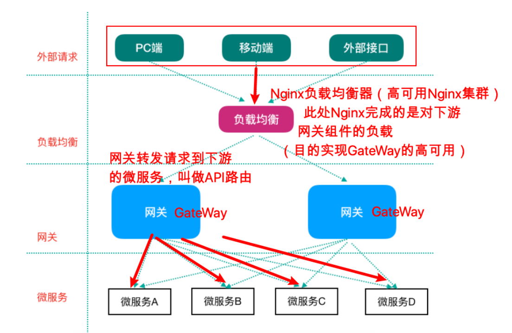
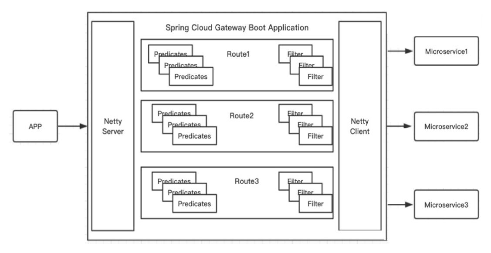
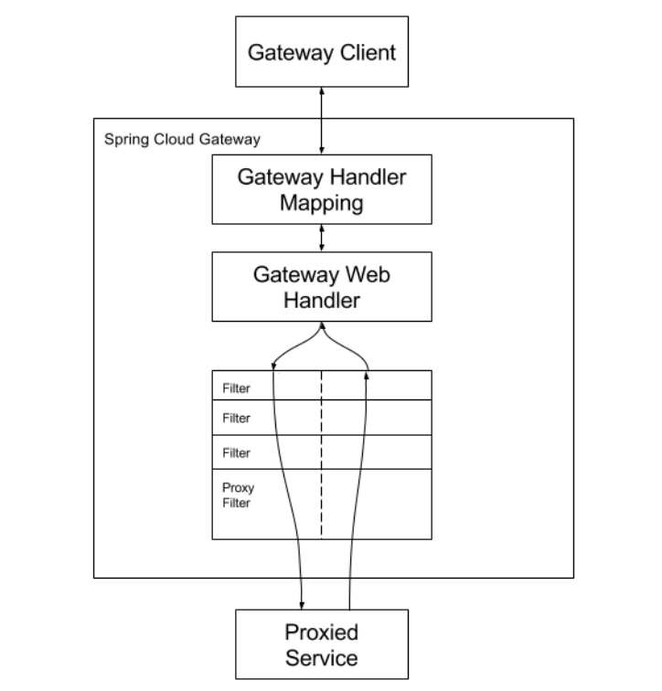
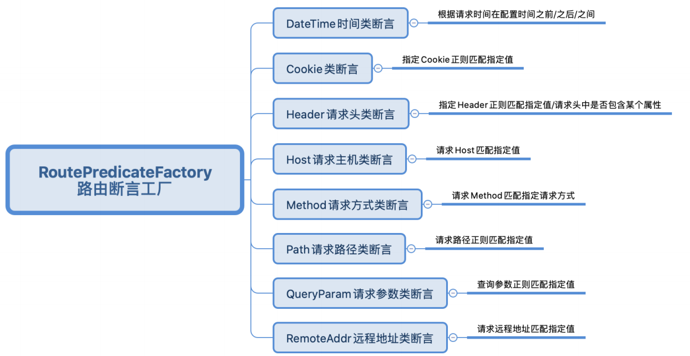

[toc]

## 一、GateWay基础

### 1. 简介

Spring Cloud GateWay由Spring官方开发的网关，目的是替代Netflix Zuul。性能⾼于Zuul，官⽅测试，GateWay是Zuul的1.6倍，旨在为微服务架构提供⼀种简单有效的统⼀的API路由管理⽅式

**==GateWay基于Spring5.X、SpringBoot2.X、WebFlux（基于Netty的异步非阻塞、响应式的表现层框架）==**


### 2. 架构

#### 2.1 网关在微服务中的架构

微服务的网关上游应该是Nginx服务器，**==通过Nginx反向代理对前端隐藏后端服务地址==**，并**==负载均衡实现网关的高可用集群==**




#### 2.2 GateWay的架构图

由以下组成

- 一系列断言Predicates
- 一个路由Route
- 一系列过滤器Filter组成




### 3. 功能

- **==反向代理/路由（Route）==**

  网关最基本的功能，由⼀个ID、⼀个⽬标URL（最终路由到的地址）、⼀系列的断⾔（匹配条件判断）和Filter过滤器（精细化控制）组成。如果断⾔为true，则匹配该路由

- **==断言（Predicates）==**

  参考了Java8中的断⾔java.util.function.Predicate，开发⼈员可以匹配Http请求中的所有内容（包括请求头、请求参数等）（类似于nginx中的location匹配⼀样），如果断⾔与请求相匹配则路由。

- **==过滤器（Filter）==**

  Spring Webflux的过滤器，可以在请求之前或者之后执⾏业务逻辑，可扩展以下功能

  - 黑白名单
  - 流量监控
  - 鉴权
  - 日志监控
  - 熔断
  - 转发


## 二、GateWay工作原理

*GateWay核⼼逻辑：路由转发 + 执⾏过滤器链*



1. GateWay收到请求后，根据请求url在HandlerMapping匹配对应的路由路径，
2. 调用GateWay Web Handler，Handler再通过指定的过滤器执行链
3. 将请求发送到对应的服务，然后返回。


## 三、GateWay 基础应用

GateWay不需要使⽤web模块，它引⼊的是WebFlux（类似于SpringMVC）

### 1. 创建网关工程，pom.xml文件

```xml
<?xml version="1.0" encoding="UTF-8"?>
<project xmlns="http://maven.apache.org/POM/4.0.0"
         xmlns:xsi="http://www.w3.org/2001/XMLSchema-instance"
         xsi:schemaLocation="http://maven.apache.org/POM/4.0.0 http://maven.apache.org/xsd/maven-4.0.0.xsd">

    <groupId>com.tangdi</groupId>
    <artifactId>scn-gateway</artifactId>
    <version>1.0-SNAPSHOT</version>

    <!--spring boot 父启动器依赖-->
    <parent>
        <groupId>org.springframework.boot</groupId>
        <artifactId>spring-boot-starter-parent</artifactId>
        <version>2.1.6.RELEASE</version>
    </parent>

    <dependencies>
        <dependency>
            <groupId>org.springframework.cloud</groupId>
            <artifactId>spring-cloud-commons</artifactId>
        </dependency>
        <dependency>
            <groupId>org.springframework.cloud</groupId>
            <artifactId>spring-cloud-starter-netflix-eureka-client</artifactId>
        </dependency>
        <!--GateWay 网关-->
        <dependency>
            <groupId>org.springframework.cloud</groupId>
            <artifactId>spring-cloud-starter-gateway</artifactId>
        </dependency>
        <!--引入webflux-->
        <dependency>
            <groupId>org.springframework.boot</groupId>
            <artifactId>spring-boot-starter-webflux</artifactId>
        </dependency>
        <!--日志依赖-->
        <dependency>
            <groupId>org.springframework.boot</groupId>
            <artifactId>spring-boot-starter-logging</artifactId>
        </dependency>
        <!--测试依赖-->
        <dependency>
            <groupId>org.springframework.boot</groupId>
            <artifactId>spring-boot-starter-test</artifactId>
            <scope>test</scope>
        </dependency>
        <!--lombok工具-->
        <dependency>
            <groupId>org.projectlombok</groupId>
            <artifactId>lombok</artifactId>
            <version>1.18.4</version>
            <scope>provided</scope>
        </dependency>

        <!--引入Jaxb，开始-->
        <dependency>
            <groupId>com.sun.xml.bind</groupId>
            <artifactId>jaxb-core</artifactId>
            <version>2.2.11</version>
        </dependency>
        <dependency>
            <groupId>javax.xml.bind</groupId>
            <artifactId>jaxb-api</artifactId>
        </dependency>
        <dependency>
            <groupId>com.sun.xml.bind</groupId>
            <artifactId>jaxb-impl</artifactId>
            <version>2.2.11</version>
        </dependency>
        <dependency>
            <groupId>org.glassfish.jaxb</groupId>
            <artifactId>jaxb-runtime</artifactId>
            <version>2.2.10-b140310.1920</version>
        </dependency>
        <dependency>
            <groupId>javax.activation</groupId>
            <artifactId>activation</artifactId>
            <version>1.1.1</version>
        </dependency>
        <!--引入Jaxb，结束-->

        <!-- Actuator可以帮助你监控和管理Spring Boot应用-->
        <dependency>
            <groupId>org.springframework.boot</groupId>
            <artifactId>spring-boot-starter-actuator</artifactId>
        </dependency>
        <!--热部署-->
        <dependency>
            <groupId>org.springframework.boot</groupId>
            <artifactId>spring-boot-devtools</artifactId>
            <optional>true</optional>
        </dependency>

        <!--链路追踪-->
        <!--<dependency>
            <groupId>org.springframework.cloud</groupId>
            <artifactId>spring-cloud-starter-sleuth</artifactId>
        </dependency>-->
    </dependencies>

    <dependencyManagement>
        <!--spring cloud依赖版本管理-->
        <dependencies>
            <dependency>
                <groupId>org.springframework.cloud</groupId>
                <artifactId>spring-cloud-dependencies</artifactId>
                <version>Greenwich.RELEASE</version>
                <type>pom</type>
                <scope>import</scope>
            </dependency>
        </dependencies>
    </dependencyManagement>

    <build>
        <plugins>
            <!--编译插件-->
            <plugin>
                <groupId>org.apache.maven.plugins</groupId>
                <artifactId>maven-compiler-plugin</artifactId>
                <configuration>
                    <source>11</source>
                    <target>11</target>
                    <encoding>utf-8</encoding>
                </configuration>
            </plugin>
            <!--打包插件-->
            <plugin>
                <groupId>org.springframework.boot</groupId>
                <artifactId>spring-boot-maven-plugin</artifactId>
            </plugin>
        </plugins>
    </build>

</project>
```


### 2. 创建启动类

```java
import org.springframework.boot.SpringApplication;
import org.springframework.boot.autoconfigure.SpringBootApplication;
import org.springframework.cloud.client.discovery.EnableDiscoveryClient;

@SpringBootApplication
@EnableDiscoveryClient
public class GateWayApplication {

    public static void main(String[] args) {
        SpringApplication.run(GateWayApplication.class,args);
    }
}
```


### 3. 全局配置文件及说明

```yaml
server:
  port: 9002
eureka:
  client:
    serviceUrl: # eureka server的路径
      defaultZone: http://lagoucloudeurekaservera:8761/eureka/,http://lagoucloudeurekaserverb:8762/eureka/ #把 eureka 集群中的所有 url 都填写了进来，也可以只写一台，因为各个 eureka server 可以同步注册表
  instance:
    #使用ip注册，否则会使用主机名注册了（此处考虑到对老版本的兼容，新版本经过实验都是ip）
    prefer-ip-address: true
    #自定义实例显示格式，加上版本号，便于多版本管理，注意是ip-address，早期版本是ipAddress
    instance-id: ${spring.cloud.client.ip-address}:${spring.application.name}:${server.port}:@project.version@
spring:
  application:
  name: scn-gateway
  cloud:
    gateway:
      # 路由可以有多个
      routes: 
        # 我们自定义的路由 ID，保持唯一
        - id: service-autodeliver-router 
          # 目标服务地址  自动投递微服务（部署多实例）  动态路由：uri配置的应该是一个服务名称，而不应该是一个具体的服务实例的地址
          #uri: http://127.0.0.1:8096
          # gateway网关从服务注册中心获取实例信息然后负载后路由
          uri: lb://lagou-service-autodeliver                                                                    
          # 断言：路由条件，Predicate 接受一个输入参数，返回一个布尔值结果。该接口包含多种默 认方法来将 Predicate 组合成其他复杂的逻辑（比如：与，或，非）。
          predicates:                                         
            - Path=/autodeliver/**
        - id: service-resume-router      
          uri: lb://lagou-service-resume
          # 断言：路由条件，Predicate 接受一个输入参数，返回一个布尔值结果。该接口包含多种默 认方法来将 Predicate 组合成其他复杂的逻辑（比如：与，或，非）。
          predicates: 
            - Path=/resume/**
          filters:
            - StripPrefix=1
```


## 四、GateWay 断言路由规则详解

Spring Cloud GateWay 帮我们内置了很多 Predicates功能，实现了各种路由匹配规则（通过 Header、请求参数等作为条件）匹配到对应的路由



#### 1. 时间点后匹配

```yaml
routes:
  - id: after_route
    uri: https://example.org
    predicates:
    - After=2017-01-20T17:42:47.789-07:00[America/Denver]
```

#### 2. 时间点前匹配

```yaml
spring:
  cloud:
    gateway:
      routes:
        - id: remoteaddr_route
          uri: https://example.org
          predicates:
            - Before=2017-01-20T17:42:47.789-07:00[America/Denver]
```

#### 3. 时间区间匹配

```yaml
spring:
  cloud:
    gateway:
      routes:
        - id: remoteaddr_route
          uri: https://example.org
          predicates:
            - Between=2017-01-20T17:42:47.789-07:00[America/Denver],2017-01-21T17:42:47.789-07:00[America/Denver]
```

#### 4. 指定Cookie正则匹配指定值	

```yaml
spring:
  cloud:
    gateway:
      routes:
        - id: remoteaddr_route
          uri: https://example.org
          predicates:
            - Cookie=chocolate, ch.p
```

#### 5. 指定Header正则匹配指定值

```yaml
spring:
  cloud:
    gateway:
      routes:
        - id: remoteaddr_route
          uri: https://example.org
          predicates:
            - Header=X-Request-Id, \d+
```

#### 6. 请求Host匹配指定值

```yaml
spring:
  cloud:
    gateway:
      routes:
        - id: remoteaddr_route
          uri: https://example.org
          predicates:
            - Host=**.somehost.org,**.anotherhost.org
```

#### 7. 请求Method匹配指定请求⽅式

```yaml
spring:
  cloud:
    gateway:
      routes:
        - id: remoteaddr_route
          uri: https://example.org
          predicates:
            - Method=GET,POST
```

#### 8. 请求路径正则匹配

```yaml
spring:
  cloud:
    gateway:
      routes:
        - id: remoteaddr_route
          uri: https://example.org
          predicates:
            - Path=/red/{segment},/blue/{segment}
```

#### 9. 请求包含某参数

```yaml
spring:
  cloud:
    gateway:
      routes:
        - id: remoteaddr_route
          uri: https://example.org
          predicates:
            - Query=green
```

#### 10. 请求包含某参数并且参数值匹配正则表达式

```yaml
spring:
  cloud:
    gateway:
      routes:
        - id: remoteaddr_route
          uri: https://example.org
          predicates:
            - Query=red, gree.
```

#### 11. 远程地址匹配

```yaml
spring:
  cloud:
    gateway:
      routes:
        - id: remoteaddr_route
          uri: https://example.org
          predicates:
            - RemoteAddr=192.168.1.1/24
```


## 五、GateWay 过滤器

#### 1. 从过滤器⽣命周期（影响时机点）

- pre  

  在被路由到服务之前执行，可扩展黑白名单、日志监控、鉴权、扩展请求头

- post

  服务执行完后响应给前端之前执行，可为响应头扩展

#### 2. 过滤器种类

- GateWayFilter 

  应⽤到单个路由路由上，GateWay有一些默认的GateWayFilter 实现，如StripPrefix：去掉url中N个占位路径然后路由转发

  ```yaml
  predicates:
   - Path=/resume/**
  filters:
    - StripPrefix=1 # 可以去掉resume之后转发
  ```

- GlobalFilter 

  应⽤到所有的路由上

#### 3. GateWay 全局过滤器黑白名单应用

获取客户端ip，判断是否在黑名单中，在的话就拒绝访问，不在的话就放行

```java
import lombok.extern.slf4j.Slf4j;
import org.springframework.cloud.gateway.filter.GatewayFilterChain;
import org.springframework.cloud.gateway.filter.GlobalFilter;
import org.springframework.core.Ordered;
import org.springframework.core.io.buffer.DataBuffer;
import org.springframework.http.HttpStatus;
import org.springframework.http.server.reactive.ServerHttpRequest;
import org.springframework.http.server.reactive.ServerHttpResponse;
import org.springframework.stereotype.Component;
import org.springframework.web.server.ServerWebExchange;
import reactor.core.publisher.Mono;

import java.util.ArrayList;
import java.util.List;

/**
 * 定义全局过滤器，会对所有路由生效
 */
@Slf4j
@Component  // 让容器扫描到，等同于注册了
public class BlackListFilter implements GlobalFilter, Ordered {

    // 模拟黑名单（实际可以去数据库或者redis中查询）
    private static List<String> blackList = new ArrayList<>();

    static {
        blackList.add("0:0:0:0:0:0:0:1");  // 模拟本机地址
    }

    /**
     * 过滤器核心方法
     * @param exchange 封装了request和response对象的上下文
     * @param chain 网关过滤器链（包含全局过滤器和单路由过滤器）
     * @return
     */
    @Override
    public Mono<Void> filter(ServerWebExchange exchange, GatewayFilterChain chain) {
        // 从上下文中取出request和response对象
        ServerHttpRequest request = exchange.getRequest();
        ServerHttpResponse response = exchange.getResponse();

        // 从request对象中获取客户端ip
        String clientIp = request.getRemoteAddress().getHostString();
        // 拿着clientIp去黑名单中查询，存在的话就决绝访问
        if(blackList.contains(clientIp)) {
            // 决绝访问，返回
            response.setStatusCode(HttpStatus.UNAUTHORIZED); // 状态码
            log.debug("=====>IP:" + clientIp + " 在黑名单中，将被拒绝访问！");
            String data = "Request be denied!";
            DataBuffer wrap = response.bufferFactory().wrap(data.getBytes());
            return response.writeWith(Mono.just(wrap));
        }

        // 合法请求，放行，执行后续的过滤器
        return chain.filter(exchange);
    }


    /**
     * 返回值表示当前过滤器的顺序(优先级)，数值越小，优先级越高
     * @return
     */
    @Override
    public int getOrder() {
        return 0;
    }
}
```

