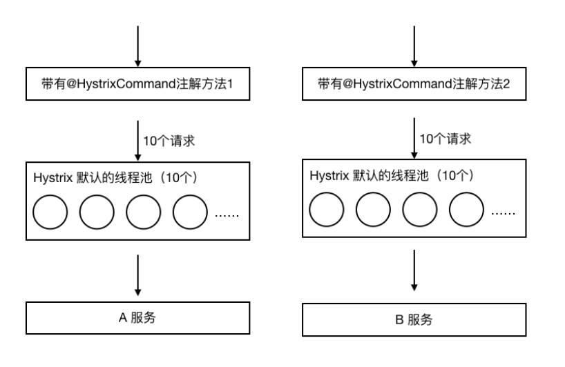
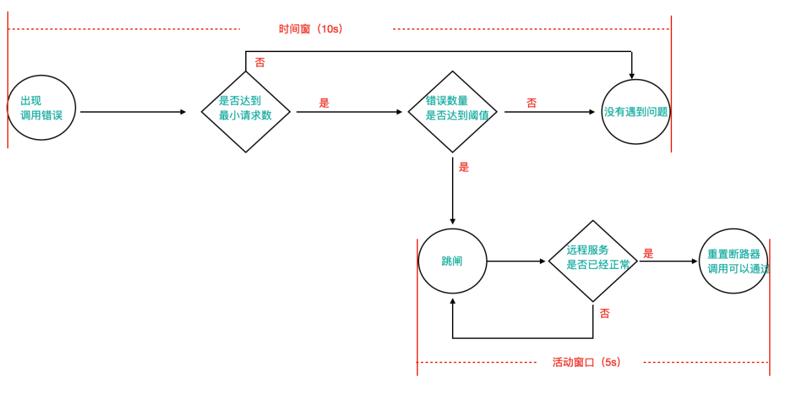
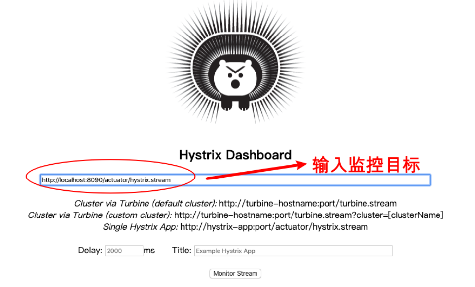
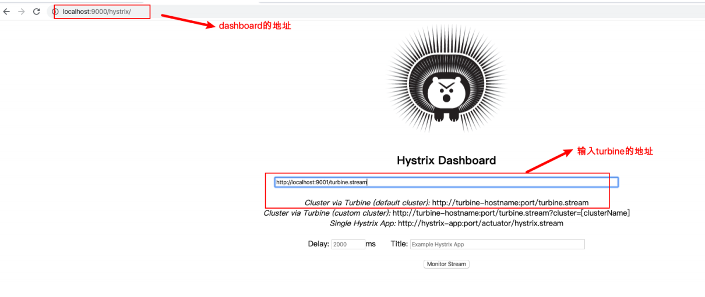

[toc]

## 一、Hystrix 功能机制

### 1. 跳闸机制

在设定的时间段内，服务的错误率达到一定阈值，将开启熔断机制，拒绝该服务的所有请求

### 2. 线程隔离机制/舱壁模式

Hystrix为每个被声明的方法设置一个线程池。如果该线程池请求已满， 则该方法的后续请求被⽴即拒绝，⽽不是排队等待，从⽽加速失败判定。

### 3. 降级机制

请求失败、超时、被拒绝，或当熔断器打开时，执⾏ fallback 回退逻辑。回退逻辑由开发⼈员 ⾃⾏提供，例如返回⼀个缺省值

### 4. 修复机制

熔断器后会⾃动进⼊“半开”状态，每隔一段时间请求一次熔断服务，判断是否恢复


## 二、Hystrix 熔断应⽤

### 1. 服务消费者⼯程引⼊Hystrix依赖坐标（也可以添加在⽗⼯程中）

```xml
<!--熔断器Hystrix-->
<dependency>
    <groupId>org.springframework.cloud</groupId>
    <artifactId>spring-cloud-starter-netflix-hystrix</artifactId>
</dependency>
```


### 2. 服务消费者⼯程的启动类中添加熔断器开启注解@EnableCircuitBreaker

##### 2.1 @EnableHystrix和@EnableCircuitBreaker功能相同，只不过@EnableCircuitBreaker具有通用性，适配其他熔断组件

##### 2.2 @SpringCloudApplication  = @SpringBootApplication + @EnableDiscoveryClient + @EnableCircuitBreaker

```java
import com.netflix.hystrix.contrib.metrics.eventstream.HystrixMetricsStreamServlet;
import org.springframework.boot.SpringApplication;
import org.springframework.boot.autoconfigure.SpringBootApplication;
import org.springframework.boot.web.servlet.ServletRegistrationBean;
import org.springframework.cloud.client.circuitbreaker.EnableCircuitBreaker;
import org.springframework.cloud.client.discovery.EnableDiscoveryClient;
import org.springframework.cloud.client.loadbalancer.LoadBalanced;
import org.springframework.context.annotation.Bean;
import org.springframework.web.client.RestTemplate;

@SpringBootApplication
@EnableDiscoveryClient
//@EnableHystrix  // 开启Hystrix功能
@EnableCircuitBreaker  // 开启熔断器功能
//@SpringCloudApplication  综合性的注解  @SpringCloudApplication  = @SpringBootApplication + @EnableDiscoveryClient + @EnableCircuitBreaker
public class AutodeliverApplication8090 {

    public static void main(String[] args) {
        SpringApplication.run(AutodeliverApplication8090.class,args);
    }


    // 使用RestTemplate模板对象进行远程调用
    @Bean
    @LoadBalanced
    public RestTemplate getRestTemplate() {
        return new RestTemplate();
    }
}
```


### 3.定义服务熔断以及降级处理⽅法

@HystrixCommand注解可定义具体每个方法 Hystrix 相关的配置

```java
@GetMapping("/checkStateTimeoutFallback/{userId}")
@HystrixCommand(
    // 线程池标识，要保持唯一，不唯一的话就共用了
    threadPoolKey = "findResumeOpenStateTimeoutFallback",
    // 线程池细节属性配置
    threadPoolProperties = {
        @HystrixProperty(name="coreSize",value = "2"), // 线程数
        @HystrixProperty(name="maxQueueSize",value="20") // 等待队列长度
    },
    // commandProperties熔断的一些细节属性配置
    commandProperties = {
        // 每一个属性都是一个HystrixProperty
        @HystrixProperty(name="execution.isolation.thread.timeoutInMilliseconds",value="2000")


        // hystrix高级配置，定制工作过程细节
        ,
        // 统计时间窗口定义
        @HystrixProperty(name = "metrics.rollingStats.timeInMilliseconds",value = "8000"),
        // 统计时间窗口内的最小请求数
        @HystrixProperty(name = "circuitBreaker.requestVolumeThreshold",value = "2"),
        // 统计时间窗口内的错误数量百分比阈值
        @HystrixProperty(name = "circuitBreaker.errorThresholdPercentage",value = "50"),
        // 自我修复时的活动窗口长度
        @HystrixProperty(name = "circuitBreaker.sleepWindowInMilliseconds",value = "3000")
    },
    fallbackMethod = "myFallBack"  // 回退方法
)
public Integer findResumeOpenStateTimeoutFallback(@PathVariable Long userId) {
    // 使用ribbon不需要我们自己获取服务实例然后选择一个那么去访问了（自己的负载均衡）
    String url = "http://lagou-service-resume/resume/openstate/" + userId;  // 指定服务名
    Integer forObject = restTemplate.getForObject(url, Integer.class);
    return forObject;
}
```


## 三、Hystrix 舱壁模式（线程池隔离机制）

为了避免问题服务请求过多导致正常服务⽆法访问，Hystrix 不是采⽤增加线程数，⽽是单独的为每⼀个控制⽅法创建⼀个线程池的⽅式，这种模式叫做“舱壁模式"，也是线程隔离的⼿段。




## 四、Hystrix 跳闸与恢复机制

- **==当调⽤出现问题时，开启⼀个时间窗（10s）== **
- 在这个时间窗内，统计调⽤次数是否达到最⼩请求数
- 是则再判断错误比例是否达到一定阈值
- 是则熔断，不再请求对应服务
- 如果**==跳闸，则会开启⼀个活动窗⼝（默认5s）==**，每隔5s，**==Hystrix会让⼀个请求通过,到达那个问题服务==**，看是否调⽤成功，如果成功，重置断路器回到第1步




## 五、配置信息

```yaml
hystrix:
  command:
    default:
      circuitBreaker:
        # 强制打开熔断器，如果该属性设置为true，强制断路器进⼊打开状态，将会拒绝所有的请求。 默认false关闭的
        forceOpen: false
        # 触发熔断错误⽐例阈值，默认值50%
        errorThresholdPercentage: 50
        # 熔断后休眠时⻓，默认值5秒
        sleepWindowInMilliseconds: 3000 
        # 熔断触发最⼩请求次数，默认值是20
        requestVolumeThreshold: 2
      execution:
        isolation:
          thread:
            # 熔断超时设置，默认为1秒。与ribbon的超时时长比较，最短的生效
            timeoutInMilliseconds: 10000
```


## 六、Hystrix Dashboard仪表盘

### 1. 新建⼀个监控服务⼯程，导⼊依赖

```xml
<!--hystrix-->
<dependency>
    <groupId>org.springframework.cloud</groupId>
    <artifactId>spring-cloud-starter-netflix-hystrix</artifactId>
</dependency>
<!--hystrix 仪表盘-->
<dependency>
    <groupId>org.springframework.cloud</groupId>
    <artifactId>spring-cloud-starter-netflix-hystrix-dashboard</artifactId>
</dependency>
<dependency>
    <groupId>org.springframework.cloud</groupId>
    <artifactId>spring-cloud-starter-netflix-eureka-client</artifactId>
</dependency>
```


### 2. 启动类添加@EnableHystrixDashboard激活仪表盘

```java
import com.netflix.hystrix.contrib.metrics.eventstream.HystrixMetricsStreamServlet;
import org.springframework.boot.SpringApplication;
import org.springframework.boot.autoconfigure.SpringBootApplication;
import org.springframework.boot.web.servlet.ServletRegistrationBean;
import org.springframework.cloud.client.discovery.EnableDiscoveryClient;
import org.springframework.cloud.netflix.hystrix.dashboard.EnableHystrixDashboard;
import org.springframework.context.annotation.Bean;

@SpringBootApplication
@EnableDiscoveryClient
@EnableHystrixDashboard  // 开启hystrix dashboard
public class HystrixDashboard9000 {

    public static void main(String[] args) {
        SpringApplication.run(HystrixDashboard9000.class,args);
    }
}
```

### 3.全局配置文件

```yaml
eureka:
  client:
    serviceUrl: # eureka server的路径
      defaultZone: http://lagoucloudeurekaservera:8761/eureka/,http://lagoucloudeurekaserverb:8762/eureka/ #把 eureka 集群中的所有 url 都填写了进来，也可以只写一台，因为各个 eureka server 可以同步注册表
  instance:
    #使用ip注册，否则会使用主机名注册了（此处考虑到对老版本的兼容，新版本经过实验都是ip）
    prefer-ip-address: true
    #自定义实例显示格式，加上版本号，便于多版本管理，注意是ip-address，早期版本是ipAddress
    instance-id: ${spring.cloud.client.ip-address}:${spring.application.name}:${server.port}:@project.version@
```


### 4. 在被监测的微服务中注册监控servlet

```java
/**
  * 在被监控的微服务中注册一个serlvet，后期我们就是通过访问这个servlet来获取该服务的Hystrix监控数据的
  * 前提：被监控的微服务需要引入springboot的actuator功能
  * @return
  */
@Bean
public ServletRegistrationBean getServlet(){
    HystrixMetricsStreamServlet streamServlet = new HystrixMetricsStreamServlet();
    ServletRegistrationBean registrationBean = new ServletRegistrationBean(streamServlet);
    registrationBean.setLoadOnStartup(1);
    registrationBean.addUrlMappings("/actuator/hystrix.stream");
    registrationBean.setName("HystrixMetricsStreamServlet");
    return registrationBean;
}
```


### 5. 访问地址http://localhost:9000/hystrix

##### 输入监控目标的servlet地址：http://localhost:8090/actuator/hystrix.stream



## 七、Hystrix turbine聚合监控

### 1. 新建⼀个聚合监控服务⼯程，导⼊依赖

```xml
<!--hystrix turbine聚合监控-->
<dependency>
    <groupId>org.springframework.cloud</groupId>
    <artifactId>spring-cloud-starter-netflix-turbine</artifactId>
</dependency>
<dependency>
    <groupId>org.springframework.cloud</groupId>
    <artifactId>spring-cloud-starter-netflix-eureka-client</artifactId>
</dependency>
```


### 2. 启动类添加@EnableTurbine，开启仪表盘以及Turbine聚合

```java
import org.springframework.boot.SpringApplication;
import org.springframework.boot.autoconfigure.SpringBootApplication;
import org.springframework.cloud.client.discovery.EnableDiscoveryClient;
import org.springframework.cloud.netflix.turbine.EnableTurbine;


@SpringBootApplication
@EnableDiscoveryClient
@EnableTurbine  // 开启Turbine聚合功能
public class HystrixTurbineApplication9001 {
    public static void main(String[] args) {
        SpringApplication.run(HystrixTurbineApplication9001.class,args);
    }
}
```


### 3. 全局配置文件

```yaml
eureka:
  client:
    serviceUrl: # eureka server的路径
      defaultZone: http://lagoucloudeurekaservera:8761/eureka/,http://lagoucloudeurekaserverb:8762/eureka/ #把 eureka 集群中的所有 url 都填写了进来，也可以只写一台，因为各个 eureka server 可以同步注册表
  instance:
    #使用ip注册，否则会使用主机名注册了（此处考虑到对老版本的兼容，新版本经过实验都是ip）
    prefer-ip-address: true
    #自定义实例显示格式，加上版本号，便于多版本管理，注意是ip-address，早期版本是ipAddress
    instance-id: ${spring.cloud.client.ip-address}:${spring.application.name}:${server.port}:@project.version@
#turbine配置
turbine:
  # appCofing配置需要聚合的服务名称，比如这里聚合自动投递微服务的hystrix监控数据
  # 如果要聚合多个微服务的监控数据，那么可以使用英文逗号拼接，比如 a,b,c
  appConfig: lagou-service-autodeliver,xxxxx
  clusterNameExpression: "'default'"   # 集群默认名称
```


### 4. 访问地址http://localhost:9000/hystrix

##### 输入监控目标的servlet地址：http://localhost:9001/turbine.stream




### 八、Hystrix 源码剖析

##### 利用SpringBoot的自动装配，Spring AOP（切@HystrixCommand注解进行环绕通知）

具体略。。。