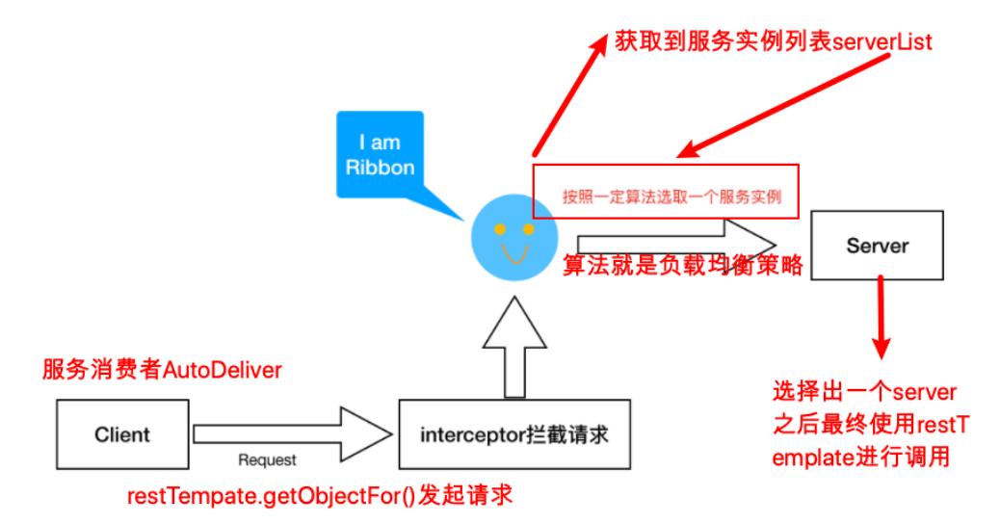

[toc]


## 一、Ribbon 基础及应用

### 1. 简介

**==Ribbon是Netflflix发布的负载均衡器==**。Eureka⼀般配合Ribbon进⾏使⽤，**==Ribbon从Eureka中读取到服务信息，在调⽤服务提供者提供的服务时，会根据⼀定的算法进⾏负载==**

### 2. 用法

#### 2.1 导入eureka-client 的jar包


#### 2.2 在@RestTemplate上添加对应注解@LoadBalanced

被@LoadBalanced修饰后，RestTemplate的方法在执行时，会被拦截器进行一些处理

```java
@Bean
// Ribbon负载均衡
@LoadBalanced
public RestTemplate getRestTemplate() {
    return new RestTemplate();
}
```

#### 2.3 RestTemplate调用远程服务时，使用applicationName替代ip和port信息

RestTemplate在执行方法时，被ribbon的拦截器拦截，从注册中心获取所有applicationName的实例


## 二、Ribbon 的负载均衡策略

| 负载均衡策略                                | 描述                                                         |
| ------------------------------------------- | ------------------------------------------------------------ |
| RoundRobinRule：轮询策略                    | 默认超过10次获取到的server都不可⽤，会返回⼀个空的server     |
| RandomRule：随机策略                        | 如果随机到的server为null或者不可⽤的话，会while不停的循环选取 |
| RetryRule：重试策略                         | ⼀定时限内循环重试。默认继承RoundRobinRule，也⽀持⾃定义注⼊，RetryRule会在每次选取之后，对选举的server进⾏判断，是否为null，是否alive，并且在500ms内会不停的选取判断。⽽RoundRobinRule失效的策略是超过10次，RandomRule是没有失效时间的概念，只要serverList没都挂。 |
| BestAvailableRule：最⼩连接数策略           | 遍历serverList，选取出可⽤的且连接数最⼩的⼀个server。该算法⾥⾯有⼀个LoadBalancerStats的成员变量，会存储所有server的运⾏状况和连接数。如果选取到的server为null，那么会调⽤RoundRobinRule重新选取 |
| AvailabilityFilteringRule：可⽤过滤策略     | 扩展了轮询策略，会先通过默认的轮询选取⼀个server，再去判断该server是否超时可⽤，当前连接数是否超限，都成功再返回。 |
| ZoneAvoidanceRule：区域权衡策略（默认策略） | 扩展了轮询策略，继承了2个过滤器：ZoneAvoidancePredicate和AvailabilityPredicate，除了过滤超时和链接数过多的server，还会过滤掉不符合要求的zone区域⾥⾯的所有节点，AWS --ZONE 在⼀个区域/机房内的服务实例中轮询 |

### 修改负载均衡策略

```yaml
#针对的被调⽤⽅微服务名称,不加就是全局⽣效
lagou-service-resume:
  ribbon:
    NFLoadBalancerRuleClassName: com.netflix.loadbalancer.RandomRule #负载策略调整
```


## 三、 Ribbon与Feign结合使用的配置

以下配置对RestTemplate不生效

```yaml
#针对的被调用方微服务名称,不加就是全局生效
user-service:
  ribbon:
    # 从eureka client拉取注册信息的时间间隔
    ServerListRefreshInterval: 30000
    #请求连接超时时间
    ConnectTimeout: 2000
    #请求处理超时时间,Feign超时时长设置。与Hystrix超时时长比较，取最短的生效
    ReadTimeout: 3000
    #对所有操作都进行重试
    OkToRetryOnAllOperations: true
    ####根据如上配置，当访问到故障请求的时候，它会再尝试访问一次当前实例（次数由MaxAutoRetries配置），
    ####如果不行，就换一个实例进行访问，如果还不行，再换一次实例访问（更换次数由MaxAutoRetriesNextServer配置），
    ####如果依然不行，返回失败信息。
    MaxAutoRetries: 0 #对当前选中实例重试次数，不包括第一次调用
    MaxAutoRetriesNextServer: 0 #切换实例的重试次数
    NFLoadBalancerRuleClassName: com.netflix.loadbalancer.RoundRobinRule #负载策略调整
```


## 四、Ribbon原理

### 1. Ribbon原理图



- RestTemplate执行调用方法时，被Ribbon的拦截器拦截
- Ribbon **==定时从Eureka Client获取服务列表并缓存本地==**，根据URL的applicationName得到所有的服务实例
- 根据配置的负载均衡策略选择一个服务实例
- 最后执行RestTemplate的方法调用服务端的RestFul接口

### 2. Ribbon源码剖析

#### 2.1 利用SpringBoot的自动装配原理，在Ribbon的jar包下，有/META-INF/spring.factories

#### 2.2 获取服务实例

**ServerListUpdater** 是Ribbon中负责服务实例更新的组件，默认的实现是 **PollingServerListUpdater**，通过线程定时去更新实例信息，定时刷新的时间间隔默认是30秒，通过 `ribbon.ServerListRefreshInterval` 配置

刷新间隔的参数通过 getRefreshIntervalMs ⽅法来获取的，⽅法中的逻辑从Ribbon 的配置中进⾏取值的