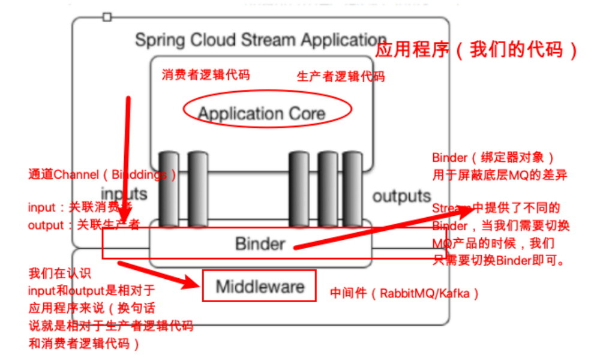

[toc]


## 一、Spring Cloud Stream简介

Spring Cloud Stream是微服务中的**消息驱动组件**

市面上流行的消息中间件有很多，如RabbitMQ、kafka、RocketMQ等等，由于内部实现机制各不相同如RabbitMQ-Exchange、kafka-Topic，所以在开发中消息中间件的应用编码各不相同，若需要切换时，将会是个大工程

所以**==Spring对中间件进行了抽象==**，定义了一套规范，**==屏蔽不同中间件底层的差异==**。使开发者在使用时只用Stream就可随意切换MQ的实现

类似于日志框架的SLF4J是各个日志的门面，Spring-data-jpa屏蔽了底层数据库的差异


## 二、Stream 概念及对应属性

### 1. Straeam 架构模型

应⽤程序通过**==inputs（相当于消息消费者consumer）==**或者**==outputs（相当于消息⽣产者producer）==**来与Spring Cloud Stream中的binder对象交互，⽽**==Binder==**对象是⽤来屏蔽底层MQ细节的，它负责与具体的消息中间件交互

若要切换MQ实现，只需更换对应的Binder绑定器，Binder绑定器的实现是框架内置的，Spring Cloud Stream⽬前⽀持Rabbit、Kafka两种消息队列




### 2. Stream编程注解

| 注解                                                     | 描述                                                      |
| -------------------------------------------------------- | --------------------------------------------------------- |
| @Input（在消费者⼯程中使⽤）                             | 注解标识输⼊通道，通过该输⼊通道接收到的消息进⼊应⽤程序  |
| @Output（在⽣产者⼯程中使⽤）                            | 注解标识输出通道，发布的消息将通过该通道离开应⽤程序      |
| @StreamListener（在消费者⼯程中使⽤，监听message的到来） | 监听队列，⽤于消费者的队列的消息的接收（有消息监听.....） |
| @EnableBinding                                           | 把Channel和Exchange（对于RabbitMQ）绑定在⼀起             |


## 三、Stream应用

### 1. 在lagou_parent下新建⼦module，⽣产者端

#### 1.1 pom.xml

```xml
<?xml version="1.0" encoding="UTF-8"?>
<project xmlns="http://maven.apache.org/POM/4.0.0"
         xmlns:xsi="http://www.w3.org/2001/XMLSchema-instance"
         xsi:schemaLocation="http://maven.apache.org/POM/4.0.0 http://maven.apache.org/xsd/maven-4.0.0.xsd">
    <parent>
        <artifactId>scn-parent</artifactId>
        <groupId>com.tangdi</groupId>
        <version>1.0-SNAPSHOT</version>
    </parent>
    <modelVersion>4.0.0</modelVersion>

    <artifactId>lagou-cloud-stream-producer-9090</artifactId>


    <dependencies>
        <!--eureka client 客户端依赖引入-->
        <dependency>
            <groupId>org.springframework.cloud</groupId>
            <artifactId>spring-cloud-starter-netflix-eureka-client</artifactId>
        </dependency>

        <!--spring cloud stream 依赖（rabbit）-->
        <dependency>
            <groupId>org.springframework.cloud</groupId>
            <artifactId>spring-cloud-starter-stream-rabbit</artifactId>
        </dependency>

    </dependencies>
</project>
```


#### 1.2 全局配置文件

```yaml
server:
  port: 9090
spring:
  application:
    name: lagou-cloud-stream-producer
  cloud:
    stream:
      binders: # 绑定MQ服务信息（此处我们是RabbitMQ）
        lagouRabbitBinder: # 给Binder定义的名称，用于后面的关联
          type: rabbit # MQ类型，如果是Kafka的话，此处配置kafka
          environment: # MQ环境配置（用户名、密码等）
            spring:
              rabbitmq:
                host: localhost
                port: 5672
                username: guest
                password: guest
      bindings: # 关联整合通道和binder对象
        output: # output是我们定义的通道名称，此处不能乱改
          destination: lagouExchange # 要使用的Exchange名称（消息队列主题名称）
          content-type: text/plain # application/json # 消息类型设置，比如json
          binder: lagouRabbitBinder # 关联MQ服务
eureka:
  client:
    serviceUrl: # eureka server的路径
      #把 eureka 集群中的所有 url 都填写了进来，也可以只写一台，因为各个 eureka server 可以同步注册表
      defaultZone: http://lagoucloudeurekaservera:8761/eureka/,http://lagoucloudeurekaserverb:8762/eureka/ 
    instance:
      prefer-ip-address: true #使用ip注册
```


#### 1.3 启动类

```java
import org.springframework.boot.SpringApplication;
import org.springframework.boot.autoconfigure.SpringBootApplication;
import org.springframework.cloud.client.discovery.EnableDiscoveryClient;

@SpringBootApplication
@EnableDiscoveryClient
public class StreamProducerApplication9090 {

    public static void main(String[] args) {
        SpringApplication.run(StreamProducerApplication9090.class,args);
    }
}
```


#### 1.4 发送消息的业务类

```java
import com.tangdi.service.IMessageProducer;
import org.springframework.beans.factory.annotation.Autowired;
import org.springframework.cloud.stream.annotation.EnableBinding;
import org.springframework.cloud.stream.messaging.Source;
import org.springframework.messaging.support.MessageBuilder;

// Source.class里面就是对输出通道的定义（这是Spring Cloud Stream内置的通道封装）
@EnableBinding(Source.class)
public class MessageProducerImpl implements IMessageProducer {

    // 将MessageChannel的封装对象Source注入到这里使用
    @Autowired
    private Source source;


    @Override
    public void sendMessage(String content) {
        // 向mq中发送消息（并不是直接操作mq，应该操作的是spring cloud stream）
        // 使用通道向外发出消息(指的是Source里面的output通道)
        source.output().send(MessageBuilder.withPayload(content).build());
    }
}
```


### 2. 在lagou_parent下新建⼦module，消费者端

#### 1.1 pom.xml

```xml
<?xml version="1.0" encoding="UTF-8"?>
<project xmlns="http://maven.apache.org/POM/4.0.0"
         xmlns:xsi="http://www.w3.org/2001/XMLSchema-instance"
         xsi:schemaLocation="http://maven.apache.org/POM/4.0.0 http://maven.apache.org/xsd/maven-4.0.0.xsd">
    <parent>
        <artifactId>scn-parent</artifactId>
        <groupId>com.tangdi</groupId>
        <version>1.0-SNAPSHOT</version>
    </parent>
    <modelVersion>4.0.0</modelVersion>

    <artifactId>lagou-cloud-stream-consumer-9092</artifactId>

    <dependencies>
        <!--eureka client 客户端依赖引入-->
        <dependency>
            <groupId>org.springframework.cloud</groupId>
            <artifactId>spring-cloud-starter-netflix-eureka-client</artifactId>
        </dependency>

        <!--spring cloud stream 依赖（rabbit）-->
        <dependency>
            <groupId>org.springframework.cloud</groupId>
            <artifactId>spring-cloud-starter-stream-rabbit</artifactId>
        </dependency>
    </dependencies>
</project>
```


#### 1.2 全局配置文件

```yaml
server:
  port: 9092
spring:
  application:
    name: lagou-cloud-stream-consumer
  cloud:
    stream:
      binders: # 绑定MQ服务信息（此处我们是RabbitMQ）
        lagouRabbitBinder: # 给Binder定义的名称，用于后面的关联
          type: rabbit # MQ类型，如果是Kafka的话，此处配置kafka
          environment: # MQ环境配置（用户名、密码等）
            spring:
              rabbitmq:
                host: localhost
                port: 5672
                username: guest
                password: guest
      bindings: # 关联整合通道和binder对象
        input: # output是我们定义的通道名称，此处不能乱改
          destination: lagouExchange # 要使用的Exchange名称（消息队列主题名称）
          content-type: text/plain # application/json # 消息类型设置，比如json
          binder: lagouRabbitBinder # 关联MQ服务
          group: lagou001 # 定义分组，相当于队列queue
eureka:
  client:
    serviceUrl: # eureka server的路径
      defaultZone: http://lagoucloudeurekaservera:8761/eureka/,http://lagoucloudeurekaserverb:8762/eureka/ #把 eureka 集群中的所有 url 都填写了进来，也可以只写一台，因为各个 eureka server 可以同步注册表
    instance:
      prefer-ip-address: true #使用ip注册
```


#### 1.3 启动类

```java
import org.springframework.boot.SpringApplication;
import org.springframework.boot.autoconfigure.SpringBootApplication;
import org.springframework.cloud.client.discovery.EnableDiscoveryClient;

@SpringBootApplication
@EnableDiscoveryClient
public class StreamConsumerApplication9092 {

    public static void main(String[] args) {
        SpringApplication.run(StreamConsumerApplication9092.class,args);
    }
}
```


#### 1.4 监听消息

```java
import org.springframework.cloud.stream.annotation.EnableBinding;
import org.springframework.cloud.stream.annotation.StreamListener;
import org.springframework.cloud.stream.messaging.Sink;
import org.springframework.messaging.Message;

@EnableBinding(Sink.class)
public class MessageConsumerService {

    @StreamListener(Sink.INPUT)
    public void recevieMessages(Message<String> message) {
        System.out.println("=========接收到的消息：" + message);
    }

}
```


## 三、Stream高级应用

### 1.自定义消息通道

Stream 内置了两种接⼝ **==Source==** 和 **==Sink==** 分别定义了 binding 为 “input” 的输⼊流和“output” 的输出流，我们也可以⾃定义各种输⼊输出流（通道），但实际我们可以在我们的服务中使⽤多个binder、多个输⼊通道和输出通道，然⽽默认就带了⼀个input的输⼊通道和⼀个output的输出通道，怎么办？

我们是可以⾃定义消息通道的，学着Source和Sink的样⼦，给你的通道定义个⾃⼰的名字，多个输⼊通道和输出通道是可以写在⼀个类中的

##### 1.1 自定义Channel

```java
interface CustomChannel {
    String INPUT_LOG = "inputLog";
    String OUTPUT_LOG = "outputLog";
    
    @Input(INPUT_LOG)
    SubscribableChannel inputLog();
    
    @Output(OUTPUT_LOG)
    MessageChannel outputLog();
}
```


##### 1.2 配置文件修改

```yaml
bindings:
  inputLog:
    destination: lagouExchange
  outputLog:
    destination: eduExchange
```


- 在 @EnableBinding 注解中，绑定⾃定义的接⼝
- 发送消息时，指定自定义的方法

- 使⽤ @StreamListener 做监听的时候，需要指定 CustomChannel.INPUT_LOG

### 2.分组

能解决多个消费者实例，消费相同消息的问题

在服务消费者端设置 spring.cloud.stream.bindings.input.group 属性，多个消费者实例配置为同⼀个group名称（在同⼀个group中的多个消费者只有⼀个可以获取到消息并消费）

分组相当于分配了队列，消息持久化

```yaml
spring:
  application:
    name: lagou-cloud-stream-consumer
  cloud:
    stream:
      binders: # 绑定MQ服务信息（此处我们是RabbitMQ）
        lagouRabbitBinder: # 给Binder定义的名称，用于后面的关联
          type: rabbit # MQ类型，如果是Kafka的话，此处配置kafka
          environment: # MQ环境配置（用户名、密码等）
            spring:
              rabbitmq:
                host: localhost
                port: 5672
                username: guest
                password: guest
      bindings: # 关联整合通道和binder对象
        input: # output是我们定义的通道名称，此处不能乱改
          destination: lagouExchange # 要使用的Exchange名称（消息队列主题名称）
          content-type: text/plain # application/json # 消息类型设置，比如json
          binder: lagouRabbitBinder # 关联MQ服务
          group: lagou001
```

