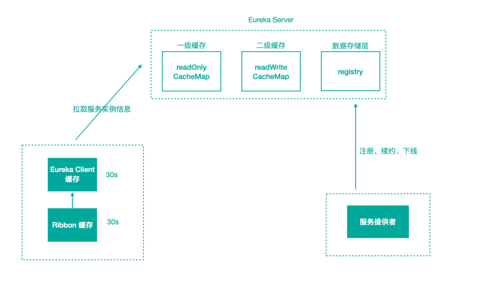

[toc]

### 一、问题场景

新服务上线后，服务消费者不能访问到刚上线的新服务，需要过⼀段时间后才能访问。

服务下线后，服务还是会被调⽤到导致访问频繁报错，⼀段时候后才彻底停⽌服务。

### 二、Eureka 服务发现慢的原因

Eureka 服务发现慢的原因主要有两个

- Eureka Server缓存的服务列表导致
- Eureka Client缓存的服务列表导致

#### 1. Eureka Server缓存

##### 1.1 原因

服务注册到注册中⼼后，服务实例信息是存储在注册表（ConcurrentHashMap）中。但Eureka为了提⾼响应速度，在内部做了优化，加⼊了两层的缓存，将Client需要的实例信息，直接缓存起来，获取的时候直接从缓存中拿数据然后响应给 Client。

- 一级缓存readOnlyCacheMap（ConcurrentHashMap），主要负责定时与readWriteCacheMap进⾏数据同步，默认**==同步时间为 30 秒⼀次==**。
- 二级缓存readWriteCacheMap（Guava），**==缓存过期时间默认为180秒==**，当服务下线、过期、注册、状态变更等操作都会清除此缓存中的数据。
- Client先从⼀级缓存中获取服务列表，如果⼀级缓存中不存在，再从⼆级缓存中获取，如果⼆级缓存也不存在，会触发缓存的加载，从存储层拉取数据到缓存中，然后再返回给 Client。
- Eureka 之所以设计⼆级缓存机制，也是为了提⾼ Eureka Server 的响应速度，缺点是缓存会导致 Client 获取不到最新的服务实例信息，然后导致⽆法快速发现新的服务和已下线的服务。

##### 1.2 Eureka Server端的解决方案

1. 缩短只读缓存的更新时间（`eureka.server.response-cache-update-interval-ms`）

2. 或者关闭只读缓存（`eureka.server.use-read-only-response-cache=false`），多级缓存导致数据不⼀致性。
4. 缩短定时监测失效服务的时间，以便服务下线后能被立即剔除

#### 2.Eureka Client缓存，主要分为两块内容，⼀块是 Eureka Client 缓存，⼀块是Ribbon 缓存。

##### 2.1 EurekaClient

- 缩短Client定时拉取服务信息的时间间隔（`eureka.client.registryFetchIntervalSeconds`）

##### 2.2 Ribbon

- 缩短Ribbon定时拉取服务信息的时间间隔
- 开启重试并设置重试次数

### 三、Spring Cloud 各组件超时

##### 1.1 Ribbon

Rbbon的超时可以配置全局的 `ribbon.ReadTimeout` 和 `ribbon.ConnectTimeout`。也可以在前⾯指定服务名，为每个服务单独配置，⽐如user-service.ribbon.ReadTimeout。

##### 1.2 Hystrix

Hystrix的全局超时 `hystrix.command.default.execution.isolation.thread.timeoutInMilliseconds`

Hystrix的特定方法超时`hystrix.command.UserRemoteClient.execution.isolation.thread.timeoutInMilliseconds`

**==Hystrix的超时时间要⼤于Ribbon的超时时间，因为Hystrix将请求包装了起来，特别需要注意的是，如果Ribbon开启了重试机制，⽐如重试3 次，Ribbon 的超时为 1 秒，那么 Hystrix 的超时时间应该⼤于 3 秒，否则就会出现 Ribbon 还在重试中，⽽ Hystrix 已经超时的现象。==**

##### 1.2 Feign

**==若配置了ribbon的时间，以ribbon为主，一般不配置Feign的时间==**

Feign也有连接超时时间（feign.client.config.服务名称.connectTimeout）和读取超时时间（feign.client.config.服务名称.readTimeout）