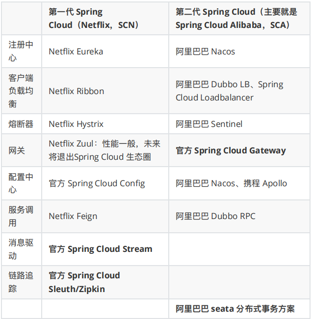
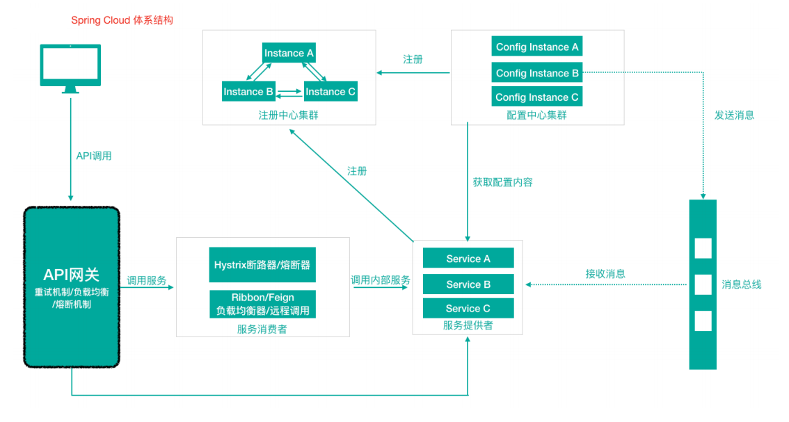

[toc]

### Spring Cloud简介

**==Spring Cloud是⼀套⽤于构建微服务架构的规范==**（所谓规范就是应该有哪些功能组件，然后组件之间怎么配合，共同完成什么事情），**==采用服务组件化，提供了一站式微服务化的解决方案==**

有组件：**==服务注册发现、配置中⼼、消息总线、负载均衡、熔断器、数据监控等==**，利⽤**==Spring Boot的开发便利性简化了微服务架构的开发（⾃动装配）==**

在这个规范之下第三⽅的Netflflix公司开发了⼀些组件、Spring官⽅开发了⼀些框架/组件，包括第三⽅的阿⾥巴巴开发了⼀套框架/组件集合Spring Cloud Alibaba，这些才是Spring Cloud规范的实现。

- Netflflix搞了⼀套 简称SCN

- Spring Cloud 吸收了Netflflix公司的产品基础之上⾃⼰也搞了⼏个组件

- 阿⾥巴巴在之前的基础上搞出了⼀堆微服务组件，Spring Cloud Alibaba（SCA）

### SPringle Cloud架构组件

### Spring Cloud 体系结构（组件协同⼯作机制）

