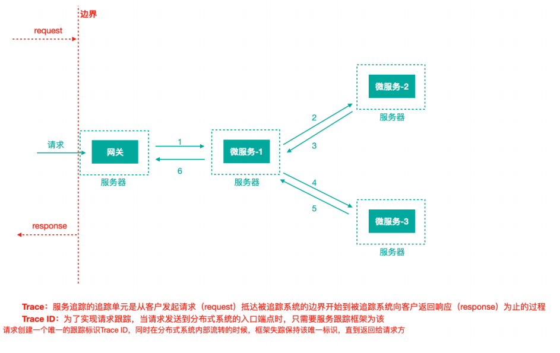
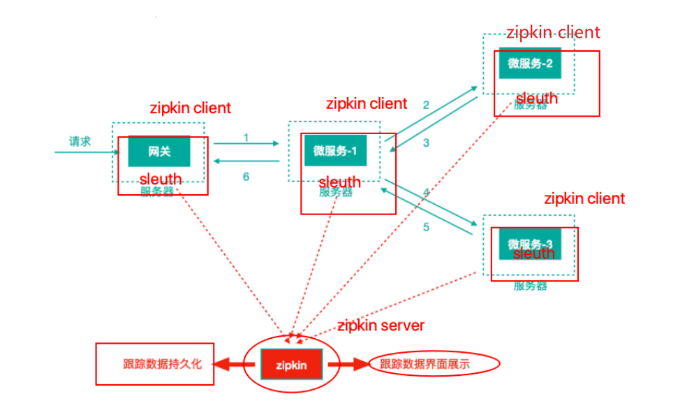

[toc]

## 一、场景

分布式架构下不同服务之间构成的调用链路，如何发现哪个节点故障？哪个节点耗时长？

可通过**==分布式链路追踪技术==**，将各个链路节点都能够记录下⽇志，并最终将⽇志进⾏集中可视化展示

**市场上的分布式链路追踪⽅案**

- **==Spring Cloud Sleuth + Twitter Zipkin==**

- 阿⾥巴巴的“鹰眼”

- ⼤众点评的“CAT”

- 美团的“Mtrace”

- 京东的“Hydra”

- 新浪的“Watchman”

- **==Apache Skywalking==**


## 二、简介

### 1. 流程图



⼀个请求链路，⼀条链路通过TraceId唯⼀标识，span标识发起的请求信息，各span通过parrentId关联起来，并记录日志

- **Trace：**服务追踪的追踪单元是从客户发起请求（request）抵达被追踪系统的边界开始，到被追踪系统向客户返回响应（response）为⽌的过程

- **Trace ID：**唯⼀的跟踪标识Trace ID，相当于一个全局流水号

- **Span ID：**链路中各单元的请求标识，⼀个Trace ID 对应多个Span Id


### 2. Span中的事件

- CS ：client send/start 客户端/消费者发出⼀个请求，描述的是⼀个span开始

- SR：server received/start 服务端/⽣产者接收请求 SR-CS属于请求发送的⽹络延迟

- SS：server send/fifinish 服务端/⽣产者发送应答 SS-SR属于服务端消耗时间

- CR：client received/fifinished 客户端/消费者接收应答 CR-SS表示回复需要的时间(响应的⽹络延迟)


### 3. 整合Zipkin

Spring Cloud Sleuth （追踪服务框架）可以追踪服务之间的调⽤，Sleuth可以记录⼀个服务请求经过哪些服务、服务处理时⻓等，根据这些，我们能够理清各微服务间的调⽤关系及进⾏问题追踪分析

我们往往把**Spring Cloud Sleuth** 和 **Zipkin** ⼀起使⽤，把 **Sleuth** 的数据信息发送给 **Zipkin** 进⾏聚合，利⽤ **Zipkin** 存储并展示数据。



## 三、应用

### 1. Server 端

#### 1.1 pom.xml

```xml
<?xml version="1.0" encoding="UTF-8"?>
<project xmlns="http://maven.apache.org/POM/4.0.0"
         xmlns:xsi="http://www.w3.org/2001/XMLSchema-instance"
         xsi:schemaLocation="http://maven.apache.org/POM/4.0.0 http://maven.apache.org/xsd/maven-4.0.0.xsd">
    <parent>
        <artifactId>scn-demo</artifactId>
        <groupId>com.tangdi</groupId>
        <version>1.0-SNAPSHOT</version>
    </parent>
    <modelVersion>4.0.0</modelVersion>

    <artifactId>scn-zipkin</artifactId>

    <dependencies>
        <!--zipkin-server的依赖坐标-->
        <dependency>
            <groupId>io.zipkin.java</groupId>
            <artifactId>zipkin-server</artifactId>
            <version>2.12.3</version>
            <exclusions>
                <!--排除掉log4j2的传递依赖，避免和springboot依赖的⽇
               志组件冲突-->
                <exclusion>
                    <groupId>org.springframework.boot</groupId>
                    <artifactId>spring-boot-starter-log4j2</artifactId>
                </exclusion>
            </exclusions>
        </dependency>
        <!--zipkin-server ui界⾯依赖坐标-->
        <dependency>
            <groupId>io.zipkin.java</groupId>
            <artifactId>zipkin-autoconfigure-ui</artifactId>
            <version>2.12.3</version>
        </dependency>

        <!--zipkin针对mysql持久化的依赖-->
        <dependency>
            <groupId>io.zipkin.java</groupId>
            <artifactId>zipkin-autoconfigure-storage-mysql</artifactId>
            <version>2.12.3</version>
        </dependency>
        <!--mysql驱动-->
        <dependency>
            <groupId>mysql</groupId>
            <artifactId>mysql-connector-java</artifactId>
        </dependency>
        <!--druid连接池-->
        <dependency>
            <groupId>com.alibaba</groupId>
            <artifactId>druid-spring-boot-starter</artifactId>
            <version>1.1.10</version>
        </dependency>
        <!--Spring的事务控制-->
        <dependency>
        <groupId>org.springframework</groupId>
        <artifactId>spring-tx</artifactId>
        </dependency>
        <dependency>
            <groupId>org.springframework</groupId>
            <artifactId>spring-jdbc</artifactId>
        </dependency>
    </dependencies>

</project>
```


#### 1.2 启动类

```java
package com.tangdi;

import org.springframework.boot.SpringApplication;
import org.springframework.boot.autoconfigure.SpringBootApplication;
import org.springframework.context.annotation.Bean;
import org.springframework.jdbc.datasource.DataSourceTransactionManager;
import org.springframework.transaction.PlatformTransactionManager;
import zipkin2.server.internal.EnableZipkinServer;

import javax.sql.DataSource;

/**
 * @program: scn-demo
 * @description:
 * @author: Wangwt
 * @create: 16:09 2021/9/4
 */


@SpringBootApplication
@EnableZipkinServer
public class ZipkinApplication {

    public static void main(String[] args) {
        SpringApplication.run(ZipkinApplication.class, args);
    }

    // 注入事务控制器
    @Bean
    public PlatformTransactionManager transactionManager(DataSource dataSource) {
        return new DataSourceTransactionManager(dataSource);
    }
}
```


#### 1.3 配置文件

```yaml
server:
  port: 9411


management:
  metrics:
    web:
      server:
        auto-time-requests: false # 关闭⾃动检测请求


spring:
  datasource:
    driver-class-name: com.mysql.jdbc.Driver
    url: jdbc:mysql://localhost:3306/zipkin?useUnicode=true&characterEncoding=utf-8&useSSL=false&allowMultiQueries=true&serverTimezone=GMT
    username: root
    password: 123456
    druid:
      initialSize: 10
      minIdle: 10
      maxActive: 30
      maxWait: 50000
# 指定zipkin持久化介质为mysql
zipkin:
  storage:
    type: mysql
```


#### 1.4 持久化

mysql中创建名称为zipkin的数据库，并执⾏如下sql语句（官⽅提供）

```sql
--
-- Copyright 2015-2019 The OpenZipkin Authors
--
-- Licensed under the Apache License, Version 2.0 (the "License"); you may not use this file except
-- in compliance with the License. You may obtain a copy ofthe License at
--
-- http://www.apache.org/licenses/LICENSE-2.0
--
-- Unless required by applicable law or agreed to inwriting, software distributed under the License
-- is distributed on an "AS IS" BASIS, WITHOUT WARRANTIES ORCONDITIONS OF ANY KIND, either express
-- or implied. See the License for the specific languagegoverning permissions and limitations under
-- the License.
--
CREATE TABLE IF NOT EXISTS zipkin_spans (
 `trace_id_high` BIGINT NOT NULL DEFAULT 0 COMMENT 'If non
zero, this means the trace uses 128 bit traceIds instead of
64 bit',
 `trace_id` BIGINT NOT NULL,
 `id` BIGINT NOT NULL,
 `name` VARCHAR(255) NOT NULL,
 `remote_service_name` VARCHAR(255),
 `parent_id` BIGINT,
 `debug` BIT(1),
 `start_ts` BIGINT COMMENT 'Span.timestamp(): epoch micros
used for endTs query and to implement TTL',
 `duration` BIGINT COMMENT 'Span.duration(): micros used
for minDuration and maxDuration query',
 PRIMARY KEY (`trace_id_high`, `trace_id`, `id`)
) ENGINE=InnoDB ROW_FORMAT=COMPRESSED CHARACTER SET=utf8
COLLATE utf8_general_ci;
ALTER TABLE zipkin_spans ADD INDEX(`trace_id_high`,
`trace_id`) COMMENT 'for getTracesByIds';
ALTER TABLE zipkin_spans ADD INDEX(`name`) COMMENT 'for
getTraces and getSpanNames';
ALTER TABLE zipkin_spans ADD INDEX(`remote_service_name`)
COMMENT 'for getTraces and getRemoteServiceNames';
ALTER TABLE zipkin_spans ADD INDEX(`start_ts`) COMMENT 'for
getTraces ordering and range';
CREATE TABLE IF NOT EXISTS zipkin_annotations (
 `trace_id_high` BIGINT NOT NULL DEFAULT 0 COMMENT 'If non
zero, this means the trace uses 128 bit traceIds instead of
64 bit',
 `trace_id` BIGINT NOT NULL COMMENT 'coincides with
zipkin_spans.trace_id',
 `span_id` BIGINT NOT NULL COMMENT 'coincides with
zipkin_spans.id',
 `a_key` VARCHAR(255) NOT NULL COMMENT
'BinaryAnnotation.key or Annotation.value if type == -1',
 `a_value` BLOB COMMENT 'BinaryAnnotation.value(), which
must be smaller than 64KB',
 `a_type` INT NOT NULL COMMENT 'BinaryAnnotation.type() or
-1 if Annotation',
 `a_timestamp` BIGINT COMMENT 'Used to implement TTL;
Annotation.timestamp or zipkin_spans.timestamp',
 `endpoint_ipv4` INT COMMENT 'Null when
Binary/Annotation.endpoint is null',
 `endpoint_ipv6` BINARY(16) COMMENT 'Null when
Binary/Annotation.endpoint is null, or no IPv6 address',
 `endpoint_port` SMALLINT COMMENT 'Null when
Binary/Annotation.endpoint is null',
 `endpoint_service_name` VARCHAR(255) COMMENT 'Null when
Binary/Annotation.endpoint is null'
) ENGINE=InnoDB ROW_FORMAT=COMPRESSED CHARACTER SET=utf8
COLLATE utf8_general_ci;
ALTER TABLE zipkin_annotations ADD UNIQUE
KEY(`trace_id_high`, `trace_id`, `span_id`, `a_key`,
`a_timestamp`) COMMENT 'Ignore insert on duplicate';
ALTER TABLE zipkin_annotations ADD INDEX(`trace_id_high`,
`trace_id`, `span_id`) COMMENT 'for joining with
zipkin_spans';
ALTER TABLE zipkin_annotations ADD INDEX(`trace_id_high`,
`trace_id`) COMMENT 'for getTraces/ByIds';
ALTER TABLE zipkin_annotations ADD
INDEX(`endpoint_service_name`) COMMENT 'for getTraces and
getServiceNames';
ALTER TABLE zipkin_annotations ADD INDEX(`a_type`) COMMENT
'for getTraces and autocomplete values';
ALTER TABLE zipkin_annotations ADD INDEX(`a_key`) COMMENT
'for getTraces and autocomplete values';
ALTER TABLE zipkin_annotations ADD INDEX(`trace_id`,
`span_id`, `a_key`) COMMENT 'for dependencies job';
CREATE TABLE IF NOT EXISTS zipkin_dependencies (
 `day` DATE NOT NULL,
 `parent` VARCHAR(255) NOT NULL,
 `child` VARCHAR(255) NOT NULL,
 `call_count` BIGINT,
 `error_count` BIGINT,
 PRIMARY KEY (`day`, `parent`, `child`)
) ENGINE=InnoDB ROW_FORMAT=COMPRESSED CHARACTER SET=utf8
COLLATE utf8_general_ci;
```


### 2. Client 端(gateway网关、微服务)

#### 2.1 pom.xml添加依赖

```xml
<!--链路追踪-->
<dependency>
    <groupId>org.springframework.cloud</groupId>
    <artifactId>spring-cloud-starter-sleuth</artifactId>
</dependency>
<!--Zipkin Client聚合链路sleuth-->
<dependency>
    <groupId>org.springframework.cloud</groupId>
    <artifactId>spring-cloud-starter-zipkin</artifactId>
</dependency>
```


#### 2.2 添加以下配置文件

```yaml
spring:
  zipkin:
    base-url: http://127.0.0.1:9411 # zipkin server的请求地址
    sender:
      # web 客户端将踪迹日志数据通过网络请求的方式传送到服务端，另外还有配置
      # kafka/rabbit 客户端将踪迹日志数据传递到mq进行中转
      type: web
  sleuth:
    sampler:
      # 采样率 1 代表100%全部采集 ，默认0.1 代表10% 的请求踪迹数据会被采集
      # 生产环境下，请求量非常大，没有必要所有请求的踪迹数据都采集分析，对于网络包括server端压力都是比较大的，可以配置采样率采集一定比例的请求的踪迹数据进行分析即可
      probability: 1


logging:
  level:
    # Feign日志只会对日志级别为debug的做出响应
    com.tangdi.webserver: debug
    # 分布式链路追踪日志
    org.springframework.web.servlet.DispatcherServlet: debug
    org.springframework.cloud.sleuth: debug
```


### 3. 访问Zipkin地址

http://localhost:9411
