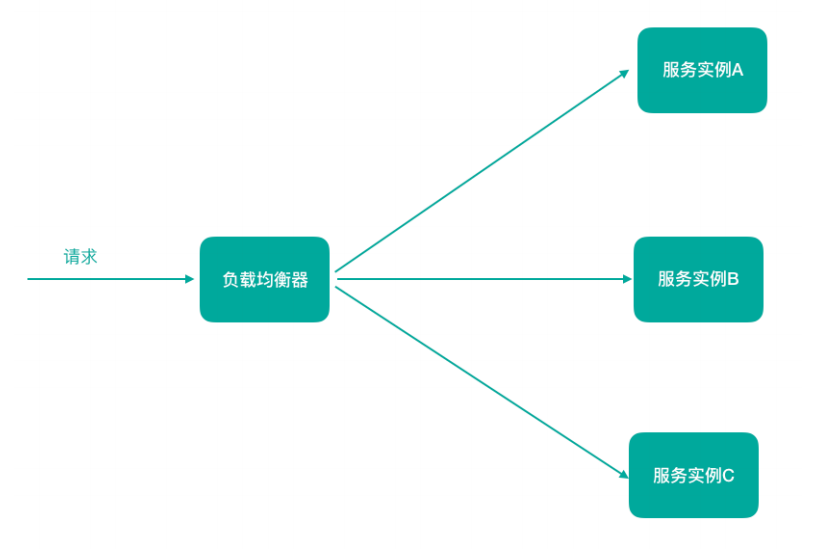
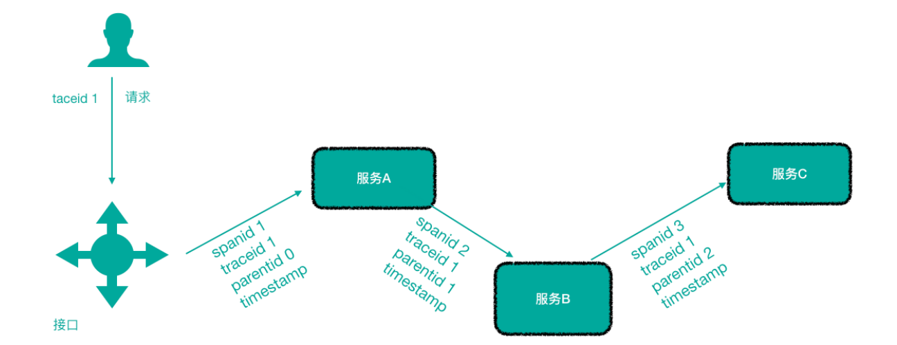

[toc]

## 一、微服务相关概念

### 服务注册与服务发现

服务自动注册与发现，服务端动态注册到注册与发现中心，消费者动态发现服务端信息

解决了因服务器搬迁，导致客户端需要修改服务端通信端点的配置

- 服务注册：服务提供者将信息（服务器IP和端⼝、服务访问协议等）注册到注册中⼼

- 服务发现：服务消费者从注册中⼼获取服务列表并**监听服务发现与注册中心的节点变更事件**，然后负载均衡策略选择⼀个服务访问

### 负载均衡

负载均衡即将请求压⼒分配到多个服务器（应⽤服务器、数据库服务器等），以此来提⾼服务的性能、可靠性

### 熔断

是一种容错机制，防止服务雪崩

微服务架构中，如果下游服务因访问压⼒过⼤⽽响应变慢或失败，上游服务为了保护系统整体可⽤性，可以暂时切断对下游服务的调⽤。这种牺牲局部，保全整体的措施就叫做熔断。

### 链路追踪

微服务架构越发流⾏，⼀个项⽬往往拆分成很多个服务，那么⼀次请求就需要涉及到很多个服务。不同的微服务可能是由不同的团队开发、可能使⽤不同的编程语⾔实现、整个项⽬也有可能部署在了很多服务器上（甚⾄百台、千台）横跨多个不同的数据中⼼。所谓链路追踪，就是对⼀次请求涉及的很多个服务链路进⾏⽇志记录、性能监控

### API ⽹关

微服务架构下，不同的微服务往往会有不同的访问地址，客户端可能需要调⽤多个服务的接⼝才能完成⼀个业务需求

API请求调⽤统⼀接⼊API⽹关层，由⽹关转发请求。API⽹关更专注在安全、路由、流量等问题的处理上（微服务团队专注于处理业务逻辑即可）

#### 若客户端直接与各个微服务通信的缺点

1. 客户端需要调⽤不同的url地址，增加了维护调⽤难度

2. 在⼀定的场景下，也存在跨域请求的问题（前后端分离就会碰到跨域问题，原本我们在后端采⽤Cors就能解决，现在利⽤⽹关，那么就放在⽹关这层做好了）

3. 每个微服务都需要进⾏单独的身份认证

#### 引入API⽹关的优点

1. 统⼀接⼊（路由）

2. 安全防护（统⼀鉴权，负责⽹关访问身份认证验证，与“访问认证中⼼”通信，实际认证业务逻辑交移“访问认证中⼼”处理）

3. ⿊⽩名单（实现通过IP地址控制禁⽌访问⽹关功能，控制访问）3）协议适配（实现通信协议校验、适配转换的功能）

4. 流量管控（限流）

5. ⻓短链接⽀持

6. 容错能⼒（负载均衡）