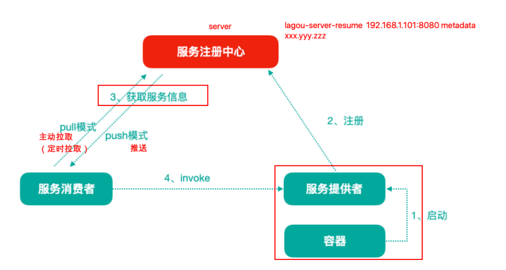
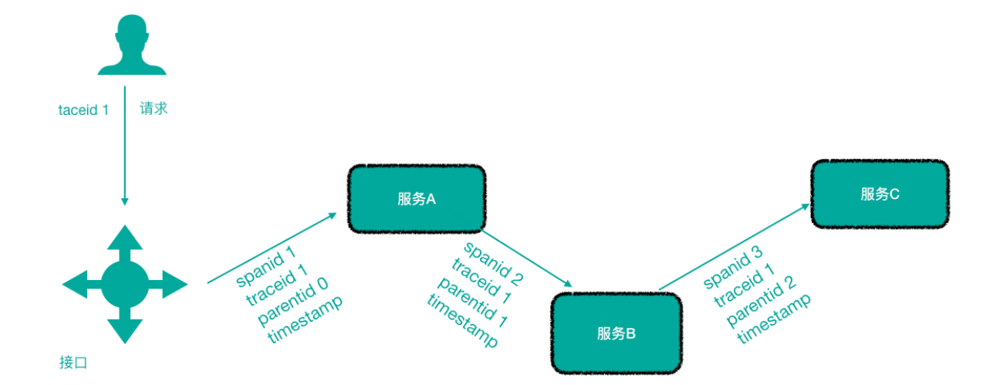
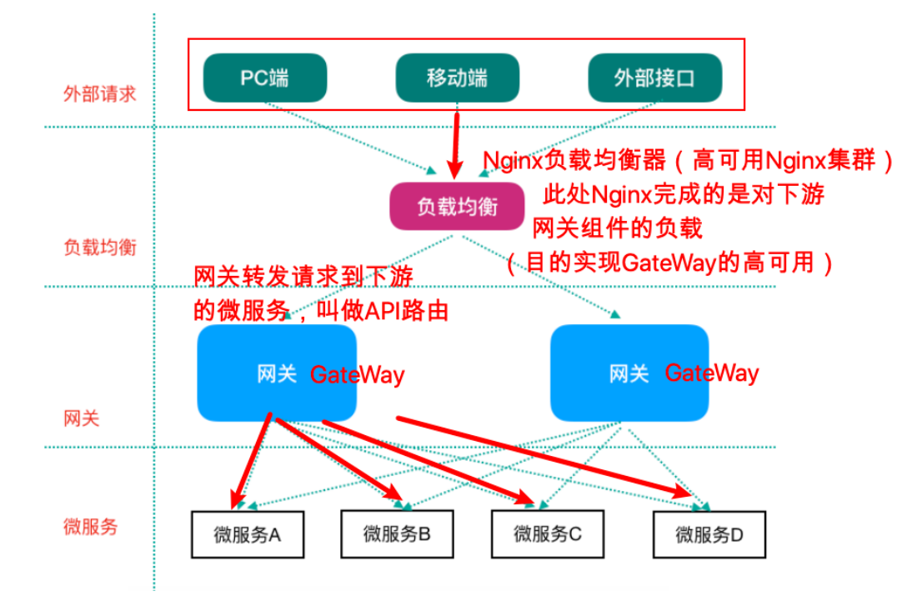

[toc]

## 一、SpringCloud微服务架构组件对比

|                | 第⼀代 SpringCloud                                                                                 （Netflix，SCN） | 第⼆代 Spring Cloud                                                                                                                                                            （主要就是Spring Cloud Alibaba，SCA） |
| -------------- | :----------------------------------------------------------- | ------------------------------------------------------------ |
| 注册中⼼       | Netflix Eureka                                               | 阿⾥巴巴 Nacos                                               |
| 客户端负载均衡 | Netflix Ribbon                                               | 阿⾥巴巴 Dubbo LB、SpringCloud Loadbalancer                  |
| 熔断器         | Netflix Hystrix                                              | 阿⾥巴巴 Sentinel                                            |
| ⽹关           | Netflix Zuul（性能⼀般，未来将退出SpringCloud⽣态圈）、**SpringCloud Gateway** |                                                              |
| 配置中⼼       | SpringCloud Config                                           | 阿⾥巴巴Nacos、携程 Apollo                                   |
| 服务调⽤       | **Netflix Feign（Ribbon+Hystrix）**                          | 阿⾥巴巴 Dubbo RPC                                           |
| 消息驱动       | **Spring Cloud Stream**                                      |                                                              |
| 链路追踪       | **Spring Cloud Sleuth/Zipkin**                               |                                                              |
| 分布式事务     |                                                              | **阿⾥巴巴 seata 分布式事务⽅案**                            |

**==SCN 和 SCA的组件在实际项目使用中，可以任意搭配==**

## 二、服务注册与服务发现

### 1. 简介

服务注册中⼼⽤于存储服务提供者地址信息、服务发布相关的属性信息，消费者通过主动查询和被动通知的⽅式获取服务提供者的地址信息，不再需要通过硬编码⽅式得到提供者的地址信息

- 服务注册：服务提供者将信息（服务器IP和端⼝、服务访问协议等）注册到注册中⼼

- 服务发现：**==主动查询==**和**==被动通知==**的⽅式获取**==所有服务提供者实例==**的地址信息

### 2. 主流服务注册发现中心对比

| 组件名    | 语⾔ | CAP                          | 对外暴露接⼝ | 功能                                        |
| --------- | ---- | ---------------------------- | ------------ | ------------------------------------------- |
| Eureka    | Java | AP（⾃我保护机制，保证可⽤） | HTTP         | 基于 RestfulAPI⻛格开发的服务注册与发现组件 |
| Consul    | GO   | CP                           | HTTP/DNS     | 采⽤Raft算法保证服务的⼀致性                |
| Zookeeper | Java | CP                           | 客户端       |                                             |
| Nacos     | Java | ⽀持AP/CP切换                | HTTP         | 注册中⼼ + 配置中⼼的组合                   |

## 三、负载均衡

负载均衡即将请求压⼒分配到多个服务器（应⽤服务器、数据库服务器等），以此来提⾼服务的性能、可靠性

负载均衡⼀般分为**服务器端负载均衡**和**客户端负载均衡**

- **服务器端负载均衡**

  ⽐如Nginx、F5这些，请求到达服务器之后由这些负载均衡器根据⼀定的算法将请求路由到⽬标服务器处理。

- **客户端负载均衡**

  ⽐如我们要说的Ribbon，服务消费者客户端会有⼀个服务器地址列表，调⽤⽅在请求前通过⼀定的负载均衡算法选择⼀个服务器进⾏访问，负载均衡算法的执⾏是在请求客户端进⾏。

## 四、熔断

是一种容错机制，防止服务雪崩

微服务架构中，如果下游服务因访问压⼒过⼤⽽响应变慢或失败，上游服务为了保护系统整体可⽤性，可以暂时切断对下游服务的调⽤。这种牺牲局部，保全整体的措施就叫做熔断。

## 五、链路追踪

微服务架构越发流⾏，⼀个项⽬往往拆分成很多个服务，那么⼀次请求就需要涉及到很多个服务。不同的微服务可能是由不同的团队开发、可能使⽤不同的编程语⾔实现、整个项⽬也有可能部署在了很多服务器上（甚⾄百台、千台）横跨多个不同的数据中⼼。所谓链路追踪，就是对⼀次请求涉及的很多个服务链路进⾏⽇志记录、性能监控

## 六、API ⽹关

微服务架构下，不同的微服务往往会有不同的访问地址，客户端可能需要调⽤多个服务的接⼝才能完成⼀个业务需求

API请求调⽤统⼀接⼊API⽹关层，由⽹关转发请求。API⽹关更专注在安全、路由、流量等问题的处理上（微服务团队专注于处理业务逻辑即可）

微服务的网关上游应该是Nginx服务器，**==通过Nginx反向代理对前端隐藏后端服务地址==**，并**==负载均衡实现网关的高可用集群==**

#### 若客户端直接与各个微服务通信的缺点

1. 客户端需要调⽤不同的url地址，增加了维护调⽤难度

2. 在⼀定的场景下，也存在跨域请求的问题（前后端分离就会碰到跨域问题，原本我们在后端采⽤Cors就能解决，现在利⽤⽹关，那么就放在⽹关这层做好了）

3. 每个微服务都需要进⾏单独的身份认证

#### 引入API⽹关的优点

1. 统⼀接⼊（路由）

2. 安全防护（统⼀鉴权，负责⽹关访问身份认证验证，与“访问认证中⼼”通信，实际认证业务逻辑交移“访问认证中⼼”处理）

3. ⿊⽩名单（实现通过IP地址控制禁⽌访问⽹关功能，控制访问）

4. 流量管控（限流）

5. ⻓短链接⽀持

6. 容错能⼒（负载均衡）