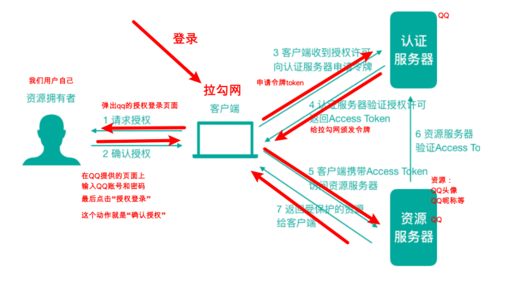
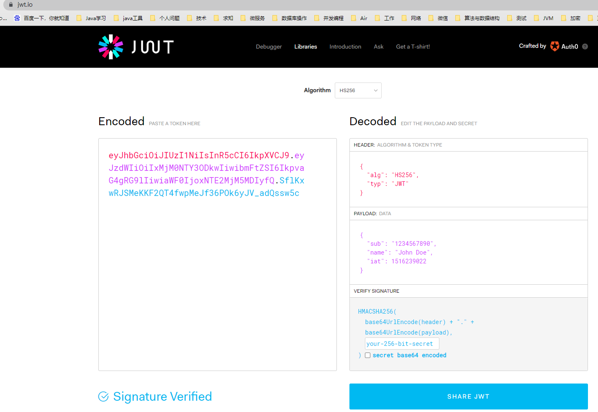
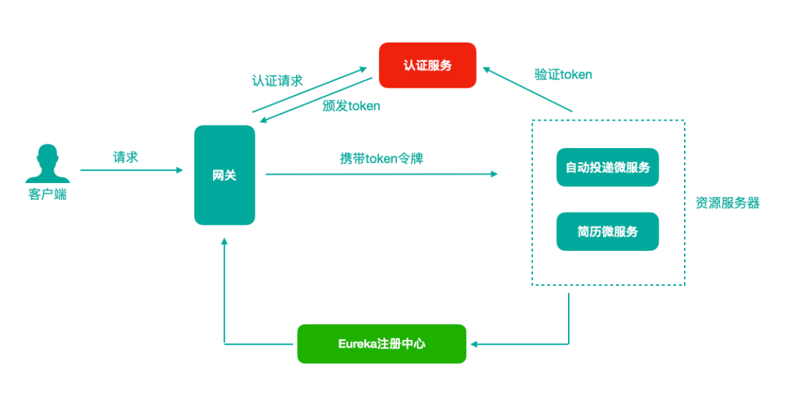
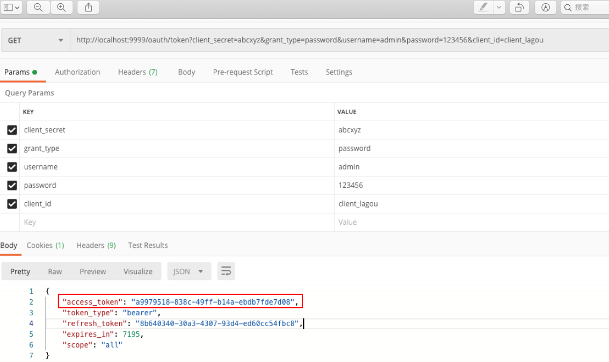
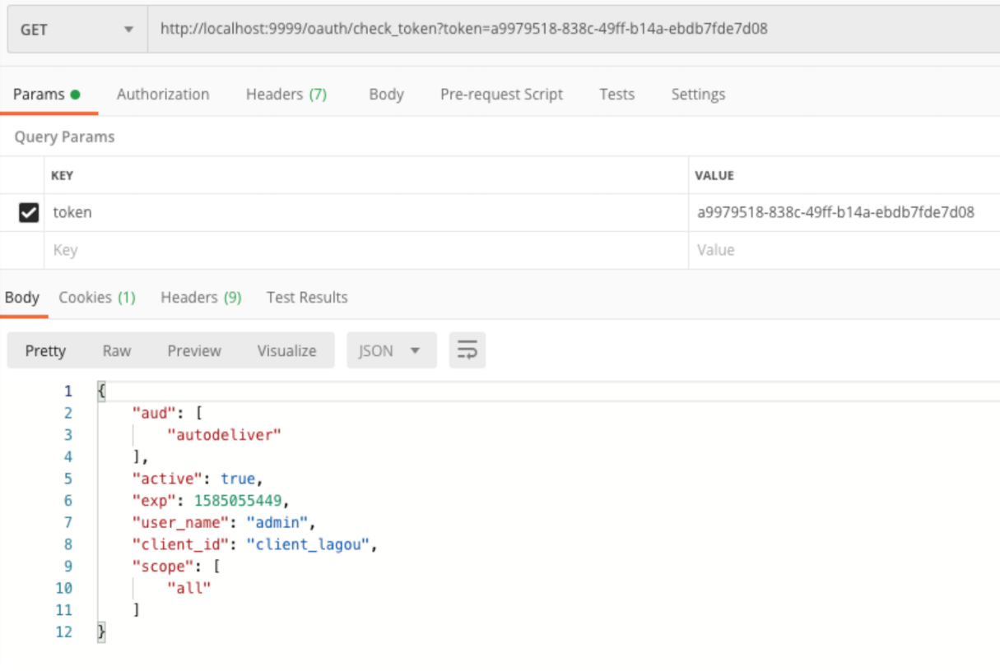
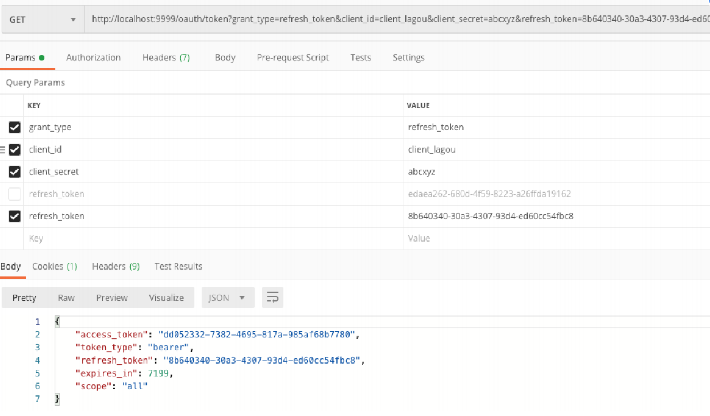

[toc]


## 一、统一身份认证/SSO单点登陆实现方式


### 1. 使用Session的传统方式实现

用户登陆成功后，将信息写入Session，并**==通过Redis、Session复制==**等方式实现分布式架构下的**==Session共享==**，并将**==SessionId写入cookie响应给客户端==**。

**缺点：**目前时代发展，**==并不是所有客户端都支持cookie了==**，比如移动端以及一些新的浏览器

### 2. 基于Token的认证方式

基于Token的认证⽅式，**==服务端不用存储认证信息（Token）==**。

在登陆时，**==统一认证中心认证通过后，生成Token（含认证信息的加密字符串可基于 JWT实现）==**，Token返回给客户端，客户端可将Token存储在任意地方，只需要在请求后端服务时带上即，后端服务在进行验证

**缺点：**Token数据量较⼤，⽽且每次请求都需要传递，因此⽐较占带宽，服务端需要验签解密比较占用资源


## 二、OAuth2  开放授权协议/标准

### 1. OAuth2 简介

**==OAuth（开放授权）是⼀个开放协议/标准==**，允许⽤户授权第三⽅应⽤访问他们存储在另外的服务提供者上的信息，⽽不需要将⽤户名和密码提供给第三⽅应⽤或分享他们数据的所有内容。针对定义，以下通过拉勾网和QQ来打个比方


当求职者想在拉钩网查询职位，但是又不想在拉勾网注册账号，由此拉勾网提供了**第三方登陆如微信、QQ、微博**，来进行授权登陆。**用户通过QQ授权并登陆**，**QQ认证中心**将一个带有用户信息的**令牌分发给拉勾网**，拉勾网即可使用令牌获取用户信息而**无需知晓用户的账号密码**。

- 第三⽅应⽤：拉勾网
- 服务提供者：QQ、微信、微博


### 2. OAuth2 角色及流程

1. 用户在某平台选择第三方登陆（如QQ登陆）
2. 跳转到QQ认证中心页面，请求授权
3. 用户输入QQ账号/密码，点击授权并登录
4. 客户端收到授权许可，向QQ认证中心申请令牌
5. 认证中心向服务器分发Access Token令牌
6. 客户端携带Access Token请求QQ资源服务器，获取用户信息
7. 返回受保护的用户信息给客户端



- **==资源所有者（Resource Owner）==**：⽤户⾃⼰

- **==客户端（Client）==**：想登陆的⽹站或应⽤，⽐如拉勾⽹

- **==认证服务器（Authorization Server）==**

  对外提供认证的认证中心，如微信、QQ的认证中心。**登陆认证、生成并颁发token、验证token、刷新token**

- **==资源服务器（Resource Server）==**：微信、QQ的服务


### 3. OAuth2 使用场景

- **==第三方授权登陆的场景==**

  作为大平台，实现一个认证中心，为其他第三方应用提供授权登陆的服务。

- **==单点登陆场景==**

  作为微服务架构，需要一个统一登陆及认证的服务，为其他所有服务进行统一的认证，实现一次登陆全服务授权


### 4. OAuth2 授权方式

- **==授权码（authorization-code）==**

  使⽤到了回调地址，是最复杂的授权⽅式，微博、微信、QQ等第三⽅登录就是这种模式

- **==密码式（password）==**提供⽤户名+密码换取token令牌

- 隐藏式（implicit） 

- 客户端凭证（client credentials）


## 三、Spring Cloud OAuth2 + JWT 实现实现统一认证


### 1.  JWT 简介

**==JSON Web Token==**（JWT）是⼀个开放的⾏业标准（RFC 7519），它定义了⼀种简介的、⾃包含的协议格式，⽤于在通信双⽅传递 **==JSON格式的数据==**，传递的信息**==经过数字签名==**可以被验证和信任。JWT 可以**==使⽤HMAC算法==**或**==使⽤RSA的公 钥/私钥对来签名==**，防⽌被篡改

JWT令牌由三部分组成，每部分中间使⽤点（.）分隔，如下图所示



- Header

  **头部**包括令牌的类型（即JWT）、**使⽤的哈希算法**（如HMAC SHA256或RSA），例如

  ```json
  {
   "alg": "HS256",
   "typ": "JWT"
  }
  ```

  

- Payload

  **存放有效信息**的地⽅，它可以存放jwt提供的现成字段，⽐ 如：iss（签发者）,exp（过期时间戳）, sub（⾯向的⽤户）等，也可⾃定义字段，**请勿存放敏感信息**，此部分可解码为明文

  ```json
  {
   "sub": "1234567890",
   "name": "John Doe",
   "iat": 1516239022
  }
  ```

  

- Signature

  **签名**，此部分⽤于防⽌jwt内容被篡改。 这个部分**使⽤base64url将前两部分进⾏编码**，编码后使⽤点（.）连接组成字符串，最后使⽤**header中声明的签名算法进⾏签名**

  - base64UrlEncode(header)：jwt令牌的第⼀部分

  - base64UrlEncode(payload)：jwt令牌的第⼆部分
  - **secret：签名所使⽤的密钥**

  ```json
  HMACSHA256(
   base64UrlEncode(header) + "." +
   base64UrlEncode(payload),
   secret)
  ```

  


### 2. Spring Cloud OAuth2 是 Spring Cloud 体系对OAuth2协议的实现

可以⽤来做多个微服务的统⼀认证（验证身份合法性）授权（验证权限）。通过向OAuth2服务（统⼀认证授权服务）发送某个类型的grant_type进⾏集中认证和授权，从⽽获得access_token（访问令牌），⽽这个token是受其他微服务信任的


### 3. 认证中心在微服务架构中




### 4. 搭建认证中心

认证服务器（Authorization Server），负责登陆认证、生成并颁发token、验证token、刷新token

#### 4.1 pom.xml

```xml
<?xml version="1.0" encoding="UTF-8"?>
<project xmlns="http://maven.apache.org/POM/4.0.0"
         xmlns:xsi="http://www.w3.org/2001/XMLSchema-instance"
         xsi:schemaLocation="http://maven.apache.org/POM/4.0.0 http://maven.apache.org/xsd/maven-4.0.0.xsd">
    <parent>
        <artifactId>lagou-parent</artifactId>
        <groupId>com.lagou.edu</groupId>
        <version>1.0-SNAPSHOT</version>
    </parent>
    <modelVersion>4.0.0</modelVersion>

    <artifactId>lagou-cloud-oauth-server-9999</artifactId>


    <dependencies>
        <!--导入Eureka Client依赖-->
        <dependency>
            <groupId>org.springframework.cloud</groupId>
            <artifactId>spring-cloud-starter-netflix-eureka-client</artifactId>
        </dependency>


        <!--导入spring cloud oauth2依赖-->
        <dependency>
            <groupId>org.springframework.cloud</groupId>
            <artifactId>spring-cloud-starter-oauth2</artifactId>
            <exclusions>
                <exclusion>
                    <groupId>org.springframework.security.oauth.boot</groupId>
                    <artifactId>spring-security-oauth2-autoconfigure</artifactId>
                </exclusion>
            </exclusions>
        </dependency>
        <dependency>
            <groupId>org.springframework.security.oauth.boot</groupId>
            <artifactId>spring-security-oauth2-autoconfigure</artifactId>
            <version>2.1.11.RELEASE</version>
        </dependency>
        <!--引入security对oauth2的支持-->
        <dependency>
            <groupId>org.springframework.security.oauth</groupId>
            <artifactId>spring-security-oauth2</artifactId>
            <version>2.3.4.RELEASE</version>
        </dependency>


        <dependency>
            <groupId>mysql</groupId>
            <artifactId>mysql-connector-java</artifactId>
        </dependency>
        <dependency>
            <groupId>com.alibaba</groupId>
            <artifactId>druid-spring-boot-starter</artifactId>
            <version>1.1.10</version>
        </dependency>
        <!--操作数据库需要事务控制-->
        <dependency>
            <groupId>org.springframework</groupId>
            <artifactId>spring-tx</artifactId>
        </dependency>
        <dependency>
            <groupId>org.springframework</groupId>
            <artifactId>spring-jdbc</artifactId>
        </dependency>


        <dependency>
            <groupId>com.lagou.edu</groupId>
            <artifactId>lagou-service-common</artifactId>
            <version>1.0-SNAPSHOT</version>
        </dependency>

    </dependencies>

</project>
```


#### 4.2 全局配置文件

```yaml
server:
  port: 9999
Spring:
  application:
    name: lagou-cloud-oauth-server
  datasource:
    driver-class-name: com.mysql.jdbc.Driver
    url: jdbc:mysql://localhost:3306/oauth2?useUnicode=true&characterEncoding=utf-8&useSSL=false&allowMultiQueries=true
    username: root
    password: 123456
    druid:
      initialSize: 10
      minIdle: 10
      maxActive: 30
      maxWait: 50000
eureka:
  client:
    serviceUrl: # eureka server的路径
      defaultZone: http://lagoucloudeurekaservera:8761/eureka/,http://lagoucloudeurekaserverb:8762/eureka/ #把 eureka 集群中的所有 url 都填写了进来，也可以只写一台，因为各个 eureka server 可以同步注册表
  instance:
    #使用ip注册，否则会使用主机名注册了（此处考虑到对老版本的兼容，新版本经过实验都是ip）
    prefer-ip-address: true
    #自定义实例显示格式，加上版本号，便于多版本管理，注意是ip-address，早期版本是ipAddress
    instance-id: ${spring.cloud.client.ip-address}:${spring.application.name}:${server.port}

```


#### 4.3 OAuth授权的客户端信息DDL

```sql
SET NAMES utf8mb4;
SET FOREIGN_KEY_CHECKS = 0;
-- ----------------------------
-- Table structure for oauth_client_details
-- ----------------------------
DROP TABLE IF EXISTS `oauth_client_details`;
CREATE TABLE `oauth_client_details` (
 `client_id` varchar(48) NOT NULL,
 `resource_ids` varchar(256) DEFAULT NULL,
 `client_secret` varchar(256) DEFAULT NULL,
 `scope` varchar(256) DEFAULT NULL,
 `authorized_grant_types` varchar(256) DEFAULT NULL,
 `web_server_redirect_uri` varchar(256) DEFAULT NULL,
 `authorities` varchar(256) DEFAULT NULL,
 `access_token_validity` int(11) DEFAULT NULL,
 `refresh_token_validity` int(11) DEFAULT NULL,
 `additional_information` varchar(4096) DEFAULT NULL,
 `autoapprove` varchar(256) DEFAULT NULL,
 PRIMARY KEY (`client_id`)
) ENGINE=InnoDB DEFAULT CHARSET=utf8;
-- ----------------------------
-- Records of oauth_client_details
-- ----------------------------
BEGIN;
INSERT INTO `oauth_client_details` VALUES ('client_lagou123',
'autodeliver,resume', 'abcxyz', 'all', 'password,refresh_token',
NULL, NULL, 7200, 259200, NULL, NULL);
COMMIT;
SET FOREIGN_KEY_CHECKS = 1;
```


#### 4.4 用户信息DDL

```sql
SET NAMES utf8mb4;
SET FOREIGN_KEY_CHECKS = 0;
-- ----------------------------
-- Table structure for users
-- ----------------------------
DROP TABLE IF EXISTS `users`;
CREATE TABLE `users` (
 `id` int(11) NOT NULL AUTO_INCREMENT,
 `username` char(10) DEFAULT NULL,
 `password` char(100) DEFAULT NULL,
 PRIMARY KEY (`id`)
) ENGINE=InnoDB AUTO_INCREMENT=5 DEFAULT CHARSET=utf8;
-- ----------------------------
-- Records of users
-- ----------------------------
BEGIN;
INSERT INTO `users` VALUES (4, 'zhangsan', 'iuxyzds');
COMMIT;
SET FOREIGN_KEY_CHECKS = 1;
```


#### 4.5 OAuth2 认证中心启动类

```java
package com.lagou.edu;


import org.springframework.boot.SpringApplication;
import org.springframework.boot.autoconfigure.SpringBootApplication;
import org.springframework.boot.autoconfigure.domain.EntityScan;
import org.springframework.cloud.client.discovery.EnableDiscoveryClient;

@SpringBootApplication
@EnableDiscoveryClient
@EntityScan("com.lagou.edu.pojo")
public class OauthServerApplication9999 {

    public static void main(String[] args) {
        SpringApplication.run(OauthServerApplication9999.class,args);
    }
}
```


#### 4.6 OAuth2 认证中心配置类 

```java
package com.lagou.edu.config;

import org.springframework.beans.factory.annotation.Autowired;
import org.springframework.context.annotation.Bean;
import org.springframework.context.annotation.Configuration;
import org.springframework.http.HttpMethod;
import org.springframework.security.authentication.AuthenticationManager;
import org.springframework.security.jwt.crypto.sign.MacSigner;
import org.springframework.security.jwt.crypto.sign.SignatureVerifier;
import org.springframework.security.jwt.crypto.sign.Signer;
import org.springframework.security.oauth2.config.annotation.configurers.ClientDetailsServiceConfigurer;
import org.springframework.security.oauth2.config.annotation.web.configuration.AuthorizationServerConfigurerAdapter;
import org.springframework.security.oauth2.config.annotation.web.configuration.EnableAuthorizationServer;
import org.springframework.security.oauth2.config.annotation.web.configurers.AuthorizationServerEndpointsConfigurer;
import org.springframework.security.oauth2.config.annotation.web.configurers.AuthorizationServerSecurityConfigurer;
import org.springframework.security.oauth2.provider.ClientDetailsService;
import org.springframework.security.oauth2.provider.client.JdbcClientDetailsService;
import org.springframework.security.oauth2.provider.token.*;
import org.springframework.security.oauth2.provider.token.store.InMemoryTokenStore;
import org.springframework.security.oauth2.provider.token.store.JwtAccessTokenConverter;
import org.springframework.security.oauth2.provider.token.store.JwtTokenStore;

import javax.sql.DataSource;
import java.util.ArrayList;
import java.util.List;


/**
 * 当前类为Oauth2 server的配置类（需要继承特定的父类 AuthorizationServerConfigurerAdapter）
 */
@Configuration
@EnableAuthorizationServer  // 开启认证服务器功能
public class OauthServerConfiger extends AuthorizationServerConfigurerAdapter {


    @Autowired
    private AuthenticationManager authenticationManager;

    @Autowired
    private LagouAccessTokenConvertor lagouAccessTokenConvertor;


    private String sign_key = "lagou123"; // jwt签名密钥


    /**
     * 认证服务器最终是以api接口的方式对外提供服务（校验合法性并生成令牌、校验令牌等）
     * 那么，以api接口方式对外的话，就涉及到接口的访问权限，我们需要在这里进行必要的配置
     * @param security
     * @throws Exception
     */
    @Override
    public void configure(AuthorizationServerSecurityConfigurer security) throws Exception {
        super.configure(security);
        // 相当于打开endpoints 访问接口的开关，这样的话后期我们能够访问该接口
        security
                // 允许客户端表单认证
                .allowFormAuthenticationForClients()
                // 开启端口/oauth/token_key的访问权限（允许）
                .tokenKeyAccess("permitAll()")
                // 开启端口/oauth/check_token的访问权限（允许）
                .checkTokenAccess("permitAll()");
    }

    /**
     * 客户端详情配置，
     *  比如client_id，secret
     *  当前这个服务就如同QQ平台，拉勾网作为客户端需要qq平台进行登录授权认证等，提前需要到QQ平台注册，QQ平台会给拉勾网
     *  颁发client_id等必要参数，表明客户端是谁
     * @param clients
     * @throws Exception
     */
    @Override
    public void configure(ClientDetailsServiceConfigurer clients) throws Exception {
        super.configure(clients);


        // 从内存中加载客户端详情

        /*clients.inMemory()// 客户端信息存储在什么地方，可以在内存中，可以在数据库里
                .withClient("client_lagou")  // 添加一个client配置,指定其client_id
                .secret("abcxyz")                   // 指定客户端的密码/安全码
                .resourceIds("autodeliver")         // 指定客户端所能访问资源id清单，此处的资源id是需要在具体的资源服务器上也配置一样
                // 认证类型/令牌颁发模式，可以配置多个在这里，但是不一定都用，具体使用哪种方式颁发token，需要客户端调用的时候传递参数指定
                .authorizedGrantTypes("password","refresh_token")
                // 客户端的权限范围，此处配置为all全部即可
                .scopes("all");*/

        // 从数据库中加载客户端详情
        clients.withClientDetails(createJdbcClientDetailsService());

    }

    @Autowired
    private DataSource dataSource;

    @Bean
    public JdbcClientDetailsService createJdbcClientDetailsService() {
        JdbcClientDetailsService jdbcClientDetailsService = new JdbcClientDetailsService(dataSource);
        return jdbcClientDetailsService;
    }


    /**
     * 认证服务器是玩转token的，那么这里配置token令牌管理相关（token此时就是一个字符串，当下的token需要在服务器端存储，
     * 那么存储在哪里呢？都是在这里配置）
     * @param endpoints
     * @throws Exception
     */
    @Override
    public void configure(AuthorizationServerEndpointsConfigurer endpoints) throws Exception {
        super.configure(endpoints);
        endpoints
                .tokenStore(tokenStore())  // 指定token的存储方法
                .tokenServices(authorizationServerTokenServices())   // token服务的一个描述，可以认为是token生成细节的描述，比如有效时间多少等
                .authenticationManager(authenticationManager) // 指定认证管理器，随后注入一个到当前类使用即可
                .allowedTokenEndpointRequestMethods(HttpMethod.GET,HttpMethod.POST);
    }


    /*
     *   该方法用于创建tokenStore对象（令牌存储对象）
     *   token以什么形式存储
     */
    public TokenStore tokenStore(){
        //return new InMemoryTokenStore();
        // 使用jwt令牌
        return new JwtTokenStore(jwtAccessTokenConverter());
    }

    /**
     * 返回jwt令牌转换器（帮助我们生成jwt令牌的）
     * 在这里，我们可以把签名密钥传递进去给转换器对象
     * @return
     */
    public JwtAccessTokenConverter jwtAccessTokenConverter() {
        JwtAccessTokenConverter jwtAccessTokenConverter = new JwtAccessTokenConverter();
        jwtAccessTokenConverter.setSigningKey(sign_key);  // 签名密钥
        jwtAccessTokenConverter.setVerifier(new MacSigner(sign_key));  // 验证时使用的密钥，和签名密钥保持一致
        jwtAccessTokenConverter.setAccessTokenConverter(lagouAccessTokenConvertor); // 注入扩展jwt令牌转换器

        return jwtAccessTokenConverter;
    }


    /**
     * 该方法用户获取一个token服务对象（该对象描述了token有效期等信息）
     */
    public AuthorizationServerTokenServices authorizationServerTokenServices() {
        // 使用默认实现
        DefaultTokenServices defaultTokenServices = new DefaultTokenServices();
        defaultTokenServices.setSupportRefreshToken(true); // 是否开启令牌刷新
        defaultTokenServices.setTokenStore(tokenStore());

        // 针对jwt令牌的添加
        defaultTokenServices.setTokenEnhancer(jwtAccessTokenConverter());

        // 设置令牌有效时间（一般设置为2个小时）
        defaultTokenServices.setAccessTokenValiditySeconds(20); // access_token就是我们请求资源需要携带的令牌
        // 设置刷新令牌的有效时间
        defaultTokenServices.setRefreshTokenValiditySeconds(259200); // 3天

        return defaultTokenServices;
    }
}
```


#### 4.7 用户信息认证安全配置类

```java
package com.lagou.edu.config;

import com.lagou.edu.service.JdbcUserDetailsService;
import org.springframework.beans.factory.annotation.Autowired;
import org.springframework.boot.autoconfigure.quartz.QuartzProperties;
import org.springframework.cglib.proxy.NoOp;
import org.springframework.context.annotation.Bean;
import org.springframework.context.annotation.Configuration;
import org.springframework.security.authentication.AuthenticationManager;
import org.springframework.security.config.annotation.authentication.builders.AuthenticationManagerBuilder;
import org.springframework.security.config.annotation.web.configuration.WebSecurityConfigurerAdapter;
import org.springframework.security.core.userdetails.User;
import org.springframework.security.core.userdetails.UserDetails;
import org.springframework.security.crypto.password.NoOpPasswordEncoder;
import org.springframework.security.crypto.password.PasswordEncoder;

import java.util.ArrayList;


/**
 * 该配置类，主要处理用户名和密码的校验等事宜
 */
@Configuration
public class SecurityConfiger extends WebSecurityConfigurerAdapter {

    @Autowired
    private PasswordEncoder passwordEncoder;

    @Autowired
    private JdbcUserDetailsService jdbcUserDetailsService;

    /**
     * 注册一个认证管理器对象到容器
     */
    @Bean
    @Override
    public AuthenticationManager authenticationManagerBean() throws Exception {
        return super.authenticationManagerBean();
    }


    /**
     * 密码编码对象（密码不进行加密处理）
     * @return
     */
    @Bean
    public PasswordEncoder passwordEncoder() {
        return NoOpPasswordEncoder.getInstance();
    }

    /**
     * 处理用户名和密码验证事宜
     * 1）客户端传递username和password参数到认证服务器
     * 2）一般来说，username和password会存储在数据库中的用户表中
     * 3）根据用户表中数据，验证当前传递过来的用户信息的合法性
     */
    @Override
    protected void configure(AuthenticationManagerBuilder auth) throws Exception {
        // 在这个方法中就可以去关联数据库了，当前我们先把用户信息配置在内存中
        // 实例化一个用户对象(相当于数据表中的一条用户记录)
        /*UserDetails user = new User("admin","123456",new ArrayList<>());
        auth.inMemoryAuthentication()
                .withUser(user).passwordEncoder(passwordEncoder);*/

        auth.userDetailsService(jdbcUserDetailsService).passwordEncoder(passwordEncoder);
    }
}
```


#### 4.8 实现UserDetailsService接口，查询用户详情Service

```java
package com.lagou.edu.service;

import com.lagou.edu.dao.UsersRepository;
import com.lagou.edu.pojo.Users;
import org.springframework.beans.factory.annotation.Autowired;
import org.springframework.security.core.userdetails.User;
import org.springframework.security.core.userdetails.UserDetails;
import org.springframework.security.core.userdetails.UserDetailsService;
import org.springframework.security.core.userdetails.UsernameNotFoundException;
import org.springframework.stereotype.Service;

import java.util.ArrayList;

@Service
public class JdbcUserDetailsService implements UserDetailsService {

    @Autowired
    private UsersRepository usersRepository;

    /**
     * 根据username查询出该用户的所有信息，封装成UserDetails类型的对象返回，至于密码，框架会自动匹配
     * @param username
     * @return
     * @throws UsernameNotFoundException
     */
    @Override
    public UserDetails loadUserByUsername(String username) throws UsernameNotFoundException {
        Users users = usersRepository.findByUsername(username);
        return new User(users.getUsername(),users.getPassword(),new ArrayList<>());
    }
}
```


#### 4.9 用户实体类及Dao

```java
package com.lagou.edu.pojo;

import lombok.Data;

import javax.persistence.Entity;
import javax.persistence.Id;
import javax.persistence.Table;

@Data
@Entity
@Table(name="users")
public class Users {
    @Id
    private Long id;
    private String username;
    private String password;
}
```

```java
package com.lagou.edu.dao;

import com.lagou.edu.pojo.Users;
import org.springframework.data.jpa.repository.JpaRepository;

public interface UsersRepository extends JpaRepository<Users,Long> {

    Users findByUsername(String username);
}

```


#### 4.10 基于Oauth2的 JWT 令牌信息扩展

##### 		4.10.1 往 JWT令牌 写入自定义字段，如请求的ip，用于在网关中的IP验证

##### 4.10.2 将自定义转换器注入认证服务配置类中

```java
package com.lagou.edu.config;

import org.springframework.security.oauth2.common.OAuth2AccessToken;
import org.springframework.security.oauth2.provider.OAuth2Authentication;
import org.springframework.security.oauth2.provider.token.DefaultAccessTokenConverter;
import org.springframework.stereotype.Component;
import org.springframework.web.context.request.RequestContextHolder;
import org.springframework.web.context.request.ServletRequestAttributes;

import javax.servlet.http.HttpServletRequest;
import java.util.Map;


@Component
public class LagouAccessTokenConvertor extends DefaultAccessTokenConverter {


    @Override
    public Map<String, ?> convertAccessToken(OAuth2AccessToken token, OAuth2Authentication authentication) {
        // 获取到request对象
        HttpServletRequest request = ((ServletRequestAttributes) (RequestContextHolder.getRequestAttributes())).getRequest();
        // 获取客户端ip（注意：如果是经过代理之后到达当前服务的话，那么这种方式获取的并不是真实的浏览器客户端ip）
        String remoteAddr = request.getRemoteAddr();
        Map<String, String> stringMap = (Map<String, String>) super.convertAccessToken(token, authentication);
        stringMap.put("clientIp",remoteAddr);
        return stringMap;
    }
}
```


#### 4.11 对外提供的API接口 

##### 4.11.1 认证并生成token

http://localhost:9999/oauth/token?client_secret=abcxyz&grant_type=password&username=admin&password=123456&client_id=client_lagou



- client_id：客户端id

- client_secret：客户单密码

- grant_type：指定使⽤哪种颁发类型，password

- username：⽤户名

- password：密码

##### 4.11.2 验证token

http://localhost:9999/oauth/check_token?token=a9979518-838c-49ff-b14a-ebdb7fde7d08



##### 4.11.3 刷新token

http://localhost:9999/oauth/token?grant_type=refresh_token&client_id=client_lagou&client_secret=abcxyz&refresh_token=8b640340-30a3-4307-93d4-ed60cc54fbc8




### 5. 资源服务器（希望访问被认证的微服务）

在原有的微服务中改造，添加Spring Cloud Oauth相关的配置及代码，

#### 5.1 无需认证的微服务，则无需改造为资源服务器


#### 5.2 添加依赖

```xml
<!--导入spring cloud oauth2依赖-->
<dependency>
    <groupId>org.springframework.cloud</groupId>
    <artifactId>spring-cloud-starter-oauth2</artifactId>
    <exclusions>
        <exclusion>
            <groupId>org.springframework.security.oauth.boot</groupId>
            <artifactId>spring-security-oauth2-autoconfigure</artifactId>
        </exclusion>
    </exclusions>
</dependency>
<dependency>
    <groupId>org.springframework.security.oauth.boot</groupId>
    <artifactId>spring-security-oauth2-autoconfigure</artifactId>
    <version>2.1.11.RELEASE</version>
</dependency>
<!--引入security对oauth2的支持-->
<dependency>
    <groupId>org.springframework.security.oauth</groupId>
    <artifactId>spring-security-oauth2</artifactId>
    <version>2.3.4.RELEASE</version>
</dependency>
```


#### 5.3 资源服务配置类

```java
package com.lagou.edu.config;

import org.springframework.beans.factory.annotation.Autowired;
import org.springframework.context.annotation.Configuration;
import org.springframework.security.config.annotation.web.builders.HttpSecurity;
import org.springframework.security.config.annotation.web.configuration.EnableWebSecurity;
import org.springframework.security.config.http.SessionCreationPolicy;
import org.springframework.security.jwt.crypto.sign.MacSigner;
import org.springframework.security.jwt.crypto.sign.RsaVerifier;
import org.springframework.security.jwt.crypto.sign.SignatureVerifier;
import org.springframework.security.oauth2.config.annotation.web.configuration.EnableResourceServer;
import org.springframework.security.oauth2.config.annotation.web.configuration.ResourceServerConfigurerAdapter;
import org.springframework.security.oauth2.config.annotation.web.configurers.ResourceServerSecurityConfigurer;
import org.springframework.security.oauth2.provider.token.RemoteTokenServices;
import org.springframework.security.oauth2.provider.token.TokenStore;
import org.springframework.security.oauth2.provider.token.store.JwtAccessTokenConverter;
import org.springframework.security.oauth2.provider.token.store.JwtTokenStore;

@Configuration
@EnableResourceServer  // 开启资源服务器功能
@EnableWebSecurity  // 开启web访问安全
public class ResourceServerConfiger extends ResourceServerConfigurerAdapter {

    private String sign_key = "lagou123"; // jwt签名密钥

    @Autowired
    private LagouAccessTokenConvertor lagouAccessTokenConvertor;

    /**
     * 该方法用于定义资源服务器向远程认证服务器发起请求，进行token校验等事宜
     * @param resources
     * @throws Exception
     */
    @Override
    public void configure(ResourceServerSecurityConfigurer resources) throws Exception {

        /*// 设置当前资源服务的资源id
        resources.resourceId("autodeliver");
        // 定义token服务对象（token校验就应该靠token服务对象）
        RemoteTokenServices remoteTokenServices = new RemoteTokenServices();
        // 校验端点/接口设置
        remoteTokenServices.setCheckTokenEndpointUrl("http://localhost:9999/oauth/check_token");
        // 携带客户端id和客户端安全码
        remoteTokenServices.setClientId("client_lagou");
        remoteTokenServices.setClientSecret("abcxyz");

        // 别忘了这一步
        resources.tokenServices(remoteTokenServices);*/


        // jwt令牌改造
        resources.resourceId("autodeliver").tokenStore(tokenStore()).stateless(true);// 无状态设置
    }


    /**
     * 场景：一个服务中可能有很多资源（API接口）
     *    某一些API接口，需要先认证，才能访问
     *    某一些API接口，压根就不需要认证，本来就是对外开放的接口
     *    我们就需要对不同特点的接口区分对待（在当前configure方法中完成），设置是否需要经过认证
     *
     * @param http
     * @throws Exception
     */
    @Override
    public void configure(HttpSecurity http) throws Exception {
        http    // 设置session的创建策略（根据需要创建即可）
                .sessionManagement().sessionCreationPolicy(SessionCreationPolicy.IF_REQUIRED)
                .and()
                .authorizeRequests()
                .antMatchers("/autodeliver/**").authenticated() // autodeliver为前缀的请求需要认证
                .antMatchers("/demo/**").authenticated()  // demo为前缀的请求需要认证
                .anyRequest().permitAll();  //  其他请求不认证
    }


    /*
       该方法用于创建tokenStore对象（令牌存储对象）
       token以什么形式存储
    */
    public TokenStore tokenStore(){
        //return new InMemoryTokenStore();

        // 使用jwt令牌
        return new JwtTokenStore(jwtAccessTokenConverter());
    }

    /**
     * 返回jwt令牌转换器（帮助我们生成jwt令牌的）
     * 在这里，我们可以把签名密钥传递进去给转换器对象
     * @return
     */
    public JwtAccessTokenConverter jwtAccessTokenConverter() {
        JwtAccessTokenConverter jwtAccessTokenConverter = new JwtAccessTokenConverter();
        jwtAccessTokenConverter.setSigningKey(sign_key);  // 签名密钥
        jwtAccessTokenConverter.setVerifier(new MacSigner(sign_key));  // 验证时使用的密钥，和签名密钥保持一致
        jwtAccessTokenConverter.setAccessTokenConverter(lagouAccessTokenConvertor); // 注入扩展jwt令牌转换器
        return jwtAccessTokenConverter;
    }

}
```


#### 5.4 取出Oauth2的 JWT 令牌信息

```java
package com.lagou.edu.config;

import org.springframework.security.oauth2.common.OAuth2AccessToken;
import org.springframework.security.oauth2.provider.OAuth2Authentication;
import org.springframework.security.oauth2.provider.token.DefaultAccessTokenConverter;
import org.springframework.stereotype.Component;
import org.springframework.web.context.request.RequestContextHolder;
import org.springframework.web.context.request.ServletRequestAttributes;

import javax.servlet.http.HttpServletRequest;
import java.util.Map;


@Component
public class LagouAccessTokenConvertor extends DefaultAccessTokenConverter {


    @Override
    public OAuth2Authentication extractAuthentication(Map<String, ?> map) {

        OAuth2Authentication oAuth2Authentication = super.extractAuthentication(map);
        oAuth2Authentication.setDetails(map);  // 将map放入认证对象中，认证对象在controller中可以拿到
        return oAuth2Authentication;
    }
}
```


#### 5.5 在需要认证的接口中，获取 JWT 信息

```java
package com.lagou.edu.controller;

import com.lagou.edu.controller.service.ResumeServiceFeignClient;
import org.springframework.beans.factory.annotation.Autowired;
import org.springframework.security.core.context.SecurityContextHolder;
import org.springframework.web.bind.annotation.GetMapping;
import org.springframework.web.bind.annotation.PathVariable;
import org.springframework.web.bind.annotation.RequestMapping;
import org.springframework.web.bind.annotation.RestController;

@RestController
@RequestMapping("/demo")
public class DemoController {

    @GetMapping("/test")
    public String findResumeOpenState() {
        Object details = SecurityContextHolder.getContext().getAuthentication().getDetails();
        return "demo/test!";
    }
}
```


### 6. 网关配置

#### 新增路由-认证中心

```yaml
spring:
  cloud:
    gateway:
      routes:
        - id: service-oauth-router
          uri: lb://lagou-cloud-oauth-server
          predicates:
            - Path=/oauth/**
```

