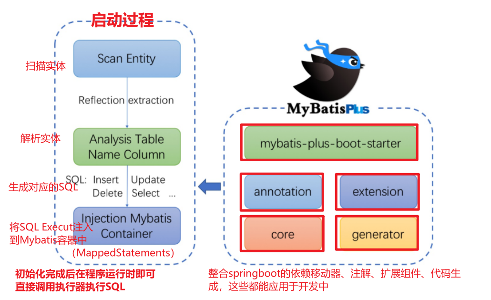
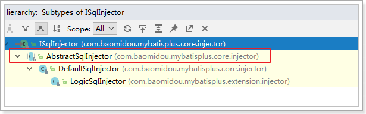
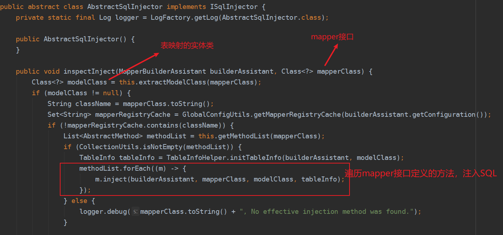
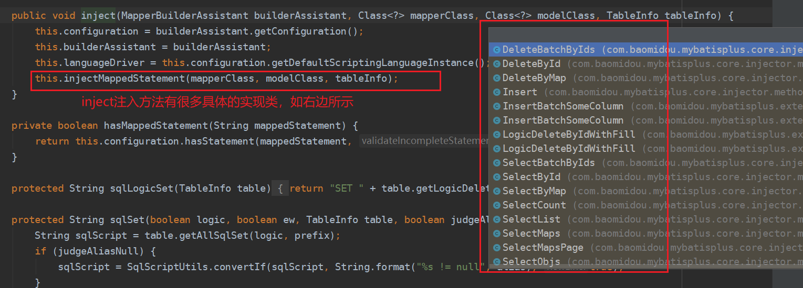
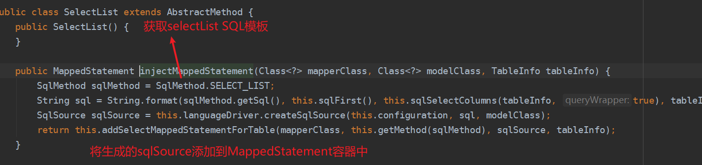
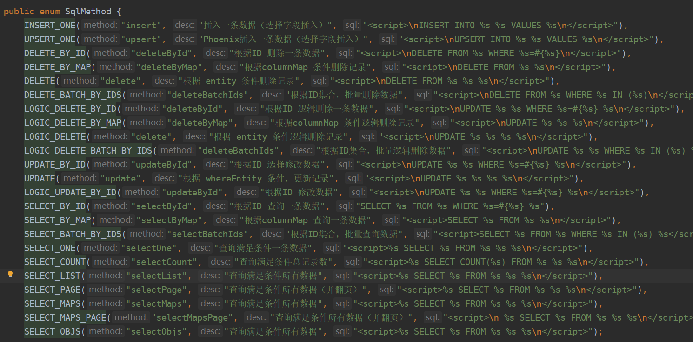
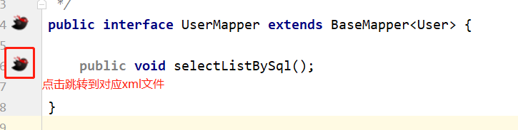
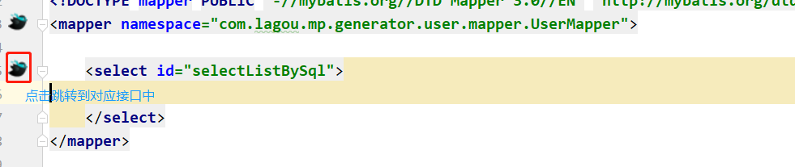
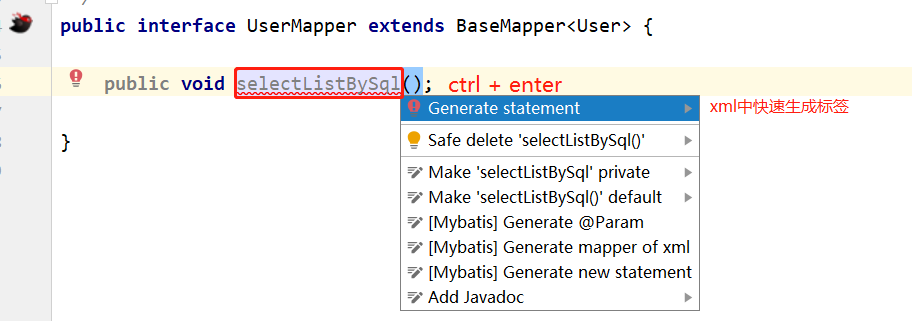

[toc]

## <font style=color:#aa2116>一、 Mybatis-Plus简介</font>

Mybatis-Plus是由国人团队[苞米豆](https://baomidou.com/)开发的一套Mybatis增强工具，在其基础上**只做增强而不修改**，极大地简化了开发，提升开发效率，以下简称mp。

### <font style=color:#e0861a>1. 特性</font>

- 无侵入：只做增强不做改变，引入它不会对现有工程产生影响，**如丝般顺滑**
- **损耗小：启动即会自动注入SQL（基本 CURD），性能基本无损耗，直接面向对象操作**
- 强大的 CRUD 操作：内置通用 Mapper、通用 Service，仅仅通过少量配置即可实现单表大部分CRUD 操作，更有强大的**条件构造器**，满足各类使用需求
- 支持 Lambda 形式调用：通过 Lambda 表达式，方便的编写各类查询条件，无需再担心字段写错
- 支持主键自动生成：支持多达 4 种主键策略（内含分布式唯一 ID 生成器 - Sequence），可自由配置，完美解决主键问题
- **支持 ActiveRecord 模式**：支持 ActiveRecord 形式调用，实体类只需继承 Model 类即可进行强大的 CRUD 操作
- **支持自定义SQL注入器**：支持全局通用方法注入（ Write once, use anywhere ）
- **内置代码生成器**：采用代码或者 Maven 插件可快速生成 Mapper 、 Model 、 Service 、Controller 层代码，支持模板引擎，更有超多自定义配置等您来使用
- **内置分页插件**：基于 MyBatis 物理分页，开发者无需关心具体操作，配置好插件之后，写分页等同于普通 List 查询
- 分页插件支持多种数据库：支持 MySQL、MariaDB、Oracle、DB2、H2、HSQL、SQLite、Postgre、SQLServer 等多种数据库
- 内置性能分析插件：可输出 Sql 语句以及其执行时间，建议开发测试时启用该功能，能快速揪出慢
  查询
- 内置全局拦截插件：提供全表 delete 、 update 操作智能分析阻断，也可自定义拦截规则，预防误
  操作

### <font style=color:#e0861a>2. 架构图</font>



### <font style=color:#e0861a>3. Spring boot整合mp</font>

##### <font style=color:#78a355>3.1 环境准备</font>

mp3.0 版本基于 JDK8，提供了 lambda 形式的调用，所以安装集成 MP3.0 要求如下：JDK 8+

##### <font style=color:#78a355>3.2 GAV</font>

<font style="font-weight:bold;color:red">提示：引入mp jar包后，不要再引入mybatis、mybatis-spring、mybatis-spring-boot依赖</font>

```xml
<modelVersion>4.0.0</modelVersion>

<parent>
    <groupId>org.springframework.boot</groupId>
    <artifactId>spring-boot-starter-parent</artifactId>
    <version>2.3.4.RELEASE</version>
    <relativePath />
</parent>
<groupId>com.tangdi</groupId>
<artifactId>mp-springboot</artifactId>
<version>0.0.1-SNAPSHOT</version>

<properties>
    <project.build.sourceEncoding>UTF-8</project.build.sourceEncoding>
    <maven.compiler.encoding>UTF-8</maven.compiler.encoding>
    <java.version>1.8</java.version>
    <maven.compiler.source>1.8</maven.compiler.source>
    <maven.compiler.target>1.8</maven.compiler.target>
</properties>

<dependencies>
    <dependency>
        <groupId>org.springframework.boot</groupId>
        <artifactId>spring-boot-starter</artifactId>
        <exclusions>
            <exclusion>
                <groupId>org.springframework.boot</groupId>
                <artifactId>spring-boot-starter-logging</artifactId>
            </exclusion>
        </exclusions>
    </dependency>
    <dependency>
        <groupId>org.springframework.boot</groupId>
        <artifactId>spring-boot-starter-test</artifactId>
        <scope>test</scope>
    </dependency>

    <!--简化代码的工具包-->
    <dependency>
        <groupId>org.projectlombok</groupId>
        <artifactId>lombok</artifactId>
        <optional>true</optional>
    </dependency>
    <!--mybatis-plus的springboot支持-->
    <dependency>
        <groupId>com.baomidou</groupId>
        <artifactId>mybatis-plus-boot-starter</artifactId>
        <version>3.1.1</version>
    </dependency>
    <!--mysql驱动-->
    <dependency>
        <groupId>mysql</groupId>
        <artifactId>mysql-connector-java</artifactId>
        <version>5.1.47</version>
    </dependency>
    <dependency>
        <groupId>org.slf4j</groupId>
        <artifactId>slf4j-log4j12</artifactId>
    </dependency>

</dependencies>

<build>
    <plugins>
        <plugin>
            <groupId>org.springframework.boot</groupId>
            <artifactId>spring-boot-maven-plugin</artifactId>
        </plugin>
    </plugins>
</build>
```

##### <font style=color:#78a355>3.3 其他配置</font>

- log4j.properties

  ```properties
  log4j.rootLogger=info,A1
  
  log4j.appender.A1=org.apache.log4j.ConsoleAppender
  log4j.appender.A1.layout=org.apache.log4j.PatternLayout
  log4j.appender.A1.layout.ConversionPattern=[%t] [%c]-[%p] %m%n
  log4j.logger.com.tangdi.mapper=TRACE
  ```

- 全局配置文件

  ```properties
  spring.datasource.url=jdbc:mysql://127.0.0.1:3306/mp?useUnicode=true&characterEncoding=utf8&autoReconnect=true&allowMultiQueries=true&useSSL=false
  spring.datasource.driverClassName=com.mysql.jdbc.Driver
  spring.datasource.username=root
  spring.datasource.password=123456
  
  
  # 起别名，用于在mapper.xml文件中省略实体类的包名
  #mybatis-plus.type-aliases-package=com.tangdi.pojo
  
  # 全局配置表名前缀，前缀+类名=表名，实体则可省略@TableName
  #mybatis-plus.global-config.db-config.table-prefix=tb_
  
  # 设置全局的主键生成策略：自增
  #mybatis-plus.global-config.db-config.id-type=auto
  
  # 加载mybatis核心配置文件
  #mybatis-plus.config-location=classpath:sqlMapConfig.xml
  
  # 加载mybatis映射配置文件
  mybatis-plus.mapper-locations=classpath*:mapper/*.xml
  
  #注意：关闭该自动驼峰映射时，不能和mybatis-plus.config-location同时存在
  mybatis-plus.configuration.map-underscore-to-camel-case=true
  
  # 逻辑已删除值(默认为 1)
  mybatis-plus.global-config.db-config.logic-delete-value=1
  # 逻辑未删除值(默认为 0)
  mybatis-plus.global-config.db-config.logic-not-delete-value=0
  ```

##### <font style=color:#78a355>3.4 前置代码</font>

- 实体

  ```java
  @Data
  @NoArgsConstructor
  @AllArgsConstructor
  @TableName("tb_user")
  public class User {
      private Long id;
      private String name;
      private Integer age;
      private String email;
  }
  ```

- mapper

  ```java
  package com.tangdi.mapper;
  
  import com.baomidou.mybatisplus.core.mapper.BaseMapper;
  import com.tangdi.pojo.User;
  
  import java.util.List;
  
  public interface UserMapper extends BaseMapper<User> {
      /*查询所有用户*/
      public List<User> findAll();
  }
  ```

- 启动类添加注解?@MapperScan

  ```java
  @MapperScan("com.tangdi.mapper") //设置mapper接口的扫描包
  ```


### <font style=color:#e0861a>4. Spring 整合mp</font>

##### <font style=color:#78a355>4.1 GAV</font>

```xml
<properties>
    <project.build.sourceEncoding>UTF-8</project.build.sourceEncoding>
    <maven.compiler.encoding>UTF-8</maven.compiler.encoding>
    <java.version>1.8</java.version>
    <maven.compiler.source>1.8</maven.compiler.source>
    <maven.compiler.target>1.8</maven.compiler.target>
    <spring.version>5.1.6.RELEASE</spring.version>
</properties>

<dependencies>
    <!-- mybatis-plus插件依赖 -->
    <dependency>
        <groupId>com.baomidou</groupId>
        <artifactId>mybatis-plus</artifactId>
        <version>3.4.0</version>
    </dependency>

    <!--Mysql-->
    <dependency>
        <groupId>mysql</groupId>
        <artifactId>mysql-connector-java</artifactId>
        <version>5.1.47</version>
    </dependency>

    <!--连接池-->
    <dependency>
        <groupId>com.alibaba</groupId>
        <artifactId>druid</artifactId>
        <version>1.0.11</version>
    </dependency>

    <!--简化bean代码的工具包-->
    <dependency>
        <groupId>org.projectlombok</groupId>
        <artifactId>lombok</artifactId>
        <version>1.18.4</version>
    </dependency>

    <dependency>
        <groupId>junit</groupId>
        <artifactId>junit</artifactId>
        <version>4.12</version>
    </dependency>

    <dependency>
        <groupId>org.slf4j</groupId>
        <artifactId>slf4j-log4j12</artifactId>
        <version>1.6.4</version>
    </dependency>

    <!-- spring -->
    <dependency>
        <groupId>org.springframework</groupId>
        <artifactId>spring-webmvc</artifactId>
        <version>${spring.version}</version>
    </dependency>
    <dependency>
        <groupId>org.springframework</groupId>
        <artifactId>spring-jdbc</artifactId>
        <version>${spring.version}</version>
    </dependency>
    <dependency>
        <groupId>org.springframework</groupId>
        <artifactId>spring-test</artifactId>
        <version>${spring.version}</version>
    </dependency>
</dependencies>

<build>
    <plugins>
        <plugin>
            <groupId>org.apache.maven.plugins</groupId>
            <artifactId>maven-compiler-plugin</artifactId>
            <configuration>
                <source>1.8</source>
                <target>1.8</target>
            </configuration>
        </plugin>
    </plugins>
</build>
```

##### <font style=color:#78a355>4.2 其他配置</font>

- jdbc.properties

  ```properties
  jdbc.driver=com.mysql.jdbc.Driver
  jdbc.url=jdbc:mysql://127.0.0.1:3306/mp?serverTimezone=GMT%2B8&useSSL=false
  jdbc.username=root
  jdbc.password=123456
  ```

- log4j.properties

  ```properties
  log4j.rootLogger=DEBUG,A1
  
  log4j.appender.A1=org.apache.log4j.ConsoleAppender
  log4j.appender.A1.layout=org.apache.log4j.PatternLayout
  log4j.appender.A1.layout.ConversionPattern=[%t] [%c]-[%p] %m%n
  ```

- spring核心配置 applicationContext.xml

  ```xml
  <?xml version="1.0" encoding="UTF-8"?>
  <beans xmlns="http://www.springframework.org/schema/beans"
         xmlns:xsi="http://www.w3.org/2001/XMLSchema-instance"
         xmlns:context="http://www.springframework.org/schema/context"
         xsi:schemaLocation="
         	http://www.springframework.org/schema/beans
  		http://www.springframework.org/schema/beans/spring-beans.xsd
         	http://www.springframework.org/schema/context
  		http://www.springframework.org/schema/context/spring-context.xsd">
  
      <!-- 引入properties文件-->
      <context:property-placeholder location="classpath:jdbc.properties"></context:property-placeholder>
  
      <!--数据源-->
      <bean id="dataSource" class="com.alibaba.druid.pool.DruidDataSource">
          <property name="driverClassName" value="${jdbc.driver}"/>
          <property name="url" value="${jdbc.url}"/>
          <property name="username" value="${jdbc.username}"/>
          <property name="password" value="${jdbc.password}"/>
      </bean>
  
      <!--1. 将sqlSessionFactory对象的创建交给spring-->
      <bean id="sqlSessionFactory" class="com.baomidou.mybatisplus.extension.spring.MybatisSqlSessionFactoryBean">
          <property name="dataSource" ref="dataSource"></property>
      </bean>
  
  
      <!--2. mapper映射扫描-->
      <bean class="org.mybatis.spring.mapper.MapperScannerConfigurer">
          <property name="basePackage" value="com.tangdi.mapper"/>
       </bean>
  
  
  </beans>
  ```

##### <font style=color:#78a355>4.3 [前置代码同上文的一致](#3.4 前置代码)</font>


### <font style=color:#e0861a>5. 纯mp</font>

##### <font style=color:#78a355>5.1  GAV</font>

```xml
<properties>
    <project.build.sourceEncoding>UTF-8</project.build.sourceEncoding>
    <maven.compiler.encoding>UTF-8</maven.compiler.encoding>
    <java.version>1.8</java.version>
    <maven.compiler.source>1.8</maven.compiler.source>
    <maven.compiler.target>1.8</maven.compiler.target>
</properties>

<dependencies>
    <!-- mybatis-plus插件依赖 -->
    <dependency>
        <groupId>com.baomidou</groupId>
        <artifactId>mybatis-plus</artifactId>
        <version>3.4.0</version>
    </dependency>

    <!--Mysql-->
    <dependency>
        <groupId>mysql</groupId>
        <artifactId>mysql-connector-java</artifactId>
        <version>5.1.47</version>
    </dependency>

    <!--连接池-->
    <dependency>
        <groupId>com.alibaba</groupId>
        <artifactId>druid</artifactId>
        <version>1.0.11</version>
    </dependency>

    <!--简化bean代码的工具包-->
    <dependency>
        <groupId>org.projectlombok</groupId>
        <artifactId>lombok</artifactId>
        <version>1.18.4</version>
    </dependency>

    <dependency>
        <groupId>junit</groupId>
        <artifactId>junit</artifactId>
        <version>4.12</version>
    </dependency>

    <dependency>
        <groupId>org.slf4j</groupId>
        <artifactId>slf4j-log4j12</artifactId>
        <version>1.6.4</version>
    </dependency>
</dependencies>

<build>
    <plugins>
        <plugin>
            <groupId>org.apache.maven.plugins</groupId>
            <artifactId>maven-compiler-plugin</artifactId>
            <configuration>
                <source>1.8</source>
                <target>1.8</target>
            </configuration>
        </plugin>
    </plugins>
</build>
```

##### <font style=color:#78a355>5.2 其他配置</font>

- jdbc.properties

  ```properties
  jdbc.driver=com.mysql.jdbc.Driver
  jdbc.url=jdbc:mysql://127.0.0.1:3306/mp?serverTimezone=GMT%2B8&useSSL=false
  jdbc.username=root
  jdbc.password=123456
  ```

- log4j.properties

  ```properties
  log4j.rootLogger=DEBUG,A1
  log4j.appender.A1=org.apache.log4j.ConsoleAppender
  log4j.appender.A1.layout=org.apache.log4j.PatternLayout
  log4j.appender.A1.layout.ConversionPattern=[%t] [%c]-[%p] %m%n
  ```

- mybatis核心配置文件 mybatis-config.xml

  ```xml
  <?xml version="1.0" encoding="UTF-8" ?>
  <!DOCTYPE configuration
          PUBLIC "-//mybatis.org//DTD Config 3.0//EN"
          "http://mybatis.org/dtd/mybatis-3-config.dtd">
  
  <configuration>
  
      <properties resource="jdbc.properties"></properties>
  
      <!--environments: 运行环境-->
      <environments default="development">
          <environment id="development">
              <!--当前的事务事务管理器是JDBC-->
              <transactionManager type="JDBC"></transactionManager>
              <!--数据源信息 POOLED：使用mybatis的连接池-->
              <dataSource type="POOLED">
                  <property name="driver" value="${jdbc.driver}"/>
                  <property name="url" value="${jdbc.url}"/>
                  <property name="username" value="${jdbc.username}"/>
                  <property name="password" value="${jdbc.password}"/>
              </dataSource>
          </environment>
      </environments>
  
      <!--引入映射配置文件-->
      <mappers>
         <package name="com.tangdi.mapper"/>
      </mappers>
  </configuration>
  ```

##### <font style=color:#78a355>5.3 [前置代码同上文的一致](#3.4 前置代码)</font>


## <font style=color:#aa2116>二、MP特性</font>

### <font style=color:#e0861a>1. CRUD</font>

#### <font style=color:#228fbd>1.1 新增</font>

可用方法只有一个，单个新增

```java
int insert(T entity);
```

##### <font style=color:#78a355>示例-单个新增</font>

```java
User user = new User();
user.setAge(18);
user.setEmail("test@lagou.cn");
user.setName("绯色");
int result = userMapper.insert(user);

System.out.println(result);// 返回受影响的行数
System.out.println(user.getId());// 返回id
```

##### <font style=color:#78a355>@TableName 类与实体映射</font>

##### <font style=color:#78a355>@TableId 配置ID策略</font>

- **type = IdType.AUTO**：数据库表自增
- **type = IdType.NONE**：不自动设置id
- type = IdType.INPUT：通过自己注册自动填充插件进行填充
- **type = IdType.ID_WORKER**：全局唯一ID
- type = IdType.UUID：全局唯一ID（UUID）
- type = IdType.ID_WORKER_STR：字符串全局唯一ID (idWorker 的字符串表示)

##### <font style=color:#78a355>@TableField 设置字段</font>

- value = "email"：解决对象属性名与库表字段名不一致问题
- exist = false：不需要与表字段映射的属性
- select = false：不查询该字段
- [fill = FieldFill.INSERT：insert时自动填充配置](#5. 自动填充)


#### <font style=color:#228fbd>1.2 修改</font>

可用方法有两个，一个根据id修改，一个根据条件修改

```java

int updateById(@Param(Constants.ENTITY) T entity);

/**
* @param entity 实体对象 (set 条件值,可以为 null)
* @param updateWrapper 实体对象封装操作类（即可以set值，也可以组装where条件）
*/
int update(@Param(Constants.ENTITY) T entity, @Param(Constants.WRAPPER)
Wrapper<T> updateWrapper);
```

##### <font style=color:#78a355>示例-根据id修改</font>

```java
User user = new User();
user.setId(6L); //主键
user.setAge(21); //更新的字段
//根据id更新，更新不为null的字段
this.userMapper.updateById(user);
```

##### <font style=color:#78a355>示例-根据条件修改</font>

```java
//更新的条件
QueryWrapper<User> wrapper = new QueryWrapper<>();
wrapper.lambda().set(User::getAge(),22).eq(User::getId(), 6);// set age = 22 where id = 6;
//执行更新操作
int result = this.userMapper.update(null, wrapper);
```


#### <font style=color:#228fbd>1.3 删除</font>

可用方法有四个，根据id删除、根据条件删除、根据id批量删除

```java
/** 根据 ID 删除 */
int deleteById(Serializable id);

/** 根据 columnMap条件 删除 */
int deleteByMap(@Param(Constants.COLUMN_MAP) Map<String, Object> columnMap);

/**  根据 wrapper删除，wrapper封装条件（可以为 null）
 */
int delete(@Param(Constants.WRAPPER) Wrapper<T> wrapper);

/** 根据ID 批量删除，主键ID列表不能为 null 以及 empty */
int deleteBatchIds(@Param(Constants.COLLECTION) Collection<? extends
Serializable> idList);
```

##### <font style=color:#78a355>示例-根据id删除</font>

```java
userMapper.deleteById(2L);
```

##### <font style=color:#78a355>示例-根据条件删除</font>

- 根据传入Map删除

  ```java
  Map<String, Object> map = new HashMap<>();
  map.put("name","可可");
  map.put("age",18);
  
  // 将columnMap中的元素设置为删除的条件，多个条件是and的关系
  int i = userMapper.deleteByMap(map);
  ```

- 根据wrapper删除

  ```java
  QueryWrapper<User> ueryWrapper = new QueryWrapper<>(user);
  ueryWrapper.lambda().eq(User::getName(),"黑黑").eq(User::getAge(),21);
  
  int i = userMapper.delete(ueryWrapper);
  ```

##### <font style=color:#78a355>示例-根据id批量删除</font>

```java
int i = userMapper.deleteBatchIds(Arrays.asList(10l,11l));
```


#### <font style=color:#228fbd>1.4 查询</font>

可用方法有根据id查询、id批量查询、根据条件查询单个记录、根据条件查询全部记录、根据条件查询行数、分页查询

```java
/** 根据 ID 查询n*/
T selectById(Serializable id);

/**
* 根据ID 批量查询,主键ID列表不能为 null 以及 empty
*/
List<T> selectBatchIds(@Param(Constants.COLLECTION) Collection<? extends
Serializable> idList);

/**
* 根据条件查询一条记录，queryWrapper封装条件（可以为 null）
*/
T selectOne(@Param(Constants.WRAPPER) Wrapper<T> queryWrapper);

/**
* 根据条件查询全部记录，queryWrapper封装条件（可以为 null）
*/
List<T> selectList(@Param(Constants.WRAPPER) Wrapper<T> queryWrapper);

/**
* 根据条件查询总记录数，queryWrapper封装条件（可以为 null）
*/
Integer selectCount(@Param(Constants.WRAPPER) Wrapper<T> queryWrapper);

/** 根据条件分页查询，page 分页查询条件（可以为 RowBounds.DEFAULT），queryWrapper封装条件（可以为 null）*/
IPage<T> selectPage(IPage<T> page, @Param(Constants.WRAPPER) Wrapper<T>
queryWrapper);
```

##### <font style=color:#78a355>示例-id查询</font>

```java
//根据id查询单个记录
User user = userMapper.selectById(2L);

//根据id集合批量查询
List<User> users = userMapper.selectBatchIds(Arrays.asList(12L, 13l));
```

##### <font style=color:#78a355>示例-条件查询</font>

```java
QueryWrapper<User> queryWrapperOne = new QueryWrapper<>();
queryWrapperOne.lambda().eq(User::getName,"子慕");

// 根据条件查询一条记录，如果查询结果超过一条，会报错
User user = userMapper.selectOne(queryWrapperOne);


QueryWrapper<User> queryWrapperList = new QueryWrapper<>();
queryWrapperList.lambda().gt(User::getAge,18); // 查询年龄大于18的

//根据条件查询数据
List<User> users = userMapper.selectList(queryWrapperList);
```

##### <font style=color:#78a355>示例-行数查询</font>

```java
QueryWrapper<User> queryWrapperList = new QueryWrapper<>();
queryWrapperList.lambda().gt(User::getAge,18); // 查询年龄大于18的

//根据条件查询行记录数
Integer count = userMapper.selectCount(queryWrapperList);
```

##### <font style=color:#78a355>示例-分页查询</font>

```java
QueryWrapper<User> queryWrapper = new QueryWrapper<>();
queryWrapper.lambda().gt(User::getAge,18); // 查询年龄大于18的

// 1:当前页，10:每页条数
Page<User> page = new Page<>(1, 10);


IPage<User> userIPage = userMapper.selectPage(page, queryWrapper);
```

分页插件

```java
package com.tangdi.config;

import com.baomidou.mybatisplus.extension.plugins.OptimisticLockerInterceptor;
import com.baomidou.mybatisplus.extension.plugins.PerformanceInterceptor;
import com.tangdi.Injector.MySqlInjector;
import org.springframework.context.annotation.Bean;
import org.springframework.context.annotation.Configuration;

@Configuration
public class MybatisPlusConfig {

    /*分页插件*/
    @Bean
    public PaginationInterceptor paginationInterceptor(){
        return new PaginationInterceptor();
    }
}
```


### <font style=color:#e0861a>2. Sql注入原理</font>

之前在介绍mp架构图时，有讲过mp在启动时会扫描解析实体并生成SQL注入到Mybatis的MappedStatements容器中。

而mp负责Sql注入的组件是 **`ISqlinjector`**，它的实现关系如下图所示:











### <font style=color:#e0861a>3. 扩展SQL注入器</font>

- 扩展BaseMapper接口，添加自定义待注入方法

```java
import com.baomidou.mybatisplus.core.mapper.BaseMapper;
import com.tangdi.pojo.User;

import java.util.List;

/*通用mapper接口，以后创建其他mapper接口时，不再继承BaseMapper，而是继承MyBaseMapper*/
public interface MyBaseMapper<T> extends BaseMapper<T> {

    /*查询所有用户*/
    public List<User> findAll();
}
```

- 添加自定义方法的Method继承自 `AbstractMethod`

```java
package com.tangdi.Injector;

import com.baomidou.mybatisplus.core.injector.AbstractMethod;
import com.baomidou.mybatisplus.core.metadata.TableInfo;
import org.apache.ibatis.mapping.MappedStatement;
import org.apache.ibatis.mapping.SqlSource;

public class FindAll extends AbstractMethod {
    @Override
    public MappedStatement injectMappedStatement(Class<?> mapperClass, Class<?> modelClass, TableInfo tableInfo) {

        String sql = "select * from " + tableInfo.getTableName();
        SqlSource sqlSource = languageDriver.createSqlSource(configuration, sql, modelClass);
        return this.addSelectMappedStatement(mapperClass, "findAll", sqlSource, modelClass, tableInfo);

    }
}
```

- 扩展DefaultSqlInjector的 **`getMethodList`** 方法，添加自定义的Method

```java
package com.tangdi.Injector;

import com.baomidou.mybatisplus.core.injector.AbstractMethod;
import com.baomidou.mybatisplus.core.injector.DefaultSqlInjector;

import java.util.List;

/*
    自定义sql注入器
 */
public class MySqlInjector extends DefaultSqlInjector {

    @Override
    public List<AbstractMethod> getMethodList() {

        List<AbstractMethod> methodList = super.getMethodList();
        // 扩充自定义方法
        methodList.add(new FindAll());

        return methodList;
    }
}
```

- 自定义sql注入器注入IoC

```java
package com.tangdi.config;

import com.baomidou.mybatisplus.extension.plugins.OptimisticLockerInterceptor;
import com.baomidou.mybatisplus.extension.plugins.PerformanceInterceptor;
import com.tangdi.Injector.MySqlInjector;
import org.springframework.context.annotation.Bean;
import org.springframework.context.annotation.Configuration;

@Configuration
public class MybatisPlusConfig {

    /*分页插件*/
    @Bean
    public PaginationInterceptor paginationInterceptor(){
        return new PaginationInterceptor();
    }

    /*自定义的sql注入器*/
    @Bean
    public MySqlInjector mySqlInjector(){
        return new MySqlInjector();
    }
}
```


### <font style=color:#e0861a>4. 条件构造-Wrapper</font>

通过上述CRUD我们知道了wrapper可以用于构建SQL，以下为wrapper提供以下方法构建sql语句

| 方法        | 说明                                                         |
| ----------- | ------------------------------------------------------------ |
| eq          | 等于 =                                                       |
| ne          | 不等于 <>                                                    |
| gt          | 大于>                                                        |
| ge          | 大于等于>=                                                   |
| lt          | 小于<                                                        |
| le          | 小于等于<=                                                   |
| between     | BETWEEN 值1 AND 值2                                          |
| notBetween  | NOT BETWEEN 值1 AND 值2                                      |
| in          | 字段 IN (v0, v1, ...)                                        |
| notIn       | 字段 NOT IN (v0, v1, ...)                                    |
| like        | LIKE '%值%'，例: like("name", "王") ---> name like '%王%'    |
| notLike     | NOT LIKE '%值%'，例: notLike("name", "王") ---> name not like '%王%' |
| likeLeft    | LIKE '%值'，例: likeLeft("name", "王") ---> name like '%王'  |
| likeRight   | LIKE '值%'，例: likeRight("name", "王") ---> name like '王%' |
| orderBy     | ORDER BY 字段1,字段2  例:orderBy(true, true, "id", "name") ---> order by id ASC,name ASC |
| orderByAsc  | ORDER BY 字段1,字段2 ASC  例: orderByAsc("id", "name") ---> order by id ASC,name ASC |
| orderByDesc | ORDER BY 字段1,字段2 DESC  例: orderByDesc("id", "name") ---> order by id DESC,name DESC |
| or          | 拼接 OR                                                      |
| and         | 拼接 AND，若不指定or和and，则默认为and拼接sql                |
| select      | 指定查询字段                                                 |
| isNull      | NULL值查询                                                   |
| isNotNull   | IS NOT NULL                                                  |
| groupBy     | 分组GROUP BY                                                 |
| having      | HAVING关键词                                                 |
| exists      | EXISTS条件语句                                               |
| notExists   | NOT EXISTS条件语句                                           |
| last        | 拼接在最后，例如last(“LIMIT 1”)                              |
| set         | 用于UpdateWrapper来set值                                     |


### <font style=color:#e0861a>5. 自动填充</font>

当新增或修改时，对应属性为空，我们就可以对它进行自动填充。

- @TableField设置填充方式

  ```java
  @TableField(fill = FieldFill.INSERT)
  private Date updateTime;
  ```

- 编写自定义填充处理类

  ```java
  import com.baomidou.mybatisplus.core.handlers.MetaObjectHandler;
  import org.apache.ibatis.reflection.MetaObject;
  import org.springframework.stereotype.Component;
  
  @Component
  public class MyMetaObjectHandler implements MetaObjectHandler {
  
      @Override
      public void insertFill(MetaObject metaObject) {
          Object updateTime = getFieldValByName("updateTime", metaObject);
          if(null == updateTime){
              // 该属性为空，可以进行填充
              setFieldValByName("updateTime",new Date(),metaObject);
          }
      }
  
      @Override
      public void updateFill(MetaObject metaObject) {
  
      }
  }
  ```


### <font style=color:#e0861a>6. mp全局配置</font>

- **configLocation**

  mybatis核心配置文件

  ```properties
  mybatis-plus.config-location = classpath:sqlMapConfig.xml
  ```

- **mapperLocations**

  mybatis mapper.xml文件

  ```properties
  mybatis-plus.mapper-locations = classpath*:mybatis/*.xml
  ```

- **typeAliasesPackage**

  给实体类起别名，省略实体类在mapper.xml中的包名

  ```properties
  mybatis-plus.type-aliases-package = com.tangdi.common.entity
  ```

- **mapUnderscoreToCamelCase**

  驼峰命名规则映射属性与字段，在mybatis中默认关闭，但在**mp中默认开启**。

  例如属性名为userName，表字段名为user_name，满足驼峰命名规则映射，则无需使用@TableField注解

  如果需要关闭，则不能存在 [configLocation配置]()

  ```properties
  #关闭自动驼峰映射，该参数不能和mybatis-plus.config-location同时存在
  mybatis-plus.configuration.map-underscore-to-camel-case=false
  ```

- **cacheEnabled**

  全局的开启或关闭配置文件中的所有映射器已经配置的任何缓存，默认为 true

  ```properties
  mybatis-plus.configuration.cache-enabled=false
  ```

- **idType**

  全局ID策略，设置后可省略实体类主键注解@TableId配置，默认值为 `ID_WORKER `全局唯一id

  ```properties
  mybatis-plus.global-config.db-config.id-type=auto
  ```

- **tablePrefix**

  表名前缀，全局配置后可省略@TableName配置，默认值为null

  ```properties
  mybatis-plus.global-config.db-config.table-prefix=tb_
  ```

以上示例均为springboot中的配置，若为spring项目则在以下bean中配置

```xml
<!--1. 将sqlSessionFactory对象的创建交给spring-->
<bean id="sqlSessionFactory"
      class="com.baomidou.mybatisplus.extension.spring.MybatisSqlSessionFactoryBean">
    <property name="configLocation" value="classpath:sqlMapConfig.xml"/>
    <property name="mapperLocations" value="classpath*:mybatis/*.xml"/>
    <property name="typeAliasesPackage" value="com.baomidou.mybatisplus.samples.quickstart.entity"/>
    <property name="globalConfig">
        <bean class="com.baomidou.mybatisplus.core.config.GlobalConfig">
            <property name="dbConfig">
                <bean
                      class="com.baomidou.mybatisplus.core.config.GlobalConfig$DbConfig">
                    <property name="idType" value="AUTO"/>
                    <property name="tablePrefix" value="tb_"/>
                </bean>
            </property>
        </bean>
    </property>
</bean>
```


### <font style=color:#e0861a>7. 乐观锁插件</font>

个人觉得，基于数据库的乐观锁其实是非必要的。高并发场景下，通常不会将流量直接扔给数据库来处理，其次乐观锁在高并发时引起大量失败结果，这行吗? 试想秒杀场景，你基于数据库乐观锁的实现，瞬时几十万的请求争夺库存1000的商品，用不了几秒数据库直接挂。即使做了上游请求的拦截，但谁也无法预测限流后达到数据库的流量会有多少。

乐观锁相对于悲观锁而言，在更新时进行比较，如果值不同于预期值，则更新失败放回flase。

语义同CAS（比较并交换）一致，都是一种乐观锁的思想。只有当前值与预期值一致，才进行赋值。

`set col1 = xxx, version = version + 1 where version = oldVersion and id = xx;`

- 数据库表加上 `version `字段

  ```sql
  ALTER TABLE `tb_user`ADD COLUMN `version` int(10) NOT NULL DEFAULT 1 AFTER `email`;
  UPDATE `tb_user` SET `version`='1';
  ```

- 实体类添加 version属性，并且加上@Version注解

  ```JAVA
  @Version
  private Integer version;
  ```

- 配置乐观锁插件

  ```java
  package com.tangdi.config;
  
  import com.baomidou.mybatisplus.extension.plugins.OptimisticLockerInterceptor;
  import com.baomidou.mybatisplus.extension.plugins.PerformanceInterceptor;
  import com.tangdi.Injector.MySqlInjector;
  import org.springframework.context.annotation.Bean;
  import org.springframework.context.annotation.Configuration;
  
  @Configuration
  public class MybatisPlusConfig {
  
      /*分页插件*/
      @Bean
      public PaginationInterceptor paginationInterceptor(){
          return new PaginationInterceptor();
      }
  
      /*自定义的sql注入器*/
      @Bean
      public MySqlInjector mySqlInjector(){
          return new MySqlInjector();
      }
  
      /*乐观锁插件*/
      @Bean
      public OptimisticLockerInterceptor optimisticLockerInterceptor() {
          return new OptimisticLockerInterceptor();
      }
  }
  ```

- 测试

  ```java
  @Test
  public void testUpdate(){
      // 查询数据
      User user = userMapper.selectById(12L);
      // 更新name
      user.setName("可乐");
  
      // set name = '可乐',version = 2 where id = 12 and version = 1;
      boolean insert = userMapper.updateById(user);
      System.out.println(insert);
  }
  ```

  


### <font style=color:#e0861a>8. ActiveRecord</font>

ActiveRecord（简称AR）一直广受动态语言（ PHP 、 Ruby 等）的喜爱，而 Java 作为准静态语言，对于 ActiveRecord 往往只能感叹其优雅，所以我们也在 AR 道路上进行了一定的探索，喜欢大家能够喜欢。

ActiveRecord是一种领域模型(Domain Model)，封装了部分业务逻辑，直接通过Model进行CRUD。

- 开启ActiveRecord

  ```java
  import com.baomidou.mybatisplus.annotation.IdType;
  import com.baomidou.mybatisplus.annotation.TableField;
  import com.baomidou.mybatisplus.annotation.TableId;
  import com.baomidou.mybatisplus.annotation.TableName;
  import com.baomidou.mybatisplus.extension.activerecord.Model;
  import lombok.AllArgsConstructor;
  import lombok.Data;
  import lombok.NoArgsConstructor;
  
  @Data
  @NoArgsConstructor
  @AllArgsConstructor
  public class User extends Model<User> {
      private Long id;
      private String name;
      private Integer age;
      private String email;
  }
  ```

- CRUD

  ```java
  /*在AR模式下，完成根据主键查询*/
  @Test
  public void testARSelectById(){
      User user = new User();
      user.setId(12L);
  
      User user1 = user.selectById();
  }
  
  
  /*在AR模式下，完成添加操作*/
  @Test
  public void testARInsert(){
      User user = new User();
      user.setName("雪碧");
      user.setAge(21);
      user.setEmail("mozhu@126.com");
  
      boolean insert = user.insert();
  }
  
  
  /*在AR模式下，完成更新操作*/
  @Test
  public void testARUpate(){
      User user = new User();
      user.setId(12L);
      user.setName("爱尚");
  
      boolean insert = user.updateById();
  }
  
  /*在AR模式下，完成删除操作*/
  @Test
  public void testARDelete(){
      boolean b = user.deleteById(16L);
  }
  
  /*在AR模式下，根据条件进行查询*/
  @Test
  public void testARFindByWrapper(){
      QueryWrapper<User> queryWrapper = new QueryWrapper<>();
      queryWrapper.lambda().ge(User::getAge,"20");
  
      User user = new User();
      List<User> users = user.selectList(queryWrapper);
  }
  ```


### <font style=color:#e0861a>9. MybatisX 快速开发插件</font>

安装方法：打开 IDEA，进入 File -> Settings -> Plugins -> Browse Repositories，输入 mybatisx 搜索并安装。
功能：

- Java 与 XML 直接跳转

  



- Mapper 方法自动生成 XML

  

  
