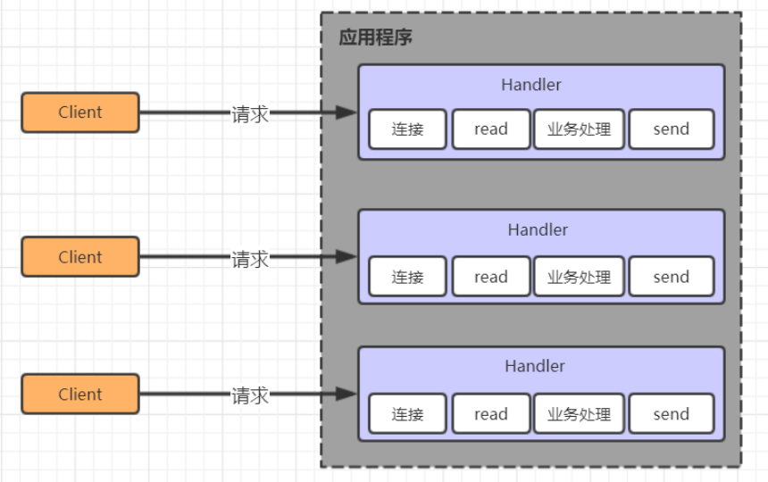
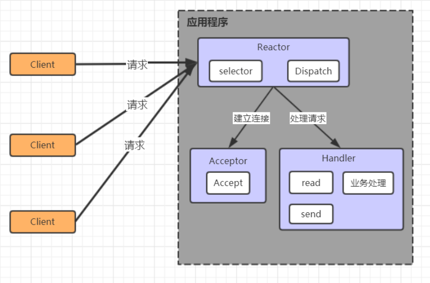
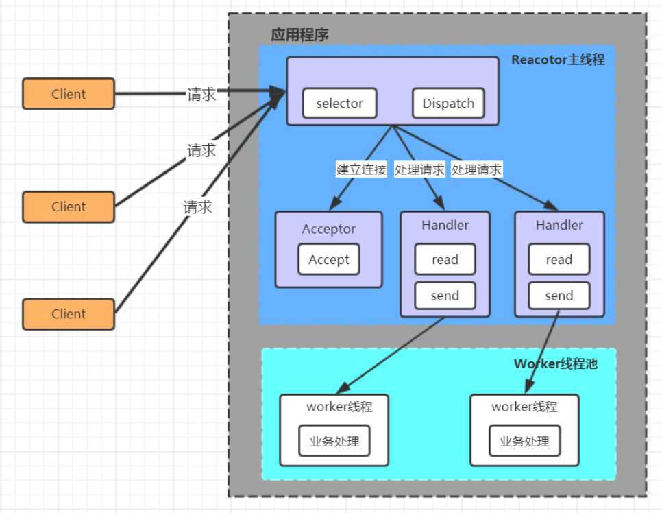
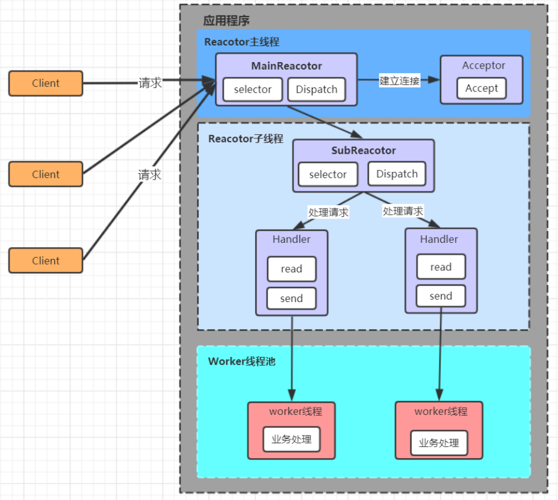
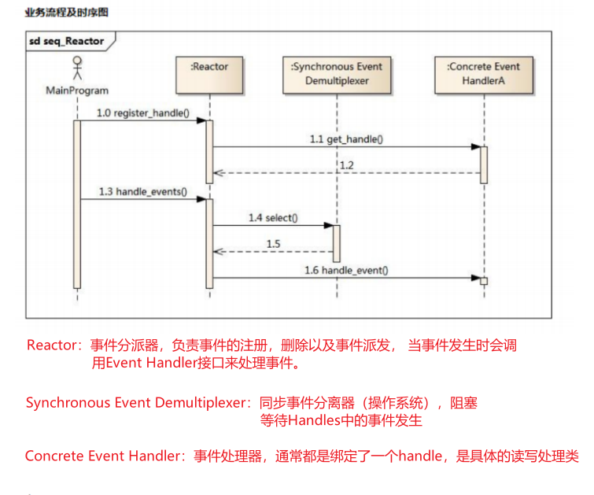
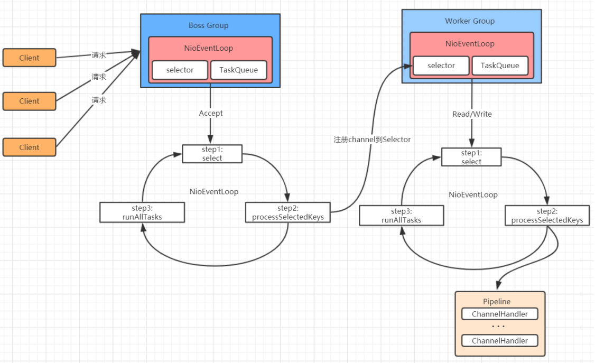
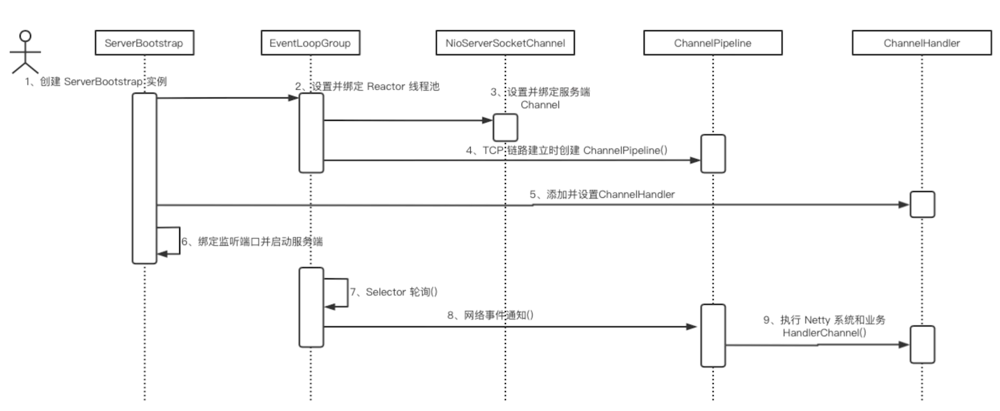
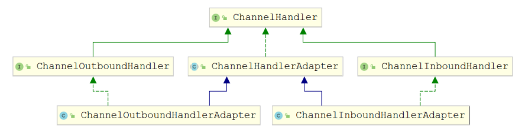
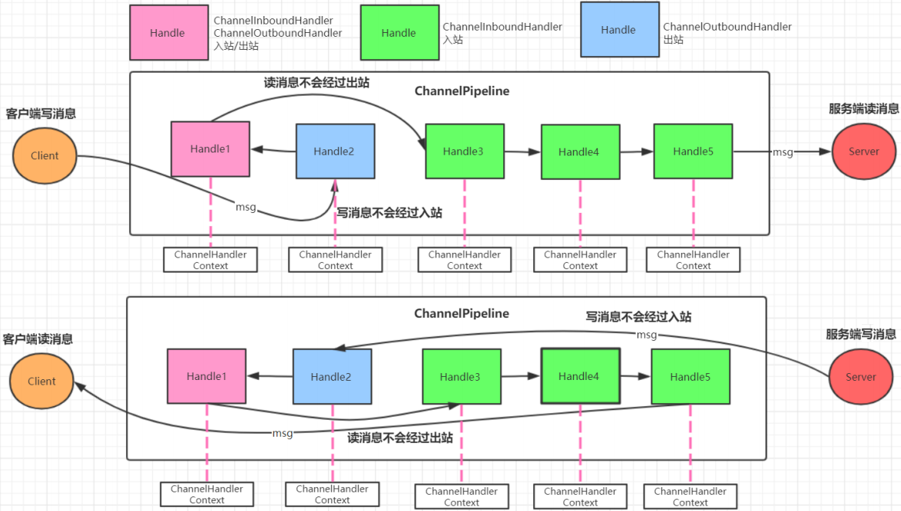
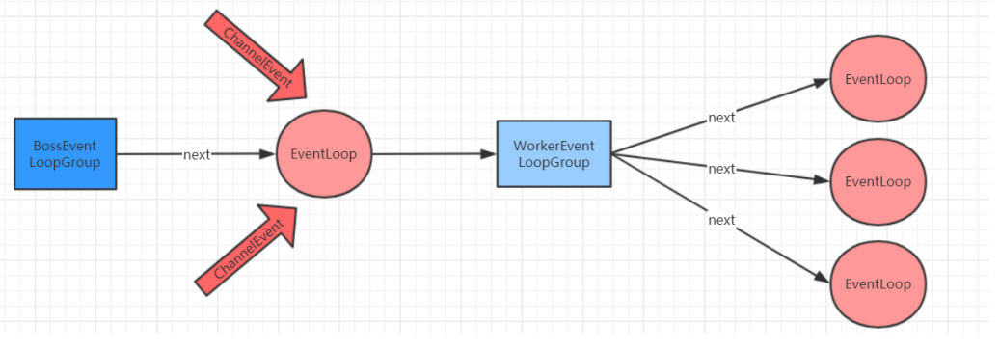

[toc]

## 一、Netty简介及优势

#### 1. 为什么要用Netty，原生NIO有什么问题？

- NIO 的类库和 API 繁杂，使用麻烦：需要熟练掌握 Selector、ServerSocketChannel、SocketChannel、ByteBuffer等。

- 需要具备其他的额外技能：要熟悉 Java 多线程编程，因为 NIO 编程涉及到 Reactor 模式，你必须对多线程和网络编程非常熟悉，才能编写出高质量的 NIO 程序。

- 开发工作量和难度都非常大：例如客户端面临断连重连、网络闪断、半包读写、失败缓存、网络拥塞和异常流的处理等等。

- **JDK NIO 的 Epoll Bug**

  臭名昭著的 Epoll Bug，它会导致 Selector 空轮询，最终导致 CPU 100%。直到JDK 1.7版本该问题仍旧存在，没有被根本解决（因为Linux系统中的select函数，在某些场景下即使没有fd就绪，也可能会直接返回。导致Java Selector一直死循环检查事件）

#### 2. 概述

Netty 是由 JBOSS 提供的一个 Java 开源框架。Netty 是一个**高性能**、**高并发**、**异步**、**基于事件驱动**的**NIO框架**，可以用来快速开发高性能、高可靠性的网络 IO 程序。

 作为当前最流行的 NIO 框架，Netty 在互联网领域、大数据分布式计算领域、游戏行业、 通信行业等获得了广泛的应用，知名的 Elasticsearch 、Dubbo 框架内部都采用了 Netty。 

#### 3. 特性及优点

-  **[零拷贝](../../../Java/基础/网络编程/零拷贝)，提升了IO读写的性能（减少上下文的切换，以及拷贝次数）**（高性能体现）
-  基于Reactor事件驱动模型，大量节约了线程资源（高性能体现）
-  提供线程池的线程数，以及TCP连接参数的设置，为不同场景提供调优余量（高性能体现）
-  **可拓展事件模型**；**支持 TCP、UDP、HTTP、WebSocket** 等协议；
-  提供安全传输、压缩、大文件传输、编解码支持等等


## 二、常见线程模型

#### 1. 传统阻塞 I/O 服务模型

就是BIO的模型，客户端请求建立连接都由服务端分配一个线程来处理连接及后续的读写，然后返回

##### 存在问题

1. 当并发数很大，就会创建大量的线程，占用很大系统资源

2. 连接创建后，如果当前线程暂时没有数据可读，该线程会阻塞在 read 操作，造成线程资源浪费



#### 2. Reactor 模式（事件驱动的一种模式）

Reactor  是一种**事件驱动的模式**，基于**IO多路复用器实现**。通过**多路复用器来监听读写事件**，当有读写事件**则派发某个线程执行后续处理**，这点就是网络服务器高并发处理关键

##### 2.1 单 Reactor 单线程

1. Reactor 通过 **多路复用器监听事件**，当有事件就绪时， **Dispatch进行分发事件**
2. 若是连接事件，则派发给**Acceptor建立连接**
3. 若是读写事件，则派发给**对应的Handler**，进行**读写数据**以及**业务处理**



**问题**：单线程模型易导致性能瓶颈，若一个请求未处理完，后续请求都将阻塞

##### 2.2 单 Reactor 多线程

1. Reactor 通过 **多路复用器监听事件**，当有事件就绪时， **Dispatch进行分发事件**
2. 若是连接事件，则派发给**Acceptor建立连接**
3. 若是读写事件，则派发给**对应的Handler**，进行**读写数据**

4. Handler读到数据后，将数据流传给Worker线程池，**由Worker线程池中的线程处理具体业务**
5. worker 线程池会分配独立线程完成真正的业务，并将结果返回给 Handler
6. handler 收到响应后，**往socketChannel写数据响应客户端**



**问题**：Reactor 处理所有的事件的监听和响应，在单线程运行， 在高并发场景容易出现性能瓶颈

##### 2.3 主从Reactor多线程

**Nginx、Memcached、Netty等都用到了主从Reactor多线程模式**

1. Reactor 主线程 **MainReactor** 只负责**监听ServerSocketChannel连接事件**，当有事件就绪时**派发给Acceptor建立连接**，并**将SocketChannel注册到SubReactor的多路复用器**
2. **SubReactor** 负责**监听SocketChannel读写事件**，当有事件就绪时**派发给对应的Handler来读写数据**
3. Handler读到数据后，将数据流传给Worker线程池，**由Worker线程池中的线程处理具体业务**
4. worker 线程池会分配独立线程完成真正的业务，并将结果返回给 Handler
5. handler 收到响应后，**往socketChannel写数据响应客户端**
6. 一个 MainReactor 线程可以对应多个SubReactor 线程



**优点：**主从Reactor职责明确，且数据交互简单（只交互连接），从Reactor可扩展成线程池应对高并发。

这种模式也被叫做服务器的 1+M+N 线程模式，即使用该模式开发的服务器包含一个（或多个，1 只是表示相对较少）连接建立线程+M 个 IO 线程+N 个业务处理线程。这是业界成熟的服务器程序设计模式

##### 2.4 Reactor 模型原理及流程



1. 主程序向事件分派器（Reactor）注册要监听的事件
2. Reactor调用OS提供的事件处理分离器，监听事件（wait）
3. 当有事件产生时，Reactor将事件派给相应的处理器来处理 handle_event()


## 三、Netty的线程模型（Netty高性能体现）

#### 1. 线程模型及工作流程

Netty 的线程模型主要**基于主从 Reactor 多线程模式**，并做了一定的改进。



- **Netty抽象出两组线程池：BossGroup 和 WorkerGroup**，类型为**NioEventLoopGroup**，每个线程池都有多个**NioEventLoop线程。**
  - **BossGroup** 的线程专门负责和**客户端建立连接**
  - **WorkerGroup** 的线程专门负责**处理连接上的读写**。
- **NioEventLoop**：**不断循环监听事件是否就绪的线程**，每个线程都有**单独的Selector多路复用器**，用于监听注册在其上的ServerSocketChannel或SocketChannel的事件
- **BossGroup中的线程**，循环执行以下三个步骤
  - **select**：**不断轮询Selector多路复用器，NioServerSocketChannel是否有就绪的连接事件**（OP_ACCEPT 事件）
  - **processSelectedKeys**：若有**连接事件就绪**，则**建立连接**（**NioSocketChannel**），并将**NioSocketChannel注册到某个WorkerGroup的 Selector上**。并且**将NioSocketChannel传入pipeline**，由管道中的**出/入站Handler处理**（比如自定义handler）
  - **runAllTasks**：继续轮询线程中的其他连接事件
- **WorkerGroup中的线程**，循环执行以下三个步骤
  - **select**：**不断轮询Selector多路复用器，NioSocketChannel是否有就绪的读写事件**（OP_READ/OP_WRITE 事件）
  - **processSelectedKeys**：若有**就绪的读写事件**，则**将channel传入pipeline**，pipeline中定义了**一系列出/入站的Handler**（如编解码handler、自定义handler等）
  - **runAllTasks**：继续轮询线程中的其他读写事件


#### 2. IO多路复用机制

**[IO多路复用详情](../../../Java/基础/网络编程/IO模型及原理)**


## 四、Netty执行流程

下图中，1~6步是netty初始化流程，然后7~9在netty的线程模型中有详细叙述！




## 五、Netty核心API

#### 1. ChannelHandler及其实现类

ChannelHandler 接口定义了许多事件处理的方法，我们可以通过重写这些方法去实现具 体的业务逻辑。API 关系如下图所示



Netty开发中需要自定义一个 Handler 类去实现 ChannelHandle接口或其子接口或其实现类，然后通过重写相应方法实现业务逻辑，我们接下来看看一般都需要重写哪些方法

##### 出/入站接口ChannelInboundHandler

**方法**

| 方法名                                                       | 说明             |
| ------------------------------------------------------------ | ---------------- |
| void channelActive(ChannelHandlerContext ctx)                | 通道就绪事件     |
| void channelRead(ChannelHandlerContext ctx, Object msg)      | 通道读取数据事件 |
| void channelReadComplete(ChannelHandlerContext ctx)          | 数据读取完毕事件 |
| void exceptionCaught(ChannelHandlerContext ctx, Throwable cause) | 通道发生异常事件 |

##### 出/入站接口实现类SimpleChannelInboundHandler

**方法**

| 方法名                                                      | 说明                    |
| ----------------------------------------------------------- | ----------------------- |
| channelRead0(ChannelHandlerContext ctx, String msg)         | 通道读取数据事件        |
| channelActive(ChannelHandlerContext ctx)                    | 通道就绪事件            |
| channelInactive(ChannelHandlerContext ctx)                  | 通道未就绪--channel下线 |
| exceptionCaught(ChannelHandlerContext ctx, Throwable cause) | 通道发生异常事件        |

**设置ChannerHandler的消息对象（前提是添加了编解码器）与handler共享**

```java
@ChannelHandler.Sharable
public class NettyHttpServerHandler extends SimpleChannelInboundHandler<HttpObject> {
```


#### 2. ChannelPipeline

ChannelPipeline 是一个 Handler 的集合，它负责处理和拦截 inbound 或者 outbound 的事件和操作，相当于一个贯穿 Netty 的责任链



如果客户端和服务器的Handler是一样的，消息从客户端到服务端或者反过来，每个Inbound类型或Outbound类型的Handler只会经过一次，混合类型的Handler（实现了Inbound和Outbound的Handler）会经过两次。准确的说ChannelPipeline中是一个ChannelHandlerContext,每个上下文对象中有ChannelHandler. **InboundHandler是按照Pipleline的加载顺序的顺序执行, OutboundHandler是按照Pipeline的加载顺序，逆序执行**


#### 3. ChannelHandlerContext

这 是 事 件 处 理 器 上 下 文 对 象 ， Pipeline 链 中 的 实 际 处 理 节 点 。 每 个 处 理 节 点ChannelHandlerContext 中 包 含 一 个 具 体 的 事 件 处 理 器 ChannelHandler，同时ChannelHandlerContext 中也绑定了对应的 ChannelPipeline和 Channel 的信息，方便对ChannelHandler 进行调用。

常用方法如下所示：

| 方法名                                  | 说明                                                         |
| --------------------------------------- | ------------------------------------------------------------ |
| ChannelFuture close()                   | 关闭通道                                                     |
| ChannelOutboundInvoker flush()          | 刷新                                                         |
| ChannelFuture writeAndFlush(Object msg) | 将 数 据 写 到 ChannelPipeline 中 当 前ChannelHandler 的下一个 ChannelHandler 开始处理（出站） |


#### 4. ChannelOption

Netty 在创建 Channel 实例后,一般都需要设置 ChannelOption 参数。ChannelOption 是 Socket 的标准参数，而非 Netty 独创的。常用的参数配置有：

- **ChannelOption.SO_BACKLOG**

  对应 TCP/IP 协议 listen 函数中的 backlog 参数，用来初始化服务器可连接队列大小。服务端处理客户端连接请求是顺序处理的，所以同一时间只能处理一个客户端连接。多个客户 端来的时候，**服务端将不能处理的客户端连接请求放在队列中等待处理，backlog 参数指定 了队列的大小。**

- **ChannelOption.SO_KEEPALIVE**

  **一直保持连接活动状态**。该参数用于设置TCP连接，当设置该选项以后，连接会测试链接的状态，这个选项用于可能长时间没有数据交流的连接。当设置该选项以后，如果在**两小时内没有数据的通信时，TCP会自动发送一个活动探测数据报文**

- **ChannelOption.CONNECT_TIMEOUT_MILLIS**

  超时设置

- **ChannelOption.TCP_NODELAY**

  TCP节点延时


#### 5. ChannelFuture

**Bind**、**Write**、**Connect** 等操作会简单的**返回一个ChannelFuture**（ Netty 中所有的 I/O 操作**都是异步的**），I/O 的调用会**直接返回**，**调用者并不能立刻获得结果，而是通过 [Future-Listener 机制](#六、Netty异步模型)**，用户可以方便的主动获取或者通过通知机制获得IO 操作结果。

常用方法有

| 方法名      | 说明                                                         |
| ----------- | ------------------------------------------------------------ |
| sync        | 将异步操作改为阻塞同步程序结果反回                           |
| isDone      | 来判断当前操作是否完成；                                     |
| isSuccess   | 来判断已完成的当前操作是否成功；                             |
| getCause    | 来获取已完成的当前操作失败的原因；                           |
| isCancelled | 来判断已完成的当前操作是否被取消；                           |
| addListener | 来注册监听器，当操作已完成(isDone 方法返回完成)，将会通知指定的监听器；如果Future 对象已完成，则通知指定的监听器 |
| channel     | 返回当前正在进行 IO 操作的通道                               |


#### 6. EventLoopGroup和实现类NioEventLoopGroup

EventLoopGroup 是一组 EventLoop 的抽象，Netty 为了更好的利用多核 CPU 资源，一般 会有多个EventLoop 同时工作，每个 EventLoop 维护着一个 Selector 实例。

EventLoopGroup 提供 next 接口，可以从组里面按照一定规则获取其中一个 EventLoop 来处理任务。在 Netty 服务器端编程中，我们一般都需要提供两个 EventLoopGroup，例如：BossEventLoopGroup 和 WorkerEventLoopGroup。 

通常一个服务端口即一个 ServerSocketChannel对应一个Selector 和一个EventLoop线程。 BossEventLoop 负责接收客户端的连接并将SocketChannel 交给 WorkerEventLoopGroup 来进 行 IO 处理，如下图所示：



BossEventLoopGroup 通常是一个单线程的 EventLoop，EventLoop 维护着一个注册了ServerSocketChannel 的 Selector 实例，BossEventLoop 不断轮询 Selector 将连接事件分离出来， 通常是 OP_ACCEPT 事件，然后将接收到的 SocketChannel 交给 WorkerEventLoopGroup，WorkerEventLoopGroup 会由 next 选择其中一个 EventLoopGroup 来将这个 SocketChannel 注册到其维护的 Selector 并对其后续的 IO 事件进行处理。

一般情况下我们都是用实现类NioEventLoopGroup，无参构造函数默认线程数 = 系统内核数量 * 2

常用方法如下所示：

| 方法名                         | 说明                |
| ------------------------------ | ------------------- |
| NioEventLoopGroup()            | 构造方法,创建线程组 |
| Future<?> shutdownGracefully() | 断开连接，关闭线程  |


#### 7. ServerBootstrap和Bootstrap

ServerBootstrap 是 Netty 中的服务器端启动助手，通过它可以完成服务器端的各种配置；

Bootstrap 是 Netty 中的客户端启动助手，通过它可以完成客户端的各种配置。常用方法如下 所示：

| 方法名                                                       | 说明                                        |
| ------------------------------------------------------------ | ------------------------------------------- |
| group(EventLoopGroup parentGroup, EventLoopGroup childGroup) | 该方法用于服务器端，用来设置两个 EventLoop  |
| group(EventLoopGroup group)                                  | 该方法用于客户端，用来设置一个 EventLoop    |
| channel(Class<? extends C> channelClass)                     | 该方法用来设置一个服务器端的通道实现        |
| option(ChannelOption option, T value)                        | 用来给 ServerChannel 添加配置               |
| childOption(ChannelOption childOption, T value)              | 用来给接收到的通道添加配置                  |
| childHandler(ChannelHandler childHandler)                    | 该方法用来设置业务处理类（自定义的 handler) |
| bind(int inetPort)                                           | 该方法用于服务器端，用来设置占用的端口号    |
| connect(String inetHost, int inetPort)                       | 该方法用于客户端，用来连 接服务器端         |


#### 8. Unpooled类

这是 Netty 提供的一个专门用来操作缓冲区的工具类，常用方法如下所示：

| 方法名                                             | 说明                                                         |
| -------------------------------------------------- | ------------------------------------------------------------ |
| copiedBuffer(CharSequence string, Charset charset) | 通过给定的数据 和字符编码返回一个 ByteBuf 对象（类似于 NIO 中的 ByteBuffer 对象） |


## 六、Netty入门案例

#### 1. 引入依赖

```xml
<dependency>
    <groupId>io.netty</groupId>
    <artifactId>netty-all</artifactId>
    <version>4.1.42.Final</version>
</dependency>
```


#### 2. Netty服务端编写

**Server**

```java
import io.netty.bootstrap.ServerBootstrap;
import io.netty.channel.*;
import io.netty.channel.nio.NioEventLoopGroup;
import io.netty.channel.socket.SocketChannel;
import io.netty.channel.socket.nio.NioServerSocketChannel;

/**
 * Netty服务端
 */
public class NettyServer {
    public static void main(String[] args) throws InterruptedException {
        //1. 创建bossGroup线程组: 处理网络事件--连接事件
        EventLoopGroup bossGroup = new NioEventLoopGroup(1);
        //2. 创建workerGroup线程组: 处理网络事件--读写事件 2*处理器线程数
        EventLoopGroup workerGroup = new NioEventLoopGroup();
        //3. 创建服务端启动助手
        ServerBootstrap serverBootstrap = new ServerBootstrap();
        //4. 设置bossGroup线程组和workerGroup线程组
        serverBootstrap.group(bossGroup, workerGroup)
                .channel(NioServerSocketChannel.class) //5. 设置服务端通道实现为NIO
                .option(ChannelOption.SO_BACKLOG, 128)//6. 参数设置
                .childOption(ChannelOption.SO_KEEPALIVE, Boolean.TRUE)//6. 参数设置
                .childHandler(new ChannelInitializer<SocketChannel>() { //7. 创建一个通道初始化对象
                    @Override
                    protected void initChannel(SocketChannel ch) throws Exception {
                        //8. 向pipeline中添加自定义业务处理handler
                        ch.pipeline().addLast(new NettyServerHandler());
                    }
                });
        //9. 启动服务端并绑定端口,同时将异步改为同步
        ChannelFuture future = serverBootstrap.bind(9999);
        future.addListener(new ChannelFutureListener() {
            @Override
            public void operationComplete(ChannelFuture future) throws Exception {
                if (future.isSuccess()) {
                    System.out.println("端口绑定成功!");
                } else {
                    System.out.println("端口绑定失败!");
                }
            }
        });
        System.out.println("服务端启动成功.");
        //10. 关闭通道(并不是真正意义上关闭,而是监听通道关闭的状态)和关闭连接池
        future.channel().closeFuture().sync();
        bossGroup.shutdownGracefully();
        workerGroup.shutdownGracefully();
    }
}
```

**自定义handler**

```java
import io.netty.buffer.ByteBuf;
import io.netty.buffer.Unpooled;
import io.netty.channel.ChannelHandlerContext;
import io.netty.channel.ChannelInboundHandler;
import io.netty.util.CharsetUtil;

/**
 * 自定义处理Handler
 */
public class NettyServerHandler implements ChannelInboundHandler {

    /**
     * 通道读取事件
     *
     * @param ctx
     * @param msg
     * @throws Exception
     */
    @Override
    public void channelRead(ChannelHandlerContext ctx, Object msg) throws Exception {
        ByteBuf byteBuf = (ByteBuf) msg;
        System.out.println("客户端发送过来的消息:" + byteBuf.toString(CharsetUtil.UTF_8));
    }


    /**
     * 通道读取完毕事件
     *
     * @param ctx
     * @throws Exception
     */
    @Override
    public void channelReadComplete(ChannelHandlerContext ctx) throws Exception {
        ctx.writeAndFlush(Unpooled.copiedBuffer("你好.我是Netty服务端",
                CharsetUtil.UTF_8));//消息出站
    }

    /**
     * 通道异常事件
     *
     * @param ctx
     * @param cause
     * @throws Exception
     */
    @Override
    public void exceptionCaught(ChannelHandlerContext ctx, Throwable cause) throws Exception {
        cause.printStackTrace();
        ctx.close();
    }

    @Override
    public void channelRegistered(ChannelHandlerContext ctx) throws Exception {

    }

    @Override
    public void channelUnregistered(ChannelHandlerContext ctx) throws Exception {

    }

    @Override
    public void channelActive(ChannelHandlerContext ctx) throws Exception {

    }

    @Override
    public void channelInactive(ChannelHandlerContext ctx) throws Exception {

    }


    @Override
    public void userEventTriggered(ChannelHandlerContext ctx, Object evt) throws Exception {

    }

    @Override
    public void channelWritabilityChanged(ChannelHandlerContext ctx) throws Exception {

    }

    @Override
    public void handlerAdded(ChannelHandlerContext ctx) throws Exception {

    }

    @Override
    public void handlerRemoved(ChannelHandlerContext ctx) throws Exception {

    }
}
```


#### 3. Netty客户端编写

**Client**

```java
import io.netty.bootstrap.Bootstrap;
import io.netty.channel.ChannelFuture;
import io.netty.channel.ChannelInitializer;
import io.netty.channel.EventLoopGroup;
import io.netty.channel.nio.NioEventLoopGroup;
import io.netty.channel.socket.SocketChannel;
import io.netty.channel.socket.nio.NioSocketChannel;

/**
 * 客户端
 */
public class NettyClient {
    public static void main(String[] args) throws InterruptedException {
        //1. 创建线程组
        EventLoopGroup group = new NioEventLoopGroup();
        //2. 创建客户端启动助手
        Bootstrap bootstrap = new Bootstrap();
        //3. 设置线程组
        bootstrap.group(group)
                .channel(NioSocketChannel.class)//4. 设置客户端通道实现为NIO
                .handler(new ChannelInitializer<SocketChannel>() { //5. 创建一个通道初始化对象
                    @Override
                    protected void initChannel(SocketChannel ch) throws Exception {
                        //6. 向pipeline中添加自定义业务处理handler
                        ch.pipeline().addLast(new NettyClientHandler());
                    }
                });
        //7. 启动客户端,等待连接服务端,同时将异步改为同步
        ChannelFuture channelFuture = bootstrap.connect("127.0.0.1", 9999).sync();
        //8. 关闭通道和关闭连接池
        channelFuture.channel().closeFuture().sync();
        group.shutdownGracefully();
    }
}
```


**自定义handler**

```java
import io.netty.buffer.ByteBuf;
import io.netty.buffer.Unpooled;
import io.netty.channel.ChannelFuture;
import io.netty.channel.ChannelFutureListener;
import io.netty.channel.ChannelHandlerContext;
import io.netty.channel.ChannelInboundHandler;
import io.netty.util.CharsetUtil;

/**
 * 客户端处理类
 */
public class NettyClientHandler implements ChannelInboundHandler {

    /**
     * 通道就绪事件
     *
     * @param ctx
     * @throws Exception
     */
    @Override
    public void channelActive(ChannelHandlerContext ctx) throws Exception {
        ChannelFuture future = ctx.writeAndFlush(Unpooled.copiedBuffer("你好呀.我是Netty客户端",
                CharsetUtil.UTF_8));
        future.addListener(new ChannelFutureListener() {
            @Override
            public void operationComplete(ChannelFuture future) throws Exception {
                if (future.isSuccess()) {
                    System.out.println("数据发送成功!");
                } else {
                    System.out.println("数据发送失败!");
                }
            }
        });
    }

    /**
     * 通道读就绪事件
     *
     * @param ctx
     * @param msg
     * @throws Exception
     */
    @Override
    public void channelRead(ChannelHandlerContext ctx, Object msg) throws Exception {
        ByteBuf byteBuf = (ByteBuf) msg;
        System.out.println("服务端发送的消息:" + byteBuf.toString(CharsetUtil.UTF_8));
    }


    @Override
    public void channelRegistered(ChannelHandlerContext ctx) throws Exception {

    }

    @Override
    public void channelUnregistered(ChannelHandlerContext ctx) throws Exception {

    }


    @Override
    public void channelInactive(ChannelHandlerContext ctx) throws Exception {

    }


    @Override
    public void channelReadComplete(ChannelHandlerContext ctx) throws Exception {

    }

    @Override
    public void userEventTriggered(ChannelHandlerContext ctx, Object evt) throws Exception {

    }

    @Override
    public void channelWritabilityChanged(ChannelHandlerContext ctx) throws Exception {

    }

    @Override
    public void handlerAdded(ChannelHandlerContext ctx) throws Exception {

    }

    @Override
    public void handlerRemoved(ChannelHandlerContext ctx) throws Exception {

    }

    @Override
    public void exceptionCaught(ChannelHandlerContext ctx, Throwable cause) throws Exception {

    }
}
```


## 七、Netty异步模型

#### 1. 基本介绍

异步的概念和同步相对。当一个异步过程调用发出后，调用者不能立刻得到结果。实际处理这个调用的组件在完成后，通过状态、通知和**回调来通知调用者**

**Netty 中的 I/O 操作是异步的，包括 Bind、Write、Connect 等操作会简单的返回一个ChannelFuture。调用者并不能立刻获得结果，而是通过 Future-Listener 机制，用户可以方便的主动获取或者通过通知机制获得IO 操作结果。**

 **Future 核心思想：**

- 假设一个方法非常耗时，在调用该方法时**立马返回一个 Future**，后续可以**通过 Future 去监控方法的处理过程**，比如Future-Listener机制


#### 2. Future 

表示异步的执行结果, 可以通过它提供的方法来检测执行是否完成，ChannelFuture 是他的一个子接口. ChannelFuture 是一个接口 ,可以添加监听器，当监听的事件发生时，就会通知到监听器

当 Future 对象刚刚创建时，处于非完成状态，调用者可以通过返回的 ChannelFuture 来获取操作执行的状态， 注册监听函数来执行完成后的操作。

##### 2.1 常用方法有

| 方法名      | 说明                                                         |
| ----------- | ------------------------------------------------------------ |
| sync        | 阻塞等待程序结果反回                                         |
| isDone      | 来判断当前操作是否完成；                                     |
| isSuccess   | 来判断已完成的当前操作是否成功；                             |
| getCause    | 来获取已完成的当前操作失败的原因；                           |
| isCancelled | 来判断已完成的当前操作是否被取消；                           |
| addListener | 来注册监听器，当操作已完成(isDone 方法返回完成)，将会通知指定的监听器；如果Future 对象已完成，则通知指定的监听器 |

##### 2.2 Future-Listener

给Future添加监听器，监听操作结果

##### 2.3 代码实现

```java
ChannelFuture future = serverBootstrap.bind(9999);
future.addListener(new ChannelFutureListener() {
    @Override
    public void operationComplete(ChannelFuture future) throws Exception {
        if (future.isSuccess()) {
            System.out.println("端口绑定成功!");
        } else {
            System.out.println("端口绑定失败!");
        }
    }
});
```

```java
public void channelActive(ChannelHandlerContext ctx) throws Exception {
    ChannelFuture future = ctx.writeAndFlush(Unpooled.copiedBuffer("你好呀.我是Netty客户端",
                                                                   CharsetUtil.UTF_8));
    future.addListener(new ChannelFutureListener() {
        @Override
        public void operationComplete(ChannelFuture future) throws Exception {
            if (future.isSuccess()) {
                System.out.println("数据发送成功!");
            } else {
                System.out.println("数据发送失败!");
            }
        }
    });
}
```

