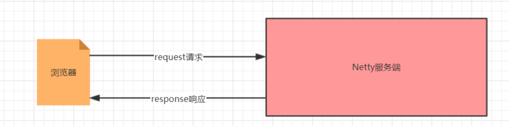

[toc]

## 基于Netty的HTTP服务器开发

### 一、介绍

Netty的HTTP协议栈无论在性能还是可靠性上，都表现优异，非常适合在非Web容器的场景下应用，相比于传统的Tomcat、Jetty等Web容器，它更加轻量和小巧，灵活性和定制性也更好。



### 二、功能需求

1. Netty 服务器在 8080 端口监听

2. 浏览器发出请求 "http://localhost:8080/ "

3. 服务器可以回复消息给客户端 "Hello! 我是Netty服务器 " ,并对特定请求资源进行过滤


### 三、服务端代码实现

##### NettyHttpServer

```java
import com.lagou.chat.NettyChatServer;
import com.lagou.chat.NettyChatServerHandler;
import io.netty.bootstrap.ServerBootstrap;
import io.netty.channel.*;
import io.netty.channel.nio.NioEventLoopGroup;
import io.netty.channel.socket.SocketChannel;
import io.netty.channel.socket.nio.NioServerSocketChannel;
import io.netty.handler.codec.http.HttpServerCodec;
import io.netty.handler.codec.string.StringDecoder;
import io.netty.handler.codec.string.StringEncoder;

/**
 * 聊天室服务端
 */
public class NettyHttpServer {
    //端口号
    private int port;

    public NettyHttpServer(int port) {
        this.port = port;
    }

    public void run() throws InterruptedException {
        //1. 创建bossGroup线程组: 处理网络事件--连接事件
        EventLoopGroup bossGroup = null;
        //2. 创建workerGroup线程组: 处理网络事件--读写事件 2*处理器线程数
        EventLoopGroup workerGroup = null;
        try {
            bossGroup = new NioEventLoopGroup(1);
            workerGroup = new NioEventLoopGroup();
            //3. 创建服务端启动助手
            ServerBootstrap serverBootstrap = new ServerBootstrap();
            //4. 设置bossGroup线程组和workerGroup线程组
            serverBootstrap.group(bossGroup, workerGroup)
                    .channel(NioServerSocketChannel.class) //5. 设置服务端通道实现为NIO
                    .option(ChannelOption.SO_BACKLOG, 128)//6. 参数设置
                    .childOption(ChannelOption.SO_KEEPALIVE, Boolean.TRUE)//6. 参数设置
                    .childHandler(new ChannelInitializer<SocketChannel>() { //7. 创建一个通道初始化对象
                        @Override
                        protected void initChannel(SocketChannel ch) throws Exception {
                            //8. 向pipeline中添加自定义业务处理handler
                            //添加编解码器
                            ch.pipeline().addLast(new HttpServerCodec());
                            // 自定义业务处理类
                            ch.pipeline().addLast(new NettyHttpServerHandler());
                        }
                    });
            //9. 启动服务端并绑定端口,同时将异步改为同步
            ChannelFuture future = serverBootstrap.bind(port);
            future.addListener(new ChannelFutureListener() {
                @Override
                public void operationComplete(ChannelFuture future) throws Exception {
                    if (future.isSuccess()) {
                        System.out.println("端口绑定成功!");
                    } else {
                        System.out.println("端口绑定失败!");
                    }
                }
            });
            System.out.println("http服务端启动成功.");
            //10. 关闭通道(并不是真正意义上关闭,而是监听通道关闭的状态)和关闭连接池
            future.channel().closeFuture().sync();
        } finally {
            bossGroup.shutdownGracefully();
            workerGroup.shutdownGracefully();
        }
    }

    public static void main(String[] args) throws InterruptedException {
        new NettyHttpServer(8080).run();
    }
}
```


##### NettyHttpServerHandler

```java
import io.netty.buffer.ByteBuf;
import io.netty.buffer.Unpooled;
import io.netty.channel.ChannelHandlerContext;
import io.netty.channel.SimpleChannelInboundHandler;
import io.netty.handler.codec.http.*;
import io.netty.util.CharsetUtil;

/**
 * http服务器处理类
 */
public class NettyHttpServerHandler extends SimpleChannelInboundHandler<HttpObject> {
    /**
     * 读取就绪事件
     *
     * @param ctx
     * @param msg
     * @throws Exception
     */
    @Override
    protected void channelRead0(ChannelHandlerContext ctx, HttpObject msg) throws Exception {
        //1.判断请求是不是HTTP请求
        if (msg instanceof HttpRequest) {
            DefaultHttpRequest request = (DefaultHttpRequest) msg;
            System.out.println("浏览器请求路径:" + request.uri());
            if ("/favicon.ico".equals(request.uri())) {
                System.out.println("图标不响应");
                return;
            }
            //2.给浏览器进行响应
            ByteBuf byteBuf = Unpooled.copiedBuffer("Hello! 我是Netty服务器 ", CharsetUtil.UTF_8);
            DefaultFullHttpResponse response =
                    new DefaultFullHttpResponse(HttpVersion.HTTP_1_1,
                            HttpResponseStatus.OK, byteBuf);
            //2.1 设置响应头
            response.headers().set(HttpHeaderNames.CONTENT_TYPE,
                    "text/html;charset=utf-8");
            response.headers().set(HttpHeaderNames.CONTENT_LENGTH,
                    byteBuf.readableBytes());
            ctx.writeAndFlush(response);
        }
    }
}
```

