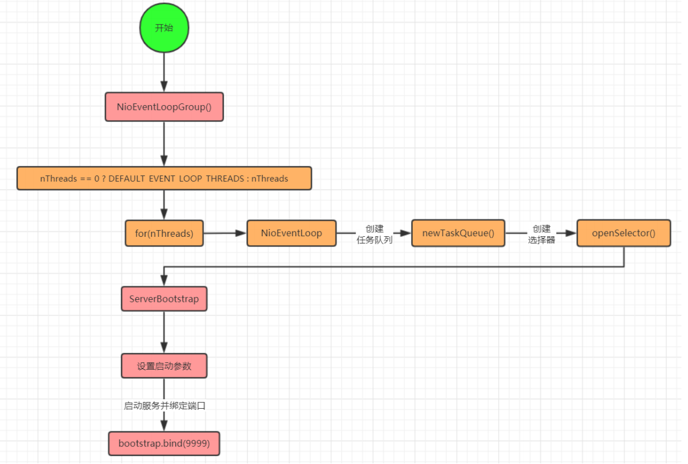
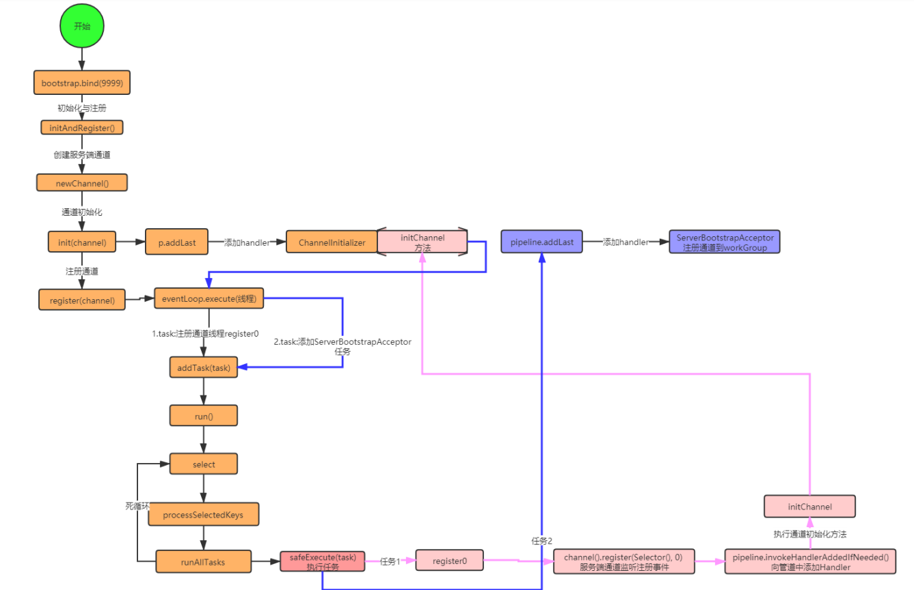
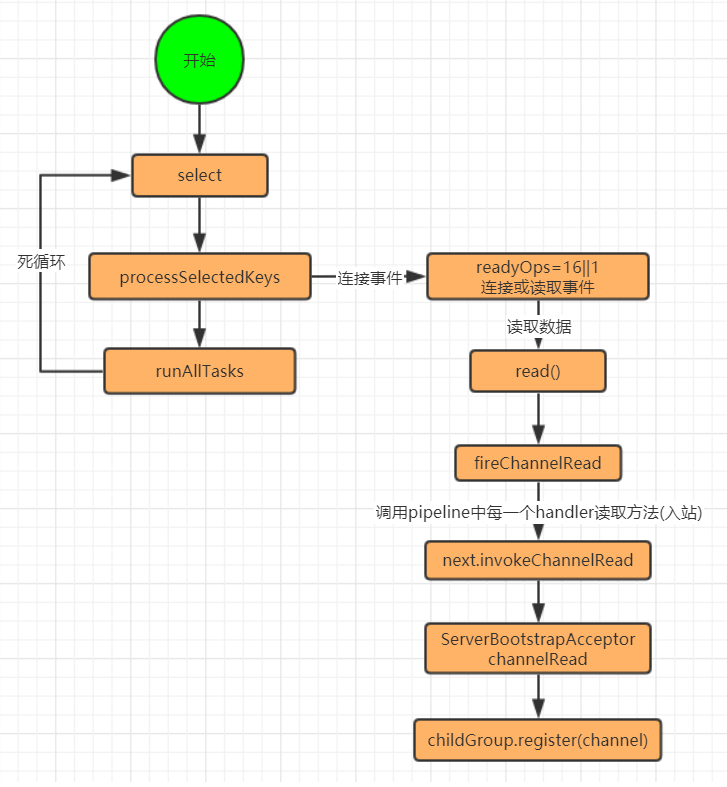

##### EventLoopGroup事件循环线程组源码流程分析

EventLoopGroup 是一组 EventLoop 的抽象，Netty 为了更好的利用多核 CPU 资源，一般会有多个 EventLoop 同时工作，每个 EventLoop 维护着一个 Selector 实例。

##### Netty启动源码流程分析

##### BossGroup/WorkGroup/消息入站流程分析

BossGroup主要负责监听. workGroup负责消息处理. 主要看下BossGroup如何将通道交给workGroup的,和如何处理消息读取的.即入站

